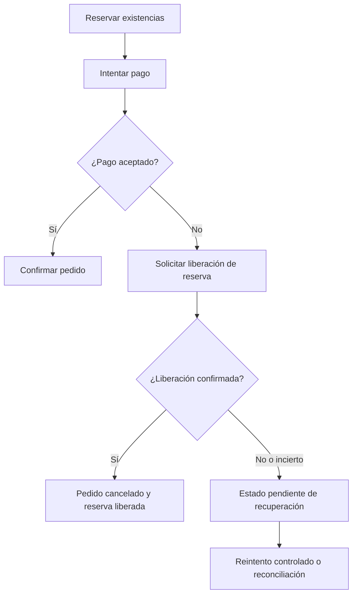

[[Obsidian/lecturas/Fundamentals of Software Architecture/09 Fundamentos de estilos arquitectónicos/00 Índice|← Índice del capítulo 9]]

# Versionado, compensación y observabilidad

El capítulo agrega **tres falacias propias de los autores** a las ocho clásicas de computación distribuida. Conviene mantener esta procedencia: versionado sencillo, compensación infalible y observabilidad opcional son la extensión del libro, no parte de la lista original de ocho.

## 1. Falacia 9: «Versionar es fácil»

Un **contrato** establece cómo se comunican participantes: campos, significados y comportamiento esperado. Cuando evoluciona una implementación, el contrato puede cambiar. Mantener una versión anterior permite que consumidores migren después, pero introduce una obligación de compatibilidad y operación.

**Ejemplo propio.** Pagos pasa de `importe` a `importe` más `moneda`. Añadir un campo parece sencillo, pero hay decisiones semánticas: ¿qué significa el importe de un consumidor antiguo? ¿Existe una moneda predeterminada válida? ¿Qué ocurre si el consumidor envía otra precisión? Mantener dos rutas no responde esas preguntas por sí solo.

El libro plantea cuatro decisiones esenciales:

| Decisión | Consecuencia práctica |
|---|---|
| Versionar servicio por servicio o todo el sistema | Cambia la coordinación de entregas y el alcance de la compatibilidad |
| Hasta dónde se extiende una versión | Puede alcanzar mensajes, clientes, adaptadores y almacenamiento |
| Cuántas versiones convivirán | Cada una necesita mantenimiento y comprobaciones |
| Cómo retirar versiones | Requiere conocer consumidores y acordar migración |

**Política didáctica para el ejemplo:** conservar temporalmente dos contratos, declarar la interpretación de clientes antiguos, observar qué versión usa cada consumidor, probar compatibilidad y retirar la anterior cuando exista evidencia de migración. «Temporalmente» necesita una condición concreta: si nunca se comprueba el uso, las versiones tienden a acumularse.

**Tradeoff o compromiso:** autonomía para migrar frente al costo de sostener varias interpretaciones simultáneas. Aquí se comparan beneficios y costos; la «compensación» de la siguiente sección es una operación de recuperación distinta. No existe un número universal de versiones correcto.

**Fuente:** PDF pp. 20–21, impresas 149–150.

## 2. Falacia 10: «Las actualizaciones compensatorias siempre funcionan»

Una **compensación** es una operación de negocio que intenta contrarrestar un efecto anterior cuando un flujo no puede completarse. El capítulo ejemplifica un coordinador que solicita cambios a varios servicios y, ante un fallo, emite operaciones de reversión.

**Matiz didáctico:** compensar no equivale al rollback de una transacción local. Una operación posterior puede restaurar un saldo o liberar una reserva, pero no borrar que alguien recibió un correo o que el estado fue visible durante unos segundos. Tampoco necesariamente restaura todos los detalles históricos al valor anterior.

En este diagrama, la salida «No» de «¿Pago aceptado?» significa **rechazo confirmado**. Un timeout deja el pago incierto y requiere averiguar su resultado o gestionar explícitamente esa incertidumbre; no debe recorrer automáticamente la rama de rechazo. La rama inferior hace visible el fallo de la propia compensación. Si liberar inventario no responde, no se marca automáticamente todo como restaurado. El flujo conserva un estado pendiente y un mecanismo de recuperación. Las flechas indican avance conceptual del proceso; el diagrama no define un protocolo ni garantiza entrega exactamente una vez.

**Ejemplo resuelto propio.** Se reservan dos productos; el pago es rechazado; la liberación falla por indisponibilidad de Inventario. El pedido debe conservar que la reserva existe o podría existir y que se intentó liberarla. Un responsable o proceso posterior necesita identificar la operación y determinar su estado. Si el sistema solo muestra «cancelado» y descarta esos datos, puede perder la capacidad de reconciliar existencias.

Preguntas que el diseño debe resolver: ¿puede repetirse la compensación? ¿Quién conoce las que quedan pendientes? ¿Durante cuánto tiempo se intentan? ¿Qué sucede si una reserva caduca antes? ¿Qué estado ve el usuario? Estas son elaboraciones propias para volver operativa la advertencia del capítulo.

**Fuente:** PDF p. 21, impresa 150.

## 3. Falacia 11: «La observabilidad es opcional»

Cuando una operación cruza varios participantes, un mensaje de error aislado no explica necesariamente el recorrido. El capítulo destaca observar interacciones y entorno mediante registros y monitorización. Sin contexto, investigar una llamada perdida o una compensación fallida se convierte en reunir fragmentos inconexos.

**Ampliación didáctica.** Distingue tres preguntas complementarias:

- **Métricas:** ¿cuántas operaciones fallan, cuánto tardan y dónde crece la espera?
- **Registros:** ¿qué decisión o suceso específico quedó registrado?
- **Trazas:** ¿qué recorrido siguió una solicitud y cuánto consumió cada tramo?

Guardar muchos logs no garantiza poder responder. Hace falta relacionar los sucesos con una operación y tener una intención de investigación. Debe evitarse registrar secretos o contenidos personales que no hagan falta para ese propósito.

| Señal del ejemplo | Qué permite saber | Qué no demuestra sola |
|---|---|---|
| Identificador de pedido y de intento | Relacionar actividad del flujo | Que el efecto ocurrió exactamente una vez |
| Resultado persistido de reserva | Conocer decisión de Inventario | Que el cliente recibió la respuesta |
| Número de compensaciones pendientes | Detectar acumulación | Por qué falla cada una |
| Duración del recorrido y de sus tramos | Localizar esperas observadas | La causa final sin contexto adicional |
| Versión del contrato usada | Preparar retirada de una versión | Que todos los casos semánticos sean compatibles |

**Costo aceptado:** instrumentación, almacenamiento, consulta y mantenimiento. **Beneficio:** evidencia para entender estados distribuidos y mejorar decisiones. Debe diseñarse junto al flujo, porque reconstruir retrospectivamente una operación sin identidad puede ser imposible.

**Fuente:** PDF p. 21, impresa 150.

> [!question] ¿Agregar `/v2` al endpoint completa el versionado?
> No. Hace identificable una variante, pero quedan compatibilidad, consumidores, coexistencia, semántica y retirada.

> [!question] ¿Una compensación exitosa significa que el mundo volvió exactamente al pasado?
> No necesariamente. Es una acción de negocio para contrarrestar un efecto; puede dejar historial, costos o efectos irreversibles.

> [!question] ¿Un log que dice «enviado» prueba que el receptor confirmó?
> No. Debe distinguirse la intención de enviar, la transmisión observada, la aceptación y la finalización. El vocabulario del registro importa.

## Fuente principal

- [[Obsidian/lecturas/Fundamentals of Software Architecture/Materiales/06 Fundamentos de estilos arquitectónicos.pdf#page=20|Fundamentals of Software Architecture, 2.ª ed., capítulo 9, PDF pp. 20–21; impresas 149–150]].

Las explicaciones, diagramas y ejemplos identificados como propios son elaboraciones didácticas; las páginas indicadas permiten contrastar los conceptos con el escaneo.

---

[[Obsidian/lecturas/Fundamentals of Software Architecture/09 Fundamentos de estilos arquitectónicos/06 Seguridad topología y coordinación|← Anterior]] · [[Obsidian/lecturas/Fundamentals of Software Architecture/09 Fundamentos de estilos arquitectónicos/08 Conway y topologías de equipos|Siguiente →]]
