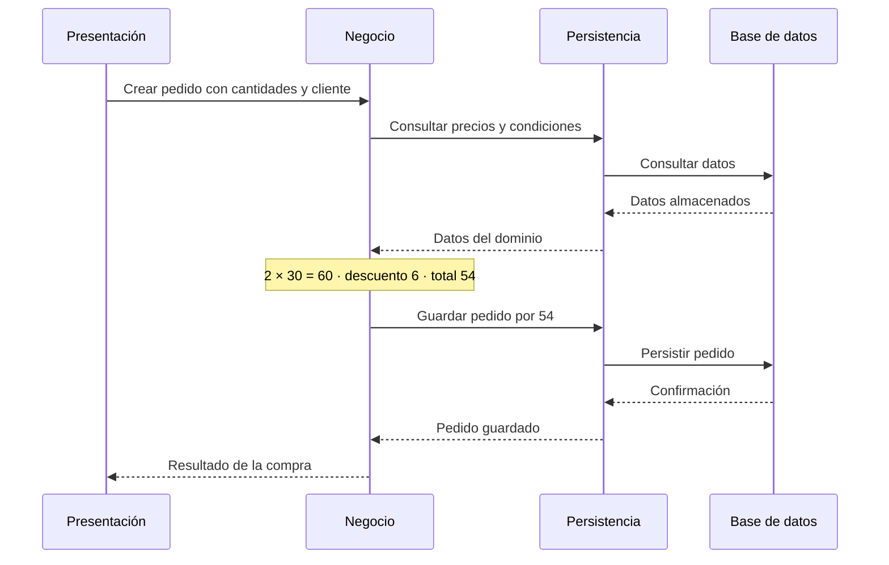

# Responsabilidades, topología y despliegue

[[Obsidian/lecturas/Fundamentals of Software Architecture/10 Arquitectura por capas/00 Índice|← Índice del capítulo]]

> [!info] Fuente y alcance
> **PDF 1–3 · impresas 153–155 · figuras 10-1 y 10-2** de [[Obsidian/lecturas/Fundamentals of Software Architecture/Materiales/07 Arquitectura por capas.pdf|07 Arquitectura por capas.pdf]], capítulo 10, «Layered Architecture Style», del fragmento proporcionado de *Fundamentals of Software Architecture*. Explicación original en español. Los ejemplos, diagramas y ejercicios se identifican como elaboración didáctica; las valoraciones pertenecen a la fuente y se contextualizan, no se presentan como mediciones universales.

## La idea que organiza todo el estilo

Una arquitectura por capas agrupa componentes según **el tipo de trabajo técnico que realizan**. La interfaz presenta información, la lógica de negocio decide, la persistencia traduce las necesidades de almacenamiento y la base de datos guarda y consulta datos. Cada capa ofrece una abstracción: quien la utiliza pide una capacidad sin conocer todos sus detalles internos.

El libro describe este estilo como frecuente por su familiaridad, sencillez y costo inicial bajo. También advierte sobre la arquitectura accidental: empezar a programar sin elegir límites explícitos suele producir algo parecido a capas, pero sin reglas claras. Tener carpetas llamadas `controllers`, `services` y `repositories` todavía no demuestra que se respeten sus responsabilidades.

## Las cuatro responsabilidades habituales

| Capa | Lo que sabe hacer | Ejemplo didáctico en una tienda | Lo que conviene delegar |
|---|---|---|---|
| Presentación | Interactuar con el usuario, recibir solicitudes y representar respuestas | Recibir un formulario de compra y mostrar el total | Calcular si el cliente tiene derecho a un descuento |
| Negocio | Ejecutar reglas y coordinar comportamientos del dominio | Aplicar descuento, validar estado del pedido, calcular total | Construir HTML o escribir SQL específico del motor |
| Persistencia | Cargar y guardar información y traducir entre representaciones | Convertir el pedido en operaciones de almacenamiento | Decidir una política comercial |
| Base de datos | Almacenar, consultar y mantener restricciones de datos | Tablas de pedidos, índices y operaciones transaccionales | Elegir la presentación visual del pedido |

Esta distribución es un modelo para razonar, no una prohibición de validaciones en varios niveles. Por ejemplo, una interfaz puede avisar que falta una dirección para mejorar la experiencia; la regla de negocio debe proteger el requisito aunque la solicitud llegue por otra interfaz. Una restricción de integridad en la base de datos puede impedir almacenar un identificador duplicado. Cada control tiene un propósito distinto.

El número cuatro tampoco es obligatorio. La fuente contempla tres capas, combinaciones de negocio y persistencia y sistemas con cinco o más. Una capa adicional necesita una responsabilidad reconocible; agregar rectángulos no mejora por sí solo el diseño.

## Una capa lógica no equivale a un servidor

En el gráfico, las bandas nombran responsabilidades lógicas; los contornos de despliegue indican qué se entrega o ejecuta conjuntamente. Contar bandas y contar despliegues responde preguntas diferentes. La imagen es una elaboración didáctica sobre las figuras 10-1 y 10-2, no una reproducción literal.

La figura 10-2 muestra tres posibilidades:

1. **Presentación, negocio y persistencia juntas; base de datos externa.** Un ejecutable de aplicación contiene tres capas y se conecta al almacén. Un cambio pequeño en el código puede requerir volver a desplegar todo ese ejecutable.
2. **Presentación separada; negocio y persistencia juntos; base de datos externa.** Existe una frontera física adicional. La separación puede ser útil, pero introduce comunicación entre unidades; no basta para declarar independencia funcional de todos los dominios.
3. **Las cuatro capas en un mismo despliegue.** Es posible con almacenamiento embebido o en memoria. El libro lo relaciona con aplicaciones pequeñas, móviles y ciertos productos instalados en las instalaciones del cliente.

> [!important] Capas y niveles físicos
> El capítulo también utiliza *n-tiered*. Para evitar ambigüedad en estas notas, **capa** designa una responsabilidad lógica y **nivel físico** o **unidad de despliegue** designa una separación operativa. Una aplicación puede tener cuatro capas sin cuatro procesos ni cuatro máquinas.

## Recorrido resuelto de una compra

**Elaboración didáctica.** Una compra contiene dos unidades de un artículo de 30 dólares y un descuento autorizado del 10 %.

La interfaz puede formatear `54` como moneda, pero el importe autorizado lo calcula negocio. Persistencia decide cómo guardar el pedido, pero no inventa otro descuento. El diagrama muestra colaboración lógica: las flechas no significan necesariamente llamadas de red. Tampoco especifica por sí solo los límites transaccionales, la concurrencia ni el tratamiento de fallos; esas decisiones se deben diseñar aparte.

## Preguntas que permiten comprobar la comprensión

**¿Puedo cambiar el framework visual sin cambiar las reglas comerciales?** En principio sí, si el contrato con negocio permanece estable y no filtraste tipos o detalles del framework a las otras capas.

**¿Una base de datos externa convierte el sistema en microservicios?** No. Una frontera física de almacenamiento no divide responsabilidades de negocio en servicios independientes.

**¿Cuál es la diferencia entre persistencia y base de datos?** La primera es código que adapta acceso y representación; la segunda es el mecanismo de almacenamiento. Una capa de persistencia puede usar un ORM, consultas directas o un sistema de archivos; no se identifica con una tecnología concreta.

**¿Qué debes dibujar antes de elegir infraestructura?** Las responsabilidades y sus contratos. Después, una vista de despliegue separada que indique dónde se ejecutan y qué dependencias cruzan procesos.

---

[[Obsidian/lecturas/Fundamentals of Software Architecture/10 Arquitectura por capas/00 Índice|← Volver al índice]]
