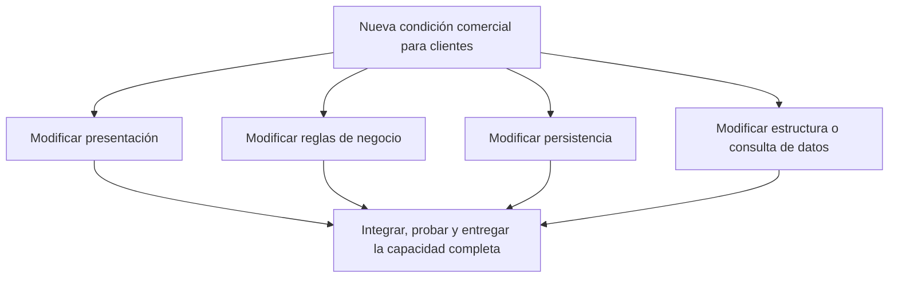

# Partición técnica y cambios de negocio

[[Obsidian/lecturas/Fundamentals of Software Architecture/10 Arquitectura por capas/00 Índice|← Índice del capítulo]]

> [!info] Fuente y alcance
> **PDF 3 · impresa 155; PDF 8–11 · impresas 160–163** de [[Obsidian/lecturas/Fundamentals of Software Architecture/Materiales/07 Arquitectura por capas.pdf|07 Arquitectura por capas.pdf]], capítulo 10, «Layered Architecture Style», del fragmento proporcionado de *Fundamentals of Software Architecture*. Explicación original en español. Los ejemplos, diagramas y ejercicios se identifican como elaboración didáctica; las valoraciones pertenecen a la fuente y se contextualizan, no se presentan como mediciones universales.

## El beneficio local y su costo global

En una partición técnica, el criterio principal para agrupar código es su función técnica: presentación, negocio o persistencia. Un especialista en interfaz puede trabajar concentrado en su capa sin conocer los detalles del motor de datos. Esta separación hace más claras las responsabilidades técnicas.

Sin embargo, una capacidad del negocio suele atravesar varias capas. El dominio «clientes» aparece en pantallas, reglas, consultas y tablas. Por eso un cambio del negocio no necesariamente queda localizado en una sola parte del sistema. El libro llama **agilidad holística** a la capacidad del sistema completo de responder al cambio: puedes mejorar la claridad de cada capa sin conseguir que una nueva capacidad se entregue con pocos cambios coordinados.

## Dos preguntas distintas sobre la organización

| Pregunta | Partición técnica | Partición por dominio |
|---|---|---|
| ¿Qué agrupa primero? | Código con el mismo papel técnico | Código que implementa una capacidad del negocio |
| ¿Dónde encuentro el código de clientes? | Repartido entre varias capas | Concentrado en el módulo de clientes, con sus divisiones internas |
| ¿Qué cambio suele quedar más localizado? | Cambiar una herramienta de interfaz o acceso a datos | Cambiar una regla o capacidad propia del dominio |
| ¿Qué riesgo requiere atención? | Cambios de negocio que atraviesan muchas áreas | Dependencias entre dominios y límites mal elegidos |

La tabla es una explicación didáctica del contraste del capítulo. No afirma que una organización sea universalmente superior: el criterio útil depende de qué cambia, con qué frecuencia y quién es responsable de ese cambio.

Un solo cambio conceptual puede tener cuatro zonas de implementación. Las flechas representan impacto del cambio, no el flujo de una solicitud ni dependencias de importación. No todo cambio real necesita las cuatro zonas.

## Ejemplo resuelto: añadir un límite de crédito

**Elaboración didáctica.** Una tienda permite a clientes empresariales comprar a crédito. Ahora debe bloquear pedidos que excedan un límite individual.

1. **Presentación:** añade un campo para administrar el límite y una explicación comprensible cuando un pedido es rechazado.
2. **Negocio:** compara exposición actual y nuevo pedido con el límite. Decide qué operaciones cuentan y en qué estados.
3. **Persistencia:** incorpora las operaciones para cargar el límite y la exposición pertinente.
4. **Base de datos:** guarda el nuevo dato y soporta las consultas e integridad necesarias.
5. **Validación del cambio:** prueba la regla en sus fronteras y también el recorrido completo, porque una pantalla correcta no compensa una consulta que devuelve datos equivocados.

Si distintos equipos son dueños exclusivos de cada capa, habrá coordinación entre equipos. Si un equipo posee el flujo completo, la organización técnica del código continúa existiendo, pero pueden reducirse los traspasos organizativos. Esta diferencia explica por qué **partición del código y topología de equipos son decisiones relacionadas, pero no idénticas**.

## El matiz de DDD

El capítulo sostiene que el diseño guiado por el dominio encaja con dificultad en una arquitectura cuyo primer criterio de separación es técnico. La razón es estructural: el dominio queda distribuido y sus cambios cruzan límites técnicos.

Esto no significa que esté prohibido usar lenguaje del dominio, entidades, objetos de valor o reglas bien modeladas dentro de una capa de negocio. El contraste se refiere a **qué límites gobiernan el sistema completo**. Como elaboración didáctica, un monolito puede organizarse primero por módulos de negocio y usar capas dentro de cada módulo. Ese diseño cambia el criterio principal de partición; no debe confundirse con el monolito estrictamente organizado por capas que evalúa el capítulo.

## Dos sentidos de modularidad

La fuente describe capas separadas por intereses técnicos y luego otorga una puntuación baja a la modularidad arquitectónica del estilo. Ambas ideas pueden coexistir:

- **Separación lógica:** es posible localizar cierto código y sustituir detalles tras contratos estables.
- **Autonomía arquitectónica:** desplegar, escalar o recuperar una capacidad sin afectar a las demás exige límites operativos que un monolito por capas habitualmente no ofrece.

Un directorio independiente no es automáticamente un despliegue independiente. Esta distinción también ayuda a entender por qué el estilo puede facilitar un experimento de interfaz, pero dificultar liberar rápidamente una nueva política comercial.

## Errores y preguntas resueltas

**«Cada capa se cambia de forma independiente».** Solo cuando el cambio respeta sus contratos y no modifica supuestos compartidos. Agregar un dato a una función que atraviesa el sistema puede requerir cambios coordinados.

**«Si todos conocen su capa, el equipo entregará rápido».** La especialización reduce ciertos esfuerzos, pero el tiempo de espera entre especialidades puede dominar la entrega de una función completa.

**«Para tener DDD necesito microservicios».** No se deduce eso del capítulo. La organización por dominio y la distribución física son ejes distintos; un monolito puede tener límites de dominio explícitos.

**Ejercicio resuelto.** Cambiar de biblioteca de botones afecta solo a presentación; agregar una modalidad de devolución modifica pantalla, reglas y almacenamiento. ¿Qué muestra la comparación? Que una misma partición puede aislar bien un cambio técnico y distribuir ampliamente uno funcional. La evaluación de mantenibilidad debe considerar los cambios esperados.

---

[[Obsidian/lecturas/Fundamentals of Software Architecture/10 Arquitectura por capas/00 Índice|← Volver al índice]]
