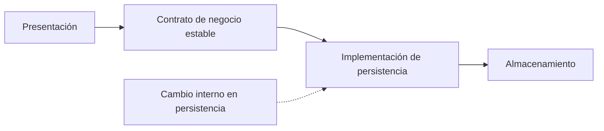

# Capas cerradas, abiertas y aislamiento del cambio

[[Obsidian/lecturas/Fundamentals of Software Architecture/10 Arquitectura por capas/00 Índice|← Índice del capítulo]]

> [!info] Fuente y alcance
> **PDF 3–6 · impresas 155–158 · figuras 10-3, 10-4 y 10-5** de [[Obsidian/lecturas/Fundamentals of Software Architecture/Materiales/07 Arquitectura por capas.pdf|07 Arquitectura por capas.pdf]], capítulo 10, «Layered Architecture Style», del fragmento proporcionado de *Fundamentals of Software Architecture*. Explicación original en español. Los ejemplos, diagramas y ejercicios se identifican como elaboración didáctica; las valoraciones pertenecen a la fuente y se contextualizan, no se presentan como mediciones universales.

## Qué significa que una capa esté cerrada

Una capa **cerrada** es una frontera que una solicitud descendente debe atravesar antes de acceder a las capas situadas debajo. En el recorrido presentación → negocio → persistencia → base de datos, cerrar negocio significa que presentación no debe llegar directamente a persistencia ni a la base de datos saltándose negocio.

Una capa **abierta** admite que una capa superior la omita para llegar a una inferior, siempre respetando las demás fronteras cerradas. «Abierta» no quiere decir accesible desde cualquier lugar del sistema ni autorización ilimitada.

En el gráfico, negocio cerrado conserva la frontera que debe atravesar presentación. Servicios abierto permite que negocio vaya a persistencia sin utilizar servicios compartidos cuando no los necesita. No autoriza presentación → servicios, porque esa ruta seguiría saltándose negocio cerrado. Elaboración didáctica basada en las figuras 10-3 a 10-5.

## Por qué cerrar una capa puede reducir el costo del cambio

El aislamiento no consiste en que no existan dependencias. Consiste en **limitar quién conoce qué**. Si presentación solo conoce el contrato de negocio, una modificación interna del acceso a datos tiene una superficie de impacto más pequeña que si presentación también conoce consultas y estructuras de persistencia.

El diagrama representa un límite de conocimiento. El aislamiento funciona si el contrato y su significado se mantienen. Cambiar una tabla internamente puede quedar oculto; cambiar el significado de «saldo disponible» puede afectar al negocio aunque la función conserve el mismo nombre y tipo de retorno.

**Elaboración didáctica:** una interfaz llama `consultarResumenCliente(id)` y recibe nombre y estado. El acceso a datos cambia de una tabla a dos tablas y una combinación. Si negocio sigue devolviendo el mismo resumen con la misma semántica, la interfaz no necesita saber cómo se obtuvo. Si la interfaz ejecutaba directamente la consulta, habría que modificarla también.

## El precio de atravesar todas las capas

Una consulta muy simple puede no necesitar reglas de negocio. Si las capas son cerradas, aun así atravesará sus contratos. Eso puede añadir llamadas, objetos, conversiones o pasos de procesamiento. En un mismo proceso, no debes equiparar ese costo automáticamente con latencia de red; hay que medir el costo efectivo. Cuando las capas están separadas físicamente, también pueden existir viajes de red.

La fuente recuerda el enfoque histórico *Fast-Lane Reader*: una lectura accede más directamente a los datos para evitar capas intermedias. Es una alternativa con un costo claro: más consumidores quedan acoplados al acceso a datos. La pregunta útil es si el ahorro medido justifica ampliar las dependencias y qué controles deben mantenerse.

## La condición de los contratos

El libro condiciona el reemplazo de una capa a contratos bien definidos y menciona **Business Delegate**, un patrón que interpone un adaptador para reducir el acoplamiento entre presentación y servicios de negocio.

No basta con poner una interfaz delante de cualquier implementación. Como explicación didáctica, el contrato debería dejar claros los datos de entrada, el resultado, los errores y las garantías relevantes. Si devuelve tipos internos del ORM o exige que presentación conozca la transacción de persistencia, el aislamiento es menor de lo que sugiere el dibujo.

## Matriz didáctica de rutas

Supongamos el orden presentación → negocio → servicios compartidos → persistencia → base de datos. Negocio y persistencia están cerrados; servicios está abierto.

| Ruta | ¿Permitida en este diseño? | Razón |
|---|---|---|
| Presentación → negocio | Sí | Cruza el contrato previsto |
| Negocio → servicios | Sí | Utiliza la capacidad compartida |
| Negocio → persistencia | Sí | Solo omite servicios, que está abierto |
| Presentación → servicios | No | Omitiría negocio cerrado |
| Negocio → base de datos | No | Omitiría persistencia cerrada |
| Presentación → persistencia | No | Omitiría negocio cerrado |

Esta matriz describe la política de ejemplo. En otro sistema, el orden o la apertura pueden ser diferentes; hay que documentarlos explícitamente.

## Preguntas resueltas

**¿Todas las capas cerradas garantizan desacoplamiento?** No. El sistema todavía puede compartir modelos enormes, detalles de infraestructura, estado global o contratos inestables. Cerrar rutas controla una dimensión del acoplamiento.

**¿Abrir servicios abre también negocio?** No. La propiedad corresponde a cada capa; una apertura no anula las demás restricciones.

**¿Una capa cerrada siempre agrega lógica a cada solicitud?** No. Puede limitarse a delegar en algunos recorridos, de donde surge el problema del sumidero que se explica en [[Obsidian/lecturas/Fundamentals of Software Architecture/10 Arquitectura por capas/04 Servicios compartidos y sumidero arquitectónico|la siguiente nota]].

**¿Qué hay que comunicar al equipo?** Orden de las capas, responsabilidades, rutas permitidas, capas abiertas y cerradas, razones de las excepciones y mecanismo para comprobar su cumplimiento. Un dibujo sin estas reglas permite interpretaciones incompatibles.

---

[[Obsidian/lecturas/Fundamentals of Software Architecture/10 Arquitectura por capas/00 Índice|← Volver al índice]]
