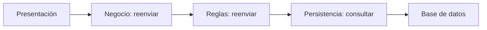

# Servicios compartidos y sumidero arquitectónico

[[Obsidian/lecturas/Fundamentals of Software Architecture/10 Arquitectura por capas/00 Índice|← Índice del capítulo]]

> [!info] Fuente y alcance
> **PDF 5–7 · impresas 157–159 · figuras 10-4 y 10-5** de [[Obsidian/lecturas/Fundamentals of Software Architecture/Materiales/07 Arquitectura por capas.pdf|07 Arquitectura por capas.pdf]], capítulo 10, «Layered Architecture Style», del fragmento proporcionado de *Fundamentals of Software Architecture*. Explicación original en español. Los ejemplos, diagramas y ejercicios se identifican como elaboración didáctica; las valoraciones pertenecen a la fuente y se contextualizan, no se presentan como mediciones universales.

## Por qué extraer servicios compartidos a otra capa

La fuente plantea una capa de negocio que contiene tanto componentes del negocio como objetos compartidos: utilidades de fecha y texto, auditoría o registro de actividad. La arquitectura quiere que presentación acceda a los componentes de negocio, pero no directamente a esos objetos compartidos.

Si ambos tipos de objetos están dentro de la misma capa y solo hay una regla general de acceso entre capas, la restricción es difícil de expresar y gobernar. Presentación tiene acceso a negocio, pero el diagrama no diferencia sus entradas públicas de las utilidades internas.

La solución del capítulo es colocar los objetos compartidos en una **capa de servicios debajo de negocio**, mantener negocio cerrado y declarar servicios abierto. Así, presentación debe pasar por negocio; negocio puede usar servicios cuando corresponde o saltarlos para llegar a persistencia.

> [!important] «Servicios» no significa microservicios
> En este ejemplo son objetos o capacidades compartidas dentro del diseño por capas. El nombre no implica red, proceso separado ni despliegue independiente.

Esta es una manera de hacer visible la regla. Como elaboración didáctica, también existen mecanismos de encapsulación de paquetes y módulos para distinguir API pública e implementación. Lo relevante es que la restricción sea explícita y comprobable, no multiplicar capas sin necesidad.

## Qué es el sumidero arquitectónico

El antipatrón **Architecture Sinkhole**, traducido aquí como **sumidero arquitectónico**, aparece cuando una solicitud atraviesa sucesivas capas que simplemente la reenvían. El capítulo ejemplifica recuperar nombre y dirección de un cliente: presentación llama a negocio; negocio a reglas; reglas a persistencia; persistencia consulta la base de datos; la respuesta vuelve sin agregación, cálculo, transformación ni aplicación de reglas.

El gráfico sigue una solicitud y distingue qué responsabilidad ejecuta cada paso. En un recorrido, las capas solo transmiten; en el otro existe una regla de negocio identificable. La imagen es elaboración didáctica. No demuestra por sí sola que la primera ruta sea lenta: la magnitud depende de implementación, frecuencia y límites físicos.

El costo puede incluir instanciar objetos, copiar datos, ejecutar conversiones y mantener código que no expresa decisiones. La existencia de una frontera estable puede seguir teniendo valor para futuros cambios o controles. Por ello no conviene llamar «inútil» a toda delegación sin analizar su papel contractual.

## Cómo evaluar el problema sin convertir una regla práctica en ley

La fuente propone observar qué proporción de solicitudes cae en este patrón y utiliza **80/20 como heurística**: un porcentaje pequeño puede tolerarse; si la mayor parte del comportamiento solo atraviesa capas vacías, puede haber un desajuste entre estilo y problema.

No es un umbral empírico universal ni una especificación de rendimiento. Debes precisar qué estás contando. Como elaboración didáctica, distingue **tipos de operación** de **solicitudes realmente ejecutadas**: dos consultas sencillas pueden ser solo el 10 % del catálogo de operaciones y, al mismo tiempo, representar el 90 % del tráfico. También pueden consumir poco tiempo total si son baratas.

Un diagnóstico útil registra para las rutas principales:

| Dato | Qué permite decidir |
|---|---|
| Frecuencia real | Cuánto se repite el recorrido |
| Trabajo por capa | Qué responsabilidad aporta cada paso |
| Tiempo y asignaciones observados | Si el costo es material |
| Contratos y consumidores | Cuánto acoplamiento introduce una ruta alternativa |
| Controles necesarios | Qué validaciones, permisos o auditoría deben conservarse |

Los indicadores anteriores son una ampliación didáctica; no son una lista textual del libro.

## Ejemplo numérico resuelto

**Elaboración didáctica.** Hay 10 000 solicitudes por hora. 8 000 son lecturas de datos básicos y atraviesan dos pasos que solo delegan; 2 000 ejecutan reglas. El porcentaje observado de solicitudes sin procesamiento intermedio es `8 000 / 10 000 = 80 %`.

Ese dato justifica investigar, pero no basta para aprobar una reestructuración. Si los dos pasos suman 0,1 ms y la consulta tarda 150 ms, eliminarlos solo reduce una fracción pequeña de la latencia. Si agregan dos viajes de red de 40 ms cada uno, el efecto potencial es diferente. Los números son supuestos del ejercicio, no mediciones del libro.

Antes de abrir una ruta, verifica que no se omitan permisos, filtros por cliente, auditoría o consistencia. Un paso puede parecer vacío en una lectura superficial y aun así envolver controles mediante interceptores o infraestructura.

## Opciones y compensaciones

- **Conservar las capas cerradas:** mantiene una política uniforme y limita consumidores, a cambio del costo residual de delegar.
- **Abrir alguna capa con una regla precisa:** reduce pasos para ciertos accesos y amplía el conocimiento de los consumidores sobre niveles inferiores.
- **Reconsiderar la estructura:** si gran parte del sistema no tiene el tipo de comportamiento que las capas intentan organizar, puede convenir otro diseño.

El libro menciona abrir todas las capas como alternativa, reconociendo su mayor dificultad para gestionar cambios. Estas notas no lo convierten en recomendación automática: perder una frontera es una decisión de acoplamiento que debe justificarse.

**Pregunta resuelta. ¿Debo inventar una regla para que una capa parezca útil?** No. Agregar procesamiento artificial oculta el problema y aumenta el costo. La solución consiste en alinear estructura y responsabilidades, o aceptar conscientemente un paso contractual de bajo costo.

---

[[Obsidian/lecturas/Fundamentals of Software Architecture/10 Arquitectura por capas/00 Índice|← Volver al índice]]
