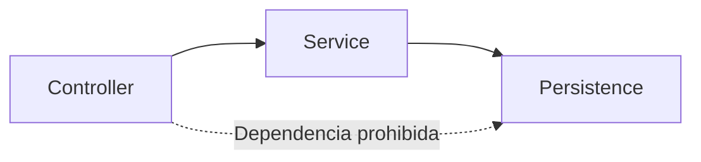

# Gobierno, pruebas estructurales y equipos

[[Obsidian/lecturas/Fundamentals of Software Architecture/10 Arquitectura por capas/00 Índice|← Índice del capítulo]]

> [!info] Fuente y alcance
> **PDF 7–9 · impresas 159–161 · ejemplo 10-1; PDF 10 · impresa 162** de [[Obsidian/lecturas/Fundamentals of Software Architecture/Materiales/07 Arquitectura por capas.pdf|07 Arquitectura por capas.pdf]], capítulo 10, «Layered Architecture Style», del fragmento proporcionado de *Fundamentals of Software Architecture*. Explicación original en español. Los ejemplos, diagramas y ejercicios se identifican como elaboración didáctica; las valoraciones pertenecen a la fuente y se contextualizan, no se presentan como mediciones universales.

## De una convención a una regla comprobable

Dibujar capas cerradas no impide que alguien importe una clase de persistencia desde un controlador. El gobierno arquitectónico convierte decisiones como «presentación utiliza negocio» en restricciones observables durante el desarrollo.

El capítulo destaca que las arquitecturas por capas cuentan con herramientas maduras de pruebas estructurales. Utiliza **ArchUnit** para ejemplificar una función de aptitud que define capas a partir de paquetes y comprueba quién puede acceder a ellas. El objetivo es detectar desviaciones antes de que las dependencias prohibidas se normalicen.

## Cómo interpretar el ejemplo 10-1

La fuente define tres grupos, `Controller`, `Service` y `Persistence`, asociados a paquetes del código. Después establece restricciones de acceso. Para no confundir una explicación con código listo para una versión concreta, aquí se expresa su intención en pseudocódigo:

```text
Definir Controller con las clases de los paquetes de controladores.
Definir Service con las clases de los paquetes de servicios.
Definir Persistence con las clases de los paquetes de persistencia.

Ninguna de las capas declaradas accede a Controller.
Solo Controller puede acceder a Service.
Solo Service puede acceder a Persistence.
```

En los nombres `mayOnlyBeAccessedByLayers`, la dirección importante es **entrante**: se restringe quién puede acceder a la capa nombrada. «Persistence solo puede ser accedida por Service» no significa «Persistence solo puede llamar a Service». Cambiar la dirección invierte el sentido de la regla.

La notación de paquetes con puntos que aparece en la fuente corresponde a patrones usados por la herramienta; al implementarla hay que revisar el alcance exacto de las clases importadas, las dependencias consideradas y la API de la versión instalada. Esta nota explica el diseño y no garantiza un fragmento ejecutable para cualquier versión.



La flecha punteada es un incumplimiento que se quiere detectar. Las flechas continuas indican relaciones permitidas en este ejemplo. No representan paquetes de red ni comprueban que una solicitud real atraviese todos los pasos.

## Ejemplo de fallo y reparación

**Elaboración didáctica.** Un desarrollador agrega `CustomerRepository` al controlador para terminar rápido una pantalla. La funcionalidad pasa su prueba de interfaz, pero rompe la regla de aislamiento.

1. La prueba estructural detecta la dependencia controlador → persistencia.
2. Se identifica qué capacidad pide la pantalla: consultar el resumen del cliente.
3. El controlador invoca un contrato de negocio que expresa esa capacidad.
4. Negocio coordina el acceso a persistencia y devuelve el resultado.
5. La prueba estructural vuelve a comprobar las dependencias; las pruebas funcionales verifican que la respuesta sea correcta.

Si la ruta directa fue una decisión deliberada, la alternativa es cambiar explícitamente la política y explicar su costo. Desactivar globalmente el control para silenciar un caso elimina información sobre todo el sistema.

## Lo que estas pruebas no demuestran

Una prueba estructural no prueba que el descuento sea correcto, que una consulta sea rápida o que no exista un fallo de autorización. Tampoco garantiza detectar todas las relaciones dinámicas, reflexivas o externas; su alcance depende de lo analizado y de la herramienta.

Por ello se complementa con pruebas de comportamiento. La separación en capas facilita sustituir colaboradores con dobles para probar unidades, pero la confianza en una entrega también exige validar integración y recorridos relevantes. La puntuación modesta de testabilidad en el libro se refiere al costo de verificar cambios en un sistema desplegado como conjunto; no afirma que las pruebas unitarias sean imposibles.

## Cómo encajan los equipos

El capítulo no exige una única topología de equipos. Describe estas posibilidades:

| Tipo de equipo | Encaje descrito | Cuidado práctico, como elaboración didáctica |
|---|---|---|
| Alineado a un flujo de valor | Posee un recorrido de extremo a extremo a través de las capas | Necesita capacidad para cambiar todas las partes de ese flujo |
| Habilitador | Aporta especialización y experimenta en una o varias capas, por ejemplo una biblioteca de interfaz | El aprendizaje debe integrarse sin crear dependencia permanente de especialistas |
| Subsistema complicado | Trabaja en una parte especializada; el libro ejemplifica acceso a datos operativos para análisis | El acceso debe estar autorizado por la política y tener contratos claros |
| Plataforma | Aprovecha herramientas y soporte común para construir y operar el sistema | Al crecer el monolito, operación puede quedar sometida a límites de memoria, conexiones y concurrencia |

El ejemplo de un equipo analítico que recibe acceso a persistencia no contradice la necesidad de gobierno: significa que se define conscientemente una integración, con alcance y reglas. No autoriza a cualquier consumidor a saltarse cualquier capa.

## Organización lógica frente a crecimiento operativo

La fuente reconoce buena separación técnica y abundancia de herramientas, pero advierte que un monolito que acumula funciones termina presionando límites compartidos. Un equipo de plataforma puede administrar ese crecimiento, aunque eso no elimina el costo de ejecutar y liberar una unidad grande.

**Pregunta resuelta. ¿Debo formar un equipo por capa?** No es una consecuencia obligatoria del estilo. Puedes tener equipos dueños de un flujo completo y especialistas que los apoyen. El diseño de equipos debe considerar autonomía de entrega y coordinación, además de conocimientos técnicos.

**Ejercicio resuelto. Una prueba estructural pasa y producción falla al guardar pedidos. ¿La arquitectura está validada?** Solo está validada la propiedad que esa prueba examinó. Debes revisar comportamiento, contratos, datos y operación. Una función de aptitud aporta evidencia específica, no una certificación total del sistema.

---

[[Obsidian/lecturas/Fundamentals of Software Architecture/10 Arquitectura por capas/00 Índice|← Volver al índice]]
