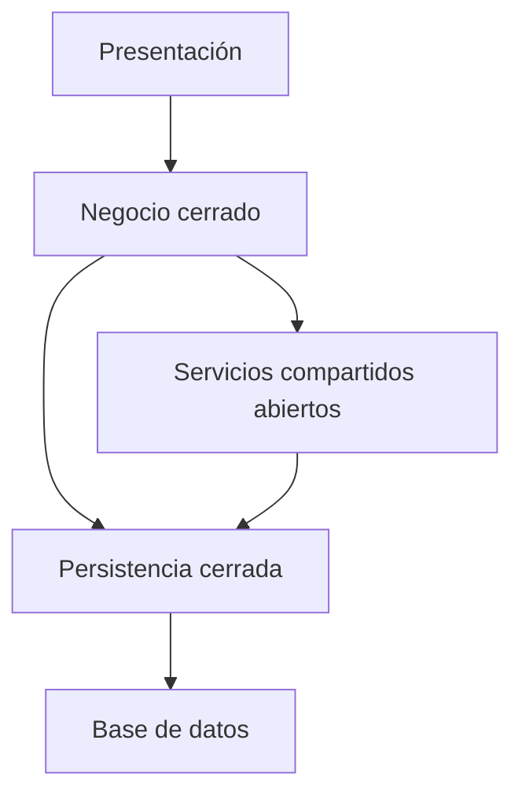

# Casos de uso, laboratorio y repaso resuelto

[[Obsidian/lecturas/Fundamentals of Software Architecture/10 Arquitectura por capas/00 Índice|← Índice del capítulo]]

> [!info] Fuente y alcance
> **PDF 11–12 · impresas 163–164; integración didáctica de PDF 1–12 · impresas 153–164** de [[Obsidian/lecturas/Fundamentals of Software Architecture/Materiales/07 Arquitectura por capas.pdf|07 Arquitectura por capas.pdf]], capítulo 10, «Layered Architecture Style», del fragmento proporcionado de *Fundamentals of Software Architecture*. Explicación original en español. Los ejemplos, diagramas y ejercicios se identifican como elaboración didáctica; las valoraciones pertenecen a la fuente y se contextualizan, no se presentan como mediciones universales.

## Capas fuera de las aplicaciones de negocio

El capítulo utiliza sistemas operativos y redes para mostrar una idea general: separar responsabilidades permite razonar sobre una parte sin manejar continuamente todos los detalles de las demás.

En su ejemplo de sistemas operativos, el hardware reúne CPU, memoria y dispositivos; el kernel ofrece abstracción y gestiona recursos; la interfaz de llamadas al sistema expone servicios; las aplicaciones y utilidades constituyen la interacción del usuario. Este es un esquema conceptual de responsabilidades, no una descripción exhaustiva de la implementación de Linux o Windows.

El aprendizaje transferible es que un consumidor usa un servicio abstracto. No debes inferir que un sistema operativo tiene exactamente la misma topología, despliegue o comportamiento de fallos que el monolito empresarial evaluado en el capítulo.

## Matiz necesario en el ejemplo de redes

La fuente menciona OSI y luego describe una lista de cinco responsabilidades vinculadas con TCP/IP: física, enlace, red, transporte y aplicación. Hay que evitar convertir esa transición en una equivalencia entre modelos.

> [!important] Aclaración técnica de estas notas
> **OSI tiene siete capas.** La lista de cinco utilizada en el ejemplo corresponde a una organización pedagógica habitual de la pila de Internet. Tampoco todo transporte garantiza entrega fiable: el ejemplo de fiabilidad corresponde a TCP; UDP no proporciona esa misma garantía. El punto que se conserva del libro es la separación de responsabilidades, no la equivalencia entre OSI y TCP/IP.

| Responsabilidad en el ejemplo de cinco capas | Qué explica |
|---|---|
| Física | Transmisión de señales por el medio |
| Enlace | Comunicación local mediante tramas y mecanismos propios del enlace |
| Red | Direccionamiento y encaminamiento, ejemplificados por IP |
| Transporte | Comunicación entre extremos; TCP ejemplifica transporte fiable |
| Aplicación | Protocolos de servicios como HTTP, SMTP o FTP |

No utilices este esquema para memorizar que «transporte siempre es fiable» ni que «OSI tiene cinco capas». Su función aquí es ilustrar abstracciones y responsabilidades. Las referencias externas de este matiz están en [[Obsidian/lecturas/Fundamentals of Software Architecture/90 Fuentes y revisión/05 Ampliación capítulos 9 y 10|la revisión de fuentes de los capítulos 9 y 10]].

## Laboratorio: un sistema de préstamos de biblioteca

**Todo el caso siguiente es elaboración didáctica.** Una biblioteca necesita registrar préstamos, impedir prestar a usuarios suspendidos y consultar disponibilidad. Hay un equipo pequeño y un plazo corto; no se exige escalado independiente por función.

### 1. Ubicar las responsabilidades

| Necesidad | Ubicación propuesta | Motivo |
|---|---|---|
| Mostrar el formulario | Presentación | Es interacción y representación |
| Rechazar usuario suspendido | Negocio | Es una política de préstamo válida para cualquier interfaz |
| Consultar ejemplares disponibles | Persistencia, a solicitud de negocio | Adapta la lectura del almacén |
| Guardar préstamo y proteger datos | Persistencia y base de datos, con responsabilidades diferenciadas | El código realiza la operación; el almacén mantiene datos y restricciones |
| Registrar auditoría compartida | Servicio compartido según política | Capacidad transversal con un contrato explícito |

### 2. Definir rutas antes de escribir código

Presentación llama a negocio. Negocio usa servicios compartidos cuando los necesita y llama a persistencia. Servicios es una capa abierta; negocio y persistencia, cerradas. Esto permite omitir la utilidad compartida en una consulta que no la necesita, sin permitir que la interfaz consulte directamente el almacén.

El dibujo muestra rutas posibles del ejemplo, no que todo servicio compartido deba consultar persistencia. Una utilidad de fechas puede funcionar sin hacerlo.

### 3. Ejecutar el préstamo

La solicitud llega a negocio. Negocio carga el estado del usuario y del ejemplar, verifica las condiciones y solicita guardar el préstamo. Una respuesta válida llega a presentación para mostrar confirmación. Si el usuario está suspendido, negocio rechaza la operación aunque el formulario haya permitido enviarla.

**Detalle de implementación que el dibujo no resuelve:** dos solicitudes simultáneas podrían observar el mismo ejemplar como disponible. La solución necesita un mecanismo de consistencia y concurrencia adecuado. Tener capas no resuelve automáticamente esa carrera; hay que definir la operación y probarla. Este matiz amplía didácticamente el ejemplo, sin atribuir un algoritmo al capítulo.

### 4. Decidir el despliegue

Una unidad de aplicación contiene presentación, negocio y persistencia; una base de datos externa guarda los préstamos. Las cuatro responsabilidades lógicas no exigen cuatro máquinas. El diseño permite comenzar con operación sencilla, pero un cambio de código vuelve a entregar la aplicación como conjunto.

### 5. Evaluar un acceso directo propuesto

Alguien pide que el formulario consulte directamente la tabla de ejemplares para ahorrar pasos. Antes de aceptarlo, se identifica si la consulta incorpora reglas, permisos o un contrato que debe mantenerse estable. Si la ruta solo reenvía y su costo es significativo, se analiza una excepción explícita; no se abre todo por conveniencia momentánea.

### 6. Preparar la verificación

Una prueba de negocio comprueba que un usuario suspendido no reciba préstamo. Una prueba de integración comprueba el guardado y el comportamiento concurrente definido. Una prueba estructural detecta imports desde presentación hacia persistencia. Cada prueba responde una pregunta diferente.

## Repaso con respuestas razonadas

**1. ¿Cuántos servidores exige una arquitectura de cuatro capas?** Ningún número fijo. Cuatro describe responsabilidades; el despliegue se decide aparte.

**2. ¿Por qué una interfaz que ejecuta SQL debilita aislamiento?** Porque conoce detalles del almacenamiento y puede necesitar cambiar junto con ellos. Además puede eludir políticas que debían ejecutarse en negocio.

**3. Si servicios está abierto, ¿presentación puede llamarlo saltando negocio cerrado?** No. La apertura de servicios permite omitir esa capa; no elimina la frontera cerrada anterior.

**4. ¿Una solicitud que solo delega demuestra que todo el estilo es incorrecto?** No. Se analiza frecuencia, costo, valor contractual y distribución de las rutas. La heurística 80/20 orienta la investigación, no emite un veredicto universal.

**5. ¿Por qué una falla de memoria puede detener toda la aplicación?** Porque las capas lógicas pueden compartir proceso y recursos. La separación del código no constituye aislamiento operativo.

**6. ¿Replicar tres veces el monolito produce tres quanta independientes?** No se deduce. Hay tres instancias de una unidad funcional y posiblemente las mismas dependencias comunes; los quanta se razonan por independencia y acoplamiento.

**7. ¿Qué aporta una regla ArchUnit que no aporta una prueba de interfaz?** Evidencia sobre dependencias estructurales permitidas. Una pantalla puede funcionar y aun así violar la política de capas.

**8. ¿Por qué el libro puntúa baja modularidad si las capas separan intereses?** Porque distingue, de manera que estas notas hacen explícita, claridad técnica de autonomía arquitectónica para evolucionar, desplegar y operar partes.

**9. ¿Cuándo es razonable aceptar una reescritura futura?** Cuando una decisión consciente de factibilidad permite entregar el valor necesario ahora y conserva límites que reducen el costo futuro. No cuando se usa como excusa para ignorar requisitos críticos actuales.

**10. ¿Cuál es la conclusión aplicable al proyecto de biblioteca?** El estilo es una opción plausible por simplicidad y alcance, siempre que se definan contratos, se gobiernen dependencias y se vigilen los límites que podrían exigir evolución.

---

[[Obsidian/lecturas/Fundamentals of Software Architecture/10 Arquitectura por capas/00 Índice|← Volver al índice]] · [[Obsidian/lecturas/Fundamentals of Software Architecture/11 Monolito modular/00 Índice|Capítulo 11 →]]
