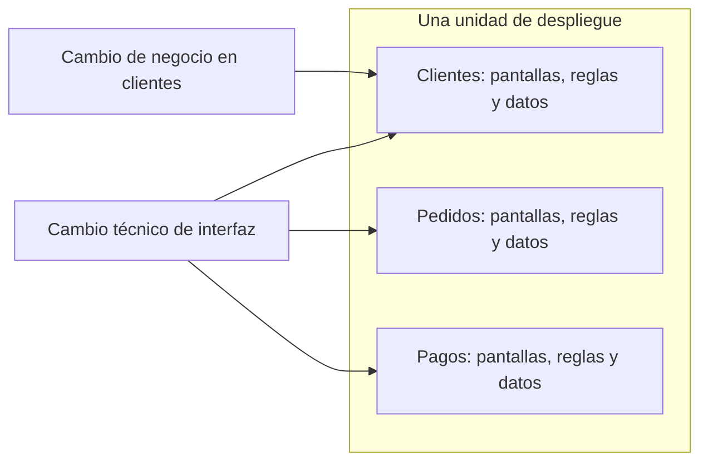

# Qué es un monolito modular

[[Obsidian/lecturas/Fundamentals of Software Architecture/11 Monolito modular/00 Índice|← Índice del capítulo 11]]

**Un monolito modular responde a dos preguntas a la vez.** ¿Cuántas piezas se despliegan? Una sola. ¿Cómo se organiza el código dentro de esa pieza? Por áreas del negocio. Entender el estilo consiste en no mezclar esas dos respuestas.

## 1. Por qué el libro le dedica un capítulo nuevo

La primera edición del libro (2020) no trataba este estilo por separado. Los autores lo añaden en la segunda edición porque se volvió muy popular por dos razones relacionadas:

- La adopción del **diseño guiado por el dominio** (*domain-driven design*, DDD). DDD propone construir el software alrededor del lenguaje y de las áreas del negocio: si la empresa habla de «pedidos», «facturación» y «envíos», el código debería tener partes con esos nombres y esas responsabilidades. Un **dominio** es un área de conocimiento del negocio; un **subdominio** es una parte más pequeña dentro de ella, por ejemplo «devoluciones» dentro de «pedidos».
- Un interés creciente por la **partición por dominio**, es decir, por organizar el primer nivel del sistema según esas áreas del negocio en lugar de según capas técnicas.

El monolito modular es una forma de aplicar esas ideas con poca complejidad operativa inicial: se obtienen fronteras de negocio claras sin pagar todavía los costos de un sistema distribuido que se estudiaron en el capítulo 9.

**Fuente:** PDF p. 1 · impresa 165.

## 2. «Monolito»: una única unidad de despliegue

El estilo es **monolítico** porque todo el sistema se entrega como una sola pieza de software. El libro cita ejemplos concretos de esa pieza:

| Plataforma | Unidad de despliegue | Qué es, en palabras sencillas |
|---|---|---|
| Java web | Archivo **WAR** (*web archive*) | Un paquete comprimido con toda la aplicación web, que un servidor de aplicaciones ejecuta |
| Java empresarial | Archivo **EAR** (*enterprise archive*) | Un paquete mayor que puede agrupar varios módulos y aplicaciones web en una sola entrega |
| .NET | Una entrega de aplicación, que puede incluir varios **ensamblados** | Binarios compilados que se publican y ejecutan como una unidad |

Lo importante no es el formato, sino la consecuencia: **para cambiar cualquier parte en producción hay que volver a desplegar la pieza completa**, y todas sus partes se ejecutan en el mismo proceso. Una llamada entre módulos es una llamada a un método, no un viaje por la red. Por eso las llamadas internas evitan problemas de transporte como la respuesta perdida o la latencia de red; las conexiones con bases remotas y proveedores externos siguen expuestas a ellos. Compartir proceso también permite que un fallo grave afecte a toda la instancia (se retoma en la nota de características).

**Fuente:** PDF p. 1 · impresa 165.

## 3. «Modular»: el negocio decide el primer nivel del código

El estilo está **particionado por dominio**: sus bloques principales representan áreas del negocio y no capacidades técnicas. El libro resume su **forma isomórfica** —la silueta que permite reconocer el estilo en un diagrama— así: *una sola unidad de despliegue con la funcionalidad agrupada por área de dominio*.

La figura 11-1 dibuja exactamente eso: una caja en tres dimensiones que representa la única unidad desplegable, y dentro, nueve rectángulos iguales rotulados «Module». No hay capas ni flechas: el mensaje es que el sistema se divide en módulos de negocio dentro del mismo paquete. El tamaño igual de los rectángulos no demuestra igual complejidad, importancia ni carga.

En este estilo, los dominios (o, a veces, subdominios) reciben el nombre de **módulos**. Un módulo agrupa todo lo necesario para una capacidad del negocio: sus reglas, su manejo de pantallas o peticiones y su acceso a datos.

**Fuente:** PDF pp. 1–2 · impresas 165–166 · figura 11-1.

## 4. La diferencia vista en un nombre de paquete

El libro usa un truco para sus ejemplos: mirar el **tercer nodo del namespace** (el nombre de paquete o espacio de nombres del código). Funciona porque los dos primeros nodos son el prefijo `com.app`; en otro proyecto el dominio puede ocupar otra posición. Lo importante es el primer agrupamiento dentro de la aplicación, no contar siempre hasta tres.

En la arquitectura por capas, el código que presenta el perfil del cliente vive en `com.app.presentation.customer.profile`. Los dos primeros nodos (`com.app`) solo identifican la aplicación; el tercero, `presentation`, dice **qué tipo de trabajo técnico** hace ese código, y el cliente aparece después. En el monolito modular, el mismo código vive en `com.app.customer.profile`: el tercer nodo, `customer`, dice **a qué área del negocio pertenece**. La imagen resalta en dorado ese tercer nodo porque es el que fija el criterio de agrupación.

Debajo, la imagen muestra lo que eso provoca en las carpetas. Con capas, el primer nivel son `presentation/`, `business/` y `persistence/`, y dentro de cada una se repiten cliente, pedido, pago… Con el monolito modular, el primer nivel son `customer/`, `order/` y `payment/`, y cada uno contiene lo suyo. Si un componente es complejo, el libro permite dividirlo por técnica **después** del dominio: `com.app.customer.profile.presentation` y `com.app.customer.profile.business`. Esa subdivisión interna es opcional y no convierte el sistema en uno por capas, porque el primer criterio sigue siendo el negocio.

**Fuente:** PDF pp. 1–2 · impresas 165–166.

## 5. Qué cambia en el trabajo diario

Supón un cambio de negocio propio: «el perfil del cliente debe guardar un segundo teléfono y validarlo».

| Pregunta | Por capas | Monolito modular |
|---|---|---|
| ¿Dónde busco? | En tres carpetas técnicas: presentación, negocio y persistencia | En una carpeta: `customer/profile` |
| ¿Quién debe coordinarse? | Posiblemente quienes cuidan cada capa | Quien es responsable del módulo de clientes |
| ¿Qué riesgo tengo? | Olvidar una de las capas o romper otra función que comparte la capa | Tocar datos que otros módulos leen directamente |
| ¿Qué despliego? | Toda la aplicación | Toda la aplicación |

La última fila es la que más se olvida: **la organización del código cambia, pero el despliegue sigue siendo uno.** El monolito modular mejora la localización y la comprensión de los cambios de negocio; no ofrece unidades independientes para publicar o reiniciar cada módulo, ni para replicarlo por separado.

Ahora imagina un cambio técnico: «sustituir el framework de interfaz en todo el sistema». Con capas, ese cambio se concentra en la capa de presentación. En el monolito modular está repartido por todos los módulos. El estilo favorece los cambios de negocio y penaliza los técnicos transversales; el libro usa esta idea para decidir cuándo no usarlo.

El diagrama resume el contraste. El cambio de negocio entra por una sola puerta, el módulo de clientes, porque todo lo que necesita está junto. El cambio técnico de interfaz tiene que entrar en los tres módulos, porque cada uno contiene sus propias pantallas. Ambos terminan en la misma caja exterior: se despliega el sistema completo.

## 6. Cómo encaja con lo estudiado antes

- En el capítulo 9 se distinguió **partición técnica** de **partición por dominio**, y se advirtió que particionar por dominio no obliga a distribuir. El monolito modular es precisamente ese caso: dominio en el código, un solo despliegue.
- En el capítulo 10, la arquitectura por capas era un monolito con partición técnica. Aquí se conserva el monolito y se invierte el criterio de partición. Por eso muchas valoraciones se parecen y solo algunas mejoran.
- En el capítulo 7, un **quantum** era una parte desplegable de forma independiente con sus dependencias. Como todo se despliega junto, este estilo tiene normalmente **un solo quantum**, por muy modulares que sean sus carpetas.

> [!question]- ¿Un sistema con carpetas `pedidos/`, `pagos/` y `envíos/` ya es un monolito modular?
> Solo si esas carpetas son verdaderos módulos: cada una debe tener su responsabilidad, sus reglas y unos pocos puntos de contacto con las demás. Si cualquier clase usa libremente las clases internas de otro módulo, los nombres de carpeta no protegen nada y el sistema se acerca a la Big Ball of Mud.

> [!question]- ¿Por qué no se puede escalar solo el módulo de pagos?
> Porque no existe como pieza desplegable independiente: está dentro del mismo paquete y del mismo proceso que el resto. Para replicar pagos horizontalmente hay que ejecutar más copias de la aplicación entera. También se puede optimizar su código o ajustar recursos internos; eso no convierte Pagos en un despliegue independiente.

> [!question]- Si un módulo complejo se divide por dentro en `presentation` y `business`, ¿el sistema pasa a ser por capas?
> No. La partición se define por el primer nivel. Si el primer nivel es el negocio y las capas aparecen dentro de un módulo, sigue siendo partición por dominio.

## Fuente principal

- [[Obsidian/lecturas/Fundamentals of Software Architecture/Materiales/08 Monolito modular.pdf#page=1|Fundamentals of Software Architecture, 2.ª ed., capítulo 11, PDF pp. 1–2 · impresas 165–166 · figura 11-1]].

---

[[Obsidian/lecturas/Fundamentals of Software Architecture/11 Monolito modular/00 Índice|← Índice del capítulo 11]] · [[Obsidian/lecturas/Fundamentals of Software Architecture/11 Monolito modular/02 Estructura monolítica y estructura modular|Siguiente →]]
