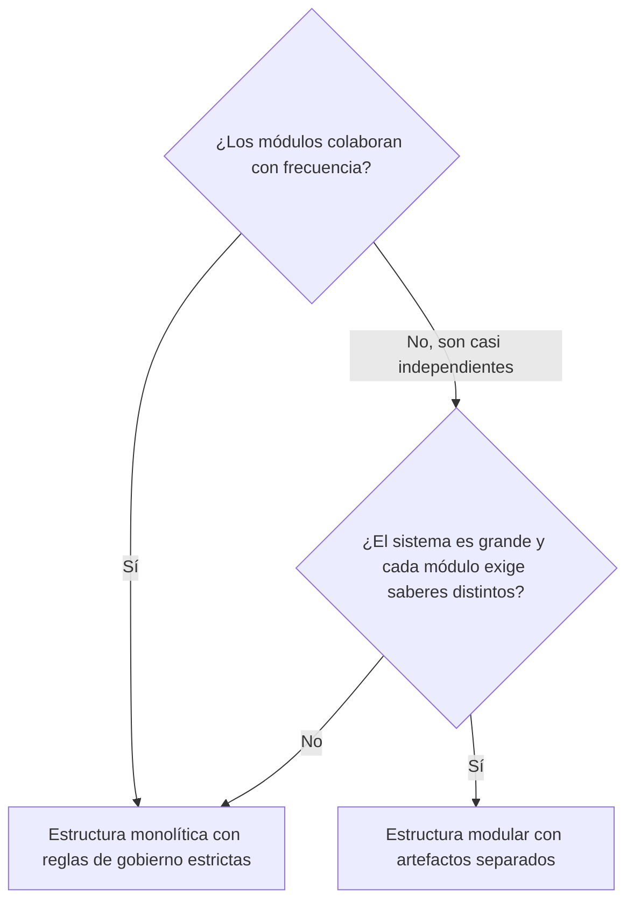

# Estructura monolítica y estructura modular

[[Obsidian/lecturas/Fundamentals of Software Architecture/11 Monolito modular/00 Índice|← Índice del capítulo 11]]

**Hay dos maneras de construir un monolito modular, y las dos terminan en el mismo despliegue único.** Lo que cambia es dónde vive el código de cada módulo y qué tan difícil resulta, en la práctica, cruzar la frontera entre módulos.


La imagen resume la nota entera. A la izquierda, la **estructura monolítica**: un único repositorio con una carpeta por módulo, que se compila de una vez. A la derecha, la **estructura modular**: cada módulo en su propio repositorio (o al menos como proyecto separado) y compilado como un artefacto independiente, un JAR en Java o un DLL en .NET. Las dos flechas convergen en la misma caja dorada: al final se entrega **una única unidad de despliegue**. Las frases en rojo anticipan el precio de cada opción: la primera depende de la disciplina del equipo; la segunda obliga a formalizar contratos cada vez que dos módulos necesitan hablar.

## 1. Estructura monolítica: un repositorio, una carpeta por módulo

En la estructura monolítica, todos los módulos están en **un solo repositorio de código fuente**. Cada módulo es un directorio de primer nivel que contiene sus componentes y sus subdominios. Al entregar el software, todo se compila y se despliega junto.

La figura 11-2 muestra un sistema de toma de pedidos (*order entry*) con seis módulos: colocación de pedidos, gestión de inventario, cumplimiento del pedido, procesamiento de pagos, notificación al cliente y envíos. Unas flechas señalan que cada módulo corresponde a un namespace. El libro lista después los namespaces completos:

```text
com.orderentry.orderplacement       → colocación de pedidos
com.orderentry.inventorymanagement  → gestión de inventario
com.orderentry.paymentprocessing    → procesamiento de pagos
com.orderentry.notification         → notificación al cliente
com.orderentry.fulfillment          → cumplimiento del pedido
com.orderentry.shipping             → envíos
```

> [!note] Una incoherencia menor del libro
> Los rótulos dibujados en la figura 11-2 dicen `com.orderentry.placement` y `com.orderentry.payment`, mientras que la lista del texto (y los ejemplos de gobierno posteriores) usan `orderplacement` y `paymentprocessing`. Se trata del mismo módulo con dos nombres; en estas notas se usa la versión de la lista, que es la que aplican las reglas de gobierno.

**Ventaja.** Es la opción más sencilla. Todo el código está en un sitio, así que se mantiene, se prueba y se despliega con facilidad: un solo proyecto para abrir, un solo proceso de compilación, un solo conjunto de pruebas.

**Riesgo.** Si las clases son públicas y no hay restricciones adicionales, compartir compilación facilita usar detalles de otro módulo. Un repositorio común no elimina los controles de acceso del lenguaje: el problema es exponer como públicas clases que conceptualmente deberían ser internas. El libro señala dos tendencias concretas: los desarrolladores **reutilizan demasiado código entre módulos** y **dejan que los módulos se comuniquen demasiado**. Cada atajo parece inofensivo, pero acumulados borran las fronteras hasta convertir un monolito modular bien diseñado en una **Big Ball of Mud**. Por eso esta opción exige un **gobierno estricto**: reglas automáticas que fallen cuando alguien cruza una frontera prohibida (se estudian en la nota de gobierno).

**Fuente:** PDF p. 3 · impresa 167 · figura 11-2.

## 2. Estructura modular: cada módulo es un artefacto

En la estructura modular, cada módulo se representa como un **artefacto autocontenido**: un archivo JAR en Java o un DLL en .NET. Un **artefacto** es el resultado empaquetado de compilar un proyecto; otros proyectos lo pueden usar como una biblioteca. Los artefactos se construyen por separado y **se combinan en una sola unidad de despliegue en el momento de desplegar**. La figura 11-3 dibuja la caja de despliegue llena de rectángulos «JAR», con flechas que identifican algunos: `order_placement.jar`, `payment.jar`, `shipping.jar`.

**Ventajas que menciona el libro:**

- Cada módulo es autocontenido, de modo que distintos equipos pueden trabajar en módulos distintos, muchas veces cada uno en **su propio repositorio**.
- Funciona bien cuando los módulos son **mayoritariamente independientes** entre sí.
- Funciona bien en sistemas **grandes y complejos donde cada módulo requiere un conocimiento distinto**, técnico o de negocio.
- Los desarrolladores tienden menos a reutilizar código en exceso o a comunicar módulos en exceso, porque hacerlo ya no es gratis: para usar otro módulo hay que declararlo como dependencia.
- Suele producir **fronteras más limpias** y una mejor separación de responsabilidades.

**Desventaja.** Pierde eficacia cuando módulos que dependen unos de otros **necesitan comunicarse**. Si pagos necesita a pedidos y pedidos necesita a inventario, cada relación obliga a gestionar dependencias entre artefactos, versiones y contratos compartidos (el problema se detalla en la nota de comunicación). En ese caso, el libro considera más eficaz la estructura monolítica.

**Fuente:** PDF p. 4 · impresa 168 · figura 11-3.

## 3. Por qué la frontera es más fuerte con artefactos

La diferencia es mecánica y conviene verla con un ejemplo propio. En la estructura monolítica, este código puede compilar si `ReservaInterna`, su constructor y el método son accesibles; llamarla «Interna» no restringe su acceso:

```java
// dentro del módulo pedidos
var reserva = new com.orderentry.inventorymanagement.interno.ReservaInterna();
reserva.descontarExistencias(articulo, 2);
```

En la estructura modular, `pedidos.jar` se compila **sin** el código de inventario. Si nadie ha declarado que pedidos depende de inventario, esa línea no compila. Para que funcione hay que tomar una decisión explícita y visible: añadir la dependencia, o mejor, depender de un contrato público de inventario. **La dependencia debe declararse, lo que hace visible el cruce de frontera.** Un JAR separado no oculta automáticamente sus clases públicas una vez añadido como dependencia: todavía hacen falta contratos y controles de acceso. En Java, la [especificación de accesibilidad](https://docs.oracle.com/javase/specs/jls/se25/html/jls-6.html#jls-6.6) distingue acceso público, de paquete y restricciones de módulos. Eso explica por qué el libro dice que los desarrolladores reutilizan y comunican menos con esta opción: no porque sean más disciplinados, sino porque cruzar cuesta un paso deliberado.

## 4. Comparación y decisión

| Aspecto | Estructura monolítica | Estructura modular |
|---|---|---|
| Dónde vive el código | Un repositorio, una carpeta por módulo | Un artefacto por módulo, a menudo con repositorio propio |
| Cómo se compila | Todo junto | Cada módulo por separado; se ensambla al desplegar |
| Qué protege la frontera | Disciplina y reglas automáticas | La propia compilación, además de las reglas |
| Comunicación entre módulos | Muy fácil (demasiado) | Requiere dependencias declaradas o interfaces compartidas |
| Encaja mejor con | Sistemas sencillos y módulos que colaboran a menudo | Sistemas grandes, módulos independientes y equipos especializados |
| Gobierno automatizado | Sencillo: un solo repositorio que revisar | Más difícil: cada módulo se revisa por separado |
| Despliegue | Una unidad | Una unidad |



El diagrama condensa el criterio del libro en dos preguntas. Si los módulos necesitan hablarse a menudo, los artefactos separados convierten cada conversación en una dependencia que hay que versionar, así que la estructura monolítica resulta más práctica, siempre que se vigilen las fronteras. Si los módulos son casi independientes y además el sistema es lo bastante grande para que cada módulo requiera especialistas, compensa aislarlos como artefactos. En un sistema pequeño con módulos independientes, la estructura monolítica sigue siendo suficiente y más barata.

## 5. Ejemplo resuelto: PedidoClaro

PedidoClaro, nuestro caso inventado de tienda de sándwiches, tiene cinco módulos: Pedidos, Pagos, Inventario, Promociones y Entregas. Un equipo de seis personas los mantiene todos. Pedidos llama a Inventario y a Pagos en cada compra; Promociones cambia cada semana; Entregas casi no conversa con nadie.

**Decisión:** estructura monolítica, un repositorio con cinco carpetas de módulo.

**Por qué:** los módulos colaboran en el flujo principal de compra y un solo equipo trabaja en todos, así que separar artefactos añadiría versiones y contratos que coordinar sin ganar autonomía real. **Costo aceptado:** hay que escribir desde el primer día reglas automáticas que impidan importar clases internas entre módulos. **Qué haría cambiar la decisión:** que aparezcan equipos distintos por módulo, o que un módulo (por ejemplo un motor de promociones con reglas muy especializadas) crezca hasta necesitar un ciclo de trabajo propio.

> [!question]- Con la estructura modular, ¿se puede desplegar solo `payment.jar`?
> No en el estilo que describe el libro: los artefactos se combinan en una sola unidad de despliegue. Cambiar `payment.jar` implica volver a ensamblar y desplegar la unidad completa. La separación mejora el desarrollo y las fronteras, no la independencia en producción.

> [!question]- ¿Por qué la estructura monolítica puede terminar en una Big Ball of Mud si empezó bien diseñada?
> Porque cruzar fronteras puede resultar muy fácil cuando todas las clases son públicas y no hay controles adicionales. Cada atajo aislado es pequeño; su acumulación elimina los límites. Sin reglas que lo detecten, la degradación es gradual e invisible.

> [!question]- ¿Cuándo pierde sentido la estructura modular?
> Cuando los módulos dependen mucho unos de otros. Cada dependencia entre artefactos exige interfaces compartidas y compatibilidad de versiones; si hay muchas, el esfuerzo supera el beneficio de las fronteras fuertes.

## Fuente principal

- [[Obsidian/lecturas/Fundamentals of Software Architecture/Materiales/08 Monolito modular.pdf#page=2|Fundamentals of Software Architecture, 2.ª ed., capítulo 11, PDF pp. 2–4 · impresas 166–168 · figuras 11-2 y 11-3]].

---

[[Obsidian/lecturas/Fundamentals of Software Architecture/11 Monolito modular/01 Qué es un monolito modular|← Anterior]] · [[Obsidian/lecturas/Fundamentals of Software Architecture/11 Monolito modular/03 Comunicación entre módulos|Siguiente →]]
