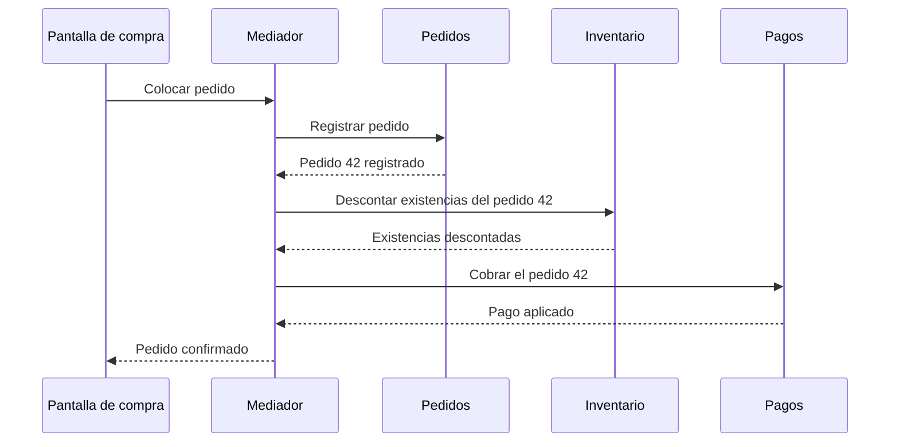

# Comunicación entre módulos: punto a punto y mediador

[[Obsidian/lecturas/Fundamentals of Software Architecture/11 Monolito modular/00 Índice|← Índice del capítulo 11]]

**El libro es tajante: en este estilo, que los módulos se comuniquen nunca es algo bueno, pero muchas veces es necesario.** Cada conversación entre módulos es un hilo que ata dos partes que querías mantener separadas. La pregunta no es cómo evitar toda comunicación, sino cómo mantenerla escasa y visible.

## 1. Por qué a veces no queda otra opción

El ejemplo del libro usa el sistema de pedidos de la figura 11-2. Cuando se coloca un pedido, el módulo `OrderPlacement` tiene que:

- pedir a `InventoryManagement` que **descuente las existencias** del artículo y haga el trabajo adicional que corresponda, por ejemplo **encargar más mercancía** si el inventario queda demasiado bajo;
- pedir a `PaymentProcessing` que **aplique el pago** del pedido.

Colocar un pedido es un flujo de negocio que atraviesa tres áreas. Ninguna partición elimina esa realidad: lo que sí puede elegirse es **cómo** viajan esas peticiones. El libro presenta dos opciones principales.

**Fuente:** PDF p. 4 · impresa 168.

## 2. Opción punto a punto (*peer-to-peer*)

Es la solución más directa: una clase de un módulo **crea una instancia de una clase de otro módulo y llama a sus métodos**. En la figura 11-4, dentro de la caja de despliegue, `Order placement` tiene dos flechas: una hacia `Inventory management` y otra hacia `Payment processing`.

```java
// Ejemplo propio: punto a punto en la estructura monolítica
public class ColocarPedido {
    public void colocar(Pedido p) {
        new GestorInventario().descontar(p.articulo(), p.cantidad());
        new ProcesadorPagos().cobrar(p.cliente(), p.total());
    }
}
```

**El problema en la estructura monolítica** es que resulta **demasiado cómodo**: como todo está en el mismo repositorio, cualquier clase puede instanciar cualquier clase de otro módulo, incluidas las internas. El libro advierte que así es fácil pasar de una arquitectura bien estructurada al antipatrón **Big Ball of Mud** de la figura 9-1: una red de dependencias cruzadas donde tocar una pieza afecta a muchas otras.

**El problema en la estructura modular** es distinto. Las clases del otro módulo están en otro artefacto (otro JAR o DLL), no en una carpeta del mismo repositorio. Un módulo que llama a otro **no compila si no tiene las referencias de sus clases**: hay que crear una **dependencia en tiempo de compilación** entre ambos. La respuesta habitual es extraer una **clase de interfaz compartida** a un JAR o DLL aparte, de modo que cada módulo compile contra esa interfaz y no contra el otro módulo:

```java
// contratos.jar — lo único que ambos módulos conocen
public interface Inventario {
    void descontar(String articulo, int cantidad);
}
// pedidos.jar compila contra contratos.jar, no contra inventario.jar
// inventario.jar implementa la interfaz Inventario
```

Así cada módulo sigue compilando de forma independiente. Pero si la comunicación crece, crecen también los contratos compartidos y sus versiones, y aparece el antipatrón que el libro llama **DLL Hell** (en Java, **JAR Hell**).

**Fuente:** PDF p. 5 · impresa 169 · figura 11-4.

## 3. Qué es el «JAR Hell», con un caso concreto

«Infierno de dependencias» describe la situación en que varias piezas necesitan **versiones incompatibles de la misma biblioteca**, y el sistema solo puede cargar una. Ejemplo propio:

1. `pedidos.jar` se compiló contra `contratos-inventario` versión 1, cuyo método es `descontar(String articulo, int cantidad)`.
2. El equipo de inventario publica la versión 2, que cambia el método a `descontar(String articulo, int cantidad, String almacen)`.
3. `envíos.jar` ya usa la versión 2.
4. Al ensamblar la unidad de despliegue solo puede quedar **una** versión del contrato en el *classpath*. Si queda la 2, pedidos falla en ejecución al buscar un método que ya no existe; si queda la 1, falla envíos.

Con pocos contratos esto se gestiona. Con muchos módulos que se llaman entre sí, cada cambio de contrato obliga a coordinar versiones de varios artefactos a la vez. Por eso el libro concluye que, **en cualquiera de las dos estructuras, demasiada comunicación entre módulos termina mal**: maraña en una, infierno de versiones en la otra.

## 4. Opción mediador

El enfoque **mediador** desacopla los módulos mediante un **componente mediador** que forma una capa de abstracción entre ellos. El mediador actúa como **orquestador**: recibe las peticiones y las entrega a los módulos adecuados. En la figura 11-5, un rectángulo `Mediator` en la parte superior tiene tres flechas hacia `Order placement`, `Payment processing` e `Inventory management`, que ya no tienen flechas entre sí.



El diagrama de secuencia muestra el flujo de colocar un pedido con mediador. La pantalla solo habla con el mediador, y el mediador conversa por turnos con Pedidos, Inventario y Pagos. Ningún módulo llama a otro: Pedidos no sabe que existe Pagos. Todas las flechas son llamadas locales dentro del mismo proceso, no mensajes por la red. El conocimiento del **orden** de los pasos, que antes estaba escondido dentro de `ColocarPedido`, ahora vive en un único sitio.

El libro añade la observación clave: **aunque el mediador desacopla los módulos entre sí, cada módulo queda acoplado al mediador.** No elimina todo el acoplamiento; simplifica la arquitectura y mantiene a los módulos independientes unos de otros. Además, es el **mediador** —no los módulos dependientes— quien necesita algún tipo de API o interfaz para invocar la funcionalidad de cada módulo.

**Fuente:** PDF pp. 5–6 · impresas 169–170 · figura 11-5.

## 5. Las tres variantes, lado a lado


La imagen reúne las tres situaciones descritas. En el panel A, Pedidos depende directamente de Inventario y de Pagos: es la opción punto a punto, cómoda pero sin freno. En el panel B, Pedidos e Inventario ya no se conocen; ambos dependen de un `contratos.jar` con interfaces, que es la respuesta habitual en la estructura modular y la puerta al infierno de versiones si los contratos se multiplican. En el panel C, un mediador depende de los tres módulos y ellos no dependen entre sí. El recuadro inferior recoge la conclusión: ninguna variante hace desaparecer el acoplamiento; lo reparte entre pares, lo concentra en contratos o lo concentra en el mediador.

## 6. Contar dependencias ayuda a decidir

Un cálculo sencillo, de elaboración propia, muestra por qué el mediador simplifica. Si cada uno de **n** módulos pudiera llamar a cualquier otro, el número máximo de dependencias dirigidas sería:

$$
\text{punto a punto} = n\,(n-1)
$$

Con un mediador que llama a cada módulo, las dependencias son **n**. Si además cada módulo tiene que avisar al mediador para iniciar flujos, serían **2n**.

| Módulos (n) | Punto a punto, máximo | Mediador (n) | Mediador bidireccional (2n) |
|---:|---:|---:|---:|
| 3 | 6 | 3 | 6 |
| 6 | 30 | 6 | 12 |
| 10 | 90 | 10 | 20 |

Con tres módulos la ventaja es pequeña; con diez es enorme. Pero el número no lo es todo: las n dependencias del mediador convergen en **una sola pieza**, que conoce los flujos de todo el sistema. Si se le deja crecer sin control, se convierte en un componente gigante que todos los equipos modifican y que concentra el riesgo de cambio.

## 7. Cómo elegir en la práctica

| Situación | Opción razonable | Motivo |
|---|---|---|
| Dos módulos con una colaboración estable y pequeña | Punto a punto a través de una interfaz pública | Es simple; una regla automática evita que se use lo interno |
| Un flujo que coordina tres o más módulos en un orden | Mediador | El orden del flujo queda explícito y los módulos no se conocen |
| Estructura modular con muchas llamadas cruzadas | Revisar los dominios antes que añadir contratos | Tanta comunicación sugiere fronteras mal trazadas (nota de riesgos) |
| Un módulo necesita solo leer datos de otro | Contrato de consulta del módulo dueño | Evita leer sus tablas o clases internas directamente |

> [!question]- Si con un mediador los módulos no se conocen, ¿por qué el libro dice que siguen acoplados?
> Porque todos dependen del mediador: si cambia cómo el mediador invoca a Pagos, hay que coordinar ese cambio. El acoplamiento no desaparece, se traslada a un punto único y conocido.

> [!question]- ¿Quién necesita la interfaz de cada módulo en el enfoque mediador?
> El mediador. Es él quien llama a los módulos; los módulos no necesitan conocer las interfaces de los demás.

> [!question]- ¿Qué error concreto produce el JAR Hell?
> Que en ejecución solo puede cargarse una versión de un artefacto compartido y algún módulo esperaba otra: aparecen fallos como métodos o clases inexistentes aunque cada módulo compilara correctamente por separado.

## Fuente principal

- [[Obsidian/lecturas/Fundamentals of Software Architecture/Materiales/08 Monolito modular.pdf#page=4|Fundamentals of Software Architecture, 2.ª ed., capítulo 11, PDF pp. 4–6 · impresas 168–170 · figuras 11-4 y 11-5]].

---

[[Obsidian/lecturas/Fundamentals of Software Architecture/11 Monolito modular/02 Estructura monolítica y estructura modular|← Anterior]] · [[Obsidian/lecturas/Fundamentals of Software Architecture/11 Monolito modular/04 Datos nube y riesgos|Siguiente →]]
