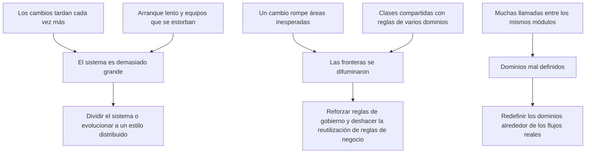

# Datos, nube y riesgos comunes

[[Obsidian/lecturas/Fundamentals of Software Architecture/11 Monolito modular/00 Índice|← Índice del capítulo 11]]

**Tener un solo despliegue no obliga a tener una sola base de datos, ni a quedarse fuera de la nube, ni a crecer sin límite.** Esta nota explica esas tres decisiones y las señales que indican que el estilo empieza a fallar.

## 1. Topologías de datos

Como el monolito modular suele desplegarse como una sola pieza, lo habitual es que use una **topología de base de datos monolítica**: una base de datos para todo el sistema. El libro destaca una ventaja concreta: **una base compartida reduce la comunicación entre módulos, porque los datos se comparten.** Si Informes necesita pedidos, puede leerlos de la base en lugar de pedirle a Pedidos que se los entregue.

Pero si los módulos **son independientes entre sí y realizan funciones específicas**, también pueden tener **su propia base de datos con los datos de su contexto**, aunque la arquitectura siga siendo monolítica. La figura 11-6 muestra las dos opciones: a la izquierda, un despliegue con nueve módulos y una flecha hacia una única base; a la derecha, un despliegue igual en el que algunos módulos apuntan a bases de datos propias y el resto sigue usando bases compartidas.

La recreación en español mantiene esa idea con seis módulos. En los dos lados, el rectángulo azul es la misma unidad de despliegue. A la izquierda, todos los módulos van a una base común. A la derecha, Recetas e Inventario, en verde, tienen su propia base, y los demás módulos siguen compartiendo la común. Debajo se resumen los efectos: compartir reduce la comunicación pero acopla a todos al mismo esquema; separar reduce el acoplamiento de datos de los módulos con almacén propio, a cambio de que cualquier consulta que cruce módulos tenga que pasar por el módulo dueño de esos datos.

**Fuente:** PDF p. 6 · impresa 170 · figura 11-6.

### El costo escondido de la base compartida

Compartir datos reduce llamadas, pero crea un **acoplamiento por datos**. Si el módulo Informes lee directamente la tabla `pedidos`, entonces:

- un cambio de columna en Pedidos puede romper Informes, aunque ninguna clase de Informes importe código de Pedidos;
- las reglas que Pedidos aplica al leer o escribir (por ejemplo, ocultar pedidos anulados) pueden saltarse sin querer.

Por eso la frase del libro tiene dos lados: la base compartida **reduce comunicación** justamente porque **hace que los módulos dependan de los mismos datos**. Una práctica intermedia, de elaboración propia, es mantener una sola base física pero asignar a cada módulo sus propias tablas o su propio esquema, y permitir que los demás lean solo a través de vistas o de consultas publicadas por el módulo dueño.

### Cuándo dar a un módulo su propia base

| Señal | Por qué favorece una base propia |
|---|---|
| El módulo trabaja con datos que nadie más usa (por ejemplo, el historial de previsiones de un algoritmo) | Nadie pierde nada al aislarlos, y el módulo puede cambiar su esquema libremente |
| Sus datos tienen otra forma o volumen (series temporales, documentos, búsquedas de texto) | Puede usar el almacenamiento más adecuado |
| Se prevé extraerlo algún día a un servicio | Separar datos anticipa una dificultad importante; aún quedan contratos, transacciones y operación |

Y el precio: no se puede suponer que seguirá disponible el mismo `JOIN` local entre esas tablas y las del resto, y mantener coherentes dos bases en una misma operación requiere más cuidado que una sola transacción.

## 2. Consideraciones de nube

Un monolito modular **puede desplegarse en la nube**, sobre todo si es un sistema pequeño. Sin embargo, el libro considera que **en general no se adapta bien a ella**: su unidad de escalado gruesa limita cuánto puede aprovechar el **aprovisionamiento bajo demanda por módulo**. Eso no impide escalar el monolito completo bajo demanda.

¿Qué significa eso? La nube permite aprovisionar recursos y, según el servicio contratado, añadir o quitar capacidad según la carga; la facturación depende de ese servicio. Un sistema distribuido puede añadir copias solo del servicio de pagos durante un pico de compras. Un monolito solo puede añadir **copias de la aplicación completa**, aunque únicamente pagos esté saturado; cada copia arranca todo el sistema, ocupa la memoria de todos los módulos y tarda lo que tarde el conjunto en iniciarse.

Aun así, los sistemas pequeños construidos con este estilo **pueden aprovechar muchos servicios de la nube**: almacenamiento de archivos, bases de datos gestionadas y mensajería, entre otros. Usar una base de datos administrada por el proveedor, por ejemplo, ahorra trabajo operativo sin cambiar el estilo.

**Fuente:** PDF p. 7 · impresa 171.

## 3. Riesgo principal: crecer demasiado

Como con cualquier monolito, el riesgo principal es que el sistema se vuelva **demasiado grande para mantenerlo, probarlo y desplegarlo adecuadamente**. El libro insiste en que los monolitos **no son malos en sí mismos**; los problemas empiezan cuando crecen demasiado. «Demasiado grande» varía de un sistema a otro, así que da **señales de alarma**:

| Señal | Qué suele estar pasando por debajo |
|---|---|
| Los cambios tardan demasiado en hacerse | Hay que entender mucho código ajeno o esperar a la siguiente entrega conjunta |
| Al cambiar un área se rompen otras de forma inesperada | Las fronteras entre módulos ya no protegen: hay dependencias ocultas o datos compartidos sin control |
| Los miembros del equipo se estorban al aplicar cambios | Muchas personas modifican los mismos archivos o compiten por el mismo ciclo de entrega |
| El sistema tarda demasiado en arrancar | El proceso carga todos los módulos; esto también alarga la recuperación tras un fallo |

**Fuente:** PDF p. 7 · impresa 171.

## 4. Riesgo: reutilizar código en exceso

Reutilizar y compartir código es una parte necesaria del desarrollo. Pero en este estilo, **demasiada reutilización difumina las fronteras de los módulos** y lleva la arquitectura al terreno del **monolito no estructurado**: un monolito con código tan interdependiente que **resulta muy costoso desenredarlo**.

Ejemplo propio. Pedidos crea una clase `Utilidades` con cálculos de precio. Pagos la usa para calcular impuestos; Promociones la usa para descuentos; Entregas le añade una función de distancia. En un año, `Utilidades` tiene reglas de cuatro dominios y cualquier cambio en ella obliga a probar los cuatro. Nadie puede extraer Pagos a otro sistema sin arrastrar esa clase y, con ella, lógica de los demás. **La reutilización que ahorraba líneas terminó fundiendo los módulos.** Reutilizar un mecanismo técnico estable (por ejemplo, formatear fechas) es muy distinto de compartir reglas de negocio de varios dominios.

**Fuente:** PDF p. 7 · impresa 171.

## 5. Riesgo: demasiada comunicación entre módulos

Idealmente, los módulos deberían ser **independientes y autocontenidos**. Es normal, y a veces necesario, que algunos se comuniquen, especialmente dentro de un **flujo de trabajo complejo**. Pero si hay **demasiada** comunicación, el libro lo interpreta como **indicio de que los dominios se definieron mal desde el principio**. En esos casos recomienda **redefinir los dominios** para acomodar los flujos complejos y las interdependencias.

Ejemplo propio. Si cada vez que Pedidos hace algo necesita consultar a Clientes, Precios y Promociones, quizá «calcular el precio final de un pedido» sea en realidad un único dominio repartido en tres módulos. Agrupar las reglas de cálculo podría reducir conversaciones, pero no demuestra que Clientes, Precios y Promociones deban fusionarse. Primero hay que distinguir reglas dispersas de colaboraciones legítimas.

El diagrama conecta cada síntoma con su causa probable y con la respuesta que sugiere el capítulo. Los síntomas de la izquierda son observables; las causas del centro son hipótesis que hay que confirmar; las acciones de la derecha no son automáticas. Por ejemplo, muchas llamadas entre dos módulos apuntan a dominios mal trazados, y la respuesta es rediseñar las fronteras, no añadir más contratos para que se llamen mejor.

> [!question]- ¿Por qué una base de datos compartida «reduce la comunicación» entre módulos?
> Porque un módulo puede leer los datos que necesita directamente de la base, sin pedírselos a otro módulo. El precio es que ambos quedan atados al mismo esquema.

> [!question]- ¿Qué impide a un monolito modular aprovechar bien la nube?
> La limitación principal es que el escalado horizontal replica toda la aplicación. Puede usar nube y escalado bajo demanda, pero no replicar un módulo aisladamente. Véase la [explicación de Microsoft sobre escalado de monolitos](https://learn.microsoft.com/en-us/dotnet/architecture/modern-web-apps-azure/common-web-application-architectures).

> [!question]- ¿Qué es un monolito no estructurado?
> Un monolito cuyo código tiene límites erosionados y dependencias difíciles de separar. Recuperar módulos puede requerir una refactorización costosa; no es una imposibilidad absoluta. Es el destino de un monolito modular cuando la reutilización excesiva y la comunicación sin control borran sus módulos.

## Fuente principal

- [[Obsidian/lecturas/Fundamentals of Software Architecture/Materiales/08 Monolito modular.pdf#page=6|Fundamentals of Software Architecture, 2.ª ed., capítulo 11, PDF pp. 6–7 · impresas 170–171 · figura 11-6]].

---

[[Obsidian/lecturas/Fundamentals of Software Architecture/11 Monolito modular/03 Comunicación entre módulos|← Anterior]] · [[Obsidian/lecturas/Fundamentals of Software Architecture/11 Monolito modular/05 Gobierno automatizado de módulos|Siguiente →]]
