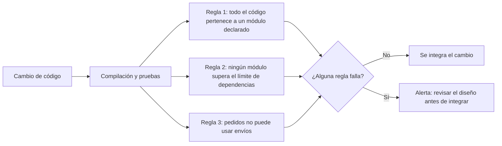

# Gobierno automatizado de módulos

[[Obsidian/lecturas/Fundamentals of Software Architecture/11 Monolito modular/00 Índice|← Índice del capítulo 11]]

**Un monolito modular solo sigue siendo modular si algo impide cruzar sus fronteras.** Como el compilador rara vez lo impide, el libro propone escribir reglas que se ejecutan solas y avisan cuando el código se sale del diseño. Son funciones de aptitud como las del [[Obsidian/lecturas/Fundamentals of Software Architecture/06 Medición y gobierno/05 Gobierno y funciones de aptitud|capítulo 6]], aplicadas a los módulos.

## 1. Qué se gobierna: el módulo

El artefacto principal del estilo es el **módulo**: representa un dominio o subdominio y normalmente se expresa mediante la **estructura de directorios o de namespaces** (en Java, la estructura de paquetes). Por eso una de las primeras formas de gobierno automatizado consiste en **definir los módulos y comprobar que todo el código respeta esa definición**.

Para escribir estas comprobaciones existen herramientas en casi todos los lenguajes. El libro menciona:

| Plataforma | Herramientas |
|---|---|
| Java | ArchUnit |
| .NET | ArchUnitNET y NetArchTest |
| Python | PyTestArch |
| TypeScript y JavaScript | TSArch |

Todas funcionan de forma parecida: leen el código compilado o fuente, construyen un mapa de paquetes y dependencias, y permiten escribir reglas que se ejecutan como pruebas automáticas. Si se configuran como controles obligatorios, una regla fallida detiene el *pipeline* (la secuencia automatizada de construcción, pruebas y entrega). La herramienta no bloquea cambios si nadie ejecuta la regla o se ignora su resultado.

El libro presenta **tres reglas** progresivamente más finas.



El diagrama sitúa las tres reglas donde actúan: en cada cambio, junto a las pruebas normales. Las tres se evalúan sobre el mismo código y cualquiera puede detener la integración. La alerta no corrige nada por sí sola; obliga a que una persona decida si el cambio es un error o si el diseño de módulos debe evolucionar.

**Fuente:** PDF p. 8 · impresa 172.

## 2. Regla 1: todo el código vive dentro de un módulo declarado

El ejemplo 11-1 hace tres cosas, en pseudocódigo:

1. Declara la lista de módulos del sistema de pedidos: los seis namespaces `com.orderentry.orderplacement`, `inventorymanagement`, `paymentprocessing`, `notification`, `fulfillment` y `shipping`.
2. Obtiene todos los namespaces que existen en el código, recorriendo el directorio raíz.
3. Para cada namespace, comprueba que **empiece por alguno de los módulos declarados**; si no, envía una alerta.

El efecto: si un desarrollador crea un namespace o directorio de primer nivel **fuera de los módulos definidos** —por ejemplo `com.orderentry.utilidades` o `com.orderentry.comun`—, recibe una alerta de que el código no cumple la arquitectura. Esa carpeta «común» es justo donde suele empezar la reutilización excesiva de la nota anterior.

Una versión propia en Python, con un detalle que el pseudocódigo no resuelve:

```python
MODULOS = [
    "com.orderentry.orderplacement", "com.orderentry.inventorymanagement",
    "com.orderentry.paymentprocessing", "com.orderentry.notification",
    "com.orderentry.fulfillment", "com.orderentry.shipping",
]

def pertenece(namespace, modulo):
    # Igual al módulo o dentro de él: evita que "shippingx" pase por "shipping".
    return namespace == modulo or namespace.startswith(modulo + ".")

def fuera_de_modulo(namespaces):
    return [ns for ns in namespaces if not any(pertenece(ns, m) for m in MODULOS)]
```

Dos precisiones sobre el pseudocódigo del libro. `starts_with(module_list)` debe entenderse como «empieza por **alguno** de los elementos de la lista». Y comparar solo prefijos de texto dejaría pasar `com.orderentry.shippingextra` como si fuera parte de `shipping`; por eso la función `pertenece` exige que después del nombre del módulo venga un punto.

**Fuente:** PDF p. 8 · impresa 172 · ejemplo 11-1.

### La regla en la estructura modular

Esta forma de gobierno funciona bien con la **estructura monolítica**, porque todo el código está en un repositorio y se puede recorrer de una vez. Con la **estructura modular** es más difícil: el código puede no estar en el mismo repositorio. Entonces **cada módulo debe comprobarse por separado**. El ejemplo 11-2 lo hace para el módulo de inventario: recorre los namespaces de ese repositorio y alerta si alguno no empieza por `com.orderentry.inventorymanagement`. (El pseudocódigo del libro escribe `namepace` en lugar de `namespace` en esa línea; es una errata sin importancia.)

La consecuencia práctica es que, con estructura modular, hay **una regla por repositorio** y alguien tiene que asegurarse de que cada repositorio la ejecute.

**Fuente:** PDF pp. 8–9 · impresas 172–173 · ejemplo 11-2.

## 3. Regla 2: limitar cuánto se comunica cada módulo

La segunda forma de gobierno controla la **cantidad de comunicación entre módulos**. El libro reconoce que definir cuánta es «demasiada» es **muy subjetivo y varía de un sistema a otro**, pero que, en general, hay que **minimizar las interdependencias**. El ejemplo 11-3 comprueba que no se supere un límite de **cinco puntos de comunicación o acoplamiento**.

La idea del pseudocódigo es:

1. Reunir los módulos y, para cada uno, la lista de sus archivos de código.
2. Para cada archivo, contar cuántas veces lo usan otros módulos (**entrantes**) y cuántos otros módulos usa él (**salientes**).
3. Sumar entrantes y salientes, y alertar si el total pasa de cinco.

> [!warning] El ejemplo 11-3 mezcla dos niveles
> El título del ejemplo habla del total de dependencias **de cada módulo**, el comentario habla del total **del sistema** y el código calcula el total **de cada archivo** y lo compara dentro del bucle, sin acumularlo por módulo. Además tiene detalles de sintaxis (llaves abiertas tras llamadas a funciones y nombres de variables que no coinciden). La intención que sí queda clara es limitar el acoplamiento de cada módulo; la versión de abajo hace eso de forma consistente.

```python
from collections import Counter

def puntos_por_modulo(dependencias):
    """dependencias: pares (origen, destino) entre módulos distintos, sin repetir."""
    entrantes, salientes = Counter(), Counter()
    for origen, destino in dependencias:
        salientes[origen] += 1
        entrantes[destino] += 1
    modulos = set(entrantes) | set(salientes)
    return {m: entrantes[m] + salientes[m] for m in modulos}

def alertas(dependencias, limite=5):
    return {m: t for m, t in puntos_por_modulo(dependencias).items() if t > limite}
```

Esta versión cuenta **pares de módulos**: si Pedidos usa Pagos desde diez archivos, cuenta como un solo punto de acoplamiento con Pagos. Contar referencias por archivo, como sugiere el libro, también es válido, pero da números mucho mayores y el límite de cinco habría que ajustarlo.

### Un ejemplo completo del conteo


La imagen aplica la regla a los seis módulos del sistema de pedidos con diez dependencias inventadas. Cada flecha va del módulo que usa al módulo usado. Pedidos usa cinco módulos —Inventario, Pagos, Notificación, Cumplimiento y Envíos—, así que tiene cinco salientes, y Notificación lo usa a él (la flecha roja), así que tiene una entrante: **1 + 5 = 6 > 5** y la regla lanza una alerta. Los demás quedan por debajo: Notificación, por ejemplo, recibe tres flechas y emite una, total 4. La tabla de la derecha permite comprobar la aritmética: la suma de todos los totales es 20, exactamente el doble de las diez flechas, porque cada flecha cuenta una vez en su origen y otra en su destino.

La flecha roja tiene además un problema de otra clase: Pedidos usa Notificación y Notificación usa Pedidos, lo que forma un **ciclo**. Aunque el total no superara el límite, ese ciclo merece revisión, como se vio en el [[Obsidian/lecturas/Fundamentals of Software Architecture/06 Medición y gobierno/06 Ciclos y distancia a la secuencia principal|capítulo 6]].

La alerta no dice qué hacer. En este caso hay al menos dos diagnósticos posibles: que Pedidos esté actuando como orquestador escondido (y convenga un mediador explícito, nota de comunicación) o que algunas de sus responsabilidades pertenezcan a otro dominio.

**Fuente:** PDF pp. 9–10 · impresas 173–174 · ejemplo 11-3.

## 4. Regla 3: prohibir una dependencia concreta

La última forma de gobierno asegura que **un módulo específico no hable con otro**. En el sistema de la figura 11-2, `OrderPlacement` **no debería comunicarse con `Shipping`**: colocar un pedido no tiene por qué saber cómo se envía. El ejemplo 11-4 expresa la regla con ArchUnit en Java. Su lógica, traducida a lenguaje natural:

| Fragmento | Significado |
|---|---|
| `noClasses().that()` | «Ninguna clase que…» |
| `.resideInAPackage("..com.orderentry.orderplacement..")` | «…esté en el paquete de colocación de pedidos o en cualquier subpaquete» |
| `.should().accessClassesThat()` | «…debe acceder a clases que…» |
| `.resideInAPackage("..com.orderentry.shipping..")` | «…estén en el paquete de envíos o en cualquiera de sus subpaquetes» |
| `.check(myClasses)` | Evalúa la regla sobre las clases importadas del proyecto y falla si alguna la incumple |

Los dos puntos `..` al principio y al final son comodines de ArchUnit: aceptan cualquier prefijo y cualquier subpaquete. La regla se escribe como una prueba unitaria más, así que se ejecuta cada vez que se ejecutan las pruebas.

Esta regla es más precisa que la anterior: no limita cuánto se comunica un módulo, sino **qué comunicación concreta está prohibida**. Es útil para proteger decisiones de diseño explícitas, por ejemplo que el envío solo se active desde Cumplimiento.

**Fuente:** PDF p. 10 · impresa 174 · ejemplo 11-4.

## 5. Las tres reglas comparadas

| Regla | Qué detecta | Qué no detecta |
|---|---|---|
| Todo el código pertenece a un módulo | Carpetas o namespaces «huérfanos» fuera del diseño | Que un módulo use clases internas de otro |
| Límite de dependencias | Módulos que concentran demasiado acoplamiento | Qué dependencia concreta sobra, ni acoplamiento a través de la base de datos |
| Dependencia prohibida | Una relación concreta que el diseño no admite | Cualquier otra relación no escrita como regla |

Ninguna regla ve el acoplamiento **por datos**: si Pedidos lee las tablas de Envíos directamente, las tres pasan. Para eso hace falta revisar también los accesos a tablas o esquemas de cada módulo.

> [!question]- ¿Por qué la primera regla es más fácil en la estructura monolítica que en la modular?
> Porque en la monolítica todo el código está en un repositorio y una sola comprobación lo recorre entero. En la modular cada módulo puede estar en un repositorio distinto, así que hay que ejecutar una comprobación por módulo.

> [!question]- Si Pedidos usa Pagos desde diez clases, ¿cuántos puntos de acoplamiento suma?
> Depende de qué se cuente. Contando pares de módulos, uno. Contando referencias por archivo, diez. Lo importante es elegir una definición, documentarla y ajustar el límite a esa definición.

> [!question]- ¿Qué expresa la regla ArchUnit del ejemplo 11-4?
> Que ninguna clase del paquete de colocación de pedidos, ni de sus subpaquetes, puede acceder a clases del paquete de envíos ni de sus subpaquetes. Si alguna lo hace, la prueba falla.

## Fuente principal

- [[Obsidian/lecturas/Fundamentals of Software Architecture/Materiales/08 Monolito modular.pdf#page=8|Fundamentals of Software Architecture, 2.ª ed., capítulo 11, PDF pp. 8–10 · impresas 172–174 · ejemplos 11-1 a 11-4]].

---

[[Obsidian/lecturas/Fundamentals of Software Architecture/11 Monolito modular/04 Datos nube y riesgos|← Anterior]] · [[Obsidian/lecturas/Fundamentals of Software Architecture/11 Monolito modular/06 Equipos y topologías|Siguiente →]]
