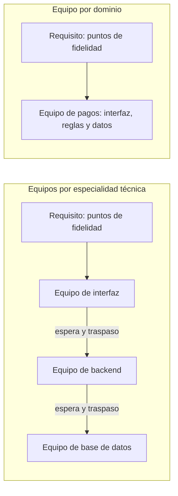

# Equipos y topologías

[[Obsidian/lecturas/Fundamentals of Software Architecture/11 Monolito modular/00 Índice|← Índice del capítulo 11]]

**Si el código se organiza por negocio, los equipos también deberían organizarse por negocio.** Es la ley de Conway del [[Obsidian/lecturas/Fundamentals of Software Architecture/09 Fundamentos de estilos arquitectónicos/08 Conway y topologías de equipos|capítulo 9]] aplicada a este estilo: cuando la estructura del equipo y la del código coinciden, cada cambio necesita menos conversaciones.

## 1. Equipos por dominio frente a equipos por especialidad técnica

Como el monolito modular está particionado por dominio, el libro afirma que **funciona mejor cuando los equipos también se alinean por área de dominio**, por ejemplo **equipos multifuncionales con especialización**. Un equipo multifuncional reúne las habilidades necesarias para entregar una función completa: alguien de interfaz, alguien de backend, alguien que domina los datos. Cuando llega un requisito de negocio, **ese equipo trabaja en la función de principio a fin, desde la lógica de presentación hasta la base de datos**, sin salir de su módulo.

En cambio, los **equipos organizados por categorías técnicas** —equipo de interfaz, equipo de backend, equipo de base de datos— **no encajan bien** con este estilo. La razón es su partición por dominio: un requisito de negocio cae dentro de un solo módulo, pero toca el trabajo de los tres equipos. Asignar requisitos de dominio a equipos técnicos **exige mucha comunicación y colaboración, algo que a menudo resulta difícil**.

El diagrama compara el recorrido del mismo requisito inventado, «aceptar puntos de fidelidad como forma de pago». Con equipos técnicos, el requisito atraviesa tres equipos y produce dos traspasos; en cada uno puede haber espera, malentendidos y una cola de prioridades distinta. Con un equipo de dominio, el requisito entra y sale del mismo grupo, que además es dueño del módulo de pagos donde vive todo el cambio. El código es el mismo en los dos casos; lo que cambia es cuántas personas deben ponerse de acuerdo.

**Fuente:** PDF p. 10 · impresa 174.

## 2. Los cuatro tipos de equipo aplicados al estilo

El libro retoma los tipos de equipo de *Team Topologies* presentados en el capítulo 9 (impresa 151) y explica cómo encaja cada uno con el monolito modular.

| Tipo de equipo | Qué dice el libro | Por qué encaja | Ejemplo propio |
|---|---|---|---|
| **Alineado con el flujo** (*stream-aligned*) | Suele ser dueño del flujo a través del sistema de principio a fin | Coincide con la forma monolítica y generalmente autocontenida del estilo | El equipo de Pedidos atiende desde la pantalla de compra hasta sus tablas |
| **Habilitador** (*enabling*) | Especialistas y miembros transversales pueden proponer mejoras y hacer experimentos **añadiendo módulos nuevos**, con impacto mínimo en los existentes | La alta modularidad y separación de responsabilidades permite probar algo nuevo sin tocar lo que funciona | Un experto en observabilidad añade un módulo de métricas y enseña a los equipos a usarlo |
| **Subsistema complicado** (*complicated-subsystem*) | Cada módulo cumple un papel específico según su dominio (por ejemplo, `PaymentProcessing`), de modo que algunos miembros se concentran en procesamiento complejo con independencia del resto | Un módulo encapsula la complejidad y los demás solo ven su interfaz | Especialistas en pagos y antifraude mantienen el módulo de pagos |
| **Plataforma** (*platform*) | Los desarrolladores aprovechan herramientas, servicios, APIs y tareas comunes | La alta modularidad facilita ofrecer capacidades compartidas a todos los módulos | Plantillas de módulo nuevo, reglas de gobierno listas para usar, pipeline de despliegue |

Conviene fijarse en el matiz del equipo **habilitador**: en este estilo, experimentar suele significar **añadir un módulo** en lugar de modificar los existentes. Como el módulo nuevo vive dentro del mismo despliegue, el experimento se integra rápido; como está separado, retirarlo es sencillo.

**Fuente:** PDF pp. 10–11 · impresas 174–175.

## 3. Qué hacer si el equipo es pequeño

El libro no exige tener un equipo por módulo. En un sistema pequeño, un solo equipo puede cuidar varios módulos. Como elaboración propia, lo importante es que **cada módulo tenga un responsable claro** y que las decisiones sobre su interfaz y sus datos no se tomen «entre todos y ninguno». Cuando el sistema y la organización crecen, los módulos ya definidos son la línea natural por la que repartir equipos, y un equipo técnico transversal (por ejemplo, de base de datos) puede reconvertirse en equipo de plataforma que ofrece servicios a los equipos de dominio.

## 4. Ejemplo resuelto

**Situación inventada.** Una empresa tiene un monolito modular con los módulos Pedidos, Pagos, Inventario y Envíos, y tres equipos: Frontend, Backend y Datos. Cada cambio de negocio tarda tres semanas, de las cuales dos son espera entre equipos.

**Diagnóstico.** La arquitectura está partida por dominio y los equipos por técnica: justo la combinación que el libro desaconseja. Cada requisito de un módulo necesita a los tres equipos.

**Propuesta.** Reorganizar en dos equipos multifuncionales —«Compra» (Pedidos y Pagos) y «Logística» (Inventario y Envíos)— y convertir parte del antiguo equipo de Datos en un equipo de plataforma que mantiene la base de datos, las copias de seguridad y las reglas de gobierno. **Costo:** los especialistas tienen que aprender algo de las otras capas y el cambio organizativo lleva tiempo. **Señal de éxito:** la mayoría de requisitos se entregan sin traspasos entre equipos.

> [!question]- ¿Por qué los equipos técnicos encajan mal con el monolito modular?
> Porque un requisito de negocio se concentra en un módulo, pero ese módulo contiene interfaz, reglas y datos. Con equipos técnicos, un solo requisito necesita a varios equipos y muchos traspasos.

> [!question]- ¿Cómo experimenta un equipo habilitador en este estilo?
> Añadiendo módulos nuevos al sistema. La modularidad hace que su impacto sobre los módulos existentes sea mínimo.

> [!question]- ¿Qué aporta un equipo de subsistema complicado?
> Permite que especialistas se concentren en un módulo de procesamiento complejo, como pagos, sin depender del resto del equipo ni de los demás módulos.

## Fuente principal

- [[Obsidian/lecturas/Fundamentals of Software Architecture/Materiales/08 Monolito modular.pdf#page=10|Fundamentals of Software Architecture, 2.ª ed., capítulo 11, PDF pp. 10–11 · impresas 174–175]].

---

[[Obsidian/lecturas/Fundamentals of Software Architecture/11 Monolito modular/05 Gobierno automatizado de módulos|← Anterior]] · [[Obsidian/lecturas/Fundamentals of Software Architecture/11 Monolito modular/07 Características y cuándo usarlo|Siguiente →]]
