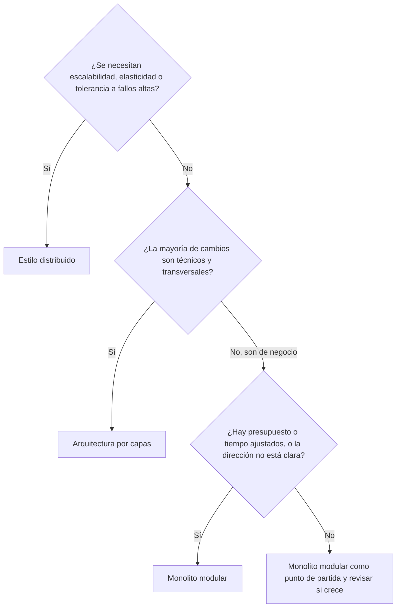

# Características y cuándo usarlo

[[Obsidian/lecturas/Fundamentals of Software Architecture/11 Monolito modular/00 Índice|← Índice del capítulo 11]]

**La ficha del monolito modular es casi la de la arquitectura por capas, con cuatro estrellas más.** Entender por qué suben esas cuatro, y por qué las operativas no se mueven, es entender el estilo.

## 1. Cómo se lee una ficha de estrellas

El libro valora cada estilo con la misma escala: **una estrella** significa que esa característica **no está bien soportada** por el estilo; **cinco estrellas**, que es **una de sus mayores fortalezas**. Las características se definieron en el capítulo 4. Son valoraciones cualitativas de los autores para comparar estilos, no mediciones de un sistema concreto.

La ficha tiene además tres datos que no son estrellas:

- **Costo general: `$`**, el más bajo de la escala.
- **Tipo de partición: dominio**, porque la lógica se divide en módulos de negocio.
- **Número de quanta: 1**, porque normalmente se implementa como un único despliegue monolítico. Un quantum, recuerda, es una parte que puede desplegarse y funcionar de forma independiente.

**Fuente:** PDF p. 11 · impresa 175.

## 2. La ficha completa, con sus razones

| Característica | Estrellas | Por qué |
|---|:---:|---|
| Simplicidad | ★★★★★ | Es monolítico: no carga con las complejidades de los estilos distribuidos (red, versiones remotas, consistencia entre servicios). Es fácil de entender y barato de construir y mantener |
| Modularidad | ★★ | Las responsabilidades se separan en módulos que representan dominios y subdominios |
| Mantenibilidad | ★★ | Deducción propia: los cambios de negocio se localizan en un módulo, pero todo sigue viviendo en una misma base de código |
| Testabilidad | ★★ | La modularidad ayuda, pero la ceremonia, el riesgo, la frecuencia de despliegue y la amplitud de las pruebas de un monolito la penalizan |
| Desplegabilidad | ★★ | Mejor organizada que en capas, pero cada cambio sigue desplegando el conjunto |
| Capacidad de evolución | ★★ | Deducción propia: las fronteras de dominio facilitan cambiar una capacidad, dentro de un único despliegue |
| Capacidad de respuesta | ★★★ | El libro no la explica; deducción propia: las llamadas entre módulos son locales, sin viajes por red |
| Escalabilidad | ★ | Se escala replicando el monolito entero |
| Elasticidad | ★ | Añadir y quitar capacidad rápidamente exige arrancar la aplicación entera |
| Tolerancia a fallos | ★ | Un fallo grave en una parte derriba toda la unidad |

**Fuente:** PDF pp. 11–12 · impresas 175–176 · figura 11-7.

## 3. Comparación con la arquitectura por capas

El gráfico enfrenta las dos fichas del libro: en azul, la arquitectura por capas (figura 10-6); en naranja, el monolito modular (figura 11-7). Cada par de barras es una característica y la longitud es el número de estrellas. Las cuatro características en negrita —modularidad, mantenibilidad, desplegabilidad y capacidad de evolución— pasan de una a dos estrellas; todas las demás son idénticas. Simplicidad queda en el máximo en ambos estilos, capacidad de respuesta en tres, y escalabilidad, elasticidad y tolerancia a fallos se quedan en una.

La lectura de fondo es que **cambiar la partición de técnica a dominio mejora lo que depende de cómo está organizado el código y no toca lo que depende de cómo se ejecuta.** Las características de ingeniería (mantener, desplegar, evolucionar) se benefician de que un cambio de negocio caiga en un solo módulo. Las operativas (escalar, absorber picos, sobrevivir a fallos) siguen limitadas por lo mismo que en capas: un único proceso y un único despliegue.

## 4. Dos imprecisiones del libro que conviene conocer

> [!warning] Testabilidad no sube respecto a capas
> El texto afirma que la desplegabilidad y la testabilidad, aunque tienen solo dos estrellas, puntúan **un poco más alto que en la arquitectura por capas** gracias a la modularidad. Comparando las figuras, la desplegabilidad sí sube (de una a dos), pero la **testabilidad ya tenía dos estrellas en capas** (figura 10-6), así que queda igual. La explicación del texto vale para la desplegabilidad; para la testabilidad, las fichas no muestran mejora.

> [!warning] Modularidad «fortaleza principal» con dos estrellas
> El texto dice que **costo, simplicidad y modularidad** son las fortalezas principales del estilo, pero la tabla da a la modularidad solo **dos estrellas**, cuando cinco significaría fortaleza. Una interpretación razonable, que es nuestra y no del libro, es que el texto habla de **modularidad lógica** (el código separado por dominios, claramente mejor que en capas) mientras que la ficha compara con estilos distribuidos, donde los módulos además se despliegan y escalan por separado. Frente a capas es una fortaleza; frente a microservicios, no.

**Fuente:** PDF pp. 11–12 · impresas 175–176 · figura 11-7; comparación con PDF 07 p. 9 · impresa 161 · figura 10-6.

## 5. Por qué escalabilidad y elasticidad reciben una estrella

La causa principal es el **despliegue monolítico**. El libro reconoce que **es posible** que algunas funciones escalen más que otras dentro de un monolito, pero eso suele exigir **técnicas de diseño muy complejas**: multihilo, mensajería interna y otras prácticas de procesamiento en paralelo, para las que este estilo no está pensado.

Ejemplo propio. En PedidoClaro, a la hora de comer las consultas del menú se multiplican por diez, mientras que el resto del sistema apenas cambia. En un monolito modular solo se puede responder de dos formas: arrancar más copias del sistema completo (con todos sus módulos, aunque solo el menú esté saturado) o complicar el interior del programa con hilos y colas internas para dar prioridad al menú. La primera desperdicia recursos; la segunda erosiona la simplicidad que justificaba el estilo.

## 6. Por qué la tolerancia a fallos recibe una estrella

Los despliegues monolíticos **no soportan tolerancia a fallos**: si una pequeña parte provoca, por ejemplo, un **agotamiento de memoria**, **se cae toda la unidad de aplicación**. Además, como en la mayoría de monolitos, la **disponibilidad** se ve afectada por un **tiempo medio de recuperación (MTTR) alto**, con **tiempos de arranque que suelen medirse en minutos**.

Un cálculo propio, simplificado, muestra por qué importa el arranque. La disponibilidad puede aproximarse como:

$$
\text{disponibilidad} = \frac{\text{MTBF}}{\text{MTBF} + \text{MTTR}}
$$

donde MTBF es el tiempo medio entre fallos. Si el sistema falla una vez al mes (unos 43.200 minutos):

| Tiempo de recuperación | Cálculo | Disponibilidad | Caída acumulada al año |
|---|---|---|---|
| 5 minutos | 43.200 / 43.205 | ≈ 99,988 % | ≈ 1 hora |
| 1 minuto | 43.200 / 43.201 | ≈ 99,998 % | ≈ 12 minutos |

Con el mismo número de fallos, reducir el arranque de cinco minutos a uno divide por cinco el tiempo sin servicio. Las cifras son un escenario; los tiempos de arranque reales dependen del sistema, y ejecutar varias réplicas detrás de un balanceador puede evitar que una sola caída deje sin servicio a los usuarios, aunque no separa los módulos dentro de cada réplica.

**Fuente:** PDF pp. 11–12 · impresas 175–176.

## 7. Cuándo usar un monolito modular

El libro da cuatro situaciones favorables:

1. **Presupuesto y tiempo ajustados.** Su simplicidad y bajo costo lo convierten en buena opción.
2. **Un sistema nuevo cuya dirección aún no está clara.** Suele ser más eficaz **empezar con un monolito modular y después evolucionar** hacia un estilo distribuido más complejo y costoso, como el basado en servicios (capítulo 14) o los microservicios (capítulo 18), **que saltar directamente a la arquitectura distribuida**. Los módulos ya definidos son las líneas por donde cortar después.
3. **Equipos orientados al dominio**, como los multifuncionales con especialización: cada equipo trabaja en un módulo de principio a fin con coordinación mínima con los demás.
4. **La mayoría de los cambios son de dominio.** El ejemplo del libro: **añadir fechas de caducidad a los artículos de la lista de deseos de un cliente**. Ese cambio vive en un solo módulo.

Además, por estar particionado por dominio, encaja bien con equipos que practican **DDD**.

**Fuente:** PDF pp. 12–13 · impresas 176–177.

## 8. Cuándo no usarlo

1. **Cuando se necesitan niveles altos de características operativas**: escalabilidad, elasticidad, disponibilidad, tolerancia a fallos, capacidad de respuesta y rendimiento. Como la mayoría de monolitos, el estilo no está pensado para ellas.
2. **Cuando la mayoría de los cambios son técnicos**, por ejemplo sustituir continuamente la interfaz de usuario o la tecnología de base de datos. Como cada módulo contiene su propia interfaz y su acceso a datos, esos cambios **afectan a todos los módulos** y requieren mucha comunicación y coordinación entre equipos de dominio. En esas situaciones, el libro considera **mucho mejor** la arquitectura por capas del capítulo 10, donde un cambio técnico se concentra en una capa.

El diagrama ordena los criterios del libro como un embudo. Primero se descartan los requisitos operativos exigentes, porque ningún monolito los cumple con fuerza. Después se mira el tipo de cambio dominante: si es técnico, gana la partición técnica de las capas; si es de negocio, gana la partición por dominio. El último paso reconoce que, sin presiones especiales, el monolito modular sigue siendo un buen inicio, con la condición de vigilar las señales de crecimiento de la nota de riesgos.

## 9. Tres decisiones resueltas

| Caso inventado | Decisión | Razón principal |
|---|---|---|
| Startup con cuatro desarrolladores y un producto que aún cambia cada mes | Monolito modular | Barato, simple y permite descubrir los dominios antes de distribuirlos |
| Portal de noticias que rediseña su interfaz cada trimestre y cambia de base de datos cada pocos años | Arquitectura por capas | Los cambios dominantes son técnicos y transversales |
| Plataforma de venta de entradas con picos de cien veces la carga normal al abrir un concierto | Estilo distribuido | La elasticidad es imprescindible y el monolito solo puede replicarse entero |

> [!question]- ¿Qué cuatro estrellas gana el monolito modular respecto a capas?
> Modularidad, mantenibilidad, desplegabilidad y capacidad de evolución, cada una de una a dos estrellas. Las demás valoraciones son iguales.

> [!question]- ¿Por qué el libro recomienda empezar con un monolito modular en lugar de con microservicios cuando la dirección no está clara?
> Porque es más simple y barato, y porque sus módulos de dominio sirven después como líneas de corte para extraer servicios. Saltar directamente a lo distribuido obliga a pagar desde el principio costos de red, datos y operación sin saber aún dónde deben ir las fronteras.

> [!question]- ¿Por qué un cambio de tecnología de base de datos es costoso en este estilo?
> Porque cada módulo tiene su propio acceso a datos. Cambiar la tecnología obliga a modificar todos los módulos y a coordinar a todos los equipos de dominio.

## Fuente principal

- [[Obsidian/lecturas/Fundamentals of Software Architecture/Materiales/08 Monolito modular.pdf#page=11|Fundamentals of Software Architecture, 2.ª ed., capítulo 11, PDF pp. 11–13 · impresas 175–177 · figura 11-7]].
- [[Obsidian/lecturas/Fundamentals of Software Architecture/Materiales/07 Arquitectura por capas.pdf#page=9|Capítulo 10, PDF p. 9 · impresa 161 · figura 10-6]], para la comparación.

---

[[Obsidian/lecturas/Fundamentals of Software Architecture/11 Monolito modular/06 Equipos y topologías|← Anterior]] · [[Obsidian/lecturas/Fundamentals of Software Architecture/11 Monolito modular/08 Caso EasyMeals|Siguiente →]]
