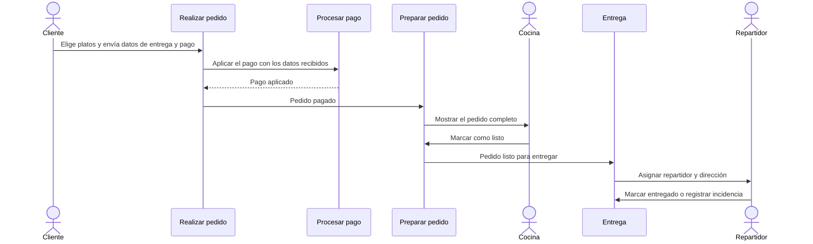

# Caso EasyMeals paso a paso

[[Obsidian/lecturas/Fundamentals of Software Architecture/11 Monolito modular/00 Índice|← Índice del capítulo 11]]

**EasyMeals es el ejemplo con el que el libro cierra el capítulo: un restaurante pequeño cuyo sistema se construye como monolito modular.** Recorrerlo módulo a módulo muestra cómo se traducen las ideas anteriores a un diseño concreto.

## 1. El negocio y por qué encaja el estilo

EasyMeals es un **restaurante de barrio nuevo, basado en entregas a domicilio**, pensado para personas que trabajan y no siempre tienen tiempo de cocinar al llegar a casa. Los clientes piden la cena por internet y la reciben en la puerta **en menos de una hora**.

El libro justifica la elección con dos rasgos del problema:

- Como restaurante **pequeño y local**, **no necesita alta escalabilidad ni gran capacidad de respuesta**. El caso no prioriza escala extrema; aun así necesita umbrales suficientes de respuesta, disponibilidad y corrección para atender pedidos.
- Su **presupuesto es limitado** y no quiere gastar mucho en un sistema elaborado. El estilo tiene el costo más bajo de la escala.

La forma del problema —pocas exigencias operativas, poco presupuesto y áreas de negocio bien diferenciadas— hace del monolito modular una buena elección.

**Fuente:** PDF p. 13 · impresa 177.

## 2. La arquitectura completa


La recreación de la figura 11-8 muestra, arriba, dos clientes HTTP distintos: el de los **clientes** del restaurante y el del **personal**. Debajo, la caja azul es la única unidad de despliegue, con seis módulos repartidos en dos grupos punteados. El grupo de atención al cliente contiene **Realizar pedido** y **Procesar pago**; el grupo de operación del restaurante contiene **Preparar pedido**, **Recetas**, **Entrega** e **Inventario de ingredientes**. Los clientes entran por Realizar pedido; el personal, por Preparar pedido. Las flechas internas siguen el recorrido de un pedido: de Realizar pedido a Procesar pago, de Realizar pedido a Preparar pedido y de Preparar pedido a Entrega. Todo el sistema usa **una sola base de datos**.

Los grupos punteados no son módulos: indican qué público usa cada conjunto. El texto del libro en este punto está algo confuso («los clientes acceden a PlaceOrder y PaymentProcessing mediante una interfaz dedicada, mediante una interfaz distinta»); lo que la figura deja claro es que **cada público tiene su propia interfaz**: los clientes usan una para pedir y pagar, y el personal usa otra para los módulos de cocina, recetas, entregas e inventario.

Los namespaces de los módulos son:

```text
com.easymeals.placeorder     → Realizar pedido
com.easymeals.payment        → Procesar pago
com.easymeals.prepareorder   → Preparar pedido
com.easymeals.delivery       → Entrega
com.easymeals.recipes        → Recetas
com.easymeals.inventory      → Inventario de ingredientes
```

**Fuente:** PDF p. 14 · impresa 178 · figura 11-8.

## 3. Cada módulo y sus componentes

El caso ilustra una idea del capítulo 8: **un módulo del monolito modular está formado por uno o varios componentes**. Cada componente es un namespace dentro del módulo, con el código de una función concreta.


La imagen presenta los seis módulos como tarjetas. El encabezado de cada tarjeta es el namespace del módulo y cada fila es un componente dentro de él: Realizar pedido tiene cinco, Pagos tres, Preparar pedido dos, Entrega tres, Recetas dos e Inventario cinco. El componente resaltado en dorado, `forecasting`, es la pieza de inteligencia artificial que hace más complejo al módulo de inventario. Ver las seis tarjetas juntas deja clara la diferencia de nivel: el módulo es el área de negocio; el componente, una función dentro de ella.

| Módulo | Qué hace | Componentes |
|---|---|---|
| **Realizar pedido** (`placeorder`) | El cliente ve el menú, elige platos, añade su nombre, dirección y datos de pago, y envía el pedido | `menu`, `shoppingcart` (carrito), `customerdata` (datos del cliente), `paymentdata` (datos de pago), `checkout` (confirmar compra) |
| **Procesar pago** (`payment`) | Aplica el pago. Acepta tarjeta de crédito, de débito y PayPal. El cliente introduce los datos en Realizar pedido, que se los pasa a este módulo | `creditcard`, `debitcard`, `paypal` |
| **Preparar pedido** (`prepareorder`) | Una vez pagado el pedido, Realizar pedido se comunica con este módulo, que **muestra el pedido completo al personal de cocina**. Al terminar de cocinar, el personal lo marca como listo | `displayorder` (mostrar pedido), `ready` (listo) |
| **Entrega** (`delivery`) | Asigna un repartidor, indica la dirección, permite marcar el pedido como entregado —lo que **cierra el ciclo de vida del pedido**— y registrar incidencias, como **un perro agresivo en la puerta o un cliente que no está en casa** | `assign` (asignar), `issues` (incidencias), `complete` (completar) |
| **Recetas** (`recipes`) | Cocineros y gerencia añaden platos al menú y mantienen la lista de ingredientes y cantidades de cada plato | `view` (consultar), `maintenance` (mantener) |
| **Inventario de ingredientes** (`inventory`) | Asegura que haya ingredientes suficientes para las recetas del menú. Es algo más complejo que los demás: tiene un **componente de IA que pronostica el volumen de ventas** para automatizar la compra semanal de ingredientes | `maintenance`, `forecasting` (pronóstico), `ordering` (pedidos a proveedores), `suppliers` (proveedores), `invoices` (facturas) |

Dos observaciones sobre los nombres: el módulo de pagos se llama `PaymentProcessing` en el texto pero su namespace es `payment`, y el de inventario se llama `IngredientsInventory` pero su namespace es `inventory`. No es un error grave; conviene saber que el nombre del módulo y el de su namespace no tienen por qué coincidir exactamente.

El libro destaca que la modularidad **facilita añadir un nuevo tipo de pago**, como **puntos de fidelidad**: el núcleo de las reglas puede concentrarse en un componente nuevo dentro de Pagos. La interfaz y los contratos quizá también cambien, como muestra el ejercicio final.

**Fuente:** PDF pp. 14–16 · impresas 178–180.

## 4. El ciclo de vida de un pedido



El diagrama de secuencia sigue un pedido desde que el cliente lo envía hasta que se entrega. Los participantes con figura de persona son el cliente, la cocina y el repartidor; los demás son módulos del mismo despliegue, así que cada flecha entre módulos es una llamada local. El pedido pasa por cuatro módulos en orden: Realizar pedido coordina el pago y luego avisa a Preparar pedido; la cocina marca el pedido como listo; Entrega asigna al repartidor y cierra el ciclo con «entregado» o registra una incidencia.

## 5. Lo que el ejemplo enseña sin decirlo

**Las flechas dibujadas son pocas.** La figura representa tres relaciones directas; no demuestra que sean todas las dependencias del sistema. Recetas e Inventario no aparecen conectados a nada, aunque el inventario necesita saber qué se vende y qué ingredientes lleva cada plato para su pronóstico. Una explicación posible es la **base de datos compartida**: podría leer ventas y recetas sin llamadas directas. Es una inferencia didáctica, no un contrato de acceso documentado por la figura. Es exactamente la ventaja que el libro atribuye a la topología de datos monolítica (nota de datos): menos comunicación entre módulos. Y también su costo: si el módulo de recetas cambia cómo guarda las cantidades, el pronóstico puede romperse sin que ninguna regla de dependencias entre módulos lo detecte.

**Realizar pedido actúa como coordinador.** Llama a Pagos y a Preparar pedido. Si el flujo creciera —por ejemplo, avisando también a Inventario y a un módulo de fidelidad—, sería una buena señal para introducir un mediador en lugar de acumular llamadas en ese módulo.

**Un módulo complejo no rompe el estilo.** El componente de IA de inventario puede requerir especialistas: es el caso típico del equipo de subsistema complicado. Sigue siendo un componente dentro de un módulo, desplegado con todo lo demás.

El libro cierra con la conclusión del ejemplo: la simplicidad y el nivel de modularidad del estilo hacen **relativamente fácil encontrar y mantener el código** para corregir un error o añadir una función.

**Fuente:** PDF p. 16 · impresa 180.

## 6. Ejercicios resueltos con EasyMeals

> [!question]- Llega el requisito «aceptar pago con puntos de fidelidad». ¿Qué se modifica?
> Principalmente el módulo de pagos, con un componente nuevo, por ejemplo `com.easymeals.payment.loyaltypoints`. Además, el componente `paymentdata` de Realizar pedido tendrá que ofrecer la nueva opción al cliente. Son dos módulos, pero el cambio de reglas vive en uno solo.

> [!question]- El restaurante quiere mostrar al cliente la hora estimada de entrega. ¿Dónde vive esa lógica?
> La estimación depende del estado de la cocina y del reparto, así que su cálculo encaja en Entrega (o en Preparar pedido si solo depende del tiempo de cocina). Realizar pedido solo debería mostrar el resultado, pidiéndoselo al módulo dueño, en lugar de calcularlo con datos ajenos.

> [!question]- Un sábado el sistema se queda sin memoria por culpa del pronóstico de inventario. ¿Qué pasa con los pedidos?
> Se caen también, porque todo corre en el mismo proceso: es la tolerancia a fallos de una estrella. Para un restaurante pequeño puede ser aceptable si la recuperación es rápida; si no, habría que ejecutar el pronóstico fuera del horario de pedidos o, más adelante, extraerlo.

> [!question]- ¿Por qué los grupos punteados de la figura no son módulos?
> Porque agrupan módulos según quién los usa (clientes o personal), no según un dominio. Cada grupo contiene varios módulos independientes, cada uno con su namespace.

## Fuente principal

- [[Obsidian/lecturas/Fundamentals of Software Architecture/Materiales/08 Monolito modular.pdf#page=13|Fundamentals of Software Architecture, 2.ª ed., capítulo 11, PDF pp. 13–16 · impresas 177–180 · figura 11-8]].

---

[[Obsidian/lecturas/Fundamentals of Software Architecture/11 Monolito modular/07 Características y cuándo usarlo|← Anterior]] · [[Obsidian/lecturas/Fundamentals of Software Architecture/11 Monolito modular/09 Laboratorio y repaso|Siguiente →]]
