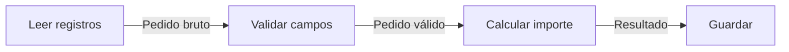

# Topología, filtros y canales

[[Obsidian/lecturas/Fundamentals of Software Architecture/12 Arquitectura pipeline/00 Índice|← Índice del capítulo 12]]

**El estilo pipeline separa el procesamiento en funciones concretas conectadas por datos.** También se llama *pipes and filters*: tuberías y filtros. Una tubería transporta; un filtro trabaja sobre lo que recibe. La división importa porque permite modificar una transformación sin reescribir la lectura del origen o el almacenamiento del resultado.

## 1. Qué problema resuelve

Imagina una función que abre un archivo de pedidos, reconoce sus columnas, rechaza registros incompletos, calcula importes, produce un resumen y lo guarda. Si todo está mezclado, sustituir el formato del archivo obliga a revisar cálculos y escritura aunque no hayan cambiado.

En un pipeline, «leer CSV», «validar», «calcular» y «guardar» son filtros distintos. **CSV** es un formato tabular de texto en el que los campos se separan por comas u otro delimitador. El lector conoce ese formato; el calculador recibe un objeto con cantidades y precios y puede ignorar de dónde salió. Esta separación transforma una dependencia de detalles en una dependencia de contratos: no necesita conocer cómo trabaja la etapa anterior, pero sí qué entrega.

El libro presenta el estilo como una de las formas fundamentales de organizar software y lo relaciona con las tuberías de Bash/Zsh, la composición funcional y MapReduce. **MapReduce** separa una transformación de datos (*map*) de una agregación (*reduce*); la relación es de composición por etapas, no de identidad completa entre ambos modelos. El capítulo muestra herramientas sencillas, pero la estructura también puede organizar procesamiento de negocio.

## 2. Las dos piezas de la topología

Un **filtro** es un componente que realiza una tarea delimitada. Puede ser una clase, varias clases o una función. «Componente» identifica una responsabilidad arquitectónica; no fija el número de archivos del código.

Un **pipe**, aquí llamado **canal**, conecta la salida de un filtro con la entrada del siguiente. Es normalmente punto a punto: un origen envía a un destino. Su dirección es única. Eso evita que cada etapa necesite conocer la coordinación interna de las otras.

La figura 12-1 encadena filtros y dobla la línea para que quepa en la página. La curva del dibujo no significa que los datos regresen a una etapa anterior. Lo relevante es la dirección de las flechas y la transferencia entre tareas.

Las cajas representan responsabilidades de nuestro ejemplo y las etiquetas de las flechas representan los datos que se entregan. El calculador recibe registros que ya cumplen el contrato de validación; el consumidor final recibe un importe calculado. La flecha define una dependencia hacia delante, aunque la ejecución tenga que informar errores a quien inició el trabajo.

## 3. La forma habitual tiene un despliegue

La **forma isomórfica** es la silueta que permite reconocer un estilo más allá de sus tecnologías. El capítulo describe la forma habitual del pipeline como una unidad de despliegue que contiene filtros conectados por canales unidireccionales.

En azul, todas las etapas viven dentro de una sola entrega. Cambiar un filtro obliga a publicar esa entrega completa, aunque su código esté bien separado. En amarillo, cada etapa es un servicio distinto: conserva su papel en el flujo, pero las flechas cruzan la red. Entonces hay que resolver transporte, versiones y fallos parciales. La modularidad del procesamiento y la independencia del despliegue son decisiones diferentes.

El libro admite explícitamente filtros desplegados como servicios, con llamadas síncronas o asíncronas. Por eso **pipeline no significa necesariamente monolito**. Las valoraciones posteriores se refieren a la variante monolítica más común.

## 4. Qué implica que los filtros sean independientes

No significa ausencia de dependencias. Una etapa depende de la estructura y del significado de su entrada. Significa que su función está encapsulada y que no necesita acceder a las clases internas de otra etapa para completarla.

El capítulo dice que los filtros suelen ser **sin estado**: normalmente no conservan entre ejecuciones información mutable necesaria para procesar el próximo dato. Eso facilita probarlos y repetirlos. No prohíbe consultar configuración, usar almacenes externos o calcular sobre ventanas de datos; en esos casos hay que explicar dónde está el estado y cómo se recupera.

La tarea completa puede ser compleja, pero su complejidad se reparte en etapas con propósitos identificables. Un filtro llamado `ProcesarTodo` que valida, calcula, escribe y envía correos pierde esa ventaja aunque aparezca dibujado en una cadena.

> [!question]- ¿Tener cuatro funciones llamadas en secuencia basta para adoptar el estilo?
> Es un comienzo, pero faltan responsabilidades claras, contratos de entrada/salida y dirección estable del procesamiento. Si todas comparten una estructura global que modifican libremente, la cadena visual oculta un acoplamiento fuerte.

> [!question]- ¿Cinco filtros implican cinco quanta?
> No. Un quantum es una unidad desplegable independiente con sus dependencias, no una caja de responsabilidad. En el pipeline monolítico típico hay uno. En una variante distribuida hay que analizar también datos compartidos y dependencias síncronas; contar servicios no basta.

## Fuente principal

[[Obsidian/lecturas/Fundamentals of Software Architecture/Materiales/09 Arquitectura pipeline.pdf#page=1|PDF 1–2 · impresas 181–182 · figura 12-1]]

---

[[Obsidian/lecturas/Fundamentals of Software Architecture/12 Arquitectura pipeline/00 Índice|← Índice]] · [[Obsidian/lecturas/Fundamentals of Software Architecture/12 Arquitectura pipeline/02 Roles y composición de filtros|Siguiente →]]
