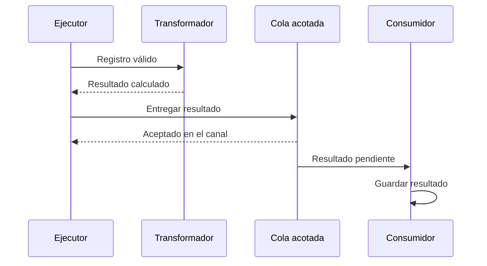

# Contratos, sincronía y rendimiento

[[Obsidian/lecturas/Fundamentals of Software Architecture/12 Arquitectura pipeline/00 Índice|← Índice del capítulo 12]]

**Separar tareas solo ayuda si cada entrega tiene un significado estable.** Un canal transporta un valor, pero su contrato determina qué puede asumir la etapa que lo recibe.

## 1. El contrato va más allá del formato

El capítulo dice que los canales pueden transportar cualquier formato y que normalmente se favorecen datos pequeños para mejorar rendimiento. Un **payload** es el contenido que viaja por el canal. Puede ser un objeto en memoria, texto, bytes o un mensaje serializado. **Serializar** significa convertir un dato en una representación transferible.

Este contrato de PedidoClaro es propio:

```json
{
  "version": 1,
  "pedido_id": "P-104",
  "cantidad": 3,
  "precio_unitario_centavos": 450,
  "moneda": "USD"
}
```

No basta con acordar que `cantidad` es un número. Debe ser entera y positiva; el precio se expresa en centavos; el identificador permanece estable entre reintentos. La salida del calculador añade `importe_centavos: 1350`. Si alguien empieza a mandar `4.50` en un campo interpretado como centavos, el JSON puede seguir siendo válido y el resultado económico quedar mal.

| Parte del contrato | Qué debe acordarse | Qué evita |
|---|---|---|
| Estructura | Nombres, tipos y campos obligatorios | Fallos al interpretar la entrada |
| Significado | Unidades, zona horaria, moneda | Cálculos técnicamente válidos pero incorrectos |
| Comportamiento | Rechazo, error, duplicados, orden | Supuestos incompatibles entre etapas |
| Evolución | Versiones y compatibilidad | Romper consumidores al cambiar productores |

Estas dimensiones son una ampliación práctica de la advertencia del libro sobre contratos, no una lista literal de la fuente.

## 2. Unidireccional y síncrono describen cosas distintas

**Unidireccional** indica hacia dónde progresa el dato. **Síncrono** significa que el llamador espera a que termine la operación. **Asíncrono** significa que puede entregar trabajo y continuar, mientras otro ejecutor lo procesa después.

Una función puede recibir un pedido, llamar al calculador y esperar su resultado sin que el flujo lógico deje de ir hacia delante. La devolución de un resultado o de un error no equivale por sí sola a crear un protocolo de negociación entre filtros. El riesgo aparece cuando un filtro necesita pedir a otro que retroceda, altere su trabajo y vuelva a consultarlo repetidamente.



El primer tramo espera la transformación; el segundo entrega a una cola. La aceptación de la cola significa que se recibió el trabajo, no que el consumidor ya lo guardó. Esa diferencia afecta lo que se puede mostrar al usuario y dónde se registra el avance.

El libro menciona hilos y mensajería embebida para canales asíncronos dentro de un monolito, y REST, mensajería o streaming para filtros remotos. Un hilo es otra línea de ejecución dentro del proceso; no crea un despliegue independiente ni proporciona por sí mismo almacenamiento durable.

## 3. Latencia y capacidad no son la misma medida

En un ejemplo propio, las etapas tardan `2, 3, 8 y 2 ms` por registro. Si un registro debe completar las cuatro sin esperas adicionales, su **latencia** mínima es:

$$L = 2 + 3 + 8 + 2 = 15\;\text{ms}.$$

Si un único ejecutor procesa un registro completo y luego el siguiente, su capacidad ideal es `1000 / 15 ≈ 66,7 registros/s`.

Si hay un trabajador por etapa y las etapas pueden solaparse procesando registros distintos, sus capacidades ideales son `500`, `333,3`, `125` y `500 registros/s`. El cuello de botella es el transformador de `8 ms`, de modo que el flujo estable no supera **125 registros/s** bajo esos supuestos. No se convierte la latencia individual en `8 ms`: cada registro sigue recorriendo las etapas y puede además esperar en colas.

## 4. Qué pasa si entra más trabajo del que sale

Si llegan `200 registros/s` y solo se completan `125`, se acumulan `75 por segundo`. Tras `60 segundos` hay `4500` pendientes, si nada cambia y no se descarta trabajo.

La **contrapresión** (*backpressure*) limita lo que el origen entrega cuando las etapas posteriores están saturadas. Una cola acotada obliga a definir una política: esperar, rechazar, guardar de forma durable para más tarde o reducir la carga. Una cola infinita en memoria puede terminar en agotamiento de memoria y afectar todo el monolito.

Estas cifras son supuestos didácticos. En la práctica influyen concurrencia, disco, red, tamaño de los datos y contención; por eso hay que medir. La simplicidad de las flechas no demuestra alto rendimiento.

> [!question]- ¿Hacer todos los canales asíncronos garantiza que el resultado llegue antes?
> No. Puede permitir solapamiento y absorber ráfagas, pero añade esperas y gestión de colas. La capacidad de la etapa más lenta sigue limitando el flujo estable mientras no cambie su capacidad.

## Fuente principal

[[Obsidian/lecturas/Fundamentals of Software Architecture/Materiales/09 Arquitectura pipeline.pdf#page=3|PDF 3 · impresa 183 · canales; PDF 6 · impresa 186 · contratos. Cálculos y contratos propios.]]

---

[[Obsidian/lecturas/Fundamentals of Software Architecture/12 Arquitectura pipeline/02 Roles y composición de filtros|← Anterior]] · [[Obsidian/lecturas/Fundamentals of Software Architecture/12 Arquitectura pipeline/04 Datos nube y despliegue|Siguiente →]]
