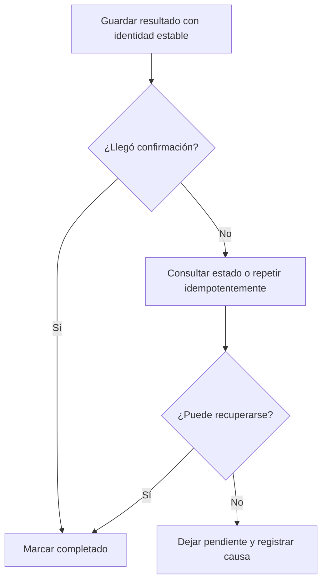

# Riesgos, errores y recuperación

[[Obsidian/lecturas/Fundamentals of Software Architecture/12 Arquitectura pipeline/00 Índice|← Índice del capítulo 12]]

**Los mayores riesgos surgen cuando una cadena sencilla empieza a ocultar coordinación, responsabilidades mezcladas o progreso incierto.** El libro identifica cuatro: filtros sobrecargados, comunicación bidireccional, recuperación de errores y contratos incompatibles.

## 1. Sobrecargar una etapa

Un transformador que «calcula importe» puede terminar validando clientes, consultando inventario, reservando productos, cobrando y enviando correos. Entonces tocar el importe pone en riesgo cinco responsabilidades adicionales. La etiqueta «transformador» no recupera la modularidad perdida.

La solución no consiste en crear un filtro por línea de código. Se separan responsabilidades que tienen motivos de cambio diferentes y contratos comprensibles. «Calcular importe» puede contener varias clases auxiliares mientras conserve una sola función del flujo.

## 2. Hacer que los datos vuelvan continuamente hacia atrás

Si el calculador necesita pedir al validador que cambie los datos y el validador necesita consultar de nuevo al lector, cada etapa empieza a conocer el proceso completo. El capítulo ve esa necesidad como señal de límites mal trazados o de un estilo inadecuado.

No toda bifurcación es un problema: clasificar una métrica como duración o uptime mantiene el avance hacia delante. Una negociación repetida, con decisiones que se revisan a medida que otras partes reaccionan, requiere más coordinación. El libro propone considerar arquitectura orientada a eventos para flujos menos predecibles; el escaneo no incluye ese capítulo y estas notas no lo reconstruyen.

## 3. Rechazar un dato es distinto de fallar

Un pedido de cantidad negativa puede rechazarse de forma esperada por el tester. Una base no disponible es un fallo operativo. Un formato incompatible puede impedir que el filtro interprete el registro. Mezclar todo como «error» hace imposible decidir si hay que corregir, descartar o reintentar.

| Situación propia | Significado | Respuesta posible |
|---|---|---|
| Cantidad negativa | Incumplimiento de una regla | Registrar rechazo; continuar con otros registros |
| Campo obligatorio ausente | Entrada inválida | Separar registro para corrección |
| Base temporalmente inaccesible | Fallo de infraestructura | Reintento acotado o pausa |
| Escritura sin confirmación | No sabemos si se guardó | Consultar/repetir con identidad estable |
| Error de programación del cálculo | El filtro no garantiza su contrato | Detener el trabajo afectado y corregir |

Las respuestas son políticas didácticas, no prescripciones literales del libro. El contexto determina si se tolera un resultado parcial o si debe detenerse el lote completo.

## 4. El caso difícil: guardó, pero no confirmó

Supón que el consumidor guarda `P-104`, y la respuesta se pierde. El ejecutor observa un tiempo agotado. Ese hecho no permite concluir que la escritura falló: puede haber ocurrido antes de perderse la confirmación.

El diagrama conserva el mismo identificador cuando se repite la escritura. Eso permite reconocer un resultado ya persistido. La ruta pendiente evita registrar como terminado un dato cuya situación sigue siendo incierta. Esta política trata la incertidumbre del fallo; no la elimina con una flecha.

La **deduplicación** detecta varias entregas de la misma identidad. No siempre basta el `pedido_id`: si un pedido cambia legítimamente, puede necesitarse una identidad que incluya versión o ejecución. La decisión depende de qué significa «el mismo resultado».

## 5. Recuperar requiere un punto conocido

Un **checkpoint** es un registro durable del avance que permite reiniciar desde un punto definido. Si todo estaba en memoria, reiniciar puede obligar a volver a leer y calcular. Si se guardaron resultados intermedios, hay que garantizar que pertenecen al contrato y la versión de cálculo que se va a continuar usando.

No conviene marcar «terminado» antes de guardar: un fallo entre ambas operaciones puede perder trabajo. Tampoco conviene asumir que guardar y marcar avance en sistemas distintos es atómico. **Atómico** significa que las operaciones ocurren como una unidad indivisible; cuando no hay esa garantía, el diseño debe tolerar repetición o reconciliar estados.

## 6. Cambiar el contrato sin cambiar al receptor

Renombrar `duracion_ms` a `duracion` puede romper el receptor de forma visible. Cambiar milisegundos por segundos conservando el nombre puede romperlo de forma silenciosa y más peligrosa. Versionar, probar compatibilidad y hacer una transición coordinada protege la frontera.

El libro exige gobierno y pruebas rigurosas ante cambios de contrato. El mecanismo concreto —versiones, despliegue gradual o adaptación— es una decisión de implementación.

> [!question]- ¿Reintentar indefinidamente una entrada inválida ayuda a recuperarla?
> No. Repetir no cambia los datos ni la regla. Debe corregirse o rechazarse; el reintento tiene sentido cuando puede cambiar la condición que causó el fallo.

> [!question]- ¿Una cola en memoria permite recuperar tras una caída del proceso?
> No por sí sola. Puede organizar la ejecución mientras el proceso vive, pero sus datos se pierden al caer. La durabilidad debe proporcionarla otro mecanismo.

## Fuente principal

[[Obsidian/lecturas/Fundamentals of Software Architecture/Materiales/09 Arquitectura pipeline.pdf#page=5|PDF 5–6 · impresas 185–186 · riesgos; políticas de recuperación propias]]

---

[[Obsidian/lecturas/Fundamentals of Software Architecture/12 Arquitectura pipeline/04 Datos nube y despliegue|← Anterior]] · [[Obsidian/lecturas/Fundamentals of Software Architecture/12 Arquitectura pipeline/06 Gobierno con etiquetas y pruebas|Siguiente →]]
