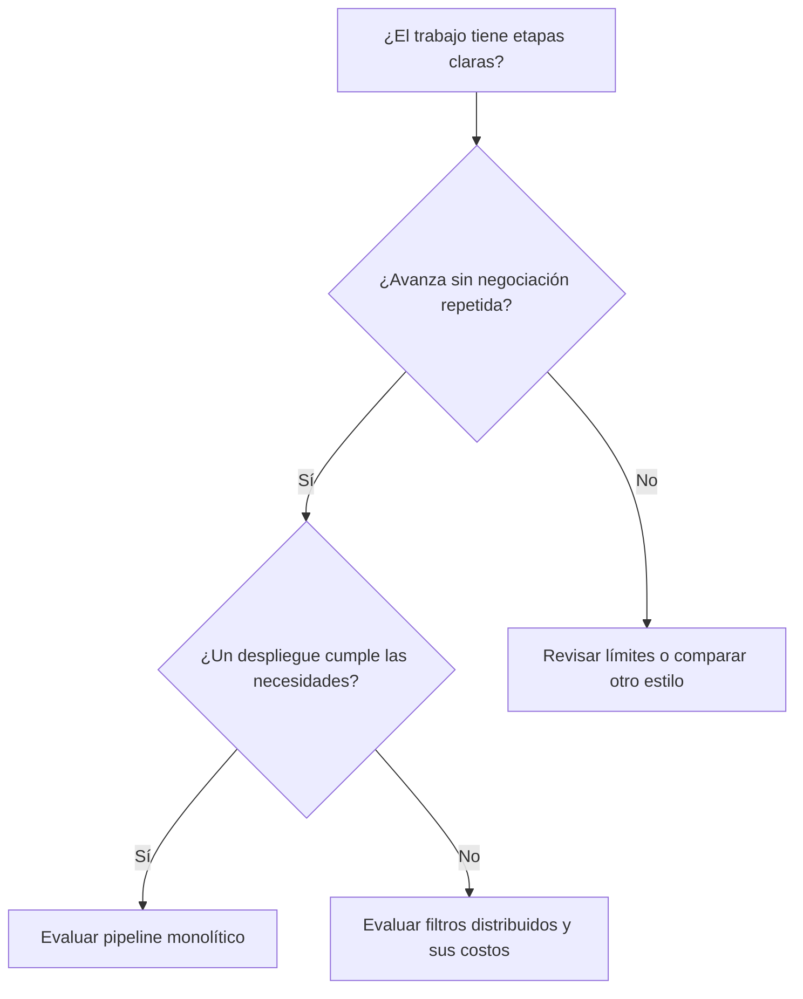

# Equipos, características y elección

[[Obsidian/lecturas/Fundamentals of Software Architecture/12 Arquitectura pipeline/00 Índice|← Índice del capítulo 12]]

**La ficha del libro favorece la sencillez del pipeline monolítico y reconoce sus límites operativos.** Separar etapas facilita comprender y probar tareas; compartir despliegue y proceso conserva costos de publicación y riesgos de fallo comunes.

## 1. Cómo encaja con los cuatro tipos de equipo

El capítulo considera el estilo compatible con distintas topologías de equipo, especialmente cuando el flujo es pequeño y está delimitado. No exige un equipo por filtro.

| Tipo | Qué significa | Aporte en el pipeline |
|---|---|---|
| **Alineado a un flujo** (*stream-aligned*) | Responsable de un recorrido de valor completo | Mantener el proceso de principio a fin y sus resultados |
| **Habilitador** (*enabling*) | Especialistas que ayudan a otros equipos a adquirir capacidades | Experimentar con un análisis nuevo sin rehacer todo el flujo |
| **Subsistema complicado** (*complicated-subsystem*) | Equipo centrado en una parte que exige conocimiento especializado | Desarrollar un filtro de cálculo complejo detrás de un contrato |
| **Plataforma** | Equipo que ofrece capacidades comunes a otros | Proporcionar herramientas, APIs, servicios y tareas reutilizables |

El libro propone añadir un transformador después del selector temporal para probar un análisis alternativo. «Sin afectar el resto» debe entenderse como proteger contratos y el flujo existente; en un sistema real también se comprueban consumo de recursos y resultados. Experimentar en la misma instancia puede competir por memoria o CPU aunque no cambie el formato.

La independencia entre filtros permite repartir trabajo, pero sigue haciendo falta alguien que cuide contratos y resultados del recorrido completo. Cuanto más pequeño sea el pipeline, menos sentido tiene multiplicar fronteras organizativas solo para imitar sus cajas.

## 2. La ficha de la figura 12-3

Las estrellas son valoraciones comparativas del estilo en el libro, no cifras medidas sobre una aplicación. Una estrella indica poco apoyo; cinco sería un apoyo fuerte. La figura describe el **despliegue monolítico habitual**.

| Familia | Característica | Estrellas verificadas |
|---|---|---:|
| Estructural | Simplicidad | ★★★★ · 4 |
| Estructural | Modularidad | ★★ · 2 |
| Ingeniería | Mantenibilidad | ★★ · 2 |
| Ingeniería | Testabilidad | ★★★ · 3 |
| Ingeniería | Desplegabilidad | ★★ · 2 |
| Ingeniería | Evolucionabilidad | ★★★ · 3 |
| Operativa | Capacidad de respuesta (*responsiveness*) | ★★★ · 3 |
| Operativa | Escalabilidad | ★ · 1 |
| Operativa | Elasticidad | ★ · 1 |
| Operativa | Tolerancia a fallos | ★ · 1 |

Otros campos: costo global **$** (bajo, sin cuantía monetaria), partición **técnica** y número de quanta **1**. La expresión del texto «siempre 1» corresponde al contexto monolítico de esta ficha; las páginas anteriores admiten despliegues distribuidos. No se extiende esa cifra a todas las variantes.

## 3. Por qué esas fortalezas y límites aparecen juntas

**Simplicidad y costo.** Una entrega evita coordinar versiones de múltiples servicios y operar canales de red internos. El flujo ordenado hace visible qué ocurre antes y después. El ahorro se refiere a complejidad relativa; no garantiza una factura baja para cualquier volumen de datos.

**Modularidad y evolución.** Cambiar el cálculo de duración puede dejar intactos captura, clasificación y persistencia si conserva el contrato. El capítulo llama a la modularidad una fortaleza aunque la tabla le dé dos estrellas. La lectura que lo hace coherente es que separa bien tareas, pero todavía comparte despliegue y no obtiene independencia operativa completa; esa explicación es una interpretación didáctica.

**Testabilidad y despliegue.** Un filtro con entradas y salidas claras puede probarse aislado. Sin embargo, para publicar un cambio se entrega toda la aplicación y hay que considerar regresiones del conjunto. El libro compara estas características con la arquitectura por capas: la separación de filtros ayuda, pero no elimina la ceremonia y el riesgo de publicar un monolito.

**Escalabilidad y elasticidad.** Escalabilidad es sostener más carga añadiendo capacidad; elasticidad es ajustar esa capacidad a la demanda. En un monolito, replicar solo el filtro lento no es una opción de despliegue. Puede replicarse la aplicación completa o aumentar recursos, con coordinación de entrada y salida. La estrella baja expresa apoyo limitado, no imposibilidad absoluta de escalar.

**Tolerancia a fallos.** Compartir proceso permite que un agotamiento de memoria en una etapa afecte a toda la instancia. La fuente usa ese caso y tiempos de recuperación altos para explicar la estrella baja. Un monolito puede tener varias réplicas y controles de recuperación, pero el estilo por sí solo no aísla cada filtro como un proceso independiente. Tampoco todo error de un filtro derriba necesariamente el proceso: una excepción manejada puede limitarse al trabajo afectado.

## 4. Distribuir mejora algunas posibilidades y cambia los costos

El capítulo propone filtros como servicios y canales asíncronos para mejorar escalabilidad, elasticidad y tolerancia a fallos. Separar procesos puede permitir aumentar réplicas de la etapa lenta y reiniciarla sin reiniciar las demás. A cambio aparecen red, colas, duplicados, observación de varias piezas y administración de versiones.

No es una garantía automática: una cola indisponible o una base compartida pueden seguir siendo dependencias críticas. Hay que volver a evaluar las características de la implementación elegida en lugar de conservar la ficha del monolito como si nada hubiera cambiado.

## 5. Cuándo usarlo y cuándo reconsiderarlo

Encaja cuando el trabajo se puede describir con pasos **distintos, ordenados y de avance en una dirección**. **Determinista**, en este contexto, significa que se conocen las reglas del recorrido; puede haber ramas decididas por condiciones explícitas. No significa que nunca haya decisiones.

El libro destaca restricciones de presupuesto y plazo, y cita EDI, ETL y orquestación. **EDI** intercambia documentos estructurados entre sistemas. **ETL** extrae, transforma y carga datos. En ambos casos, separar lectura, transformación y destino tiene una utilidad concreta.

Es menos adecuado si necesita mucha conversación de ida y vuelta entre etapas o si el recorrido cambia mediante reacciones difíciles de fijar como una secuencia. La variante monolítica también obliga a revisar necesidades altas de escala, elasticidad o aislamiento de fallos.

La decisión parte del recorrido funcional y después evalúa el despliegue. La rama distribuida exige una nueva comparación de costos y dependencias; no es una mejora gratuita. Si el problema es la necesidad continua de negociar entre etapas, repartirlo por la red no corrige ese desajuste.

> [!question]- ¿Una rama «si es duración, calcular duración; si no, probar uptime» contradice el estilo?
> No. Es una decisión explícita que sigue hacia delante. El problema descrito por el libro es una coordinación de ida y vuelta que vuelve compleja la cadena y mezcla sus responsabilidades.

> [!question]- ¿La tabla demuestra que mi aplicación tendrá tres estrellas de respuesta?
> No. Es una guía comparativa del libro, no una medida de tu implementación. Debes definir escenarios y medir tamaños de entrada, colas, tiempos y dependencias reales.

## Fuente principal

[[Obsidian/lecturas/Fundamentals of Software Architecture/Materiales/09 Arquitectura pipeline.pdf#page=8|PDF 8–11 · impresas 188–191 · equipos, figura 12-3 y criterios de uso]]

---

[[Obsidian/lecturas/Fundamentals of Software Architecture/12 Arquitectura pipeline/06 Gobierno con etiquetas y pruebas|← Anterior]] · [[Obsidian/lecturas/Fundamentals of Software Architecture/12 Arquitectura pipeline/08 Caso de telemetría Kafka|Siguiente →]]
