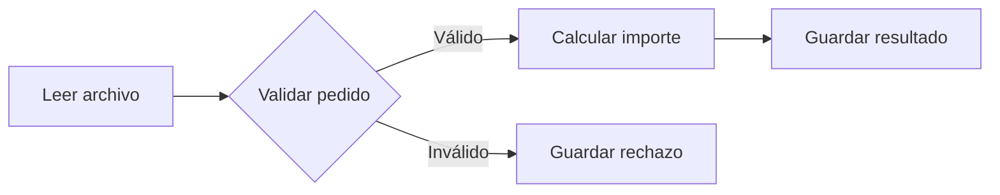

# Laboratorio y repaso resuelto

[[Obsidian/lecturas/Fundamentals of Software Architecture/12 Arquitectura pipeline/00 Índice|← Índice del capítulo 12]]

**Este laboratorio integra límites, contratos, capacidad y recuperación.** PedidoClaro y todas las cifras de esta nota son propios. El objetivo es justificar cada decisión, no memorizar una cadena de nombres.

## 1. Enunciado

PedidoClaro recibe un archivo diario con pedidos. Cada fila contiene identificador, cantidad, precio unitario en centavos y moneda. Hay que separar filas inválidas, calcular importes de las válidas y guardar un resultado por pedido y versión del lote. El origen debe poder cambiar de CSV a otro formato sin modificar el cálculo.

Para el ejercicio, se aceptan únicamente cantidades enteras positivas, precios enteros no negativos y moneda `USD`. No hay cobros ni reservas de inventario. La política de negocio exige conservar el motivo de rechazo y completar las demás filas válidas.

Propón filtros y contratos. Determina qué ocurre con estas filas:

| Pedido | Cantidad | Precio unitario | Moneda |
|---|---:|---:|---|
| P-1 | 2 | 450 centavos | USD |
| P-2 | -1 | 450 centavos | USD |
| P-3 | 3 | 200 centavos | USD |

> [!question]- Solución: filtros y responsabilidades
> Productor `LeerPedidos`: interpreta el archivo y entrega registros brutos con identidad del lote. Tester `ValidarPedido`: verifica reglas y separa rechazos. Transformador `CalcularImporte`: multiplica cantidad por precio sin conocer CSV. Consumidor `GuardarResultado`: persiste usando una clave como `(lote_version, pedido_id)`. Un consumidor alternativo guarda los rechazos. La salida del lector debe conservar moneda, unidades y versión; la del calculador añade importe en centavos.

Los datos válidos progresan al cálculo; los inválidos tienen un final explícito que conserva su causa. Esa segunda salida es una política propia del ejercicio. Evita tanto reintentar indefinidamente la fila incorrecta como perder silenciosamente el motivo del rechazo.

> [!question]- Solución: resultados de las tres filas
> P-1 produce `2 × 450 = 900 centavos = 9,00 USD`. P-2 termina en rechazos por cantidad negativa y no produce importe. P-3 produce `3 × 200 = 600 centavos = 6,00 USD`. Hay dos resultados válidos y un rechazo. Sumar los importes válidos da `1500 centavos = 15,00 USD`; esa agregación necesitaría una responsabilidad explícita adicional si formara parte del producto.

## 2. Calcular la capacidad

Supón un trabajador por etapa, etapas solapadas, tiempos constantes y sin costos adicionales. Leer tarda `2 ms`; validar `3 ms`; calcular `8 ms`; guardar `2 ms`. Entran `200 registros/s`. Para este cálculo de capacidad, considera que todos son válidos y recorren la misma ruta.

> [!question]- ¿Cuál es el cuello de botella y cuánto se acumula en un minuto?
> Las capacidades son `1000/2 = 500`, `1000/3 ≈ 333,3`, `1000/8 = 125` y `1000/2 = 500 registros/s`. Calcular limita a `125`. La diferencia con la entrada es `200 − 125 = 75 registros/s`; en un minuto se acumulan `75 × 60 = 4500` registros. Un pipeline con filtros pequeños necesita igualmente un límite de cola y una política frente a saturación.

> [!question]- ¿Dos trabajadores de cálculo resuelven el problema en este modelo?
> Si pueden trabajar de forma independiente, sin contención y preservando la corrección, la capacidad de cálculo sube a `2 × 125 = 250 registros/s`. El nuevo límite del conjunto es `250`, suficiente para una entrada de `200`. La latencia de cálculo de cada registro sigue siendo `8 ms`. Si importa mantener el orden de salida, habrá que preservarlo o aceptar explícitamente resultados fuera de orden. La mejora real requiere medición.

## 3. Recuperar una escritura incierta

`GuardarResultado` intenta guardar P-1. El almacén confirma internamente la escritura, pero la respuesta al ejecutor se pierde. Este solo observa un tiempo agotado. La clave del resultado es `(lote-2026-09-29-v1, P-1)`.

> [!question]- ¿Se puede asumir que no se guardó y añadir un registro nuevo?
> No. La ausencia de confirmación no demuestra ausencia de escritura. Una consulta por la misma identidad o una escritura idempotente puede reconocer el resultado existente. Añadir un registro nuevo con otra identidad podría duplicarlo. Solo se marca completado cuando la política de confirmación o reconciliación lo permita.

> [!question]- ¿Reprocesar un lote con otra fórmula debe usar la misma versión?
> No si representa un resultado nuevo que debe distinguirse del anterior. Hay que definir la identidad de la ejecución y su versión, para que la deduplicación no confunda una repetición con un recálculo legítimo.

## 4. Proteger las fronteras

Define comprobaciones de contrato para cantidades, unidades y moneda. Prueba el cálculo sobre entradas válidas, incluidos precio cero y valores altos acordados. Comprueba que una fila inválida genera rechazo y no escritura válida. Verifica que el mismo resultado repetido conserva el efecto esperado. Finalmente, mide una ráfaga para comprobar que la cola respeta su límite.

No basta con comprobar una etiqueta `Transformer`: el comportamiento relevante es que el calculador no reciba entradas inválidas ni modifique el almacenamiento. Tampoco es suficiente probar filtros aislados: la integración debe verificar que sus contratos coinciden.

## 5. Decisión arquitectónica resuelta

Para este ejercicio, una entrega monolítica tiene sentido si cumple la carga y el tiempo disponible: mantiene bajo el costo operativo y conserva filtros separados. El aumento de concurrencia puede evaluarse dentro del mismo proceso antes de justificar despliegues distintos.

Si el calculador necesita hardware diferente o su fallo debe aislarse del lector, la variante distribuida merece una comparación. Entonces hay que incluir transporte, duplicados, seguimiento y operación. Si el proceso cambia para negociar inventario, precio y aprobación en ciclos sucesivos, hay que revisar la idoneidad del flujo unidireccional.

## 6. Repaso del capítulo

> [!question]- ¿Qué hace pipeline reconocible?
> Funciones delimitadas en filtros conectados por canales cuyo flujo de datos avanza en una dirección. La forma habitual del libro vive en una sola unidad de despliegue.

> [!question]- ¿Por qué el productor Kafka recibe datos si se define como «solo salida»?
> Porque solo salida describe sus conexiones con los filtros del pipeline. Leer datos de un origen externo es precisamente su responsabilidad.

> [!question]- ¿Qué diferencia hay entre tester y transformador?
> El tester decide continuidad o ruta mediante criterios; el transformador cambia o calcula el dato. Separarlos permite modificar cálculo y clasificación por razones diferentes.

> [!question]- ¿Un filtro necesita ser una sola clase y no tener estado en ningún sitio?
> No. Puede contener varias clases. El libro dice que suele ser sin estado, pero los ejemplos usan almacenes. Lo relevante es explicitar su responsabilidad y dónde se conserva el estado necesario.

> [!question]- ¿Qué diferencia hay entre modularidad y desplegabilidad?
> Modularidad separa responsabilidades y dependencias del código. Desplegabilidad se refiere a publicar cambios. Un filtro modular dentro de un monolito continúa formando parte de una entrega completa.

> [!question]- ¿Qué riesgos nombra el capítulo?
> Sobrecargar filtros, introducir comunicación de ida y vuelta, no definir cómo salir y recuperar tras errores, y romper contratos entre etapas.

> [!question]- ¿Qué garantizan las etiquetas del libro?
> Contexto sobre el rol y el punto de entrada. No prueban por sí solas que el código cumpla ese rol.

> [!question]- ¿La ficha de un quantum se aplica automáticamente a filtros distribuidos?
> No. Describe la variante monolítica habitual. En distribución se vuelven a analizar unidades desplegables y sus dependencias.

El capítulo siguiente del libro trata **microkernel**, con componentes enchufables. Ese material no está en el escaneo de pipeline, pero ya puede estudiarse en [[Obsidian/lecturas/Fundamentals of Software Architecture/13 Arquitectura microkernel/00 Índice|el índice del capítulo 13]].

## Fuente principal

[[Obsidian/lecturas/Fundamentals of Software Architecture/Materiales/09 Arquitectura pipeline.pdf#page=1|PDF 1–12 · impresas 181–192 · integración del capítulo; laboratorio y cifras propios]]

---

[[Obsidian/lecturas/Fundamentals of Software Architecture/12 Arquitectura pipeline/08 Caso de telemetría Kafka|← Anterior]] · [[Obsidian/lecturas/Fundamentals of Software Architecture/13 Arquitectura microkernel/00 Índice|Capítulo 13 · Microkernel →]]
