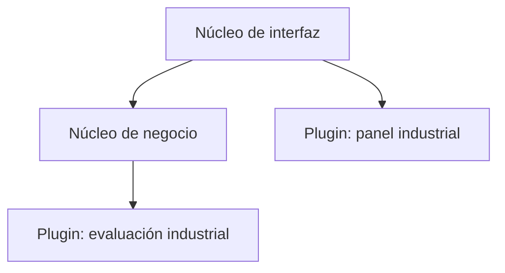

# Composición, espectro e interfaz

[[Obsidian/lecturas/Fundamentals of Software Architecture/13 Arquitectura microkernel/00 Índice|← Índice del capítulo 13]]

**La relación núcleo–plugins no fija cómo organizar el interior del núcleo ni cuánto valor ofrece sin extensiones.** Estas dos decisiones explican por qué aplicaciones muy diferentes pueden usar la misma idea.

## Núcleo por capas o por dominios

La figura 13-2 contiene dos variantes. En la primera, el núcleo se organiza por capas de presentación, negocio y persistencia: su división es **técnica**, porque agrupa responsabilidades según el tipo de trabajo. En la segunda, el núcleo es un monolito modular: su división es **por dominio**, porque los módulos representan áreas del negocio.

Un núcleo modular no elimina los plugins. Por ejemplo propio, una aplicación de comercio puede tener módulos de pedidos, pagos y devoluciones en el núcleo. Dentro de pagos, tarjeta, crédito de tienda, tarjeta regalo y orden de compra pueden ser extensiones. El libro usa precisamente los métodos de pago para explicar que cada servicio de dominio puede conservar su propio conjunto de plugins.

La frontera externa y la organización interna se complementan. Si el problema variable es «cómo evaluar cada dispositivo», conviene definir extensiones de evaluación. Si el problema interno es «pedidos y pagos cambian por razones distintas», conviene separar módulos del núcleo. Convertir todos los módulos en plugins sin identificar una variación real puede añadir indirección sin una ventaja clara.

El libro admite incluso núcleos divididos en servicios de dominio desplegados por separado. Esa variante necesita un análisis de dependencias y operación propio; la tabla de valoración posterior describe sobre todo la forma monolítica habitual.

## El espectro de funcionalidad autónoma

Un sistema que admite plugins no necesariamente tiene un núcleo mínimo. El libro propone un espectro según cuánta funcionalidad autónoma conserva el núcleo y cuán estable es. En el extremo más próximo al microkernel puro, el núcleo prepara un soporte básico que adquiere utilidad cuando se incorporan extensiones.

El caso de Eclipse se usa como simplificación conceptual: abrir, editar y guardar texto representa la base; las herramientas adicionales convierten esa base en un entorno de desarrollo completo. Un **IDE**, entorno integrado de desarrollo, reúne edición, compilación, depuración y otras herramientas. La descripción del libro sirve para separar base y capacidades; no pretende inventariar los componentes exactos de una distribución actual de Eclipse.

Un **linter** es una herramienta que analiza código y señala problemas o incumplimientos de reglas. Su núcleo puede analizar la sintaxis y producir un **AST**, árbol de sintaxis abstracta: una estructura que representa construcciones como funciones, llamadas y expresiones. Los plugins aportan las reglas que examinan ese árbol. Separar el análisis sintáctico de la regla evita que cada regla tenga que interpretar el texto fuente desde cero.

La caja azul muestra una base cuya utilidad final depende mucho de las reglas. La verde muestra un producto que ya resuelve su función central y admite ampliaciones. La flecha representa aumento de funcionalidad autónoma, no una carrera hacia un diseño mejor. El navegador del ejemplo del libro se sitúa hacia ese segundo extremo: puede navegar sin extensiones, aunque estas añadan capacidades.

La pregunta práctica es dónde se acumulan los cambios. Un núcleo casi vacío con un contrato modificado cada semana puede resultar menos estable que uno funcional con puntos de extensión duraderos. «Más puro» no equivale a «más apropiado».

## Tres maneras de ubicar la interfaz

La figura 13-3 distingue estas opciones:

| Variante | Organización | Consecuencia |
|---|---|---|
| Interfaz incorporada | Interfaz, núcleo y plugins se entregan juntos | La publicación es sencilla; cambios de interfaz y backend comparten entrega |
| Interfaz separada | La interfaz es otra unidad y consume el núcleo | Hay un contrato adicional entre interfaz y backend |
| Interfaz separada con sus propios plugins | La interfaz también tiene núcleo y extensiones | Se personalizan presentación y procesamiento mediante contratos diferentes |

Por ejemplo propio, una consola de reciclaje podría añadir un plugin de panel para equipos industriales en la interfaz y otro de evaluación en el backend. El panel recoge mediciones; el evaluador decide sobre ellas. No deberían compartir una clase privada solo porque pertenecen al mismo producto: el dato atraviesa una frontera y necesita significado acordado.

Las dos relaciones horizontales conceptuales son puntos de extensión distintos. La flecha interfaz–negocio transporta solicitudes y resultados. Separar las entregas añade un contrato que también necesita pruebas y compatibilidad; no equivale automáticamente a independencia operacional.

> [!question]- ¿Un navegador con extensiones es el ejemplo de núcleo mínimo?
> En el espectro del libro, no: conserva funcionalidad útil sin ellas. La idea de núcleo mínimo se ilustra mejor con una herramienta que prepara datos para reglas aportadas por plugins.

> [!question]- ¿La interfaz debe vivir dentro del núcleo?
> No. Puede estar incorporada o separada, e incluso organizarse como otro microkernel. La elección cambia despliegue y contratos, no la obligación de mantener estable la relación con sus extensiones.

## Fuente principal

[[Obsidian/lecturas/Fundamentals of Software Architecture/Materiales/10 Arquitectura microkernel.pdf#page=3|PDF 3–5 · impresas 195–197 · figuras 13-2 y 13-3]]; [[Obsidian/lecturas/Fundamentals of Software Architecture/Materiales/10 Arquitectura microkernel.pdf#page=8|PDF 8–9 · impresas 200–201 · figura 13-7]]. Comercio y consola industrial son ejemplos propios.

---

[[Obsidian/lecturas/Fundamentals of Software Architecture/13 Arquitectura microkernel/01 Núcleo y topología|← Anterior]] · [[Obsidian/lecturas/Fundamentals of Software Architecture/13 Arquitectura microkernel/03 Plugins y mecanismos de carga|Siguiente →]]
