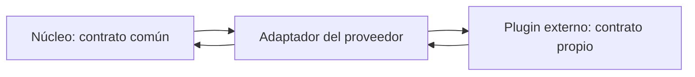

# Registro, contratos y adaptación

[[Obsidian/lecturas/Fundamentals of Software Architecture/13 Arquitectura microkernel/00 Índice|← Índice del capítulo 13]]

**El registro responde dónde está una capacidad; el contrato responde qué promete.** Ambos permiten que el núcleo seleccione extensiones sin especializar su código para cada una.

## El registro es un catálogo de capacidades

El **registro de plugins** conserva las extensiones disponibles y la información para acceder a ellas. Puede ser un mapa interno de claves a objetos o descriptores. Cuando existen servicios remotos puede incorporar direcciones, protocolos y versiones. El libro también contempla registros y herramientas de descubrimiento más complejos; no exige esa infraestructura para un producto con pocas extensiones locales.

En Going Green, la clave puede ser el identificador del modelo y el destino una implementación de evaluación. En el ejemplo fiscal, un componente llamado `AuditChecker` puede anunciar entradas, salidas y representación XML. **XML** y **JSON** son formatos para representar datos estructurados; saber el formato permite decodificar, pero no explica el significado de los campos.


El núcleo busca una capacidad a partir de la solicitud. El registro amarillo contiene identidad y metadatos; el contrato azul fija cómo invocarla. La extensión verde aplica reglas y devuelve un resultado. La localización puede tener éxito y la operación fallar si la versión o el significado de los datos no coincide: encontrar una dirección válida no equivale a encontrar una implementación compatible.

## Las tres entradas del libro son alternativas

En PDF 9, el ejemplo Java ejecuta tres `put` con la misma clave `iPhone6s`, apuntando respectivamente a una clase, una cola y una URL. Representan **formas alternativas de acceso**. Si se ejecutan juntas sobre el mismo mapa, las dos últimas sustituyen los valores anteriores y solo queda la URL. No se obtiene automáticamente un sistema con tres rutas.

Un descriptor propio más claro distingue `modo`, `destino` y `versionContrato`, o utiliza mapas separados si realmente se admiten varias implementaciones. Por ejemplo:

```yaml
clave: evaluacion/telefono-a
modo: local
implementacion: EvaluadorTelefonoA
versionContrato: 1
activo: true
```

Estos campos son una elaboración didáctica. El núcleo debe decidir también cómo actuar ante duplicados, capacidades desactivadas o ausencia de proveedor. Una capacidad opcional puede no aparecer en la interfaz; una obligatoria debe bloquear la operación con un error explicable. Elegir silenciosamente otro evaluador podría producir una decisión incorrecta.

## Un contrato incluye comportamiento y significado

El contrato del libro se llama `AssessmentPlugin` e incluye `assess`, `register` y `deregister`. La evaluación devuelve `AssessmentOutput`: informe, indicador de reventa, valor estimado y precio recomendado. Registrar y retirar son operaciones de ciclo de vida; evaluar es una operación de negocio. La muestra no define los detalles de error ni el modelo de concurrencia.

| Parte del resultado del libro | Significado | Responsabilidad |
|---|---|---|
| `assessmentReport` | Informe ya preparado | El plugin lo produce; el núcleo lo muestra o imprime |
| `resell` | Indica si puede revenderse | El plugin aplica las reglas que sustentan la decisión |
| `value` | Valor calculado | El plugin calcula con criterios de su variante |
| `resellPrice` | Precio recomendado de reventa | El plugin aporta la recomendación |

El núcleo no tiene que interpretar los detalles particulares del informe para coordinar el proceso. Sin embargo, si necesita buscar motivos de rechazo o construir estadísticas, depender de un texto libre puede ser insuficiente. Un contrato propio podría añadir códigos estructurados y conservar el informe para presentación. Eso responde a un requisito concreto, no corrige arbitrariamente el ejemplo del libro.

El ejemplo utiliza `Double` para importes. Su intención es ilustrar la estructura. Para un contrato de negocio real hay que fijar moneda, precisión y redondeo; representar un importe como un número no resuelve esas preguntas. En nuestro laboratorio los importes estarán expresados en centavos enteros para que el cálculo sea verificable.

## El adaptador protege el contrato común

Un **adaptador** traduce entre el contrato de un tercero y el contrato interno. Si una extensión ajena devuelve `sellable: "Y"` y el núcleo espera un booleano, la conversión pertenece al adaptador. Si devuelve otra moneda, convertir requiere una política y un dato autorizado; no basta con renombrar la propiedad.



La caja intermedia absorbe particularidades del proveedor. El núcleo sigue usando el contrato común. Esa protección funciona si el adaptador traduce significado, errores y versiones, además del formato. Un adaptador que entrega datos ambiguos solo desplaza el problema.

## Evolucionar sin romper

Como ampliación propia, una nueva propiedad opcional puede ser compatible si los consumidores antiguos pueden ignorarla y existe un valor por defecto definido. Cambiar «valor calculado» de centavos a dólares manteniendo el mismo campo rompe significado aunque el tipo siga siendo número. Una versión de contrato debe distinguir esos cambios y permitir probar qué núcleo funciona con qué plugin.

> [!question]- ¿Una interfaz Java basta para un contrato completo?
> Comprueba firmas y tipos, pero todavía faltan significado, errores, unidades, efectos secundarios y expectativas de concurrencia. Dos implementaciones pueden compilar y discrepar sobre qué representa un importe.

> [!question]- ¿El registro necesita ser una base de datos?
> No. Un mapa controlado por el núcleo puede bastar. Una infraestructura externa se justifica cuando el conjunto o las ubicaciones cambian y la operación necesita descubrirlos; también introduce disponibilidad, consistencia y administración adicionales.

## Fuente principal

[[Obsidian/lecturas/Fundamentals of Software Architecture/Materiales/10 Arquitectura microkernel.pdf#page=9|PDF 9–10 · impresas 201–202 · registro, contratos y AssessmentOutput]]. Descriptor YAML, unidades monetarias y reglas de evolución son elaboración propia.

---

[[Obsidian/lecturas/Fundamentals of Software Architecture/13 Arquitectura microkernel/03 Plugins y mecanismos de carga|← Anterior]] · [[Obsidian/lecturas/Fundamentals of Software Architecture/13 Arquitectura microkernel/05 Acceso remoto nube y quantum|Siguiente →]]
