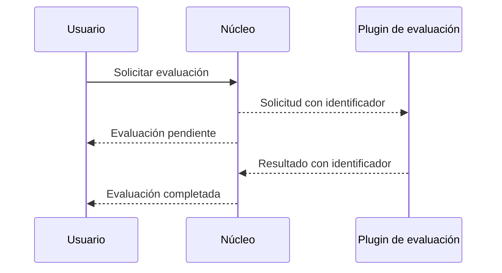

# Acceso remoto, nube y quantum

[[Obsidian/lecturas/Fundamentals of Software Architecture/13 Arquitectura microkernel/00 Índice|← Índice del capítulo 13]]

**Convertir un plugin en servicio cambia el modo de fallar y operar, aunque conserve su papel de extensión.** La figura 13-6 usa REST para mostrar que el punto de extensión puede cruzar la red.

## Punto a punto local

El acceso local suele ser una llamada de método o función al punto de entrada del plugin. El núcleo pasa objetos y recibe un resultado dentro del proceso. Hay poco coste de transporte y la distribución del producto es sencilla. La contrapartida es compartir recursos: consumo excesivo de memoria, bloqueo de hilos o una dependencia incompatible pueden perjudicar la aplicación completa.

**Punto a punto** describe quién comunica con quién; no significa necesariamente «sin red». El capítulo utiliza esa expresión principalmente para invocaciones locales. Una llamada remota directa también tiene un emisor y un destinatario, pero introduce problemas de transporte.

En el lado izquierdo las dos cajas viven dentro del mismo proceso. En el derecho ocupan procesos distintos y la flecha cruza la red. Esa nueva frontera permite que el plugin caiga sin terminar necesariamente el proceso del núcleo, pero la solicitud que lo necesita puede seguir fallando. Aislar el proceso reduce un tipo de propagación; no sustituye el diseño de recuperación.

## REST y mensajería

En una invocación síncrona, el núcleo espera la respuesta antes de completar la operación. REST, como lo usa el ejemplo del libro, expone una operación mediante un servicio accesible por HTTP. Aparecen serialización de datos, latencia y **timeout**, el límite de espera. Cuando ese límite vence, el núcleo puede no saber si el plugin terminó la operación y la respuesta se perdió o si nunca la recibió.

Con **mensajería asíncrona**, el núcleo publica una solicitud y puede devolver que el trabajo quedó pendiente. El libro explica este recorrido para una evaluación de dispositivo: iniciar evaluación, recibir después una notificación y comunicar al usuario que terminó. Mejora la rapidez de la confirmación inicial, pero no elimina la duración del trabajo.

El identificador enlaza solicitud y resultado en esta ampliación didáctica. Las flechas discontinuas representan mensajes y respuestas, sin prometer entrega única. El núcleo debe conservar el estado pendiente para que la finalización tenga un destino y el usuario pueda distinguir confirmación inicial de resultado final.

Como ejemplo propio, si se reintenta una evaluación con la misma clave de operación, el sistema debe evitar registrar dos resultados contradictorios. **Idempotencia** significa que repetir una operación identificada no multiplica su efecto de negocio. No supone que la red entregue una única vez. También hay que definir qué sucede con una respuesta tardía de una versión antigua del plugin.

## Beneficios y costes del acceso remoto

El libro destaca desacoplamiento, capacidad de escalar componentes y cambios de plugins sin una plataforma de carga en caliente dentro del proceso del núcleo. Un evaluador pesado puede aumentar sus instancias sin replicar necesariamente todos los demás plugins.

Aparecen más unidades que instalar, observar y mantener. La variante resulta más complicada para productos de terceros instalados en las instalaciones del cliente. La disponibilidad del plugin remoto condiciona las operaciones que lo necesitan. El texto dice que ese problema no sería igual en un despliegue monolítico: la precisión es que allí no existe esa dependencia de red, **pero un plugin local también puede lanzar errores, bloquearse o consumir recursos**.

Por ejemplo propio, cuatro llamadas remotas secuenciales con 60 ms de transporte añadido por llamada acumulan `4 × 60 = 240 ms`, antes del procesamiento. El dato es ilustrativo, no una medición. Si una evaluación requiere muchas llamadas pequeñas entre núcleo y plugin, la separación geográfica puede perjudicar respuesta aunque el plugin sea muy rápido.

## Nube: tres ubicaciones del libro

| Variante | Qué se mueve | Consecuencia destacada |
|---|---|---|
| Aplicación completa en nube | Núcleo y extensiones | Se conserva el empaquetado habitual y se opera una entrega completa |
| Datos en nube, aplicación local | Almacenes de datos | La aplicación sigue local, pero depende de conexiones para acceder a los datos |
| Núcleo local, plugins en nube | Capacidades especializadas | Cada invocación frecuente puede pagar latencia y transferencia |

La tercera variante parece atractiva para modularidad, pero el capítulo advierte sobre llamadas frecuentes y datos abundantes. El lugar donde vive el código debe responder a carga, latencia y operación, además de a la separación conceptual.

## Por qué el libro sigue contando un quantum

Un **quantum arquitectónico** es una unidad de comportamiento y despliegue con independencia suficiente respecto de sus dependencias. No se obtiene contando contenedores. El capítulo mantiene **un quantum** incluso en el dibujo con plugins remotos, porque las solicitudes siguen pasando obligatoriamente por el núcleo monolítico. Es la clasificación del libro para esa topología centralizada.

Hay que distinguirla de decir que «hay un solo proceso»: en la figura remota hay varios servicios y entregas. Que un plugin pueda desplegarse por separado tampoco prueba que funcione de manera operacionalmente independiente: puede depender del núcleo, contratos, datos y flujo de coordinación. Una topología diferente, especialmente con trabajo asíncrono autónomo, requeriría volver a analizar esas dependencias; no corresponde copiar el número uno a cualquier sistema que admita extensiones.

> [!question]- ¿Asíncrono significa que todo termina más rápido?
> No. El usuario puede recibir antes una confirmación de aceptación, mientras el trabajo continúa. La duración final incluye cola, procesamiento y comunicación de resultado. Son dos tiempos diferentes.

> [!question]- ¿Cinco servicios de plugins son cinco quanta?
> No automáticamente. El libro considera uno en su topología con núcleo obligatorio. La independencia de entrega es solo una parte del análisis: hay que examinar también dependencias de ejecución y datos.

## Fuente principal

[[Obsidian/lecturas/Fundamentals of Software Architecture/Materiales/10 Arquitectura microkernel.pdf#page=7|PDF 7–8 · impresas 199–200 · figura 13-6 y acceso remoto]]; [[Obsidian/lecturas/Fundamentals of Software Architecture/Materiales/10 Arquitectura microkernel.pdf#page=11|PDF 11 · impresa 203 · nube]]; [[Obsidian/lecturas/Fundamentals of Software Architecture/Materiales/10 Arquitectura microkernel.pdf#page=13|PDF 13 · impresa 205 · quantum]]. Identificación, reintentos y cálculo de latencia son elaboraciones propias.

---

[[Obsidian/lecturas/Fundamentals of Software Architecture/13 Arquitectura microkernel/04 Registro contratos y adaptación|← Anterior]] · [[Obsidian/lecturas/Fundamentals of Software Architecture/13 Arquitectura microkernel/06 Datos y propiedad del estado|Siguiente →]]
