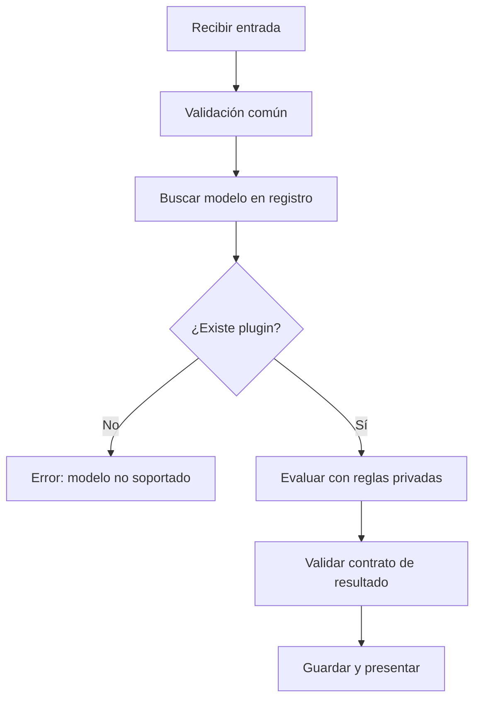

# Laboratorio y repaso resuelto

[[Obsidian/lecturas/Fundamentals of Software Architecture/13 Arquitectura microkernel/00 Índice|← Índice del capítulo 13]]

**EcoEval es un ejercicio propio inspirado en Going Green.** Todos sus precios y reglas son inventados para practicar arquitectura, sin representar una cotización real. El objetivo es agregar modelos sin modificar el flujo del núcleo y poder explicar por qué una decisión quedó en cada componente.

## 1. Requisitos y frontera

La aplicación recibe un dispositivo, verifica datos básicos, selecciona un evaluador, obtiene un resultado y guarda el expediente. Por ahora se instala como una entrega y se necesita más facilidad de mantenimiento que escalado independiente.

| Responsabilidad | Ubicación | Razón |
|---|---|---|
| Validar que existe un identificador y que la batería está entre 0 y 100 | Núcleo | Regla común de entrada |
| Seleccionar el evaluador por modelo | Núcleo con registro | Coordinación estable |
| Decidir si el modelo se puede revender | Plugin | Regla de variante |
| Calcular valor y precio recomendado | Plugin | Conocimiento específico |
| Guardar el resultado y estado del expediente | Núcleo | Datos comunes del proceso |
| Mantener tabla de depreciación particular | Plugin | Dato privado de la variante |

El núcleo puede validar el rango de batería sin saber si el umbral de reventa del teléfono es 70 u 80. La primera condición garantiza una entrada coherente; la segunda expresa una política del modelo.

## 2. Contrato mínimo y explícito

```text
EntradaEvaluacion:
  operacionId: identificador estable
  dispositivoId: identificador del expediente
  modelo: clave de selección
  bateriaPorcentaje: entero 0..100
  pantallaRota: booleano

ResultadoEvaluacion:
  puedeRevender: booleano
  valorCentavos: entero >= 0
  precioRecomendadoCentavos: entero >= 0 o ausente
  motivos: lista de códigos
  informe: texto para mostrar
  versionReglas: identificador
```

El contrato identifica unidades y separa códigos de explicación humana. «Ausente» en el precio significa que no hay recomendación de venta; no se interpreta como un precio de cero. El núcleo puede mostrar el informe sin analizar su redacción y usar códigos estables para estadísticas.

## 3. Dos plugins y cálculo completo

**Teléfono A:** valor base de 12 000 centavos; si batería menor que 80, descontar 2 000; si pantalla rota, descontar 4 000. Puede revenderse si batería es al menos 70 y la pantalla no está rota. Cuando puede revenderse, el precio recomendado es valor más 2 000.

**Tableta B:** valor base de 18 000 centavos; si batería menor que 75, descontar 3 000; si pantalla rota, descontar 6 000. Puede revenderse si batería es al menos 65 y la pantalla no está rota. Su precio recomendado es valor más 3 000.

Para un teléfono A con batería 76 y pantalla intacta, `12 000 − 2 000 = 10 000` centavos: valor de 100 unidades monetarias del ejercicio. Como `76 ≥ 70` y la pantalla está intacta, puede revenderse. Precio recomendado: `10 000 + 2 000 = 12 000` centavos, equivalentes a 120. El plugin devuelve motivo `BATERIA_DESCUENTO` y su versión de reglas. El núcleo guarda y presenta el resultado sin calcular estos descuentos.

Para una tableta B con batería 64 y pantalla rota, `18 000 − 3 000 − 6 000 = 9 000` centavos. No puede revenderse por dos condiciones; el precio recomendado queda ausente. Todavía tiene valor calculado dentro de este ejercicio: que no pueda revenderse no obliga a confundir «valor» con «precio de venta».

## 4. Coordinación sin una condición por modelo

```python
# Pseudocódigo didáctico: ilustra la selección, no una aplicación completa.
def evaluar_y_guardar(entrada, registro, repositorio):
    validar_entrada_comun(entrada)
    plugin = registro.obtener(entrada.modelo)
    if plugin is None:
        raise ModeloNoSoportado(entrada.modelo)
    resultado = plugin.evaluar(entrada)
    validar_resultado_comun(resultado)
    repositorio.guardar(entrada.operacionId, resultado)
    return resultado
```

La condición de ausencia protege la coordinación; no decide reglas de un dispositivo. `validar_resultado_comun` comprueba invariantes del contrato, como importes no negativos y ausencia de precio cuando no corresponde recomendar venta. Las fórmulas viven dentro de cada `evaluar`. El código es deliberadamente incompleto: las clases, repositorio y validadores necesitan implementación antes de ejecutarlo.



La decisión central trata disponibilidad de capacidad. El cálculo especializado se encapsula en una caja; por eso añadir otro modelo no agrega una rama a este flujo. El registro y las pruebas del nuevo plugin sí cambian: extensión sin reescribir coordinación no significa ausencia de cualquier cambio.

## 5. Ampliaciones resueltas

> [!question]- Se incorpora Portátil C. ¿Qué se modifica?
> Se implementa un evaluador con el mismo contrato, se escriben casos de sus reglas y se registra la nueva clave. En la variante por compilación se publica la entrega completa; en una variante gestionada en ejecución hay que activar el artefacto con su ciclo de vida. El flujo anterior permanece si el contrato expresa todo lo necesario.

> [!question]- Portátil C necesita medir temperatura. ¿Se agrega una propiedad a todas las entradas sin más?
> Primero se decide si la medición pertenece a una capacidad común y cómo se representa cuando falta. Un campo opcional podría conservar compatibilidad, pero el plugin C debe declarar que lo necesita. Si se cambia el significado del contrato, conviene una versión nueva o una entrada especializada compatible con la selección. Agregar campos indefinidos para cada modelo degrada el contrato.

> [!question]- Teléfono A quiere llamar directamente a Tableta B para reutilizar su fórmula. ¿Qué problema introduce?
> Una dependencia lateral: actualizar o retirar Tableta B puede romper al teléfono. Si la fórmula es una abstracción técnica estable, se puede extraer a una biblioteca común con compatibilidad explícita. Si es una política de negocio del modelo B, no pertenece al teléfono aunque hoy coincidan los números.

> [!question]- El equipo propone poner todos los plugins en nube porque son módulos. ¿Qué falta evaluar?
> Frecuencia de llamadas, volumen de entrada/salida, latencia permitida, carga, aislamiento y operación. La frontera modular no exige red. Para esta primera entrega local, el requisito favorece simplicidad; separar un evaluador pesado después puede justificarse con evidencia concreta.

> [!question]- Cambia el nombre de una tabla del expediente. ¿Qué plugin hay que modificar?
> Ninguno si recibían entradas por contrato y la transformación del núcleo mantiene significado. Si consultaban directamente esa tabla, hay acoplamiento de almacenamiento y la promesa de independencia no se cumple.

## 6. Pruebas con propósito

| Caso propio | Resultado esperado | Riesgo que comprueba |
|---|---|---|
| Teléfono A, batería 76, pantalla intacta | Valor 10 000, reventa sí, precio 12 000 | Fórmula y umbral |
| Teléfono A, batería 69, pantalla intacta | Valor 10 000, reventa no, precio ausente | Diferencia entre descuento y elegibilidad |
| Tableta B, batería 64, pantalla rota | Valor 9 000, reventa no, precio ausente | Dos descuentos y dos motivos |
| Modelo desconocido | Error de capacidad no soportada | Selección segura |
| Batería 101 | Rechazo antes de invocar plugin | Invariante común |
| Plugin devuelve importe negativo | Rechazo del resultado | Contrato defensivo |
| Repetición de operación remota identificada | Una finalización de negocio según política | Reintentos sin efecto duplicado |

La última prueba aplica a una ampliación remota; no se afirma que el pseudocódigo haya implementado idempotencia. El laboratorio propone el comportamiento y muestra qué faltaría construir para esa variante.

## 7. Repaso conceptual

> [!question]- ¿Dónde quedó la complejidad de evaluar muchos modelos?
> En plugins que cambian por separado, más un mecanismo de registro y contrato. La complejidad total no se borra; se divide en responsabilidades comprensibles y con impacto de cambio delimitado.

> [!question]- ¿Qué diferencia hay entre independencia lógica y operacional?
> La lógica evita conocer reglas e internals de otra extensión. La operacional permite funcionar y cambiar con suficiente autonomía de procesos, datos y ejecución. Un plugin local puede tener la primera y compartir completamente la segunda con el monolito.

> [!question]- ¿Qué dos señales obligan a revisar el diseño?
> Variantes nuevas que siempre alteran el núcleo y plugins que se necesitan mutuamente con versiones incompatibles. Ambas indican que la frontera deja de contener cambios.

## Relación con la fuente

[[Obsidian/lecturas/Fundamentals of Software Architecture/Materiales/10 Arquitectura microkernel.pdf#page=2|PDF 2–3 y 9–12 · impresas 194–195 y 201–204 · evaluación, contrato, datos y riesgos]]. EcoEval, reglas, cálculos y pruebas son elaboración propia completamente resuelta en esta nota.

---

[[Obsidian/lecturas/Fundamentals of Software Architecture/13 Arquitectura microkernel/09 Casos del libro y variaciones|← Anterior]] · [[Obsidian/lecturas/Fundamentals of Software Architecture/14 Arquitectura basada en servicios/00 Índice|Capítulo 14 · Basada en servicios →]]
