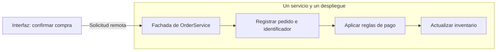

# Interior, fachadas y granularidad

[[Obsidian/lecturas/Fundamentals of Software Architecture/14 Arquitectura basada en servicios/00 Índice|← Índice del capítulo 14]]

**La frontera remota de un servicio no obliga a distribuir también su interior.** Varias funciones del negocio pueden coordinarse mediante llamadas entre clases o módulos dentro del mismo proceso. Esa es una de las razones por las que este estilo puede conservar menos costo de coordinación que una partición muy fina.

## La fachada API recibe una intención de negocio

Una **API** es un contrato de acceso: qué operaciones se ofrecen, qué datos aceptan y qué resultados devuelven. Una **fachada** concentra ese acceso y protege al cliente de la organización interna. En lugar de pedir a la interfaz que conozca tres repositorios y ocho clases, se le ofrece una operación como `confirmarPedido`.

La fachada del servicio puede validar la forma de la petición y coordinar la operación, pero las reglas de negocio deben tener un lugar comprensible. **Orquestación** significa decidir el orden y las condiciones de los pasos: crear pedido, calcular total, comprobar pago y actualizar stock. **Persistencia** significa guardar y recuperar datos más allá de la ejecución actual.

El ejemplo del libro es una compra en comercio electrónico. `OrderService` recibe una sola intención de la interfaz: el cliente pide unos artículos. Dentro del servicio se coloca el pedido, se genera su identificador, se aplica el pago y se actualiza el inventario de cada producto. El punto del ejemplo es la ubicación de la coordinación, no una receta suficiente para integrar una pasarela bancaria real.

La única flecha que cruza el límite del servicio es la entrada desde la interfaz. Las demás expresan coordinación interna; pueden ser llamadas de código ordinarias. Cambiar la implementación de Inventario no obliga a enseñar esa estructura al cliente, mientras el contrato externo siga compatible. Un proveedor de pagos remoto añadiría una frontera de red que aquí se omite deliberadamente, y que se trata en la nota de transacciones.

## Dos organizaciones internas posibles

El panel izquierdo organiza la implementación por función técnica: fachada, negocio y persistencia. El derecho organiza módulos por subdominio debajo de la fachada. Ambos paneles representan un solo servicio con una sola entrega. La variante por módulos concentra código que cambia por un motivo de negocio; la variante por capas hace más explícita la separación de responsabilidades técnicas. Las cajas inferiores señalan que una buena partición del código no crea nuevas fronteras de despliegue.

La figura 14-2 del libro admite ambas alternativas. Una arquitectura externa por dominios puede contener un diseño interno por capas. También puede contener algo parecido a un monolito modular: responsabilidades bien separadas que se publican juntas. El estilo externo y el diseño interno responden a escalas diferentes de la decisión.

## Qué se gana al agrupar

Pedidos, reglas de pago e inventario pueden compartir una transacción local si los datos participantes están en el mismo recurso transaccional y la implementación mantiene ese alcance. También pueden compartir memoria, tipos y llamadas internas sin pagar una ida y vuelta de red por cada paso. Menos fronteras remotas reducen los lugares donde una ejecución puede quedar a medias.

Ese agrupamiento tiene un costo. Una modificación en colocación de pedidos obliga a probar y publicar todo `OrderService`, incluyendo el procesamiento de pagos que no cambió. El libro contrasta esa situación con separar `OrderPlacement` y `PaymentService`: un cambio interno y compatible de colocación podría publicarse solo en el primer servicio. Si cambia el contrato entre ambos, sí puede requerir coordinación de los dos.

## Ejemplo propio: estimar el alcance real

Supón que un servicio contiene tres módulos, cada uno con veinte escenarios de regresión. Una entrega que cambia solo Pedidos puede requerir ejecutar los sesenta escenarios relevantes del servicio porque todos viajan en el mismo artefacto. Si se divide en tres despliegues, una entrega local y compatible podría reducir esa regresión a veinte escenarios del módulo cambiado, más comprobaciones del contrato compartido.

Eso no demuestra que tres servicios sean siempre mejores: aparecen despliegues, observación, compatibilidad y fallos remotos nuevos. La decisión depende de la frecuencia de cambio y del valor de publicar por separado. **Radio de impacto** es el conjunto de funciones que un cambio puede romper, aunque su código no se haya tocado.

Un criterio práctico propio consiste en revisar cambios pasados: si Pago y Pedido cambian juntos repetidamente por la misma regla, mantenerlos en una frontera puede ser coherente. Si un módulo cambia continuamente con un equipo y ciclo propios, puede merecer una frontera más pequeña. Contar clases o líneas sin investigar esas causas aporta poca evidencia.

> [!question]- ¿Una fachada grande siempre es una mala fachada?
> El número de operaciones no basta. Es problemática cuando mezcla dominios sin coherencia, expone detalles internos o concentra todas las reglas en un solo bloque. Un contrato amplio que representa correctamente un dominio puede seguir siendo útil y modular internamente.

> [!question]- ¿Por qué llamar a un servicio remoto puede ser más caro que llamar a una clase?
> La llamada remota necesita transporte, serialización y coordinación de errores entre procesos. La llamada de clase comparte el proceso y normalmente evita esas fronteras. Eso no hace gratis a las llamadas internas ni convierte cualquier comunicación remota en un error de diseño.

## Fuente principal

[[Obsidian/lecturas/Fundamentals of Software Architecture/Materiales/11 Arquitectura basada en servicios.pdf#page=3|PDF 3–5 · impresas 211–213 · figura 14-2 y comparación OrderService/OrderPlacement/PaymentService]].

---

[[Obsidian/lecturas/Fundamentals of Software Architecture/14 Arquitectura basada en servicios/01 Topología y servicios de dominio|← Anterior]] · [[Obsidian/lecturas/Fundamentals of Software Architecture/14 Arquitectura basada en servicios/03 Transacciones ACID y compensaciones|Siguiente →]]
