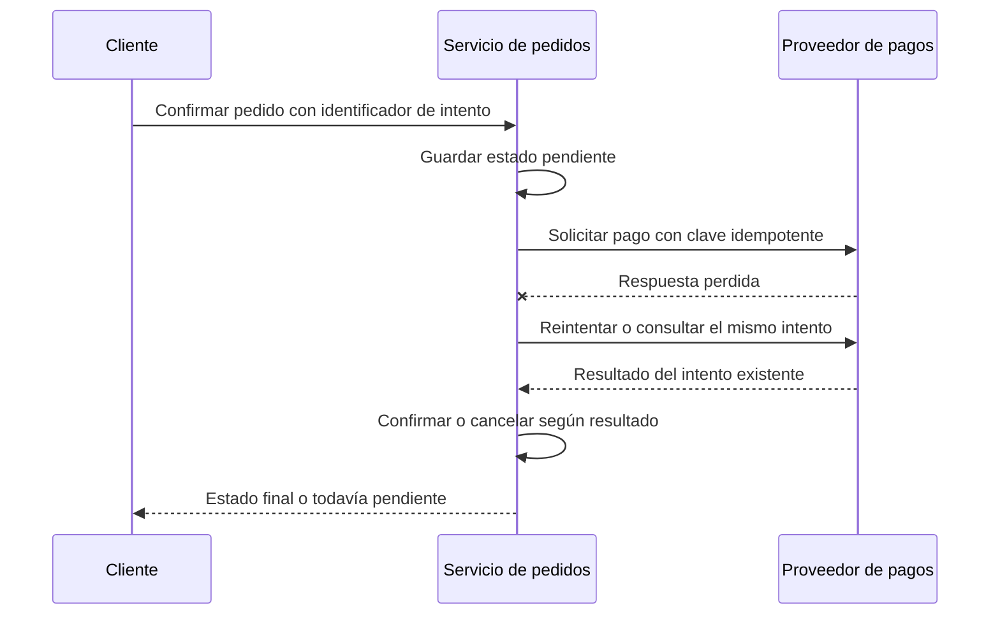

# Transacciones ACID y compensaciones

[[Obsidian/lecturas/Fundamentals of Software Architecture/14 Arquitectura basada en servicios/00 Índice|← Índice del capítulo 14]]

**Un servicio amplio facilita reunir una operación en una transacción local, pero no vuelve atómico todo lo que ese servicio llama.** La frontera decisiva es la participación de cada recurso en la transacción. Esta precisión evita entender el ejemplo del libro como si un `ROLLBACK` local pudiera devolver por sí solo dinero ya cobrado por una plataforma externa.

## ACID con un ejemplo concreto

Una **transacción** agrupa cambios que la base confirma o descarta como una unidad. **COMMIT** confirma; **ROLLBACK** descarta los cambios no confirmados de esa transacción. ACID resume cuatro propiedades:

| Propiedad | Significado en un pedido | Lo que no promete por sí sola |
|---|---|---|
| Atomicidad | Pedido y reserva de stock participantes se confirman juntos o ninguno se confirma | Deshacer un correo o un cobro externo |
| Consistencia | Las restricciones e invariantes declaradas siguen cumpliéndose después de una operación válida | Que la base conozca reglas que nunca se implementaron |
| Aislamiento | La concurrencia se controla conforme al nivel de aislamiento elegido | Que cualquier nivel equivalga a ejecución totalmente serial |
| Durabilidad | Los cambios confirmados sobreviven según las garantías del motor y su configuración | Inmunidad a cualquier desastre imaginable |

Una **invariante** es una regla que siempre debe mantenerse: por ejemplo, stock disponible no negativo. «Consistencia» aquí se refiere a restricciones del estado válido; no es idéntica a «todas las réplicas ya muestran el mismo valor».

El capítulo usa una tarjeta vencida como ejemplo. `OrderService` inserta un pedido y aplica el pago dentro de su operación. Si la validación del pago falla antes de confirmar los cambios locales, un rollback elimina lo insertado en esa transacción. El usuario recibe el rechazo y no queda un pedido aprobado a medias.

## Modelo local paso a paso, elaboración propia

Tenemos cinco unidades disponibles y se solicitan dos. La operación abre una transacción, valida una reserva de dos y escribe un pedido pendiente. Si el pago local simulado es rechazado, descarta la transacción: no hay pedido confirmado y las cinco unidades siguen disponibles. Si todas las reglas pasan, confirma el pedido y quedan tres unidades.

En SQL conceptual, el servicio ejecuta `BEGIN`, aplica sus escrituras y termina con `COMMIT` o `ROLLBACK`. La reserva necesita manejar la concurrencia mediante una actualización condicional, bloqueo o aislamiento adecuado: dos clientes no deben leer ambos «cinco» y confirmar reservas incompatibles. Un límite de servicio no reemplaza ese mecanismo.

La documentación de [PostgreSQL sobre transacciones](https://www.postgresql.org/docs/16/tutorial-transactions.html) describe este alcance de confirmación y descarte. El ejemplo usa cambios participantes en una misma transacción; separar llamadas HTTP en dos servicios no conserva automáticamente ese alcance, aunque consulten la misma base.

## Qué cambia al separar servicios

En el contraste del libro, `OrderPlacement` confirma primero el pedido y luego llama a `PaymentService`. Si este rechaza la tarjeta, el pedido ya existe. Hace falta una **compensación**: una nueva operación de negocio que cancela el pedido o lo deja explícitamente rechazado, y libera las reservas necesarias.

La fila superior termina descartando cambios todavía no confirmados. La inferior conserva un pedido confirmado como pendiente y luego confirma su cancelación. La flecha discontinua representa esa corrección posterior: no borra el hecho de que hubo una operación previa. Durante el intervalo pueden existir observadores que hayan visto el estado pendiente. Además, la propia compensación puede necesitar reintentos.

Una **saga** coordina una secuencia de transacciones locales y define qué hacer si falla un paso. Puede continuar mediante reintentos o ejecutar acciones compensatorias. Esa distinción está descrita en [AWS, Saga patterns](https://docs.aws.amazon.com/prescriptive-guidance/latest/cloud-design-patterns/saga-patterns.html). No sustituye cada transacción local: las transacciones locales siguen pudiendo ser ACID.

## BASE no es una instrucción de rollback

El libro contrapone ACID con BASE —disponibilidad básica, estado flexible y consistencia eventual— y llega a llamarlo técnica de transacciones distribuidas. Conviene precisar el lenguaje: BASE es una caracterización de garantías y compromisos; **no es por sí mismo un protocolo transaccional**. Una saga, una compensación y un protocolo de commit distribuido son mecanismos concretos, con propiedades distintas.

**Consistencia eventual** significa que actualizaciones separadas convergen después de un tiempo bajo condiciones de progreso y resolución de conflictos. No garantiza por sí sola que una compensación esté correctamente programada ni que la convergencia suceda dentro del tiempo que necesita el negocio. «Usa BASE» no alcanza como explicación del diseño.

## El pago remoto rompe la simplificación

Si un servicio llama a un banco, el banco puede completar el cobro y perderse la respuesta. El servicio local no sabe inmediatamente si hubo cobro. Hacer rollback de sus tablas no ordena al banco cancelar nada. Se necesitan estados explícitos, conciliación con el proveedor y una operación de anulación o devolución si corresponde.

Una **operación idempotente** puede repetirse sin duplicar su efecto previsto. Para un cobro, usar una clave de idempotencia evita convertir un reintento de la misma intención en dos cobros. [Stripe documenta las solicitudes idempotentes](https://docs.stripe.com/api/idempotent_requests) como mecanismo para reintentar sin repetir accidentalmente una operación. Esta referencia es una ampliación técnica del ejemplo, no una implementación presentada por el libro.

La respuesta perdida representa incertidumbre de transporte, no rechazo de negocio. El mismo identificador conecta los reintentos con una única intención. El servicio mantiene un estado pendiente hasta obtener evidencia y evita anunciar «cancelado» solo porque hubo un timeout.

> [!question]- ¿Una única base vuelve atómicas dos transacciones de dos servicios?
> No. Compartir motor no convierte dos sesiones y dos commits separados en una sola transacción. Haría falta un mecanismo explícito de coordinación; ese costo es precisamente una de las razones para mantener juntas ciertas operaciones.

> [!question]- ¿Compensar siempre deja el universo exactamente como estaba?
> No. Puede cancelar un pedido y liberar stock, pero no borrar que se envió un mensaje o que un tercero lo observó. Se define una recuperación válida para el negocio y se conserva el historial necesario.

## Fuente principal

[[Obsidian/lecturas/Fundamentals of Software Architecture/Materiales/11 Arquitectura basada en servicios.pdf#page=4|PDF 4–5 · impresas 212–213 · pedido rechazado, ACID y compensación]], y [[Obsidian/lecturas/Fundamentals of Software Architecture/Materiales/11 Arquitectura basada en servicios.pdf#page=16|PDF 16 · impresa 224 · alcance transaccional]].

---

[[Obsidian/lecturas/Fundamentals of Software Architecture/14 Arquitectura basada en servicios/02 Interior fachadas y granularidad|← Anterior]] · [[Obsidian/lecturas/Fundamentals of Software Architecture/14 Arquitectura basada en servicios/04 Interfaces gateway y fronteras|Siguiente →]]
