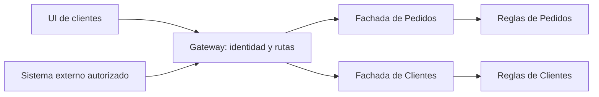

# Interfaces, gateway y fronteras

[[Obsidian/lecturas/Fundamentals of Software Architecture/14 Arquitectura basada en servicios/00 Índice|← Índice del capítulo 14]]

**La interfaz, los servicios y los datos no tienen que dividirse con el mismo número de piezas.** El capítulo permite una interfaz común, interfaces por grupos de negocio o una interfaz por servicio. También permite incorporar una capa API compartida. Cada frontera responde a un costo y a una autonomía distinta.

## Tres variantes de interfaz

**UI** significa interfaz de usuario: la parte con la que una persona interactúa. La figura 14-3 distingue:

| Variante | Organización | Ventaja posible | Costo que aparece |
|---|---|---|---|
| Una UI monolítica | Un artefacto visual llama a varios servicios | Experiencia y entrega sencillas de coordinar | Cambios visuales de varios dominios comparten publicación y posible fallo |
| UI por dominio o grupo | Clientes tiene una UI y Operaciones otra | Separar públicos, permisos y ciclos de entrega | Repetir o coordinar diseño, sesión y navegación |
| UI por servicio | Cada servicio tiene un cliente visual propio | Máxima separación visual de esas capacidades | Mayor fragmentación y esfuerzo de composición |

El ejemplo del libro es un sistema de pedidos: una interfaz permite comprar a clientes, otra permite a empaquetadores consultar los artículos que deben preparar y otra sirve al equipo de soporte. No se necesita obligar a clientes y empaquetadores a recibir la misma aplicación para compartir servicios y datos.

El beneficio en tolerancia a fallos depende de la implementación. Si una UI interna se cae y otra conserva sus propios recursos y dependencias disponibles, la otra puede seguir. Si ambas dependen de un único componente de sesión indisponible, su independencia visual es menor de lo que sugieren dos cajas.

Las tres filas superiores son alternativas, no capas que deban apilarse. El amarillo identifica las interfaces. Abajo, el verde representa un gateway opcional que puede interponerse frente a los servicios azules en cualquiera de esas variantes. La cantidad de interfaces y la existencia del gateway son dos decisiones diferentes.

## Qué aporta una capa API externa

Un **proxy inverso** recibe solicitudes en nombre de servidores internos y las dirige a destinos. Un **API gateway** puede sumar políticas de entrada como autenticación, rutas, cuotas o composición. El capítulo propone esa capa para exponer capacidades a sistemas externos, consolidar métricas, seguridad, auditoría y descubrimiento, y balancear múltiples instancias.

**Autenticación** identifica al solicitante; **autorización** decide qué puede hacer. Un gateway que valida identidad no sustituye todas las decisiones de negocio: Pedidos todavía debe comprobar si esa persona puede acceder a ese pedido. **Auditoría** registra hechos relevantes de acceso y operación; **métricas** permiten medir volumen, errores y latencia; **descubrimiento** resuelve dónde vive un servicio.

El costo de una política compartida es su alcance: una regla defectuosa puede bloquear varios servicios. También aparece un salto de red y un componente que debe operarse. Puede ser razonable para entrada pública y superfluo en una aplicación interna pequeña. El capítulo lo ofrece como variante, no como requisito del estilo.

## Fachada del servicio y gateway no son lo mismo

La fachada pertenece al servicio y conoce la operación de su dominio. El gateway está antes de varios servicios y organiza el acceso común. «Confirmar pedido» puede ser responsabilidad de la fachada; «dirigir `/pedidos` a instancias saludables» es responsabilidad de la entrada.

En PDF 11 el libro permite coordinación entre dominios desde la UI o el gateway cuando resulte necesaria. Eso no contradice que en PDF 4 la fachada coordine dentro del dominio: son dos escalas de orquestación. Tampoco hace automáticamente transaccional una secuencia lanzada por el cliente.

El gateway conoce destinos y políticas comunes; las fachadas conocen contratos de dominio. Las dos ramas permiten evolucionar responsabilidades por separado. Si se suben todas las reglas de todos los dominios al gateway, el componente de entrada puede convertirse en un nuevo centro de cambios coordinados.

## Fronteras de seguridad

Separar UI pública de interna ayuda a exponer solo las funciones pertinentes. Sin embargo, esconder un botón o una URL no constituye un límite de seguridad. El acceso debe quedar restringido también en rutas, permisos y red según el caso. En Going Green el libro añade una separación de red entre datos internos y públicos, que se estudia con sus dependencias en la nota 09.

> [!question]- ¿Una UI por servicio es siempre la más ágil?
> Puede permitir publicar cada parte, pero una experiencia que combina varias partes necesita compatibilidad y coordinación. La autonomía solo compensa cuando los grupos de cambios y públicos justifican el costo adicional.

> [!question]- ¿El gateway reemplaza la fachada API?
> No. El cliente puede llegar por un gateway y seguir consumiendo el contrato de la fachada. Ambos están en posiciones diferentes y resuelven problemas diferentes.

## Fuente principal

[[Obsidian/lecturas/Fundamentals of Software Architecture/Materiales/11 Arquitectura basada en servicios.pdf#page=5|PDF 5–7 · impresas 213–215 · figuras 14-3 y 14-4]], y [[Obsidian/lecturas/Fundamentals of Software Architecture/Materiales/11 Arquitectura basada en servicios.pdf#page=11|PDF 11 · impresa 219 · coordinación UI/gateway]].

---

[[Obsidian/lecturas/Fundamentals of Software Architecture/14 Arquitectura basada en servicios/03 Transacciones ACID y compensaciones|← Anterior]] · [[Obsidian/lecturas/Fundamentals of Software Architecture/14 Arquitectura basada en servicios/05 Topologías de datos y dependencias|Siguiente →]]
