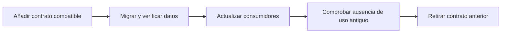

# Esquemas, bibliotecas y cambios

[[Obsidian/lecturas/Fundamentals of Software Architecture/14 Arquitectura basada en servicios/00 Índice|← Índice del capítulo 14]]

**La base compartida no tiene por qué implicar una biblioteca global con todas sus entidades.** El capítulo muestra que el alcance de una dependencia de código puede hacer que un cambio localizado de tabla obligue a coordinar todos los servicios. Dividir esa dependencia por dominios limita el radio de cambio sin separar físicamente el motor.

## De tabla a dependencia compilada

Un **esquema** describe la estructura de los datos: tablas, columnas, tipos, restricciones y relaciones. Una **entidad** es una representación de esos datos en el código, por ejemplo una clase `Factura`. Una **biblioteca compartida** es un paquete de código que varios servicios incorporan, como un JAR en Java o una DLL en .NET. El capítulo también admite que contenga SQL.

Si se modifica la columna `importe` o se añade una obligación a `Factura`, hay que revisar su representación y las consultas que la usan. Cuando todas las entidades de toda la base viven en un paquete único, todos los servicios dependen de ese paquete, incluso los que nunca leen Facturas. El acoplamiento del paquete es más grande que el acoplamiento real del dato.

La figura 14-6 llama a esa biblioteca única un **antipatrón**, una solución habitual que introduce consecuencias contraproducentes. No significa que toda biblioteca compartida sea incorrecta ni que cualquier modificación aditiva fuerce siempre una entrega coordinada. Significa que una dependencia global e indiscriminada oculta quién necesita de verdad cada contrato y amplía el riesgo de versiones incompatibles.

## Partición lógica sin separar el motor

La **partición lógica** agrupa datos por responsabilidades dentro de la misma base. El ejemplo del libro tiene cinco grupos: común, clientes, facturación, pedidos y seguimiento. Se distribuyen cinco bibliotecas que representan esos grupos. No se trata aquí de fragmentación física de filas o *sharding*; se trata de límites conceptuales y contratos de código.

La figura 14-7 muestra cuatro servicios y estas dependencias:

| Servicio representado | Bibliotecas que usa |
|---|---|
| Clientes | Clientes + Común |
| Facturación | Facturación + Común |
| Pedidos | Pedidos + Clientes + Común |
| Seguimiento | Seguimiento + Común |

Un cambio de Facturación afecta a su biblioteca y a los servicios que la incorporan. En esa figura solo el servicio de Facturación. Un cambio de Clientes puede afectar a Clientes y Pedidos. Un cambio de Común sigue alcanzando a los cuatro. La separación no elimina el acoplamiento existente; lo hace más preciso y visible.

El rojo identifica el cambio de Facturación. A la izquierda se propaga por una biblioteca global hasta todos los servicios. A la derecha llega a la biblioteca específica y al consumidor de ese contrato. Las cajas grises no necesitan cambiar por esa dependencia particular. El diagrama compara el alcance de un cambio incompatible; no afirma que todo cambio de esquema fuerce recompilar cada consumidor.

## Versionar ayuda, pero no decide compatibilidad

**Versionar** permite que un servicio use una versión anterior mientras otro usa la nueva. El libro reconoce que puede reducir el problema, aunque todavía hace falta descubrir qué servicios y consultas quedan afectados. El número de versión no garantiza que el motor pueda atender simultáneamente ambos contratos.

Ejemplo propio: versión 1 de Pedidos espera la columna `cliente_nombre`; versión 2 espera `nombre_completo`. Publicar versión 2 de la biblioteca mientras se elimina inmediatamente `cliente_nombre` rompe a las instancias antiguas. Conservar una ventana de compatibilidad permite cambiar los servicios en distinto momento.

Como elaboración propia, un cambio gradual puede seguir esta secuencia: añadir el nuevo campo sin quitar el anterior, soportar ambas formas mientras se migra y verifica la información, actualizar consumidores y retirar lo antiguo cuando no quede ningún consumidor. Son pasos de compatibilidad que concretan el riesgo del libro; no un mandato de hacerlo así para cualquier cambio.

Cada etapa conserva una condición necesaria para la siguiente. El punto crucial es que la eliminación llega después de comprobar que ya no hay consumidores antiguos. Una migración con datos inválidos o un consumidor olvidado impide considerar seguro el retiro.

## La parte común merece un tratamiento especial

Las tablas comunes y `common_entities_lib` pueden volver a concentrar el alcance de casi todos los cambios. El libro propone restringir quién modifica esas entidades en el control de versiones, por ejemplo reservándolo al equipo de base de datos si el sistema lo permite. La intención es reforzar control y conciencia del impacto, no declarar que un equipo central deba aprobar cualquier línea del sistema.

Una adaptación propia consiste en combinar responsables claros, revisión obligatoria para contratos comunes y pruebas de compatibilidad de los consumidores. El control organizativo sin conocimiento técnico no detecta una consulta olvidada; las pruebas sin responsable no deciden si el cambio de significado es apropiado.

El consejo del libro es particionar la base de forma tan fina como sea útil conservando dominios de datos bien definidos. «Más fino» no significa crear una biblioteca por columna ni mezclar decenas de paquetes sin coherencia. El objetivo es que cada cambio llegue a sus consumidores reales y no a un conjunto accidentalmente enorme.

> [!question]- ¿Particionar tablas lógicamente permite tolerar la caída del motor?
> No. Mejora control del cambio, propiedad y claridad de dependencias. Si todos siguen en el mismo motor y este cae, la separación lógica no ofrece aislamiento operacional.

> [!question]- ¿Compartir Común es siempre evitable?
> No. Algunas referencias y contratos son compartidos de verdad. Lo importante es mantenerlos pequeños, estables y gobernados, y no convertir «común» en un cajón donde termina cualquier dato que dos equipos necesitan.

## Fuente principal

[[Obsidian/lecturas/Fundamentals of Software Architecture/Materiales/11 Arquitectura basada en servicios.pdf#page=8|PDF 8–10 · impresas 216–218 · figuras 14-6 y 14-7]].

---

[[Obsidian/lecturas/Fundamentals of Software Architecture/14 Arquitectura basada en servicios/05 Topologías de datos y dependencias|← Anterior]] · [[Obsidian/lecturas/Fundamentals of Software Architecture/14 Arquitectura basada en servicios/07 Operación nube riesgos y gobierno|Siguiente →]]
