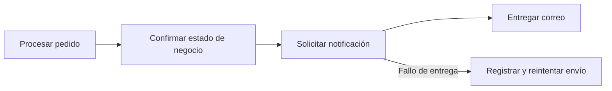

# Operación, nube, riesgos y gobierno

[[Obsidian/lecturas/Fundamentals of Software Architecture/14 Arquitectura basada en servicios/00 Índice|← Índice del capítulo 14]]

**El ahorro de complejidad depende de sostener pocos dominios relativamente autónomos.** Si cada solicitud recorre una cadena de servicios, o si cada cambio obliga a publicar todos, la topología conserva el costo de distribución y pierde buena parte de la ventaja de separación.

## Nube y unidades de ejecución

El capítulo afirma que el estilo encaja en entornos de nube porque sus servicios pueden desplegarse y operarse por separado. Un **contenedor** empaqueta una aplicación y sus dependencias de ejecución; **serverless** designa modelos en los que el proveedor gestiona gran parte de la infraestructura de ejecución. La elección de esas tecnologías no define por sí sola el estilo.

Por su alcance funcional amplio, el libro considera más habitual ejecutar los dominios como servicios en contenedores que como pequeñas funciones serverless. También aclara antes que no es obligatorio contenerizar: un servicio puede desplegarse de forma semejante a una aplicación monolítica. La recomendación no es una incompatibilidad técnica con serverless ni un requisito de usar Kubernetes.

Almacenamiento de archivos, bases y mensajería gestionados pueden apoyar la solución. El capítulo no especifica proveedor, tarifas ni límites actuales, por lo que estas notas conservan la explicación arquitectónica sin convertirla en una recomendación comercial.

## Escalabilidad y elasticidad

**Escalabilidad** es la capacidad de atender más carga añadiendo recursos. **Elasticidad** es ajustar esos recursos al aumento y descenso de demanda. Si un servicio grande contiene Cotización y otras cuatro funciones, replicarlo para Cotización replica también las cuatro funciones menos usadas. Por eso el libro considera la escala gruesa menos eficiente que una división pequeña de la función caliente.

Ejemplo propio: una instancia contiene una función de cotización que consume la mayor parte del CPU y cuatro funciones internas que casi no se usan. Pasar de una a cuatro instancias multiplica la capacidad del servicio, pero también copia memoria y componentes de todas las funciones. Si solo Cotización tiene el pico, ese gasto podría motivar una extracción puntual. No demuestra que deba extraerse todo el sistema.

Un **pool de conexiones** reutiliza un conjunto de conexiones a la base. El libro dice que la cantidad limitada de servicios suele hacer menos problemático agotarlas, pero admite el riesgo si crece su número. Cálculo propio: ocho servicios × dos instancias × veinte conexiones máximas por instancia = **320 conexiones potenciales**. Si el presupuesto operativo admite 200, «solo ocho servicios» no alcanza como garantía. Los pools, réplicas y límites deben planificarse juntos.

Una **caché en memoria** conserva datos para evitar trabajo repetido. Con una sola instancia puede ser sencilla; con réplicas aparece la pregunta de cómo se invalidan y cuánta desactualización se acepta. La nube no responde esa pregunta automáticamente.

## Los dos riesgos específicos destacados

El primero es demasiada comunicación entre servicios de dominio. Si Pedidos necesita Clientes, que necesita Riesgo, que necesita Facturación, una caída intermedia puede bloquear la operación completa. Las fronteras quizá no corresponden a capacidades autónomas, o quizá este estilo no sea apropiado para ese flujo.

El segundo es demasiados servicios. El libro recomienda un límite práctico cercano a doce y relaciona superarlo con pruebas, despliegues, observación, conexiones y cambios de base. Esta cifra expresa experiencia de los autores, especialmente para esta variante, no una constante universal. La evidencia del sistema tiene más valor que cumplir el número mientras persisten cadenas frágiles.

## Gobernar es comprobar la arquitectura

Una **función de aptitud arquitectónica** es una comprobación que verifica si una propiedad deseada se mantiene. El libro propone detectar cambios que atraviesen dominios y limitar comunicación entre servicios. También conserva comprobaciones generales de complejidad, escalabilidad y respuesta.

Como ejemplos propios, se pueden registrar estas señales:

| Señal | Qué revela | Qué no se debe concluir automáticamente |
|---|---|---|
| Cambios de negocio que afectan a varios servicios | Posible frontera mal situada o contrato común inestable | Que todo cambio transversal sea un defecto |
| Llamadas obligatorias entre dominios por solicitud | Dependencia de disponibilidad y latencia | Que cualquier llamada ocasional esté prohibida |
| Despliegues coordinados frecuentes | Autonomía de entrega menor de la prevista | Que se deba eliminar una coordinación justificada |
| Cambios de tablas comunes con muchos consumidores | Riesgo de propagación | Que haya que duplicar todos los datos |
| Conexiones máximas y carga del motor | Capacidad compartida limitada | Que el número de servicios describa toda la carga |

Una métrica propia útil es `cambios que requieren varias entregas / cambios de negocio revisados`. Si fueron doce de cuarenta, el resultado es 30%. Ese porcentaje no tiene un umbral universal: permite revisar cuáles cruzaron fronteras y por qué. Un cambio de regulación común puede necesitar varios dominios correctamente separados.

## Excepciones con un propósito

El capítulo acepta que Procesamiento de pedidos llame a Notificaciones del cliente para enviar un correo de estado. La intención es evitar que esa excepción se transforme en una malla extensa de dependencias obligatorias. Como elaboración propia, conviene decidir si el pedido puede completarse aunque el correo tarde, y observar los fallos de envío por separado.

La confirmación del negocio y la entrega del correo son etapas con consecuencias diferentes. Este diseño propio ilustra una excepción cuyo fallo puede recuperarse sin repetir la compra. Si la regla del negocio exigiera entrega inmediata, tendría que declararse esa dependencia y su costo.

> [!question]- ¿Un servicio caído no afecta nunca a los demás?
> Puede dejar de afectar a su código o proceso, pero sí afectar a un flujo que lo necesita. La base, gateway o infraestructura común también pueden propagar el fallo. La independencia se comprueba con dependencias concretas y escenarios de indisponibilidad.

> [!question]- ¿Qué es más importante que contar servicios?
> Saber qué necesitan para completar su trabajo, cuántos cambian juntos, dónde concentran carga y qué pasa cuando se cae una dependencia. El conteo ayuda a dimensionar trabajo operativo, pero no sustituye ese análisis.

## Fuente principal

[[Obsidian/lecturas/Fundamentals of Software Architecture/Materiales/11 Arquitectura basada en servicios.pdf#page=11|PDF 11 · impresa 219 · nube, riesgos y gobierno]], y [[Obsidian/lecturas/Fundamentals of Software Architecture/Materiales/11 Arquitectura basada en servicios.pdf#page=15|PDF 15 · impresa 223 · escala, elasticidad, caché y conexiones]].

---

[[Obsidian/lecturas/Fundamentals of Software Architecture/14 Arquitectura basada en servicios/06 Esquemas bibliotecas y cambios|← Anterior]] · [[Obsidian/lecturas/Fundamentals of Software Architecture/14 Arquitectura basada en servicios/08 Equipos y características|Siguiente →]]
