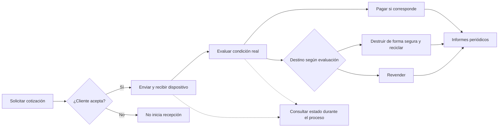

# Going Green y quanta

[[Obsidian/lecturas/Fundamentals of Software Architecture/14 Arquitectura basada en servicios/00 Índice|← Índice del capítulo 14]]

**Going Green muestra cómo siete servicios pueden formar dos grupos arquitectónicos, con seguridad y escala diferentes.** El negocio recicla dispositivos electrónicos: necesita atender muchas consultas de clientes y ejecutar una operación interna especializada. El capítulo usa ese contraste para justificar UI, datos y despliegues separados.

## El proceso de negocio completo

El caso pertenece al libro. Sus seis pasos son:

1. El cliente consulta cuánto se le pagará por su dispositivo mediante web o kiosco: **Cotización** (*Quoting*).
2. Si acepta, envía el dispositivo a la empresa: **Recepción** (*Receiving*).
3. La empresa examina el estado del dispositivo: **Evaluación** (*Assessment*).
4. Si está en buen estado de funcionamiento, paga al cliente: **Contabilidad** (*Accounting*). Mientras tanto, el cliente puede consultar en la web el **Estado del artículo** (*Item Status*).
5. Según la evaluación, la empresa destruye de forma segura y recicla piezas, o revende el dispositivo en una plataforma de terceros: **Reciclaje** (*Recycling*).
6. Periódicamente produce informes financieros y operacionales: **Informes** (*Reporting*).

Cotización es una estimación previa y Evaluación comprueba el estado real. Confundir ambas elimina la razón para tener responsabilidades distintas: el importe ofrecido puede depender de información todavía no verificada. Estado es una capacidad de consulta que acompaña el flujo, no otra actividad de procesamiento colocada después de todas las demás.

Las flechas continuas representan decisiones y actividades del flujo narrado. Las discontinuas indican que la consulta de estado sigue disponible mientras el artículo atraviesa diferentes etapas. El diagrama no impone una llamada remota entre todas esas actividades: ese es un flujo de negocio, no un mapa de dependencias de código.

## Siete servicios, tres interfaces, dos bases

El caso implementa cada una de las siete capacidades como un servicio de dominio desplegado por separado. La UI se divide en tres aplicaciones: Recepción; Reciclaje y Contabilidad; Clientes, accesible por web y kiosco. La primera atiende Recepción y Evaluación; la segunda Reciclaje, Contabilidad e Informes; la tercera Cotización y Estado.

Las operaciones internas comparten una base y las capacidades públicas otra. Son **dos bases físicas**, no solo dos esquemas dentro del mismo motor. La distinción permite una separación de red que protege datos internos y reduce competencia de algunas cargas, a cambio de resolver qué información pasa entre ambas.

La zona azul contiene los cinco servicios internos; la amarilla, los dos orientados a clientes. El rótulo de cada zona indica sus interfaces, cuyos detalles se describen arriba. Los datos verdes pertenecen a esas zonas. La flecha azul discontinua muestra que Recepción puede escribir estado en la base pública; la ocre muestra la alternativa de sincronizar información entre bases. Son alternativas explícitas del libro, no la obligación de hacer las dos a la vez. Ninguna dibuja acceso público a los datos internos.

## Escalar solo donde el volumen lo exige

El libro señala que Cotización y Estado necesitan varias instancias para atender grandes volúmenes de clientes. Los otros cinco servicios pueden mantenerse con una instancia en el escenario descrito. Esto conserva la autonomía de escala por dominio sin obligar a replicar toda la operación de reciclaje.

No significa que Recepción nunca necesitará redundancia ni que una sola instancia garantice disponibilidad. Significa que el caso tiene demandas diferentes y puede dimensionar cada dominio según ellas. Un requisito adicional de recuperación podría justificar réplicas también en los servicios internos.

Evaluación cambia con frecuencia porque aparecen nuevos dispositivos y criterios. Concentrarla en un servicio permite revisar sus reglas, probarlas y publicarlas sin reemplazar Reciclaje, Contabilidad ni Cotización, siempre que no cambien los contratos compartidos. El libro usa esto para explicar agilidad, pruebas y despliegue por dominio.

## Quanta: contar dependencias y no cajas

Un **quantum arquitectónico** es una unidad desplegable con sus dependencias necesarias y una cohesión funcional alta. El plural es **quanta**. Incluye recursos que condicionan la autonomía de esa capacidad; no es un sinónimo de instancia, servicio, proceso ni pantalla.

En la figura 14-9 el libro identifica dos quanta. El interno reúne cinco servicios, dos interfaces y una base común. El público reúne dos servicios, una interfaz y otra base. La base compartida dentro de cada grupo explica por qué cinco servicios internos no se cuentan como cinco quanta. Una UI o base común para todo el sistema puede llevar a un único quantum según el análisis del capítulo.

La figura 14-10 introduce además el acceso de información desde dentro hacia fuera. Aquí hace falta un matiz: el libro conserva la descripción de separación, pero una dependencia síncrona obligatoria de Recepción hacia la base pública puede acoplar parte de la operación interna a su disponibilidad. Si la base pública cae y Recepción no puede confirmar nada sin escribir allí, la independencia operacional completa no está demostrada por el dibujo.

Si la actualización pública es una publicación diferida que se recupera después, Recepción puede conservar más independencia durante la caída. El capítulo ofrece sincronización de tablas como alternativa, pero no fija si es síncrona ni describe sus garantías. Por eso «dos quanta» se presenta como el análisis del libro, con la condición de revisar las dependencias concretas al implementarlo.

## Seguridad direccional y actualidad del estado

El firewall permite a funciones internas acceder o actualizar datos destinados al público, y bloquea el camino inverso. **Firewall** es un control del tráfico entre redes según reglas. «Unidireccional» aquí describe quién puede iniciar el acceso autorizado, no una red en la que las respuestas nunca regresan.

La base pública necesita solo lo necesario para las consultas del cliente. El libro menciona reflejo interno de tablas y sincronización externa como alternativa de transferencia. Como elaboración propia, una proyección de estado puede excluir información interna, publicar una fecha de última actualización y tolerar unos segundos de retraso si el negocio lo acepta. El tiempo aceptable debe ser una decisión explícita, no una promesa implícita de «consistencia eventual».

## Recorrido propio con un dispositivo

Una persona consulta la oferta por un teléfono y acepta. La recepción registra llegada; Evaluación determina que la batería está dañada; Contabilidad aplica la regla de pago correspondiente; Reciclaje decide recuperar piezas. Estado debe mostrar una representación comprensible de esas etapas, mientras Informes incorpora el resultado cuando corresponda.

Si Evaluación está caída, el dispositivo puede permanecer recibido sin evaluación. Si Estado está caído, la operación interna quizá continúe, pero el cliente no puede consultarla. Si la base interna está caída, los cinco servicios que la necesitan sufren juntos. Si la escritura de estado público es obligatoria y síncrona, una caída pública puede impedir también completar Recepción. Cada respuesta depende de la dependencia real, no del número de colores del diagrama.

> [!question]- ¿Qué diferencia siete servicios de dos quanta en este ejemplo?
> Siete cuenta las responsabilidades desplegadas como servicios. Dos cuenta los grupos de dependencias de la figura 14-9. Compartir una base y otras dependencias puede unir varios servicios en un quantum.

> [!question]- ¿La separación de red prueba aislamiento absoluto entre zonas?
> No. Protege direcciones de acceso y datos, pero el flujo interno hacia la base pública sigue siendo una dependencia. El aislamiento operacional depende de si esa transferencia bloquea el trabajo y de cómo se recupera.

## Fuente principal

[[Obsidian/lecturas/Fundamentals of Software Architecture/Materiales/11 Arquitectura basada en servicios.pdf#page=13|PDF 13–14 · impresas 221–222 · figura 14-9 y análisis de quanta]], [[Obsidian/lecturas/Fundamentals of Software Architecture/Materiales/11 Arquitectura basada en servicios.pdf#page=16|PDF 16–18 · impresas 224–226 · flujo completo, figura 14-10, firewall, bases y evolución]].

---

[[Obsidian/lecturas/Fundamentals of Software Architecture/14 Arquitectura basada en servicios/08 Equipos y características|← Anterior]] · [[Obsidian/lecturas/Fundamentals of Software Architecture/14 Arquitectura basada en servicios/10 Migración y elección del estilo|Siguiente →]]
