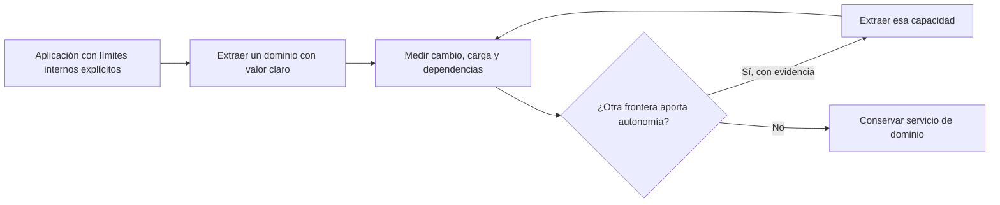

# Migración y elección del estilo

[[Obsidian/lecturas/Fundamentals of Software Architecture/14 Arquitectura basada en servicios/00 Índice|← Índice del capítulo 14]]

**Este estilo puede ser un destino válido y también una etapa de aprendizaje para una migración posterior.** El capítulo recomienda evitar convertir toda función en un microservicio solo porque se decidió distribuir la aplicación. La necesidad de autonomía debe demostrarse por dominio.

## Qué problema resuelve bien

La arquitectura basada en servicios encaja cuando la aplicación tiene capacidades de negocio identificables, necesita publicar algunas por separado y quiere conservar una cantidad manejable de componentes operativos. Permite una modularidad mayor que la de un único despliegue, sin exigir desde el comienzo una partición fina y propiedad privada de datos para cada pequeña función.

También encaja con **diseño guiado por el dominio** —*domain-driven design* o DDD—, un enfoque que organiza el software alrededor del modelo y las reglas del negocio. El capítulo ve natural alojar un dominio coherente en un servicio. Esto es una afinidad, no una prueba de que cada dominio deba tener un despliegue ni de que adoptar el estilo sea suficiente para modelarlo correctamente.

La ventaja transaccional consiste en poder mantener juntas algunas operaciones relacionadas, con transacciones locales. La ventaja de entrega consiste en poder publicar el dominio. Ambas dependen de sus límites concretos: unir demasiado aumenta el alcance de regresión; separar demasiado introduce comunicación y consistencia distribuida.

## Cuándo cuestionarlo

Se cuestiona si la mayoría de cambios necesita muchas entregas coordinadas, si las capacidades llaman obligatoriamente a muchas otras para funcionar, si los límites del negocio permanecen inestables o si la escala necesita granularidad mucho más fina. También se cuestiona si una aplicación pequeña no obtiene suficiente valor de la operación distribuida.

Esas señales abren varias opciones. Se puede mejorar la modularidad interna, realinear dominios, separar un único servicio caliente o elegir otro estilo. «Tenemos un problema de límites» no implica automáticamente «necesitamos más servicios».

| Presión dominante | Respuesta posible | Costo que hay que aceptar |
|---|---|---|
| Publicar cambios de un dominio sin publicar todo | Servicio de dominio independiente | Contrato remoto y operación adicional |
| Mantener varias escrituras atómicas | Agruparlas dentro de alcance transaccional local | Un despliegue más amplio |
| Escalar una función muy utilizada | Extraer solo esa responsabilidad | Nueva dependencia y nuevo diseño de datos |
| Separar operación interna de consultas públicas | UI y base públicas propias | Transferencia y actualidad de datos |
| Reducir complejidad en una aplicación pequeña | Mantener un despliegue modular | Menos autonomía de entrega por dominio |

La tabla es una elaboración propia que transforma las compensaciones del capítulo en preguntas de decisión. No pretende declarar una respuesta universal para cada presión.

## El caso de migración de Going Green

El libro propone conservar Reciclaje y Contabilidad como servicios de dominio amplios: en el escenario descrito no necesitan dividirse más. Evaluación, en cambio, cambia a menudo y requiere mucha agilidad. Los autores sugieren dividirla en servicios por tipo de dispositivo cuando esa independencia resulte útil.

La diferencia se basa en ritmo de cambio y responsabilidad, no en hacer que todos los recuadros tengan el mismo tamaño. Una posible arquitectura futura puede combinar servicios gruesos para dominios estables con servicios más finos para Evaluación. El estilo es una herramienta para decidir, no una obligación de uniformar todas las piezas.

La sugerencia de un servicio por tipo de dispositivo sigue siendo una propuesta del libro. No es necesariamente apropiada si se comparten las mismas reglas y cada cambio técnico requiere actualizar todos los tipos. Antes de crear veinte despliegues conviene comprobar que cada frontera puede evolucionar de forma autónoma y que el beneficio supera su operación.

## Migración gradual como experimento, elaboración propia

Una transición puede empezar identificando módulos en un monolito, estableciendo contratos internos y aclarando propiedad de datos. Luego se extrae un dominio con una razón concreta, por ejemplo publicar Evaluación diariamente sin reabrir todo Reciclaje. Se observa qué contratos se rompen, qué cambios siguen compartidos y dónde aparecen llamadas obligatorias. Esa información decide la siguiente extracción.

El bucle expresa aprendizaje: cada extracción aporta evidencia para la siguiente. Conservar un servicio amplio es un resultado válido si ya satisface las necesidades. La flecha hacia «extraer» no convierte la migración en una escalera obligatoria hasta cientos de servicios.

## Preguntas para una decisión explicable

Una recomendación bien sustentada debería contestar: qué cambio de negocio se quiere independizar, qué estados deben permanecer atómicos, qué carga crece por separado, qué datos comparten significado y quién puede operar la nueva frontera. También debe especificar qué sucede cuando cae la base o se pierde una respuesta remota.

Ejemplo propio: si la necesidad es que Cotización atienda diez veces más consultas, escalar ese servicio puede bastar. Dividir Reciclaje en cinco componentes remotos no responde a esa presión. Si la necesidad es publicar solo reglas de batería mientras las de pantalla permanecen estables, una subdivisión de Evaluación podría aportar valor, siempre que sus datos y contrato no obliguen a publicar ambos a la vez.

> [!question]- ¿La arquitectura basada en servicios es una versión incompleta de microservicios?
> No. En el libro es un estilo con compromisos propios y puede ser una solución final apropiada. Puede servir como etapa de migración, pero no necesita «completarse» convirtiendo cada dominio en piezas pequeñas.

> [!question]- ¿Por qué distribuir primero puede dificultar descubrir límites?
> Si las responsabilidades siguen mezcladas, las llamadas locales se convierten en remotas sin reducir cambios conjuntos. Se añade operación antes de conseguir autonomía. Clarificar límites y observar cambios aporta una base más concreta para decidir la extracción.

## Fuente principal

[[Obsidian/lecturas/Fundamentals of Software Architecture/Materiales/11 Arquitectura basada en servicios.pdf#page=16|PDF 16 · impresa 224 · DDD, transacciones y modularidad]], [[Obsidian/lecturas/Fundamentals of Software Architecture/Materiales/11 Arquitectura basada en servicios.pdf#page=18|PDF 18 · impresa 226 · migración selectiva y caso Evaluación]].

---

[[Obsidian/lecturas/Fundamentals of Software Architecture/14 Arquitectura basada en servicios/09 Going Green y quanta|← Anterior]] · [[Obsidian/lecturas/Fundamentals of Software Architecture/14 Arquitectura basada en servicios/11 Laboratorio y repaso|Siguiente →]]
