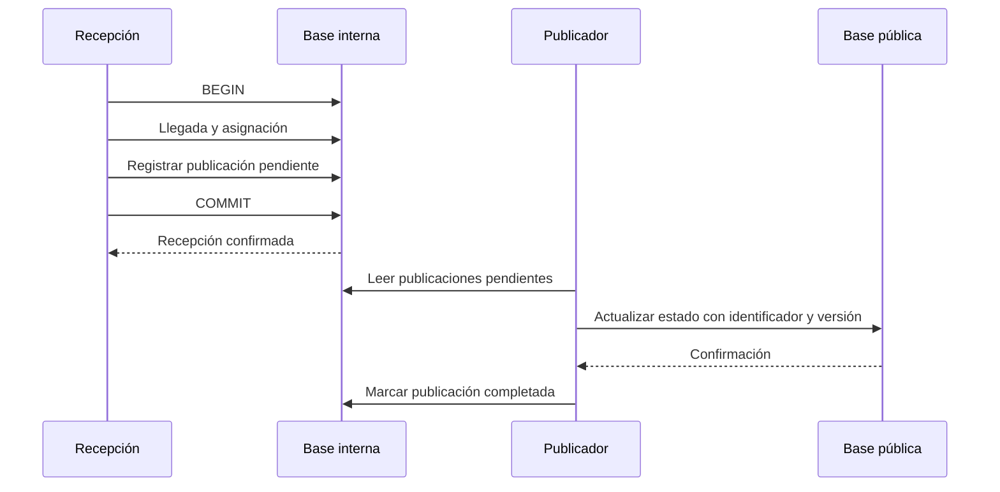

# Laboratorio y repaso

[[Obsidian/lecturas/Fundamentals of Software Architecture/14 Arquitectura basada en servicios/00 Índice|← Índice del capítulo 14]]

Este laboratorio es una **elaboración propia** inspirada en las compensaciones del capítulo. No es un caso del libro. El objetivo es justificar límites, transacciones, datos, escala y recuperación con requisitos concretos.

## Enunciado: ReCompra

ReCompra adquiere equipos usados. Necesita cotizar precios por Internet, registrar recepción en almacén, evaluar estado, pagar cuando corresponda, decidir reciclaje o reventa y generar informes. Tres personas desarrollan la aplicación inicial. Hay mucha consulta pública y pocos equipos procesados por hora; las reglas de evaluación cambian cada semana.

Requisitos del ejercicio:

- Cotización pública puede recibir veinte veces más solicitudes que Recepción.
- La operación interna no debe exponer diagnósticos completos al público.
- Al registrar recepción, la llegada y la asignación a evaluación deben confirmarse juntas.
- Un retraso de hasta treinta segundos en el estado público es aceptable.
- Un cambio en las reglas de evaluación debe poder publicarse sin reemplazar Reciclaje.
- El pago real se hace con un proveedor externo y puede perderse su respuesta.

Los números y condiciones pertenecen a este ejercicio, no al libro. Se usan para evitar una decisión apoyada solo en nombres de estilos.

## Paso 1: proponer límites

> [!question]- ¿Qué servicios y UI propondrías, sin convertir cada verbo en una API remota?
> Un punto de partida razonable es Cotización pública, Recepción, Evaluación, Contabilidad y Reciclaje, más Informes si su operación requiere una entrega separada. Puede haber dos UI —pública e interna— y una base pública separada de la interna. No es obligatorio crear Estado como servicio separado desde el primer día: puede estar con la capacidad pública si comparten ciclo y carga. La razón para dividir Evaluación es su cambio frecuente. Recepción conserva dentro del mismo alcance la llegada y asignación, porque el requisito pide confirmarlas juntas.

La respuesta es una alternativa justificada, no el único diseño correcto. Un equipo de tres personas puede empezar con menos despliegues si conserva módulos internos y logra la autonomía prioritaria. La cantidad de desarrolladores influye en el costo operativo, pero no determina por sí sola las fronteras.

## Paso 2: definir una transacción local

Estado inicial: hay cero registros de llegada y cero asignaciones para dispositivo D-381. Recepción comienza una transacción, inserta la llegada y una asignación a la cola local de Evaluación. Si falla la segunda escritura, hace rollback. Si ambas pasan, confirma.

| Momento | Llegada D-381 | Asignación D-381 | ¿Estado confirmado? |
|---|---|---|---|
| Antes | No | No | Sí, estado anterior |
| Dentro de transacción | Sí | Sí o en curso | Todavía no |
| Si se confirma | Sí | Sí | Sí, las dos |
| Si se descarta | No | No | Sí, estado anterior |

> [!question]- ¿Compartir base con Evaluación obliga a llamarla por red para registrar la asignación?
> No necesariamente. Si Recepción es responsable de registrar una asignación local que Evaluación consultará después, las dos escrituras pueden vivir en su transacción. Hay que definir propiedad y semántica de esa tabla. Si la asignación solo existe cuando un servicio remoto la acepta con otro commit, ya no se ha demostrado la atomicidad requerida.

## Paso 3: publicar estado sin bloquear recepción

El retraso público tolerado permite separar el registro interno de su presentación pública. Una elaboración posible guarda la llegada y una intención persistente de publicación en la misma transacción interna. Un proceso posterior publica el estado y reintenta si la base pública está indisponible. **Intención persistente** significa que la tarea pendiente sobrevive al reinicio y no vive solo en memoria.

La recepción no espera la base pública después de su commit interno. Guardar la intención junto a los datos evita confirmar una llegada y perder por completo el aviso si el proceso se cae inmediatamente. El publicador puede ejecutar la misma tarea más de una vez, por lo que necesita identificar el evento y evitar que un estado antiguo sobrescriba otro más nuevo.

Este mecanismo es una extensión del ejercicio y no una implementación descrita en el capítulo. Tiene parecido con una salida transaccional persistente; su justificación aquí es el estado explícito y la recuperación. No elimina el costo de operar, observar y limpiar pendientes.

> [!question]- ¿Qué pasa si la base pública cae una hora, cuando el requisito tolera treinta segundos?
> Recepción puede continuar, pero se incumple la actualidad del estado público. Hay que alertar por edad de pendientes y mostrar información con su fecha, no prometer que el requisito sigue cumplido por tener reintentos. El diseño separa continuidad interna y frescura pública; no vuelve ilimitada la tolerancia al retraso.

## Paso 4: un pago con respuesta incierta

Contabilidad solicita un pago para D-381 y la conexión se corta. No debe asumir que el proveedor lo rechazó. Mantiene el intento como pendiente, usa un identificador estable para la misma intención y consulta o reintenta según el contrato del proveedor. Si se confirma, registra la referencia del pago; si se rechaza, conserva el rechazo y la causa apropiada.

> [!question]- ¿Qué haría un rollback local si el proveedor ya completó el pago?
> Descartaría solamente escrituras locales no confirmadas. No cancela el efecto externo. Una devolución o anulación es una operación específica del proveedor y del negocio. Se necesita conciliación para no perder el rastro de una operación remota completada.

> [!question]- ¿Cómo evitarías dos pagos al reintentar?
> El mismo intento necesita un identificador de idempotencia o un mecanismo equivalente admitido por el proveedor, además de control local para evitar iniciar dos intenciones distintas por el mismo pago debido. Repetir una clave y crear otra por accidente son situaciones diferentes.

## Paso 5: estimar recursos compartidos

Supón seis servicios: Cotización tiene cuatro instancias y los otros cinco una cada uno. Cada instancia admite diez conexiones de pool. Hay nueve instancias en total: `4 + 5 = 9`. El máximo configurado es `9 × 10 = 90` conexiones. Si se duplica Cotización a ocho instancias, el total pasa a trece instancias y 130 conexiones.

> [!question]- ¿El aumento de consultas públicas debe aumentar también conexiones a la base interna?
> Si la topología pública consulta solo su propia base, no directamente. La transferencia de estado sí tiene recursos y carga propios. Si las consultas públicas todavía hacen joins o llamadas obligatorias al interior, la separación física no ha eliminado esa dependencia.

> [!question]- ¿Por qué «seis servicios» describe mal el costo de conexiones?
> Porque lo consumen sus instancias y pools. Réplicas, configuración y carga cambian el resultado aunque el número de servicios lógicos permanezca igual.

## Paso 6: limitar propagación de un cambio

Se añade `criterio_bateria_version` a Evaluación. En una biblioteca global de todas las entidades, la versión nueva puede alcanzar innecesariamente a todos. En bibliotecas por dominio, afecta a quien consume Evaluación. Si Informes usa ese contrato, también es consumidor real y debe verificarse.

> [!question]- ¿Qué verificarías antes de retirar una columna antigua?
> Todos sus consumidores, incluidas consultas manuales, informes y versiones todavía desplegadas, deben dejar de necesitarla. También se verifica que el nuevo dato esté migrado y conserve su significado. Una búsqueda de clases por sí sola puede omitir SQL y procesos externos.

## Paso 7: contar quanta con honestidad

Si los cinco servicios internos comparten una base, forman un grupo de dependencias internas según el enfoque del capítulo. La parte pública con UI y base propias puede formar otro. La publicación diferida de estado ayuda a que una caída pública no bloquee recepción, aunque la transferencia siga existiendo y deba recuperarse.

> [!question]- ¿Dos UI más seis servicios más dos bases suman diez quanta?
> No. Ese total mezcla tipos de componentes. Un quantum se analiza con sus dependencias necesarias; cinco servicios que requieren la misma base no se vuelven cinco unidades completamente independientes por tener cinco ejecutables.

## Repaso de los conceptos esenciales

> [!question]- ¿Qué ventaja compra la granularidad gruesa?
> Menos coordinación por red para completar un dominio y mayor oportunidad de transacciones locales. Se paga con un alcance de pruebas y publicación más grande.

> [!question]- ¿Por qué gateway y fachada no son intercambiables?
> El gateway organiza entrada y políticas comunes para varios servicios. La fachada ofrece el contrato de un dominio y coordina su operación interna.

> [!question]- ¿Qué muestra la errata de tolerancia a fallos?
> La figura 14-8 tiene tres estrellas y la prosa de PDF 15 dice cuatro. Se conserva la tabla como reproducción y se documenta la contradicción; no se elimina ni se promedia.

> [!question]- ¿BASE elimina la necesidad de diseñar recuperación?
> No. Es una descripción de garantías y compromisos. Se necesita un mecanismo concreto de coordinación, reintentos, compensación y observación según el flujo.

> [!question]- ¿Hay que llegar siempre a microservicios?
> No. Se extraen fronteras cuando la independencia de cambio, escala o operación aporta valor suficiente. Servicios de dominio pueden ser el resultado final.

## Fuente de los principios aplicados

[[Obsidian/lecturas/Fundamentals of Software Architecture/Materiales/11 Arquitectura basada en servicios.pdf#page=3|PDF 3–5 · impresas 211–213 · granularidad y transacciones]], [[Obsidian/lecturas/Fundamentals of Software Architecture/Materiales/11 Arquitectura basada en servicios.pdf#page=7|PDF 7–11 · impresas 215–219 · datos, cambios y gobierno]], [[Obsidian/lecturas/Fundamentals of Software Architecture/Materiales/11 Arquitectura basada en servicios.pdf#page=16|PDF 16–18 · impresas 224–226 · Going Green y migración]].

---

[[Obsidian/lecturas/Fundamentals of Software Architecture/14 Arquitectura basada en servicios/10 Migración y elección del estilo|← Anterior]] · [[Obsidian/lecturas/Fundamentals of Software Architecture/15 Arquitectura dirigida por eventos/00 Índice|Capítulo 15 →]]
