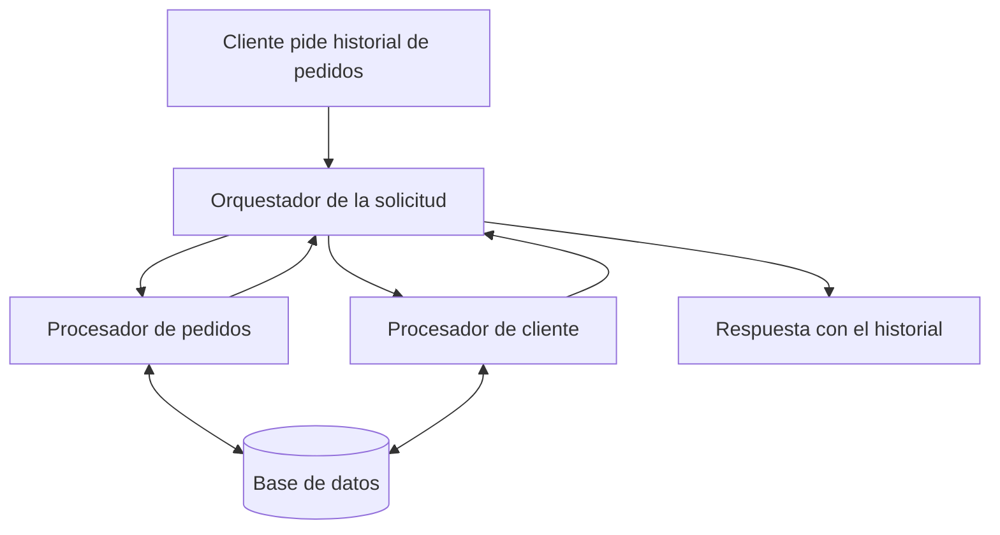
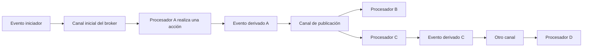

# Fundamentos y topología broker

[[Obsidian/lecturas/Fundamentals of Software Architecture/15 Arquitectura dirigida por eventos/00 Índice|← Índice del capítulo 15]]

**Una arquitectura dirigida por eventos organiza el trabajo como una cadena de hechos y reacciones: un servicio realiza una acción, anuncia lo que ocurrió y otros servicios deciden qué hacer con ese hecho.** Su nombre en inglés es *event-driven architecture*, abreviado **EDA**. La característica central es la relación entre productores y consumidores de hechos, acompañada habitualmente de comunicación asíncrona.

Un **productor** publica un evento. Un **consumidor** recibe ese evento y ejecuta una reacción. El mismo servicio puede desempeñar ambos papeles: Inventario consume `pedido_creado`, modifica existencias y produce `inventario_actualizado`.

## De pedir una respuesta a anunciar un hecho

El capítulo empieza comparando dos modelos. En un **modelo basado en solicitudes**, una entrada pide una operación concreta y el sistema organiza su ejecución para producir una respuesta. El ejemplo del libro es consultar el historial de pedidos de los últimos seis meses. Se conoce la información buscada, el contexto del cliente y el resultado que debe devolverse.

Un **orquestador de solicitudes** conserva el control del recorrido: llama a procesadores y reúne su trabajo. Puede vivir en la interfaz, una API o un servicio de coordinación. **Orquestar** significa decidir qué participantes actúan y en qué orden. **Determinista**, en este contexto, significa que la lógica de coordinación establece el recorrido de la solicitud; no quiere decir que la red jamás falle.

El centro conoce a los procesadores y espera sus resultados. Las flechas de regreso representan información necesaria para construir la respuesta. Esta es una adaptación explicativa de la figura 15-1: el recorrido termina cuando el orquestador puede responder al cliente.

En el **modelo basado en eventos**, una parte del sistema anuncia algo ocurrido y las demás reaccionan según sus responsabilidades. El libro usa una oferta en una subasta: llega una nueva oferta, se compara con las demás y se determina cuál es la más alta. El acontecimiento inicia reacciones que pueden incluir actualización del líder, aviso al anterior postor o análisis de la actividad.

La diferencia se refiere al significado y al control del flujo. Una interfaz puede usar HTTP para registrar una oferta y, después, iniciar procesamiento por eventos. Por tanto, una entrada interactiva y una arquitectura interna EDA pueden coexistir.

## Las cuatro piezas de la topología básica

Una **topología** es la disposición de componentes y canales de comunicación. En la topología inicial del libro aparecen cuatro piezas:

| Pieza | Qué significa | Ejemplo didáctico |
|---|---|---|
| Evento iniciador | Entrada que pone en marcha el flujo completo | Una nueva oferta entra en la subasta |
| Broker de eventos | Infraestructura que recibe y distribuye eventos por canales | Un intermediario entrega la oferta al procesador correspondiente |
| Procesador de eventos | Servicio que reacciona y ejecuta una responsabilidad | Comparar ofertas y actualizar al postor líder |
| Evento derivado | Hecho publicado como resultado del procesamiento anterior | `postor_lider_actualizado` |

Un **broker** es un intermediario de comunicación. El productor entrega al canal, y el broker permite que los consumidores reciban lo publicado. El productor necesita conocer el canal y el contrato del evento; puede evitar conocer las direcciones de todos los consumidores.

La caja verde del broker concentra los canales, mientras las cajas azules de productores y procesadores contienen trabajo de negocio. Las flechas indican publicación y distribución a suscriptores; la flecha de retorno representa un nuevo hecho derivado. Una publicación puede distribuirse a varios suscriptores, de modo que el recorrido se ramifica sin que el productor tenga que invocar a cada participante.

La acción de A provoca un nuevo hecho. B y C reaccionan de forma independiente, y la reacción de C puede iniciar otra etapa. Los canales pertenecen conceptualmente al broker aunque el dibujo los separe para explicar el recorrido. El flujo concluye cuando sus reacciones pendientes se han procesado y ningún participante produce trabajo adicional.

## El broker distribuye; las reacciones forman el proceso

En esta topología, el broker no contiene necesariamente una receta como «primero cobrar, después reservar, después enviar». Su responsabilidad es entregar eventos. El orden de negocio emerge de los tipos de eventos que consume y produce cada servicio: Preparación consume `pago_aplicado`, por lo que depende causalmente de ese hecho.

Esto se llama **coreografía**: los participantes coordinan su comportamiento mediante eventos, sin un único participante que dirija cada paso. La palabra es una aclaración didáctica de la topología, útil para contrastarla más adelante con el mediador. El proceso global sigue existiendo, pero su lógica está repartida entre las suscripciones y reacciones.

**Asíncrono** significa que el emisor no tiene que esperar el procesamiento completo del receptor para continuar. **Fire-and-forget**, «enviar y continuar», describe una publicación sin esperar una respuesta de negocio. No implica que se pueda ignorar si el broker recibió la publicación: una confirmación técnica de recepción y el resultado final del negocio son cosas distintas.

## Canales, tópicos y federación

Un **canal** es el lugar lógico por el que circula un tipo de comunicación. El capítulo menciona colas, tópicos y streams:

- Un **tópico** permite que distintos suscriptores estén interesados en una publicación. Un mismo `pedido_creado` puede llegar a Pagos, Inventario y Notificaciones.
- Una **cola** se usa habitualmente para entregar cada trabajo a un consumidor dentro del grupo que lo procesa. Varias instancias de Pagos pueden competir por trabajos de pago, sin que todas cobren el mismo pedido.
- Un **stream** mantiene una secuencia de eventos que los consumidores pueden recorrer según su posición. Publicar y leer no tienen que ocurrir al mismo tiempo.

La topología broker del libro se apoya en **publicación y suscripción**, también llamado *publish/subscribe* o **pub/sub**: los productores publican en un canal y los consumidores declaran interés por ese canal. Las tecnologías concretas pueden combinar estos mecanismos. El significado de evento o comando depende del contenido, como explica la [[Obsidian/lecturas/Fundamentals of Software Architecture/15 Arquitectura dirigida por eventos/03 Eventos mensajes y extensibilidad|nota 03]].

Un broker **federado** se compone de varias instancias agrupadas por dominio, frecuentemente con clusters para distribuir carga y sostener disponibilidad. Un **dominio** es un área de negocio, como Pedidos o Logística. La federación evita suponer que absolutamente todo debe pasar por una sola máquina central. Sigue habiendo infraestructura compartida cuya capacidad y fallos hay que considerar.

## Estilo completo y parte de otro estilo

Los autores defienden EDA como **estilo arquitectónico** porque han construido sistemas completos organizados de este modo. También puede ser parte de un híbrido: una arquitectura de microservicios puede usar eventos para comunicar algunos servicios. «Microservicios» describe determinadas fronteras y unidades de despliegue; «dirigida por eventos» describe cómo una parte importante del trabajo se inicia y propaga. Las dos descripciones pueden aplicarse al mismo sistema.

La flexibilidad proviene de repartir las responsabilidades y publicar hechos reutilizables. La dificultad aparece al reconstruir un proceso cuyo control está repartido. Comprender un pedido completo exige conocer qué servicios escuchan cada evento y cuáles pueden iniciar después.

> [!question]- ¿El broker es el servicio que decide todas las reglas del pedido?
> En la topología presentada aquí, distribuye publicaciones por canales. Las reglas están en los procesadores y en los eventos que los conectan. Un mediador, que se estudia más adelante, sí puede conservar una coordinación explícita del flujo.

> [!question]- ¿Tener una cola convierte cualquier aplicación en EDA?
> No basta. Una cola también puede transportar comandos como `cobrar_pedido`. EDA se reconoce por el uso de hechos y reacciones para organizar el comportamiento. El transporte y el significado deben analizarse por separado.

> [!question]- ¿Quién puede ser productor y consumidor al mismo tiempo?
> Cualquier procesador que reciba un hecho, ejecute una acción y anuncie el resultado. Inventario consume `pedido_creado` y produce `inventario_actualizado`. Su nuevo evento desencadena la siguiente reacción, pero sigue siendo un evento derivado. El iniciador del flujo es la entrada original del pedido.

## Fuente principal

[[Obsidian/lecturas/Fundamentals of Software Architecture/Materiales/12 Arquitectura dirigida por eventos.pdf#page=1|PDF 1–3 · impresas 227–229 · figuras 15-1 y 15-2]]. Las aclaraciones sobre coreografía, confirmación técnica y combinación de mecanismos son elaboración didáctica.

---

[[Obsidian/lecturas/Fundamentals of Software Architecture/15 Arquitectura dirigida por eventos/00 Índice|← Índice]] · [[Obsidian/lecturas/Fundamentals of Software Architecture/15 Arquitectura dirigida por eventos/02 Pedido del libro y eventos derivados|Siguiente →]]
