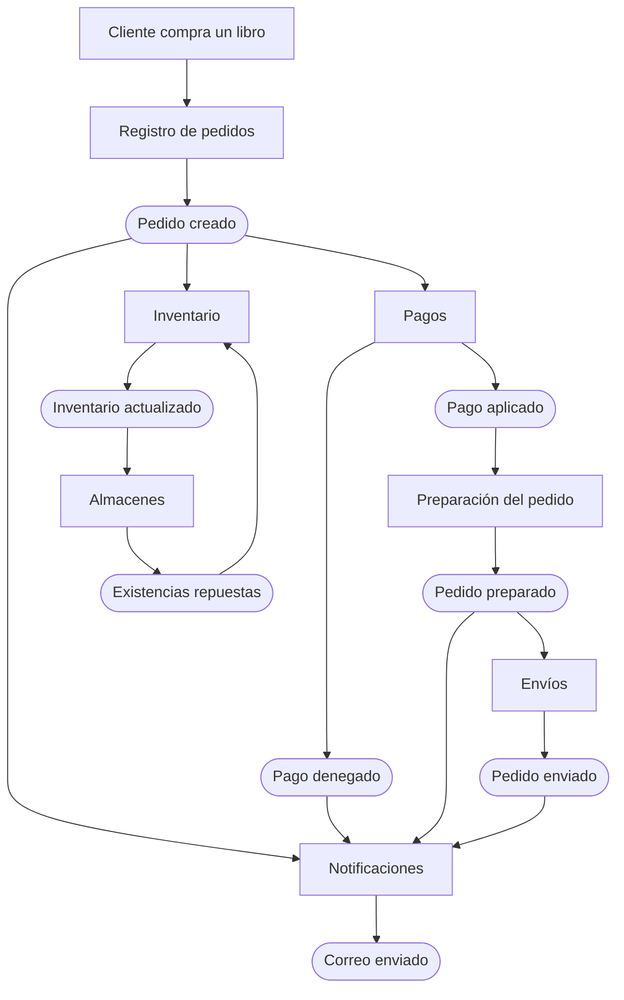
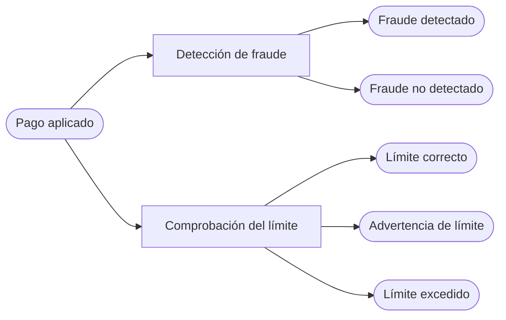
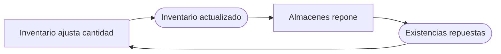

# Pedido del libro y eventos derivados

[[Obsidian/lecturas/Fundamentals of Software Architecture/15 Arquitectura dirigida por eventos/00 Índice|← Índice del capítulo 15]]

**El pedido de un libro permite entender EDA como un proceso que se ramifica: una compra genera varios hechos, y cada servicio reacciona solo a los que le interesan.** La figura 15-3 del capítulo representa servicios y eventos. El broker está omitido para que las relaciones de negocio se vean con claridad: las flechas de eventos siguen representando comunicación asíncrona mediante canales.

## El flujo completo del caso del libro

El hecho inicial aparece en verde y los servicios en azul. El pedido creado abre tres ramas: pago, inventario y aviso al cliente. Los rótulos de las flechas nombran los hechos que conectan las reacciones: el pago aprobado inicia la preparación y posteriormente el envío. Inventario tiene su propio recorrido hacia almacenes, mientras Notificaciones escucha distintos hitos. El broker se omite para mostrar directamente esas relaciones de negocio.

Las cajas rectangulares son procesadores; las cajas redondeadas son hechos publicados. Que Pagos e Inventario reciban el mismo evento no significa que uno espere al otro. En cambio, Preparación depende de `pago_aplicado`, y Envíos depende de `pedido_preparado`: el orden procede de esas relaciones causales.

### 1. Registrar el pedido y devolver su identificador

El servicio **Order Placement**, traducido aquí como Registro de pedidos, recibe la entrada de compra, inserta el pedido en una tabla y devuelve un **identificador de pedido**, un valor que permite referirse a esa compra. Después publica `pedido_creado`, que informa que el pedido ya existe.

El identificador devuelto confirma la creación del registro. El resto del proceso continúa: todavía falta saber si el cobro será aceptado y cuándo se preparará o enviará el paquete. Esta diferencia entre «recibido» y «completado» es fundamental para diseñar la interfaz.

### 2. Tres consumidores reaccionan en paralelo

**Notificaciones** escucha `pedido_creado`, envía al cliente un correo con los detalles y publica `correo_enviado`. En el dibujo original nadie escucha ese último hecho. El evento sigue siendo útil como punto de extensión, explicado en la [[Obsidian/lecturas/Fundamentals of Software Architecture/15 Arquitectura dirigida por eventos/03 Eventos mensajes y extensibilidad|nota 03]].

**Pagos** escucha el mismo `pedido_creado` y cobra la tarjeta. Según el resultado, publica `pago_aplicado` o `pago_denegado`. Son **resultados alternativos** de una operación de cobro; el dibujo presenta ambos caminos posibles, sin afirmar que los dos ocurren en un mismo cobro.

**Inventario** escucha `pedido_creado` y ajusta las existencias del libro. Publica `inventario_actualizado`. Ninguna de estas tres reacciones requiere una llamada directa desde Registro de pedidos a cada consumidor.

La causa de este paralelismo es la distribución de un mismo hecho a varios suscriptores. La consecuencia es que un consumidor lento no obliga por sí mismo a los demás a esperar. También implica que la arquitectura necesita mecanismos adicionales si una regla exige coordinación entre esas ramas.

### 3. Inventario conecta con almacenes

**Almacenes** reacciona a `inventario_actualizado`. Gestiona existencias entre almacenes y solicita reposición cuando resultan demasiado bajas. Al completarse la reposición, publica `existencias_repuestas`; Inventario vuelve a ajustar su cantidad.

El recorrido muestra una relación en dos sentidos. Es válida cuando los dos hechos tienen significado diferente y la reacción sabe cuándo detenerse. En la explicación del libro, el ajuste causado por la reposición no vuelve a emitir el evento que reiniciaría indefinidamente la misma reacción de almacenes.

### 4. El pago selecciona la continuación del proceso

Si ocurre `pago_denegado`, Notificaciones pide al cliente actualizar la tarjeta o escoger otro método. Si ocurre `pago_aplicado`, **Order Fulfillment**, traducido como Preparación del pedido, inicia las tareas de selección y empaquetado. El libro menciona indicar al trabajador dónde encontrar el libro y qué caja utilizar.

Al finalizar, publica `pedido_preparado`. Notificaciones y Envíos responden en paralelo. Notificaciones avisa que el pedido está listo; Envíos selecciona un método, despacha el paquete y publica `pedido_enviado`. Notificaciones vuelve a reaccionar para avisar que el pedido está en camino.

| Hecho publicado | Consumidores del caso | Consecuencia |
|---|---|---|
| `pedido_creado` | Pagos, Inventario, Notificaciones | Cobrar, ajustar stock y enviar detalles |
| `pago_denegado` | Notificaciones | Pedir un método de pago válido |
| `pago_aplicado` | Preparación | Seleccionar y empaquetar artículos |
| `inventario_actualizado` | Almacenes | Evaluar distribución y reposición |
| `existencias_repuestas` | Inventario | Ajustar las existencias tras la reposición |
| `pedido_preparado` | Envíos, Notificaciones | Despachar y avisar que está listo |
| `pedido_enviado` | Notificaciones | Avisar del despacho |
| `correo_enviado` | Ninguno en la figura | Dejar disponible un hecho para futuras extensiones |

## Eventos derivados: una acción puede producir varias clases de resultado

Un **evento derivado** nace del procesamiento de un evento anterior. Es una pieza necesaria de EDA porque permite que la consecuencia de una acción provoque nuevas reacciones. Un procesador puede tener varios tipos de eventos de salida según sus resultados. También puede publicar varios hechos de una misma operación cuando representan información diferente.

La figura 15-4 amplía el caso de pago. Un mismo hecho llega a Detección de fraude y Límite de crédito. Detección de fraude puede publicar `fraude_detectado` o `fraude_no_detectado`. Límite de crédito puede publicar un resultado normal, una advertencia de proximidad al límite o un exceso de límite.

Las salidas son los posibles hechos que anuncia cada evaluación. El resultado normal también merece un evento: otro consumidor puede necesitar saber que la revisión terminó satisfactoriamente. La ausencia de un evento de error no prueba por sí sola que una evaluación haya finalizado.

El libro sugiere que `limite_correcto` podría incluir el crédito disponible. `advertencia_de_limite` puede interesar a Notificaciones. `limite_excedido` puede interesar a Notificaciones, a un servicio que rechace la compra y a una capacidad de negocio que amplíe crédito cuando corresponda. El productor comunica lo que comprobó, sin incorporar necesariamente cada uso posterior de esa información.

> [!note] Diferencia entre el texto y la figura 15-4
> El texto de la página impresa 233 describe el hecho como `creditcard charged`, mientras la figura de la impresa 234 rotula el nodo como `Payment applied`. Aquí el diagrama conserva «Pago aplicado», como la figura. La idea compartida es que un hecho del pago alimenta comprobaciones paralelas. El esquema ilustra propagación de eventos; no especifica un protocolo bancario completo ni determina por sí solo qué controles deben ocurrir antes de autorizar un cobro real.

## El evento venenoso del caso

En este apartado el libro usa **poison event**, traducido como **evento venenoso**, para una publicación que mantiene un ciclo continuo de reacciones entre servicios. Es un significado concreto dentro de este ejemplo: el evento inicia una reacción que vuelve a iniciar la anterior, sin una condición de parada.

El circuito resulta peligroso si cada ajuste emite siempre `inventario_actualizado` y cada reacción de Almacenes produce siempre una nueva reposición. Las etapas se disparan repetidamente sin un cambio de negocio que lo justifique. En el caso explicado por los autores, Inventario evita volver a publicar el hecho que reiniciaría el ciclo después de consumir `existencias_repuestas`.

Como elaboración didáctica, también puede distinguirse el motivo del ajuste y reaccionar solo cuando exista una necesidad real. El principio es que una dependencia circular necesita una regla de terminación. Un broker distribuye publicaciones; no conoce necesariamente la intención de negocio suficiente para decidir dónde debe acabar el ciclo.

## La carrera de relevos y sus límites

El libro compara el flujo con una carrera de relevos: cada corredor hace un tramo y entrega el testigo al siguiente. Un procesador que publica su resultado puede atender otros eventos, en lugar de acompañar personalmente todo el proceso.

La comparación explica independencia temporal, pero EDA puede tener **ramificaciones**: un mismo hecho activa varios servicios. Tampoco implica que publicar garantice por sí solo que todo terminará bien. La entrega fiable, los reintentos, las compensaciones y la visibilidad del estado del pedido requieren diseño adicional.

Cada procesador puede escalar según su carga. Si Notificaciones acumula trabajo, pueden añadirse instancias de esa capacidad sin aumentar necesariamente Preparación o Inventario. Los canales y almacenamiento compartidos siguen imponiendo límites.

> [!question]- ¿Por qué Registro de pedidos no llama directamente a Notificaciones, Pagos e Inventario?
> Porque publica un hecho que esos tres consumidores conocen. Así evita mantener dentro de su implementación la lista y las reglas de todos ellos. Agregar una nueva reacción puede consistir en suscribir otro procesador al mismo hecho.

> [!question]- ¿El paralelismo asegura que Inventario termine antes de preparar el paquete?
> No. La figura hace depender Preparación de `pago_aplicado`, pero no dibuja una espera de confirmación de Inventario. Si el negocio exige esa condición, hace falta modelarla explícitamente. Es un límite del ejemplo, no una garantía implícita de EDA.

> [!question]- ¿Publicar el resultado positivo de una comprobación es redundante?
> No cuando otros participantes necesitan distinguir «revisión terminada sin problema» de «revisión aún pendiente». El resultado positivo aporta información que la simple ausencia de un error no permite deducir.

## Fuentes principales

[[Obsidian/lecturas/Fundamentals of Software Architecture/Materiales/12 Arquitectura dirigida por eventos.pdf#page=3|PDF 3–5 · impresas 229–231 · figura 15-3 y pedido del libro]]. [[Obsidian/lecturas/Fundamentals of Software Architecture/Materiales/12 Arquitectura dirigida por eventos.pdf#page=7|PDF 7–8 · impresas 233–234 · figura 15-4 y eventos derivados]]. Las precisiones sobre causalidad, condiciones previas y garantías son elaboración didáctica.

---

[[Obsidian/lecturas/Fundamentals of Software Architecture/15 Arquitectura dirigida por eventos/01 Fundamentos y topología broker|← Anterior]] · [[Obsidian/lecturas/Fundamentals of Software Architecture/15 Arquitectura dirigida por eventos/03 Eventos mensajes y extensibilidad|Siguiente →]]
