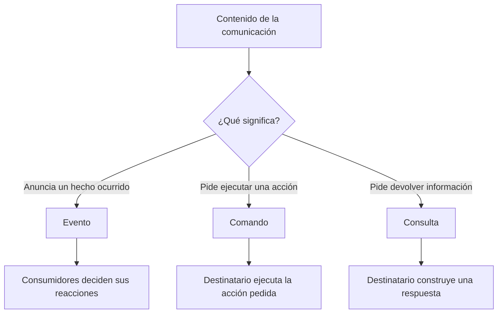
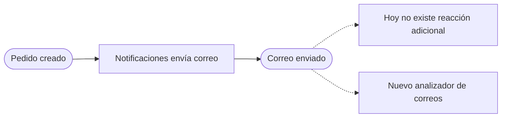

# Eventos mensajes y extensibilidad

[[Obsidian/lecturas/Fundamentals of Software Architecture/15 Arquitectura dirigida por eventos/00 Índice|← Índice del capítulo 15]]

**Un evento informa de algo ocurrido. Un comando pide que algo ocurra. Una consulta pide información.** Esta distinción afecta a quién toma decisiones, qué dependencia existe entre participantes y qué debería contener la comunicación. El capítulo agrupa comandos y consultas bajo el término «mensajes» al compararlos con eventos.

En el uso técnico general, un evento también viaja dentro de un mensaje de transporte. Para mantener la distinción del libro, aquí «mensaje» significa la comunicación de un comando o consulta, mientras «evento» se refiere al anuncio de un hecho. Son categorías semánticas: describen el significado, aunque ambos puedan enviarse mediante el mismo broker.

## El significado importa más que el canal

`pedido_creado` anuncia que existe un nuevo pedido. El productor conoce ese hecho, pero no necesita decidir que Notificaciones mande un correo o que Inventario ajuste stock. Esas reacciones pertenecen a los consumidores.

`aplicar_pago` expresa una instrucción. Su emisor espera que la responsabilidad de cobro se ejecute. `consultar_opciones_de_envio` expresa una pregunta y necesita una respuesta con opciones. Cambiar el transporte de esos dos mensajes no cambia su significado.

| Criterio | Evento | Mensaje de comando o consulta |
|---|---|---|
| Significado | Un hecho ya ocurrió | Algo debe hacerse o responderse |
| Ejemplo | `pedido_creado` | `aplicar_pago` |
| Relación habitual | Uno publica, varios pueden reaccionar | Un destinatario lógico realiza la operación |
| Respuesta de negocio | Habitualmente no se exige al emisor | Habitualmente se necesita un resultado o confirmación |
| Canal habitual en el libro | Tópico, stream o notificación | Cola o comunicación punto a punto |
| Quién decide la reacción | Cada consumidor interesado | El emisor especifica la operación solicitada |

«Habitualmente» es importante. Un comando puede enviarse sin esperar respuesta. Un evento puede tener hoy un único consumidor. También puede difundirse un comando a muchos destinatarios. Estas variantes no anulan la diferencia fundamental entre **anunciar un hecho** y **solicitar una acción**.

La clasificación comienza por la intención del contenido. Elegir un tópico o una cola ocurre después y debe servir a esa intención. El mismo formato JSON puede expresar cualquiera de las tres categorías, por lo que reconocerlas exige comprender la operación de negocio.

## Los cuatro ejemplos cotidianos del libro

El capítulo utiliza situaciones comunes para evitar que esta diferencia se confunda con detalles de programación:

1. **La torre indica a un vuelo que gire hacia una dirección determinada.** Es un comando dirigido al piloto responsable. Otros pilotos podrían escucharlo, pero escuchar no convierte a todos en destinatarios de la instrucción.
2. **Un informativo anuncia que entró un frente frío.** Es un evento: comunica un hecho ocurrido a muchas personas. Cada una puede decidir si necesita un abrigo, cambiar un viaje o no hacer nada.
3. **El profesor pide a la clase abrir una página del cuaderno.** Es un comando difundido a varios estudiantes. La difusión modifica el alcance, pero el contenido sigue pidiendo una acción futura.
4. **Una persona comunica que llegó tarde a una reunión.** Es un evento porque informa de una situación que ya sucedió. Los asistentes deciden si deben explicarle lo tratado, continuar o reorganizar la agenda.

El tercer caso es especialmente útil: **pub/sub no transforma automáticamente un comando en evento**. Si un servicio publica `enviar_correo_ahora` en un tópico, sigue especificando una acción que alguien debe ejecutar. El desacoplamiento de transporte puede ser real, pero el emisor conserva conocimiento semántico de la operación pedida.

## Evento iniciador no siempre significa hecho de negocio confirmado

El capítulo llama «evento iniciador» a entradas como colocar un pedido. Esa entrada puede llegar formulada como intención del usuario: «quiero comprar». Después de crear el registro, el sistema publica un hecho derivado: `pedido_creado`.

Para evitar confusión al diseñar, conviene nombrar las dos etapas con precisión. Como ejemplo propio, `solicitud_de_compra_recibida` anuncia que se recibió una intención, mientras `pedido_creado` afirma que el registro existe. Ninguno de esos dos hechos equivale a `pago_aplicado` o a `pedido_enviado`. Cada nombre debe expresar exactamente qué estado puede darse por establecido.

## Extensibilidad: publicar también hechos que nadie utiliza todavía

La **extensibilidad** es la facilidad para incorporar capacidades nuevas con poco impacto sobre las existentes. En EDA, un hecho publicado puede funcionar como punto de extensión: otro servicio puede comenzar a consumirlo cuando aparece una necesidad.

La figura 15-5 del libro presenta Notificaciones generando `correo_enviado`. En la versión actual no hay consumidores de ese evento. Más adelante el negocio decide analizar los correos enviados a clientes. Puede incorporarse un servicio **Analizador de correos** que escuche ese hecho, sin modificar la lógica de Registro de pedidos o de Pagos y sin tener que introducir una nueva llamada dentro de Notificaciones.

La flecha hacia el analizador representa una ampliación futura del sistema. El hecho se publica antes de que exista esa capacidad. La disponibilidad del punto de extensión reduce el cambio necesario en el productor: el nuevo consumidor se incorpora a un canal ya previsto.

El libro llama a esta publicación un **evento derivado extensible**. En algunos mecanismos la publicación sin suscriptores desaparece; en un stream retenido puede permanecer almacenada y simplemente no estar siendo leída. Por eso «nadie lo consume hoy» no garantiza que un consumidor futuro pueda consultar toda la historia: eso depende de la retención del canal.

## La extensibilidad necesita información utilizable

El simple nombre `correo_enviado` no basta para cualquier análisis. Como elaboración propia, un analizador podría necesitar identificador del correo, identificador del pedido, momento del envío y clase de notificación. Si el evento omite esos datos, será un punto de extensión muy limitado. Si incluye todo el contenido indiscriminadamente, aumentará tamaño, contratos y exposición de información.

La decisión consiste en publicar un hecho **significativo** con contexto suficiente, evitando exigir al productor que conozca todas las funciones futuras. La [[Obsidian/lecturas/Fundamentals of Software Architecture/15 Arquitectura dirigida por eventos/05 Payloads con datos o claves|nota 05]] desarrolla ese equilibrio entre llevar datos y llevar una referencia.

Un consumidor nuevo debe comprender el mismo contrato. Por tanto, la independencia de las implementaciones no elimina la coordinación alrededor del significado del hecho y su formato. Si `correo_enviado` pasa a significar «correo puesto en cola», un analizador que contabilice envíos efectivos comenzará a producir conclusiones incorrectas aunque el JSON siga siendo válido.

## Desacoplamiento semántico con un ejemplo propio

Supongamos que un sensor publica `temperatura_medida` con el valor de la medición. Un servicio puede archivar el histórico, otro activar ventilación y otro detectar anomalías. El sensor conoce el significado de la medición, pero puede desconocer esas tres respuestas.

Si el sensor publica `activar_ventilador`, ya contiene una decisión sobre qué acción debería ejecutar otro componente. El segundo diseño puede ser apropiado si el sensor es responsable de esa decisión, pero describe una comunicación de comando. La ventaja del primer diseño es que permite agregar una nueva reacción, como una alarma, sin convertir al sensor en coordinador de todas las políticas.

> [!question]- ¿`enviar_correo` se convierte en evento si se publica a diez suscriptores?
> No. Sigue siendo una instrucción. `correo_enviado` anuncia el resultado de una acción ya realizada. La cantidad de receptores es una característica de distribución, no la definición del significado.

> [!question]- ¿Un evento debe estar escrito siempre en pasado?
> El pasado ayuda a expresar hechos, pero el nombre no constituye una prueba. Un sistema puede llamar `pago_aplicado` a una petición de cobro mal nombrada. Hay que verificar qué estado existe realmente cuando se publica.

> [!question]- ¿Por qué publicar `fraude_no_detectado` si aparentemente no pasó nada?
> Porque sí ocurrió algo: terminó una comprobación con un resultado. Ese hecho permite continuar decisiones que dependen de la revisión y distinguirla de una comprobación todavía pendiente.

> [!question]- ¿El analizador futuro podrá recuperar todos los correos enviados antes de instalarse?
> Solo si el mecanismo conserva los eventos y permite leerlos. Suscribirse a nuevas publicaciones y consultar una historia retenida son capacidades diferentes.

## Fuentes principales

[[Obsidian/lecturas/Fundamentals of Software Architecture/Materiales/12 Arquitectura dirigida por eventos.pdf#page=6|PDF 6–7 · impresas 232–233 · eventos frente a mensajes]]. [[Obsidian/lecturas/Fundamentals of Software Architecture/Materiales/12 Arquitectura dirigida por eventos.pdf#page=9|PDF 9 · impresa 235 · figura 15-5 y extensibilidad]]. Los ejemplos del sensor y los detalles de información para el analizador son elaboración didáctica.

---

[[Obsidian/lecturas/Fundamentals of Software Architecture/15 Arquitectura dirigida por eventos/02 Pedido del libro y eventos derivados|← Anterior]] · [[Obsidian/lecturas/Fundamentals of Software Architecture/15 Arquitectura dirigida por eventos/04 Asincronía difusión y desacoplamiento|Siguiente →]]
