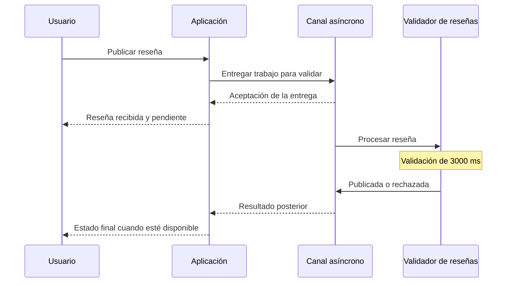
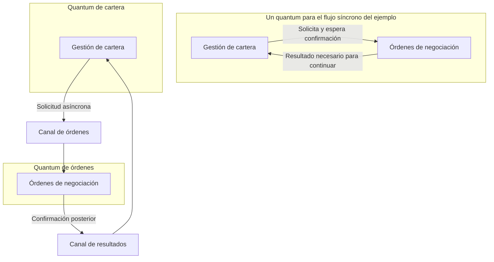
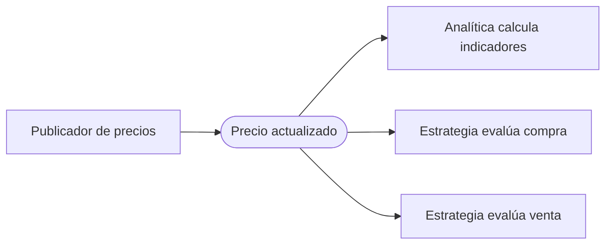

# Asincronía difusión y desacoplamiento

[[Obsidian/lecturas/Fundamentals of Software Architecture/15 Arquitectura dirigida por eventos/00 Índice|← Índice del capítulo 15]]

**La comunicación asíncrona permite devolver control antes de completar el trabajo remoto. Esto mejora la rapidez de respuesta y reduce algunas dependencias entre servicios, pero obliga a distinguir aceptación, procesamiento y resultado final.** EDA utiliza esa capacidad tanto para publicar sin esperar resultados como para intercambiar solicitudes y respuestas por canales asíncronos.

## La reseña del producto: dos tiempos distintos

En el ejemplo del libro, una persona escribe una reseña. El servicio tarda **3.000 ms** en revisar palabras prohibidas, posibles expresiones abusivas y si el texto se refiere al producto. Solo después puede publicarlo.

El camino síncrono utiliza una llamada REST. La petición tarda 50 ms en llegar, el servicio trabaja 3.000 ms y la respuesta tarda 50 ms en volver:

$$T_{respuesta\;sincrona}=50+3.000+50=3.100\;\text{ms}.$$

La persona espera 3,1 segundos para recibir una confirmación de que la reseña fue publicada. La respuesta incluye el resultado final de la operación.

El camino asíncrono permite confirmar que el trabajo fue aceptado en **25 ms**, según los valores del capítulo. El consumidor realiza sus 3.000 ms de validaciones más tarde. La persona puede continuar usando la aplicación mientras esa revisión sigue pendiente.

La columna azul representa esperar el resultado final y la verde representa recuperar control tras la aceptación. Las dos conservan 3.000 ms de validación. La suma asíncrona hace explícitos los dos tramos de 25 ms dibujados en la figura original, mientras el texto del libro cuenta solo uno; esa diferencia de medición se desarrolla más abajo.

La respuesta temprana comunica recepción, mientras la posterior comunica el resultado. La secuencia es una elaboración explicativa del ejemplo: hace visible el aviso final que una aplicación necesita diseñar cuando el resultado puede ser rechazado después de la aceptación.

| Medida | Qué pregunta responde | En el ejemplo |
|---|---|---|
| Rapidez de respuesta, *responsiveness* | ¿Cuánto espera la persona para recuperar control o recibir información? | 3.100 ms síncronos frente a 25 ms para la aceptación asíncrona |
| Tiempo de procesamiento | ¿Cuánto tarda la validación del contenido? | 3.000 ms en ambos caminos |
| Tiempo hasta el resultado final | ¿Cuándo queda publicada o rechazada la reseña? | Depende también del transporte y de la espera en el canal |

El libro diferencia **responsiveness** y **performance**. Aquí usamos «rapidez de respuesta» para la primera y «rendimiento del procesamiento» para la segunda. La mejora de respuesta no demuestra que las validaciones se hayan vuelto más rápidas. Optimizar las revisiones con paralelismo o caché podría reducir el tiempo de procesamiento: sería una mejora diferente.

### Qué significan realmente los números

La comparación de espera visible es:

$$\frac{3.100}{25}=124.$$

La aceptación llega en un tiempo 124 veces menor en los valores del ejemplo. Esto **no significa** que el sistema valide 124 veces más reseñas por segundo. La capacidad de validación sigue condicionada por sus recursos, concurrencia y coste de procesamiento.

Además, el ejemplo supone 50 ms por tramo síncrono y 25 ms por tramo asíncrono: la comparación no mantiene idénticos valores de red. Su conclusión principal es la diferencia entre esperar el resultado y esperar una aceptación. Los números ilustran esa diferencia, sin constituir una promesa de latencia para una tecnología determinada.

> [!note] Pequeña inconsistencia temporal de la figura 15-6
> El texto calcula el camino asíncrono como 25 + 3.000 = 3.025 ms. La figura dibuja un tramo de 25 ms entre productor y canal y otro de 25 ms entre canal y consumidor. Si ambos tramos se recorren consecutivamente, el total hasta completar la validación sería 25 + 25 + 3.000 = 3.050 ms, antes de añadir cualquier cola o aviso de resultado. Se conservan los 25 ms de aceptación y los 3.000 ms de validación; la cifra exacta hasta la finalización depende de qué tramos incluya la medida.

Como ejemplo propio, si una reseña espera dos segundos en el canal antes de comenzar la validación, una aceptación en 25 ms puede coexistir con más de cinco segundos hasta su publicación. La interfaz resulta fluida, pero la demora de procesamiento sigue existiendo.

## Aceptar un trabajo exige explicar su estado

La consecuencia de responder pronto es que el sistema puede descubrir un error después. Si la reseña incumple reglas, hay que comunicar el rechazo. El libro sugiere avisar al usuario registrado, indicando el problema y cómo corregirlo. Una notificación, un estado consultable o una actualización de la interfaz son posibilidades de diseño.

El caso de una orden bursátil del capítulo muestra una situación más sensible: si se acepta la intención de comprar y luego falla el procesamiento, la persona necesita conocer el resultado. «Recibido» no equivale a «compra realizada». La comunicación temprana debe expresar esa diferencia.

**Fire-and-forget** describe que el emisor no espera una respuesta de negocio en ese intercambio. No significa que el resultado deje de importar. El seguimiento puede ocurrir mediante un evento posterior, una consulta o un servicio encargado de informar.

## Desacoplamiento dinámico y quantum arquitectónico

El **acoplamiento dinámico** es la dependencia que existe durante la ejecución. Si A llama a B y debe esperar su respuesta para completar su propia operación, los tiempos y fallos de B afectan directamente a A.

El libro llama **quantum arquitectónico** a una parte desplegable de forma independiente que está unida internamente por acoplamiento dinámico síncrono y cuya frontera ayuda a entender las características arquitectónicas. Dos despliegues distintos pueden pertenecer al mismo quantum cuando se necesitan mutuamente de manera síncrona para completar el flujo.

En las figuras 15-7 y 15-8, **Gestión de cartera** envía una orden al sistema **Órdenes de negociación**. Este revisa cumplimiento y crea la orden. La primera versión obliga a Gestión de cartera a esperar un número de confirmación.

El marco superior agrupa los dos sistemas porque la llamada síncrona liga su capacidad de completar la operación. Los marcos inferiores muestran que la aceptación de órdenes puede continuar sin esperar inmediatamente al procesador remoto. Los dos canales hacen explícito que la confirmación vuelve más tarde.

Los autores llaman **Dynamic Quantum Entanglement** al entrelazamiento de quanta que aparece al introducir esa dependencia síncrona. Sus consecuencias en el ejemplo son concretas:

- **Disponibilidad:** si Órdenes está caído, Cartera no puede completar la emisión síncrona de la orden.
- **Rapidez de respuesta:** si Órdenes tarda, Cartera también devuelve tarde el resultado.
- **Escalabilidad:** aumentar la capacidad de Cartera puede requerir aumentar la de Órdenes; el cuello de botella remoto limita el flujo.

La versión asíncrona permite recibir la intención y almacenarla para procesarla después. Si el canal admite publicaciones y conserva el trabajo de forma fiable, una indisponibilidad temporal del procesador no impide necesariamente aceptar nuevas órdenes.

Esto no crea capacidad infinita: los canales tienen límites y un atraso sostenido afecta al tiempo hasta la finalización. Tampoco asegura por sí solo quanta completamente independientes si existen otras llamadas síncronas o dependencias comunes. La comparación del libro aísla la relación de comunicación dibujada.

## Difusión y desacoplamiento semántico

La figura 15-9 describe un productor que difunde un evento a varios consumidores. **Desacoplamiento semántico** significa que el productor conoce el hecho publicado, pero puede desconocer qué acciones realizará cada receptor.

En el ejemplo del libro, cambia el precio de un instrumento bursátil y se publica el nuevo precio. Analítica, una estrategia de compra y una estrategia de venta pueden responder de formas diferentes. El servicio de precios no necesita ejecutar directamente esas estrategias ni elegir una única reacción.

Los tres consumidores utilizan un mismo hecho para responsabilidades distintas. El productor no contiene la lista de decisiones de inversión. El contrato del evento sigue siendo compartido: todos necesitan interpretar correctamente el instrumento, precio y contexto temporal.

La difusión también sostiene **consistencia eventual**, cuando varios participantes se actualizan después de un hecho y convergen con el tiempo, y **procesamiento de eventos complejos**, que combina eventos para detectar situaciones de mayor nivel. Difundir una publicación aporta el mecanismo de comunicación; las reglas de convergencia o detección siguen teniendo que implementarse.

> [!question]- ¿La reseña está publicada cuando llega la respuesta de 25 ms?
> No. La respuesta confirma aceptación para procesamiento. Las validaciones pueden seguir pendientes y terminar en rechazo. La interfaz debe informar ese estado con precisión.

> [!question]- ¿Cómo puede una cola mejorar disponibilidad sin que el consumidor esté activo?
> Puede conservar trabajo mientras el consumidor está temporalmente indisponible. La aceptación depende entonces de que el canal funcione y disponga de capacidad. La finalización espera a que el consumidor vuelva y procese lo acumulado.

> [!question]- ¿Desacoplamiento semántico elimina los contratos?
> No. El productor puede desconocer las acciones de los consumidores, pero debe publicar un hecho con significado y estructura comprensibles. La independencia de reacción convive con una dependencia del contrato.

## Fuentes principales

[[Obsidian/lecturas/Fundamentals of Software Architecture/Materiales/12 Arquitectura dirigida por eventos.pdf#page=9|PDF 9–11 · impresas 235–237 · figura 15-6 y reseñas]]. [[Obsidian/lecturas/Fundamentals of Software Architecture/Materiales/12 Arquitectura dirigida por eventos.pdf#page=11|PDF 11–13 · impresas 237–239 · figuras 15-7, 15-8 y 15-9]]. El ejemplo de espera de dos segundos y las precisiones sobre capacidad y otros acoplamientos son elaboración didáctica.

---

[[Obsidian/lecturas/Fundamentals of Software Architecture/15 Arquitectura dirigida por eventos/03 Eventos mensajes y extensibilidad|← Anterior]] · [[Obsidian/lecturas/Fundamentals of Software Architecture/15 Arquitectura dirigida por eventos/05 Payloads con datos o claves|Siguiente →]]
