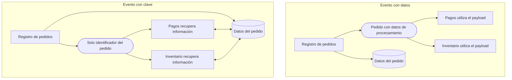
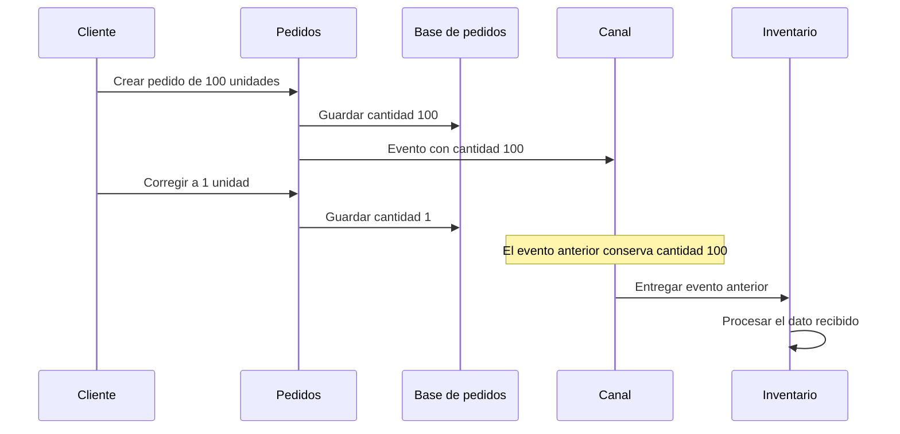

# Payloads con datos o claves

[[Obsidian/lecturas/Fundamentals of Software Architecture/15 Arquitectura dirigida por eventos/00 Índice|← Índice del capítulo 15]]

**El payload es la información que viaja dentro del evento. Puede llevar los datos necesarios para trabajar o solo una referencia para recuperarlos después.** El capítulo compara estas dos estrategias porque intercambian costes: evitar consultas puede mejorar el procesamiento, mientras transmitir poca información simplifica contratos y reduce tráfico.

Un **payload basado en datos**, *data-based payload*, incluye información suficiente para ejecutar la reacción. Un **payload basado en clave**, *key-based payload*, incluye una clave que identifica el objeto de negocio, como un pedido o cliente. El consumidor debe recuperar los datos que necesita mediante una consulta adicional.

## El pedido con todos sus datos

La figura 15-10 del libro presenta Registro de pedidos guardando el pedido en una base de datos y publicando `order_placed` con **45 atributos y un tamaño de 500 KB**. Son valores del ejemplo del capítulo, no tamaños obligatorios ni habituales de cualquier pedido.

Pagos extrae del evento el identificador del pedido, los datos del cliente y el importe. Inventario extrae identificador del artículo y cantidad. Ambos tienen los datos disponibles al recibir el evento, sin consultar la base de pedidos.

El siguiente JSON es un ejemplo propio reducido para explicar la idea; no reproduce los 45 campos del caso:

```json
{
  "tipo": "pedido_creado",
  "pedido_id": "123",
  "cliente_id": "C42",
  "importe": 38.50,
  "moneda": "USD",
  "articulos": [
    {"articulo_id": "LIBRO-01", "cantidad": 1}
  ]
}
```

El valor del diseño no reside en enviar un objeto enorme, sino en hacer que el consumidor disponga del contexto que necesita. El capítulo usa el pedido completo como forma de atender consumidores cuyo trabajo puede ser desconocido para el productor.

## El mismo pedido con una clave

En la figura 15-12, Registro de pedidos guarda los datos y publica un evento cuyo payload contiene únicamente el identificador. El ejemplo de la página impresa 243 utiliza la clave `order_id` con valor `123`.

```json
{
  "order_id": "123"
}
```

Pagos recibe la clave y consulta la información de cobro. Inventario recibe la misma clave y consulta los artículos y cantidades. Se transmite menos información en el evento, pero aparecen llamadas y dependencias adicionales.


La caja verde del camino con datos distribuye información suficiente para que Pagos e Inventario, en azul, reaccionen directamente. La caja naranja del camino con clave distribuye un identificador y obliga a recuperar información mediante las flechas de consulta. El tamaño del evento disminuye, mientras el almacenamiento o servicio que responde las consultas se vuelve parte del coste y de las dependencias de cada reacción.



Ambas alternativas guardan el pedido. La diferencia es la fuente inmediata de información para los consumidores. En el dibujo con clave, cada consumidor depende de una consulta posterior; esa consulta puede dirigirse a una API del propietario de los datos cuando el acceso directo a su base no está permitido.

## Por qué los datos favorecen autonomía de procesamiento

Cada consulta adicional consume tiempo, conexiones y capacidad del almacenamiento. Si un evento ya contiene la información, el consumidor evita ese viaje. También puede trabajar cuando no tiene acceso a la base que originó el hecho.

Un **bounded context**, o contexto delimitado, es una frontera dentro de la cual un modelo y sus reglas tienen significado coherente. Si Pedidos posee su base y no permite acceso desde Logística, un evento con datos puede atravesar esa frontera sin exigir que Logística consulte tablas internas. El capítulo relaciona esta ventaja con topologías de datos por dominio o por servicio.

El coste se mueve al canal: payloads grandes necesitan más ancho de banda y serialización, ocupan más espacio retenido y amplían los contratos que los consumidores deben comprender. Por ello «menos consultas» y «menos coste total» no son sinónimos automáticos.

## Por qué las claves favorecen datos actualizados

Un **sistema de registro**, *system of record*, es la fuente autoritativa para un dato. El capítulo contrasta los datos copiados dentro de eventos con consultar una fuente central actualizada. Una clave permite recuperar el estado disponible en el momento de la consulta, en lugar de utilizar una copia emitida anteriormente.

El caso del libro es un cliente que pide **100 unidades aunque quería una**, o que utiliza una dirección equivocada. Corrige el pedido casi inmediatamente. La base queda con los valores nuevos, pero un evento ya publicado sigue conteniendo los valores antiguos.



La copia del evento describe un estado anterior. Inventario no descubre automáticamente la corrección si trabaja solo con ese payload. Si los eventos nuevos se procesan antes que los viejos y un consumidor sobrescribe valores sin distinguir versiones, el estado antiguo puede reemplazar al nuevo.

La precisión didáctica es que **una instantánea histórica no es un error por existir**. Puede ser exactamente lo que se necesita para auditar qué se pidió originalmente. El problema aparece cuando se interpreta como estado vigente para una operación que debe utilizar la corrección. Decidir entre datos históricos y datos actuales forma parte del contrato de negocio.

Con una clave, el consumidor puede leer el valor corregido. Sin embargo, leer «lo más reciente» también cambia la semántica: una reacción a un hecho de hace un minuto puede terminar usando datos que todavía no existían cuando ocurrió ese hecho. El libro destaca la mejora de consistencia; esta aclaración ayuda a elegir según la operación, en lugar de considerar que consultar siempre devuelve el estado temporal deseado.

## La comparación de la tabla 15-1

La tabla del capítulo usa «bueno» y «malo» para resumir tendencias dentro de las alternativas descritas. Los rótulos no sustituyen el análisis del caso concreto:

| Criterio de la tabla 15-1 | Basado en datos | Basado en clave | Por qué aparece esa tendencia |
|---|---|---|---|
| Rendimiento y escalabilidad | Bueno | Malo | Los datos evitan consultas adicionales por consumidor |
| Gestión de contratos | Malo | Bueno | Un pedido completo tiene más campos y cambios que una clave |
| Acoplamiento por estructura compartida | Malo | Bueno | Los consumidores pueden quedar ligados a un objeto grande |
| Uso de ancho de banda | Malo | Bueno | El objeto completo ocupa más que su identificador |
| Acceso restringido a base de datos | Bueno | Malo | Los datos permiten trabajar sin leer la base del productor |
| Fragilidad general del sistema | Malo | Bueno | El capítulo considera la propagación de cambios de contrato y la duplicación de datos |

La clasificación de rendimiento se refiere al procesamiento completo, incluyendo consultas. Desde la perspectiva exclusiva de red y broker, una clave pequeña normalmente resulta más barata de transportar. No hay contradicción: se están midiendo partes diferentes del recorrido.

Como cálculo propio, si entran 500 pedidos/s y dos consumidores consultan una vez por pedido, aparecen aproximadamente:

$$500\;pedidos/s\times2\;consultas/pedido=1.000\;consultas/s.$$

La estimación no incluye consultas internas de cada servicio ni reintentos. Su propósito es mostrar que un evento pequeño puede desplazar la carga a una dependencia central. La base que devuelve los datos necesita soportar esa lectura simultánea.

## Elegir por evento, no para toda la arquitectura

El libro insiste en que no se trata de una elección global entre dos extremos. Un sistema puede emitir `pedido_creado` con datos suficientes para preparar una compra y `catalogo_modificado` con una referencia para que los interesados consulten el catálogo vigente.

Para una decisión concreta, las preguntas útiles son:

- ¿La reacción necesita saber qué ocurrió en ese instante o utilizar el estado actual?
- ¿Los consumidores tienen una forma permitida y disponible de recuperar los datos?
- ¿Cuántas consultas añade cada publicación y quién absorbe su carga?
- ¿Cuánto ocupa el payload y cuánto cambia su contrato?
- ¿Qué información permite decidir si hace falta reaccionar?

La última pregunta conduce a los **eventos anémicos**: reducir el tamaño demasiado puede eliminar el contexto necesario. La [[Obsidian/lecturas/Fundamentals of Software Architecture/15 Arquitectura dirigida por eventos/06 Contratos acoplamiento y eventos anémicos|nota 06]] desarrolla ese problema junto con contratos y ancho de banda.

> [!question]- ¿Por qué puede ser mala una clave si cabe en unos pocos bytes?
> Porque transportar el evento es solo una parte del trabajo. Cada consumidor debe recuperar datos, añadiendo latencia y dependencia del almacenamiento o API. Si hay muchos consumidores, la suma de consultas puede superar la capacidad disponible.

> [!question]- ¿Un payload con datos debe contener toda la tabla del pedido?
> No es una obligación del concepto. Debe permitir la reacción prevista con contexto suficiente. El capítulo usa un pedido completo para ilustrar ventajas y costes; enviar campos indiscriminadamente puede producir acoplamiento y tráfico innecesarios.

> [!question]- ¿Un evento antiguo es incorrecto porque conserva una cantidad que luego cambió?
> Puede ser una descripción correcta del pasado. Se vuelve problemático si un consumidor lo usa como dato vigente cuando la operación requiere la corrección. El contrato debe explicar si representa una instantánea histórica o un estado para aplicar.

## Fuentes principales

[[Obsidian/lecturas/Fundamentals of Software Architecture/Materiales/12 Arquitectura dirigida por eventos.pdf#page=14|PDF 14–15 · impresas 240–241 · figura 15-10 y payload con datos]]. [[Obsidian/lecturas/Fundamentals of Software Architecture/Materiales/12 Arquitectura dirigida por eventos.pdf#page=17|PDF 17–19 · impresas 243–245 · figura 15-12 y tabla 15-1]]. El JSON reducido, las 1.000 consultas/s y la distinción temporal de instantáneas son elaboración didáctica.

---

[[Obsidian/lecturas/Fundamentals of Software Architecture/15 Arquitectura dirigida por eventos/04 Asincronía difusión y desacoplamiento|← Anterior]] · [[Obsidian/lecturas/Fundamentals of Software Architecture/15 Arquitectura dirigida por eventos/06 Contratos acoplamiento y eventos anémicos|Siguiente →]]
