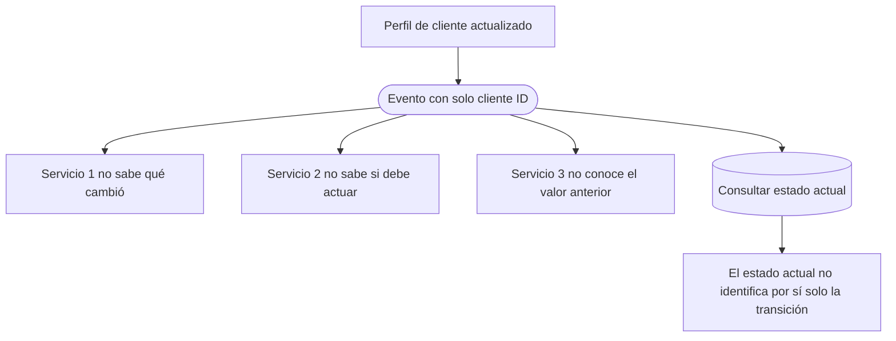

# Contratos acoplamiento y eventos anémicos

[[Obsidian/lecturas/Fundamentals of Software Architecture/15 Arquitectura dirigida por eventos/00 Índice|← Índice del capítulo 15]]

**Distribuir hechos reduce la dependencia de llamadas directas, pero los consumidores siguen dependiendo del significado y de la estructura de los eventos.** Un payload enorme puede ligar servicios a muchos campos que no usan. Uno demasiado pobre puede impedir que decidan cómo reaccionar. El diseño debe conservar el contexto necesario con un contrato que pueda evolucionar.

## Qué es un contrato de evento

Un **contrato** define cómo interpretar una comunicación: campos, tipos, significado, obligatoriedad y condiciones bajo las cuales se publica. Que el transporte lleve JSON o XML no elimina el contrato; solo define parte del formato.

El libro distingue:

| Contrato | Cómo se expresa | Consecuencia |
|---|---|---|
| Estricto | Esquema formal, definición de objeto o estructura explícita | Puede detectar incompatibilidades, pero el consumidor queda ligado a la definición aceptada |
| Flexible | Pares nombre–valor y reglas menos rígidas | Facilita tolerar algunas diferencias, pero sigue necesitando acuerdos de interpretación |

**JSON** es un formato de representación de datos, mientras **JSON Schema** es una forma de definir y validar la estructura esperada. Usar JSON no significa por sí solo que el contrato sea flexible; puede validarse contra un esquema muy rígido.

El contrato también incluye semántica. Un campo `importe` necesita contexto suficiente para saber qué representa y en qué moneda está. Si el campo sigue siendo numérico pero cambia de importe total a importe neto, un consumidor puede interpretar mal el dato aunque el esquema no cambie. Este ejemplo es elaboración didáctica.

## Versionar permite convivir, pero exige coordinación

**Versionar** significa identificar distintas formas o significados de un contrato para que los participantes sepan cuál están usando. El libro menciona indicar una versión mediante un tipo MIME específico en encabezados. La idea general es evitar que un consumidor interprete datos nuevos como si conservaran exactamente el contrato antiguo.

**Compatibilidad hacia atrás** significa que una evolución puede seguir siendo entendida por participantes existentes dentro de las reglas previstas. **Deprecar** una versión significa anunciar su retirada futura. **Gobernanza** es el conjunto de acuerdos y controles para que los servicios respeten esas reglas.

Como ejemplo propio, Pedidos emite una versión nueva que divide `direccion` en varios campos. Una estrategia podría permitir durante una transición las versiones anterior y nueva. Pero si algunos consumidores ignoran la versión, pueden fallar o leer mal la información. Si se retira la anterior sin comprobar los consumidores activos, el hecho de haber «versionado» no evita la ruptura.

La dificultad en EDA es que el productor puede desconocer todas las suscripciones y que algunos eventos permanecen pendientes o retenidos. Se debe planificar qué consumidores entienden cada versión y durante cuánto tiempo seguirán llegando datos antiguos. El desacoplamiento dinámico no elimina el trabajo de coordinación sobre contratos.

## Acoplamiento por estructura compartida: stamp coupling

El libro usa **stamp coupling** para un tipo de acoplamiento estático: varios componentes reciben una estructura común grande, pero cada uno utiliza solo una parte. Aquí se llama **acoplamiento por estructura compartida** para expresar la idea en español.

En la figura 15-11, Registro de pedidos emite los **45 atributos y 500 KB** del pedido. Inventario solo necesita **dos atributos: identificador de artículo y cantidad, con un total de 30 bytes** en el ejemplo. Aun así, puede depender de la definición completa del objeto.

Inventario usa dos valores, pero recibe y puede validar la estructura que contiene todos. Si un cambio en un campo de dirección rompe la clase generada o el esquema aceptado, también tendrá que actualizarse Inventario aunque su regla de existencias no haya cambiado. El problema es la dependencia estructural, no que Inventario tenga interés de negocio en la dirección.

La figura dibuja añadir un campo, mientras el texto pone como ejemplo eliminar una línea de dirección. El efecto depende de las reglas del contrato: un consumidor que tolera campos desconocidos puede aceptar una adición. Por tanto, el esquema del libro ilustra un **riesgo de propagación de cambios**, no una ley según la cual cualquier nuevo campo siempre rompe a todos.

El libro menciona **contratos dirigidos por consumidores**, *consumer-driven contracts*: cada consumidor tiene acuerdos ajustados a lo que necesita. Esa estrategia es más difícil cuando un evento se difunde a receptores que el productor no conoce de antemano. No es imposible coordinar consumidores conocidos, pero la apertura de la difusión limita cuánto puede optimizarse el evento para una lista cerrada de destinatarios.

## El ancho de banda: un coste calculable

**Ancho de banda** es capacidad de transportar datos por unidad de tiempo. Transmitir campos inútiles también consume esa capacidad. El capítulo usa 500 pedidos por segundo para comparar enviar el objeto de 500 KB con enviar los 30 bytes que Inventario necesita.

Para el objeto completo:

$$500\;\frac{pedidos}{s}\times500\;\frac{KB}{pedido}=250.000\;\frac{KB}{s}=250\;\frac{MB}{s}.$$

Para los datos mínimos del ejemplo:

$$500\;\frac{pedidos}{s}\times30\;\frac{bytes}{pedido}=15.000\;\frac{bytes}{s}=15\;\frac{KB}{s}.$$

Se utilizan unidades decimales: 1 KB = 1.000 bytes y 1 MB = 1.000 KB. Así la razón es:

$$\frac{250.000\;KB/s}{15\;KB/s}\approx16.666,7.$$

La diferencia es de unas 16.667 veces en ese enlace de Inventario, usando los números deliberadamente contrastantes del libro. El cálculo no incluye encabezados, codificación, confirmaciones, replicación o reintentos; el tráfico real será mayor. Tampoco afirma que todos los consumidores puedan trabajar con esos mismos 30 bytes: Pagos necesita otra información.

| Lo transmitido a Inventario | Tasa calculada | Qué se conserva |
|---|---:|---|
| Pedido completo, 500 KB | 250 MB/s | Datos suficientes para muchas posibles reacciones |
| Artículo y cantidad, 30 bytes | 15 KB/s | Solo la información de esa reacción concreta |

El contraste explica por qué el supuesto «el ancho de banda es infinito» resulta peligroso en sistemas distribuidos. La red, el broker y las copias retenidas necesitan recursos; en algunos entornos el volumen transportado también cambia el coste económico. Reducir datos innecesarios puede ser valioso, siempre que no elimine información necesaria para el procesamiento.

## Evento anémico: saber que cambió algo sin saber qué

Un **evento anémico** es un evento cuyo payload no contiene suficiente contexto para que un consumidor decida o complete su reacción. Es una evaluación funcional, no una cantidad universal de bytes: un evento pequeño puede ser suficiente y uno grande puede seguir omitiendo el dato relevante.

La página impresa 245 introduce el caso de un perfil de cliente actualizado. Perfil de cliente modifica la base y emite `profile_updated` con únicamente el identificador del cliente. Tres servicios reaccionan, pero les falta información distinta:

| Consumidor del caso | Qué necesita saber | Qué no puede deducir del identificador |
|---|---|---|
| Servicio 1 | Qué dato cambió | Si cambió nombre, dirección u otro atributo |
| Servicio 2 | Si el cambio requiere una acción | Si el cambio afecta a su responsabilidad |
| Servicio 3 | Cuál era el valor anterior | La transición entre el estado viejo y el nuevo |

Consultar una base que solo conserva el estado actual puede devolver el nuevo perfil, pero no reconstruye automáticamente el cambio. Ver una dirección actual no indica qué dirección había antes ni si fue esa la parte modificada. Una fuente con historial podría aportar esa información; el caso del libro muestra que la clave y el estado vigente por sí solos no bastan.

La misma carencia afecta a varias reacciones, pero no por el mismo motivo. El primer servicio carece de identidad del cambio, el segundo de criterio para decidir y el tercero de historia. Añadir muchos campos actuales puede resolver algunos problemas y dejar pendiente el valor anterior.

Una mejora didáctica posible es incluir qué campo cambió, identificador del objeto y contexto temporal o versión. Cuando la reacción depende de la transición, puede necesitar valores anterior y nuevo. Qué datos conviene publicar depende de la operación y del contrato; no existe una solución universal de «enviar siempre todo».

La [[Obsidian/lecturas/Fundamentals of Software Architecture/15 Arquitectura dirigida por eventos/07 Payload y granularidad de eventos|nota 07]] continúa el caso completo de la figura 15-13 y explica el problema del extremo contrario: producir demasiados eventos diminutos. La elección útil es conservar contexto significativo sin convertir cada detalle técnico en una nueva publicación de negocio.

> [!question]- ¿Por qué un cambio de dirección puede obligar a actualizar Inventario?
> Si Inventario está ligado al contrato completo del pedido, una modificación incompatible de ese contrato puede romper su validación o representación aunque solo use artículo y cantidad. Un consumidor tolerante a cambios compatibles puede evitar parte de esa propagación.

> [!question]- ¿Versionar elimina la necesidad de coordinar consumidores?
> No. Hace explícitas las variantes del contrato y facilita la convivencia. Todavía hay que comprobar qué entiende cada consumidor, cómo interpreta las versiones y cuándo es seguro retirar una anterior.

> [!question]- ¿Enviar solo el identificador siempre genera eventos anémicos?
> No. Para algunas reacciones basta una referencia y una consulta. Se vuelve anémico cuando falta contexto necesario que esa consulta no puede recuperar, como qué cambió o qué valor existía antes.

> [!question]- ¿El cálculo de 250 MB/s describe el tráfico de toda la aplicación?
> No. Describe transmitir esos eventos de 500 KB a Inventario a 500 pedidos/s. Otras entregas, replicación y encabezados aumentan tráfico. Otros consumidores pueden necesitar payloads distintos.

## Fuentes principales

[[Obsidian/lecturas/Fundamentals of Software Architecture/Materiales/12 Arquitectura dirigida por eventos.pdf#page=15|PDF 15–17 · impresas 241–243 · contratos, versiones, figura 15-11 y ancho de banda]]. [[Obsidian/lecturas/Fundamentals of Software Architecture/Materiales/12 Arquitectura dirigida por eventos.pdf#page=19|PDF 19 · impresa 245 · inicio del caso de eventos anémicos]]. La figura 15-13 está en PDF 20 y se desarrolla en la nota siguiente. Los ejemplos de semántica del importe y la evolución de dirección son elaboración didáctica.

---

[[Obsidian/lecturas/Fundamentals of Software Architecture/15 Arquitectura dirigida por eventos/05 Payloads con datos o claves|← Anterior]] · [[Obsidian/lecturas/Fundamentals of Software Architecture/15 Arquitectura dirigida por eventos/07 Payload y granularidad de eventos|Siguiente →]]
