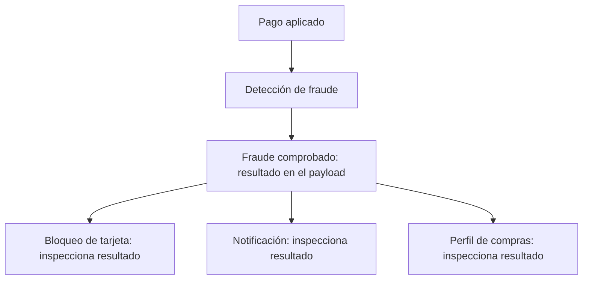
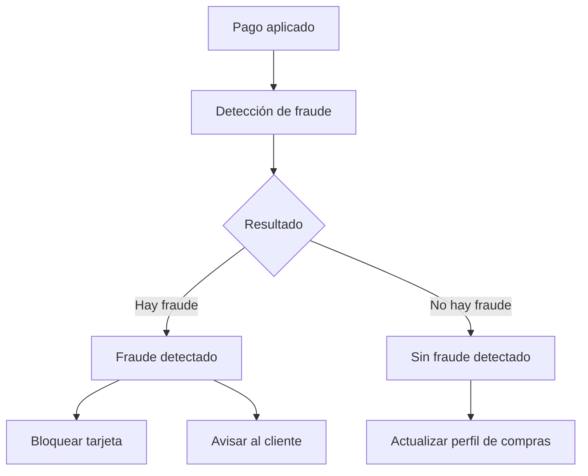

[[Obsidian/lecturas/Fundamentals of Software Architecture/15 Arquitectura dirigida por eventos/00 Índice|Índice del capítulo 15]]

# Payload y granularidad de eventos

Un evento útil cuenta qué ocurrió y aporta el contexto suficiente para que sus consumidores decidan y actúen. Hay dos decisiones distintas: **qué información viaja dentro del evento** y **cuántos eventos representan una acción del negocio**. El capítulo conecta ambas, pero no las confunde. Un evento puede estar bien nombrado y llevar muy pocos datos; también puede llevar todos los datos necesarios y formar parte de una cascada innecesariamente fragmentada.

## El contenido y el tamaño de la acción son dos dimensiones

El **payload** es el cuerpo de datos del evento. Su granularidad indica cuánto detalle incluye. La **granularidad del evento** indica qué tamaño de hecho de negocio representa su nombre y su emisión. `perfil_actualizado` puede contener cambios en tres campos, mientras que tres eventos separados pueden representar cada cambio individualmente.

La nota anterior desarrolla los eventos anémicos: eventos con contexto insuficiente. El caso del libro es un perfil actualizado cuyo mensaje solo contiene el identificador del cliente. Los consumidores desconocen qué cambió, si deben actuar y cuáles eran los valores anteriores. Consultar la base después puede recuperar el estado actual, pero no necesariamente reconstruir el anterior ni el cambio exacto que originó el evento.

| Diseño del payload | Qué permite | Qué problema puede crear |
|---|---|---|
| Solo identificador | Identificar la entidad afectada | Obliga a consultar contexto y puede perder la historia del cambio |
| Datos relevantes del cambio | Entender y procesar ese hecho | Exige definir un contrato explícito |
| Objeto completo con todo su estado | Muchas consultas posteriores dejan de ser necesarias | Acopla a consumidores con una estructura mayor de la que requieren |

El libro presenta estos extremos como un espectro. Enviar todo favorece el **stamp coupling**, acoplamiento por compartir estructuras compuestas: los servicios pueden terminar dependiendo de un objeto grande aunque solo usen una fracción. Enviar demasiado poco crea consumidores dependientes de consultas posteriores. La solución para la actualización de perfil es transmitir la información modificada y sus valores previos cuando estos sean relevantes.

## Ejemplo del libro: un resultado demasiado general

Después de registrar un pedido, el servicio de pagos cobra la tarjeta y publica un pago aplicado. Detección de fraude analiza el cargo. Una primera propuesta publica siempre `fraud_checked`, con un campo que dice si encontró fraude.

Tres consumidores reciben ese mismo tipo de evento. Bloqueo de tarjeta y Notificación al cliente solo tienen trabajo si hubo fraude; Perfil de compras solo tiene trabajo si no hubo fraude. Cada uno debe recibir el mensaje y examinar el resultado para decidir si lo ignora. El nombre del evento no permite distinguir los dos desenlaces.

Las tres flechas finales significan tres entregas o rutas de consumo aunque solo parte de los destinatarios tenga una acción útil. El trabajo adicional incluye transportar mensajes, interpretar su contenido y descartarlos. El problema descrito no es que comprobar fraude sea una mala operación; es que el evento mezcla resultados con destinatarios diferentes.

El libro propone dos tipos: `fraud_detected` y `no_fraud_detected`. No publica ambos para un cargo: **publica el correspondiente a su resultado**. Los consumidores se suscriben al desenlace que les interesa.

El resultado queda expresado en el tipo de evento. Bloqueo y Notificación reciben el hecho que requiere intervención; Perfil recibe el hecho que le permite actualizar sus algoritmos. El contrato todavía necesita datos del cargo o del cliente, pero desaparece la decisión repetida de averiguar si ese tipo de resultado le corresponde.

## Ejemplo del libro: demasiados eventos pequeños

El extremo contrario recibe el nombre **Swarm of Gnats**, enjambre de pequeños insectos. Un cliente se muda y cambia conjuntamente su dirección de facturación, dirección de envío y teléfono. El servicio actualiza el perfil y emite tres eventos: dirección de facturación actualizada, dirección de envío actualizada y teléfono actualizado.

El problema es que una única intención del usuario se fragmenta en muchas notificaciones técnicas. Si cada consumidor vuelve a generar eventos pequeños, el flujo crece, usa más recursos y se vuelve difícil de comprender. Además, un consumidor que necesite el cambio completo puede tener que reconstruirlo a partir de mensajes que no necesariamente llegan juntos.

La propuesta del libro es un evento `profile_updated` con los valores anteriores y posteriores de los campos modificados. Así el nombre representa el resultado de la acción completa, mientras el payload conserva el detalle para que cada consumidor haga su trabajo.

La comparación separa el detalle de los datos del número de eventos emitidos. Agrupar la actualización de perfil reduce la fragmentación sin borrar qué campos cambiaron. Dividir el resultado del análisis de fraude, en cambio, mejora las rutas porque los desenlaces conducen a acciones distintas. Ambas decisiones responden a la semántica del negocio.

## Por qué no existe una regla de un evento por campo

El criterio recomendado es centrar el evento en el **resultado del procesamiento o cambio de estado**. Un campo de una tabla no equivale necesariamente a un hecho relevante para el negocio. Pero tampoco conviene agrupar resultados distintos solo porque los calcula el mismo servicio.

Como elaboración propia, imagina un pedido que cambia de dirección y luego se cancela. `direccion_de_entrega_actualizada` y `pedido_cancelado` representan hechos distintos con implicaciones diferentes; juntarlos en un genérico `pedido_modificado` puede exigir a todos los consumidores inspeccionar una lista de cambios. En cambio, fragmentar una dirección en calle, número, ciudad y código postal normalmente destruye una unidad de información que se necesita completa.

Una pregunta útil es: **¿este consumidor puede decidir su interés por el tipo de hecho, y puede ejecutar su responsabilidad con el contexto incluido?** La primera parte ayuda a nombrar y separar eventos; la segunda ayuda a definir su payload. Una tercera pregunta evalúa si una sola acción produce una cantidad de eventos que complica innecesariamente el sistema.

> [!question]- ¿Dividir fraude comprobado en dos tipos contradice agrupar cambios del perfil?
> No. Fraude tiene dos desenlaces con acciones y consumidores diferentes. Los tres cambios del perfil forman parte del mismo resultado de actualización. El criterio no es contar campos ni perseguir siempre mensajes pequeños: es expresar hechos útiles con el contexto necesario.

> [!question]- ¿Un evento con solo una clave siempre está mal?
> No. El libro admite que puede tener sentido para ciertas creaciones o eliminaciones. Es insuficiente cuando el consumidor necesita conocer el cambio o el estado anterior y no puede recuperarlo de forma fiable. La evaluación depende de la responsabilidad concreta del consumidor.

> [!question]- ¿Todos los datos anteriores deben publicarse por costumbre?
> No. El objetivo es incluir contexto relevante para el cambio. Publicar datos ajenos a las responsabilidades de los consumidores aumenta el contrato y el acoplamiento. La selección del payload debe explicarse por el uso que permite.

**Fuente:** PDF 20–23 · impresas 246–249 · figuras 15-13 a 15-17. [[Obsidian/lecturas/Fundamentals of Software Architecture/Materiales/12 Arquitectura dirigida por eventos.pdf#page=20|Consultar el escaneo]].

← [[Obsidian/lecturas/Fundamentals of Software Architecture/15 Arquitectura dirigida por eventos/06 Contratos acoplamiento y eventos anémicos|Anterior]] · [[Obsidian/lecturas/Fundamentals of Software Architecture/15 Arquitectura dirigida por eventos/08 Errores asíncronos y Workflow Event|Siguiente]] →
