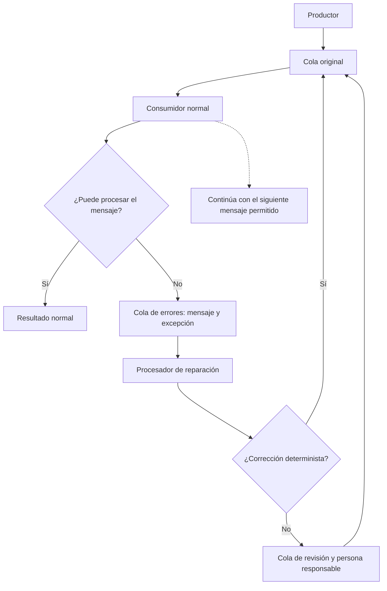
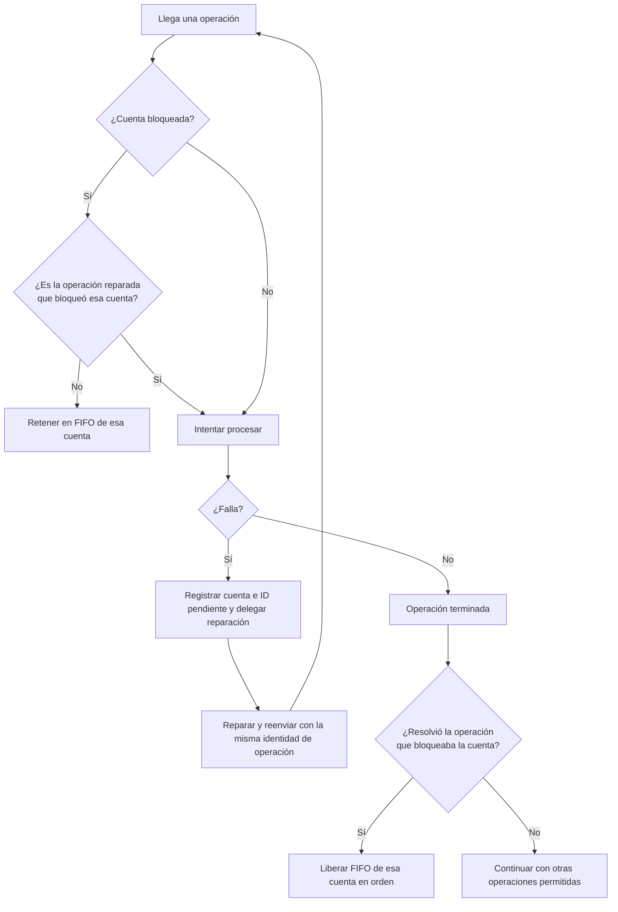

[[Obsidian/lecturas/Fundamentals of Software Architecture/15 Arquitectura dirigida por eventos/00 Índice|Índice del capítulo 15]]

# Errores asíncronos y Workflow Event

En un intercambio síncrono, quien envió la solicitud todavía puede estar esperando una respuesta. Cuando ocurre un error, el sistema puede devolverlo a ese interlocutor. En un flujo asíncrono, el productor puede haber continuado hace tiempo y no existe necesariamente una persona esperando para corregir el mensaje. Registrar una excepción permite investigar, pero **registrar el error no repara el trabajo pendiente**.

El patrón **Workflow Event** del libro separa el procesamiento normal del trabajo de diagnóstico y reparación. Su objetivo es conservar la capacidad de responder del consumidor mientras el sistema gestiona mensajes problemáticos. No convierte un dato inválido en válido automáticamente: crea un camino específico para tratarlo.

## Delegación, contención y reparación

**Delegar** significa enviar el mensaje fallido y la información del error a un procesador especializado. **Contener** significa impedir que ese problema detenga indiscriminadamente el resto del flujo. **Reparar** significa corregir un defecto identificable y reenviar el mensaje al canal original para que el consumidor normal vuelva a procesarlo.

El regreso a la cola original permite que la lógica de negocio siga residiendo en el consumidor que ya conoce esa responsabilidad. El reparador modifica o devuelve el mensaje; no duplica toda la ejecución del servicio principal. La ruta humana existe porque algunos errores no se pueden interpretar con seguridad mediante reglas automáticas.

En el patrón del libro, el consumidor delega enseguida y toma el siguiente mensaje. Si se quedara investigando, retrasaría ese siguiente mensaje y todos los demás que esperan detrás. El beneficio se produce precisamente al sacar el diagnóstico del camino crítico del consumidor, aunque la operación afectada tarde más en terminar.

## El ejemplo completo del libro: órdenes de compra de acciones

Un asesor prepara un lote de instrucciones de compra y las envía de forma asíncrona a una firma que las procesa. El contrato contiene cuatro campos: cuenta, operación, símbolo de la acción y cantidad. Los tres primeros son cadenas y la cantidad debe poder interpretarse como un número entero largo.

Las instrucciones del ejemplo compran AAPL. Las cantidades son 1254, 3122, 5433, **8756 SHARES**, 1211 y 2654. La cuarta instrucción añade la palabra `SHARES` en el campo numérico. El servicio intenta convertir la cadena completa a un número y obtiene una excepción `NumberFormatException`.

| Elemento | Qué ocurre |
|---|---|
| Dato esperado | Un entero como `8756` |
| Dato recibido | La cadena `8756 SHARES` |
| Fallo | La conversión numérica no acepta la palabra adicional |
| Información que se delega | Instrucción original más detalles de la excepción |
| Reparación del ejemplo | Retirar la palabra conocida del campo |
| Reenvío | Devolver la instrucción con `8756` a la cola original |

El ejemplo enseña que el consumidor puede procesar las instrucciones correctas, delegar la cuarta y continuar con las siguientes. El reparador reconoce que el defecto es el sufijo textual, lo elimina y reenvía la orden. Cuando vuelve a llegar, el servicio puede interpretarla y ejecutarla.

Es una corrección determinista dentro de ese contrato: no se inventa la cantidad ni se decide una operación distinta. Como precisión práctica propia, una regla de reparación debería comprobar exactamente el formato autorizado antes de modificar el dato. El patrón no justifica adivinar números, símbolos o intenciones ante entradas ambiguas.

La ruta de reparación se aparta del procesamiento principal y vuelve a incorporarse al canal original. Ese desvío explica tanto la mejora en capacidad de respuesta como su principal consecuencia: el mensaje reparado puede regresar cuando otros mensajes posteriores ya terminaron.

## La consecuencia que no debe pasarse por alto: cambia el orden

Supón, como ejemplo propio, que la cola contiene A, B y C. A y C son válidos; B requiere reparación. Si el consumidor sigue trabajando, el orden de terminación puede ser A, C, B. Conservar el mensaje y repararlo no equivale a conservar la secuencia de sus efectos.

En las operaciones bursátiles del libro, el orden dentro de una cuenta sí puede importar: una venta de IBM debe preceder a una compra de AAPL en esa misma cuenta. Si la venta se desvía para reparación y la compra continúa, el sistema puede violar una dependencia de negocio.

El libro propone mantener el identificador de la cuenta afectada y retener sus operaciones posteriores en una cola temporal FIFO. **FIFO** significa primero en entrar, primero en salir. Cuando la operación defectuosa se corrige y termina, el servicio libera las operaciones retenidas de esa cuenta en su secuencia original.

La operación reparada conserva su identidad original y recibe permiso para ejecutarse aunque su cuenta esté bloqueada: es precisamente el trabajo cuya resolución permite liberar la FIFO. Las operaciones posteriores de esa cuenta permanecen retenidas hasta que ese resultado sea confirmado.

El bloqueo corresponde al contexto que necesita orden, no necesariamente a toda la plataforma. Una cuenta problemática puede detener sus propias operaciones mientras otras cuentas siguen avanzando. La decisión convierte una dependencia global costosa en una restricción localizada, pero requiere registrar y recuperar ese estado correctamente.

## Qué añade una implementación real

Como elaboración propia, conviene mantener el identificador de la operación original, el motivo del error, el número de intentos y la relación entre el mensaje defectuoso y su reparación. Sin un límite de reintentos, una supuesta corrección puede crear un bucle: fallar, reparar, reenviar y fallar de nuevo indefinidamente.

También debe distinguirse un formato inválido de un fallo transitorio. Una indisponibilidad temporal no se resuelve alterando el dato. Y si el consumidor alcanzó a producir un efecto antes de fallar, reenviar exige evitar ejecutar ese efecto dos veces. Esa propiedad se llama **idempotencia** y se conecta con la siguiente nota sobre entrega fiable.

> [!question]- ¿Por qué no basta con escribir el error en un log?
> Porque el mensaje sigue sin cumplir su finalidad. El log ofrece evidencia, pero necesita una ruta de recuperación para que el trabajo se repare, se reintente o llegue a una persona responsable.

> [!question]- ¿El consumidor puede continuar siempre con cualquier mensaje?
> No. Si las operaciones posteriores dependen de la fallida, deben retenerse dentro del contexto que necesita orden. El ejemplo del libro utiliza la cuenta de corretaje como ese contexto.

> [!question]- ¿Delegar errores conserva la latencia de la operación fallida?
> No. Conserva la capacidad del consumidor de atender otros mensajes. La operación afectada incorpora el tiempo de diagnóstico, reparación y reenvío, y puede tardar considerablemente más.

**Fuente:** PDF 23–26 · impresas 249–252 · figuras 15-18 y 15-19. [[Obsidian/lecturas/Fundamentals of Software Architecture/Materiales/12 Arquitectura dirigida por eventos.pdf#page=23|Consultar el escaneo]].

← [[Obsidian/lecturas/Fundamentals of Software Architecture/15 Arquitectura dirigida por eventos/07 Payload y granularidad de eventos|Anterior]] · [[Obsidian/lecturas/Fundamentals of Software Architecture/15 Arquitectura dirigida por eventos/09 Evitar la pérdida de eventos|Siguiente]] →
