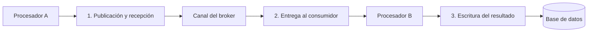
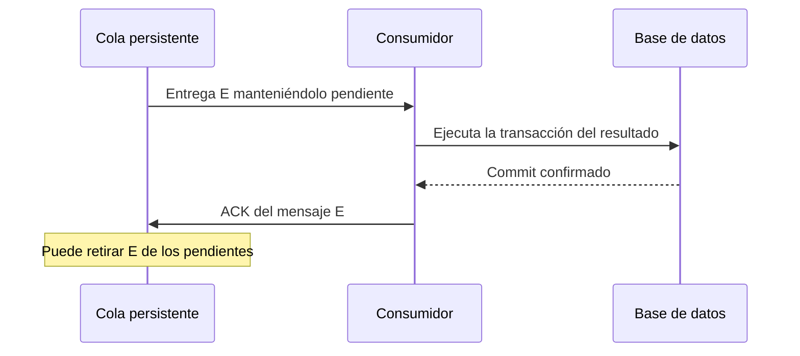

[[Obsidian/lecturas/Fundamentals of Software Architecture/15 Arquitectura dirigida por eventos/00 Índice|Índice del capítulo 15]]

# Evitar la pérdida de eventos

Un evento puede perderse sin que nadie haya escrito una línea que diga «descartarlo». Basta con que falle un componente entre dos momentos en los que distintos participantes asumen quién es responsable del mensaje. Para razonar sobre fiabilidad, la pregunta útil es: **si el proceso se apaga ahora mismo, ¿dónde queda una copia recuperable y quién sabe que el trabajo continúa pendiente?**

El capítulo presenta un productor A, un canal de mensajería, un consumidor B y una base de datos. A publica un evento; B debe procesarlo y guardar el resultado. No basta con proteger el broker: también hay que proteger la entrega y la escritura final.

## Tres zonas de pérdida del ejemplo

La primera zona incluye un productor que cae antes de confirmar el envío, o un broker que acusa recepción y después pierde el mensaje antes de entregarlo. La segunda aparece cuando B recibe el mensaje y cae antes de completar el procesamiento. La tercera aparece cuando B procesa, pero no consigue persistir el resultado. Cada frontera cambia quién debería conservar el trabajo pendiente.

| Zona | Riesgo descrito | Mecanismo del libro |
|---|---|---|
| Productor → broker | Publicación incompleta o mensaje solo en memoria | Envío con confirmación y cola persistente |
| Broker → consumidor | Retirar el mensaje antes de terminar el trabajo | Acknowledgment explícito del cliente |
| Consumidor → base | Fallo o inconsistencia al guardar el resultado | Transacción ACID y coordinación con la confirmación |

## 1. Persistencia y confirmación del envío

Una **cola persistente** guarda los mensajes en almacenamiento recuperable, en lugar de depender únicamente de la memoria del broker. Si el broker reinicia, puede volver a cargar lo que quedó almacenado. La persistencia reduce una clase concreta de pérdida: la desaparición del contenido al caer el proceso que lo tenía en memoria.

El **envío síncrono** mencionado por el libro significa que la llamada del productor espera hasta que el broker confirme la persistencia. Aunque el sistema de negocio sea asíncrono, esa llamada particular al broker puede bloquear brevemente. El productor no debe interpretar como éxito una publicación cuyo resultado desconoce.

Una precisión práctica es necesaria: esperar una confirmación no conserva por sí solo un evento si el productor cae antes de que llegue al broker. El texto afirma que el evento está todavía en el productor o persistido en la cola, pero «estar en el productor» solo es recuperable si también existe una estrategia de durabilidad o regeneración. Una variable en memoria desaparece al reiniciar. Las notas no interpretan esa frase como una garantía universal.

Como ampliación propia, un **outbox transaccional** registra el cambio de negocio y un evento pendiente en la misma transacción local. Otro proceso publica lo pendiente y marca su envío. Esto responde a la pregunta de dónde queda el mensaje cuando el productor cae, aunque requiere controlar publicaciones repetidas y no aparece desarrollado en estas páginas.

## 2. Recibir no significa haber terminado

Un **acknowledgment**, abreviado ACK, es una confirmación explícita. Con el modo que el libro llama auto-acknowledge, el mensaje puede retirarse cuando se entrega al consumidor. Si B falla inmediatamente después, ya no existe una copia pendiente en la cola para recuperarlo.

Con **client acknowledge**, el broker conserva el mensaje pendiente mientras B trabaja. Si B cae sin confirmar, el mensaje puede volver a estar disponible para entrega. Así la confirmación representa el trabajo terminado, en lugar del simple hecho de haber leído un mensaje.

El ACK ocurre después de confirmar la escritura. Si se enviara antes, una caída entre la confirmación y la escritura dejaría el trabajo perdido desde la perspectiva del broker. Retener el mensaje durante el procesamiento introduce la posibilidad de volver a entregarlo, lo que es preferible a perderlo, pero exige razonar sobre duplicados.

## 3. La base de datos y la confirmación son dos sistemas

Una transacción **ACID** agrupa operaciones con atomicidad, consistencia, aislamiento y durabilidad. La atomicidad permite que una escritura parcial se deshaga; la durabilidad permite recuperar lo confirmado bajo las garantías del sistema de almacenamiento. Una entrada inválida no se convierte en correcta por usar ACID: la transacción puede fallar y el mensaje sigue necesitando una ruta de error.

El libro menciona **Last Participant Support**, LPS, como mecanismo para coordinar la transacción con la retirada del mensaje. El propósito es cerrar la separación entre «resultado persistido» y «mensaje confirmado». Esta coordinación depende del soporte del broker, del gestor transaccional y de la base. No basta con poner un `commit` y un ACK consecutivos para crear atomicidad entre sistemas diferentes.

Cada protección corresponde a una frontera distinta. La persistencia ayuda antes de la entrega; el ACK tardío conserva la posibilidad de reentrega mientras trabaja el consumidor; la transacción protege el resultado local. El conjunto necesita una estrategia explícita para los intervalos entre esas operaciones.

## Evitar pérdidas puede permitir duplicados

Como elaboración propia, supón que B guarda correctamente una factura y cae antes de que su ACK llegue al broker. El broker vuelve a entregar el evento porque todavía figura pendiente. Si B crea otra factura, el sistema no perdió el mensaje, pero duplicó su efecto.

La **idempotencia** significa que volver a ejecutar una misma operación identificada no vuelve a producir su efecto de negocio. Una tabla de eventos ya procesados, una restricción única por identificador de operación o una actualización cuidadosamente diseñada pueden ayudar, según el dominio. Cuando se usa un registro de eventos procesados, registrar el identificador y ejecutar el efecto deben formar parte de la misma transacción local: registrar antes y caer puede omitir el efecto; registrar después y caer puede repetirlo. Lo importante es que la recuperación de entrega y la protección contra efectos duplicados son responsabilidades diferentes.

La documentación de RabbitMQ distingue las confirmaciones de publicación y los ACK del consumidor: cubren tramos independientes y no prueban que el efecto de negocio haya ocurrido exactamente una vez. También describe posibles reentregas y la necesidad de manejar duplicados. [Fiabilidad de RabbitMQ](https://www.rabbitmq.com/docs/reliability), [confirmaciones y acknowledgments](https://www.rabbitmq.com/docs/4.1/confirms).

El outbox explicado arriba es una ampliación respaldada por el patrón descrito por AWS: guardar el cambio y el mensaje pendiente en una misma transacción reduce el riesgo de separar la escritura de negocio de la publicación. [Patrón transactional outbox](https://docs.aws.amazon.com/prescriptive-guidance/latest/cloud-design-patterns/transactional-outbox.html).

## Broadcast, suscripciones durables y streaming

El capítulo cita implementaciones AMQP en las que un exchange distribuye una publicación a las colas de los suscriptores según reglas de enlace. Cada consumidor interesado necesita su ruta de entrega. En Jakarta Messaging/JMS, los tópicos permiten difusión y las **suscripciones durables** retienen los mensajes del suscriptor mientras este está temporalmente desconectado, dentro de las garantías y configuración del sistema.

El libro también señala que Kafka usa otra forma de streaming y que las técnicas deben evaluarse para esa implementación concreta. No se debe trasladar literalmente «retirar de la cola al hacer ACK» a cualquier plataforma: distintos brokers representan el progreso y la conservación de formas diferentes.

> [!question]- ¿Una cola persistente resuelve todos los fallos?
> No. Protege una copia almacenada en el broker. No repara un mensaje inválido, no conserva un evento que nunca llegó y no asegura que el consumidor haya terminado su escritura.

> [!question]- ¿Por qué confirmar después del commit puede duplicar trabajo?
> Porque una caída en ese intervalo deja el resultado guardado y el mensaje pendiente. Al recuperarse, puede repetirse la entrega. El consumidor debe reconocer la operación ya ejecutada o coordinar transaccionalmente ambos efectos.

> [!question]- ¿Entrega al menos una vez significa efecto exactamente una vez?
> No. La primera describe la posibilidad de recibir mensajes repetidos. La segunda requiere que la aplicación y su almacenamiento impidan repetir el efecto de negocio dentro de las garantías que realmente ofrecen.

**Fuente:** PDF 27–29 · impresas 253–255 · figuras 15-20 y 15-21. [[Obsidian/lecturas/Fundamentals of Software Architecture/Materiales/12 Arquitectura dirigida por eventos.pdf#page=27|Consultar el escaneo]]. Las precisiones sobre outbox, idempotencia y límites de las garantías son elaboración explicativa propia.

← [[Obsidian/lecturas/Fundamentals of Software Architecture/15 Arquitectura dirigida por eventos/08 Errores asíncronos y Workflow Event|Anterior]] · [[Obsidian/lecturas/Fundamentals of Software Architecture/15 Arquitectura dirigida por eventos/10 Request-reply y correlación|Siguiente]] →
