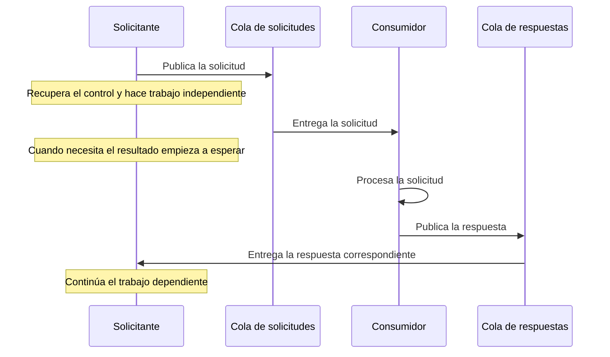
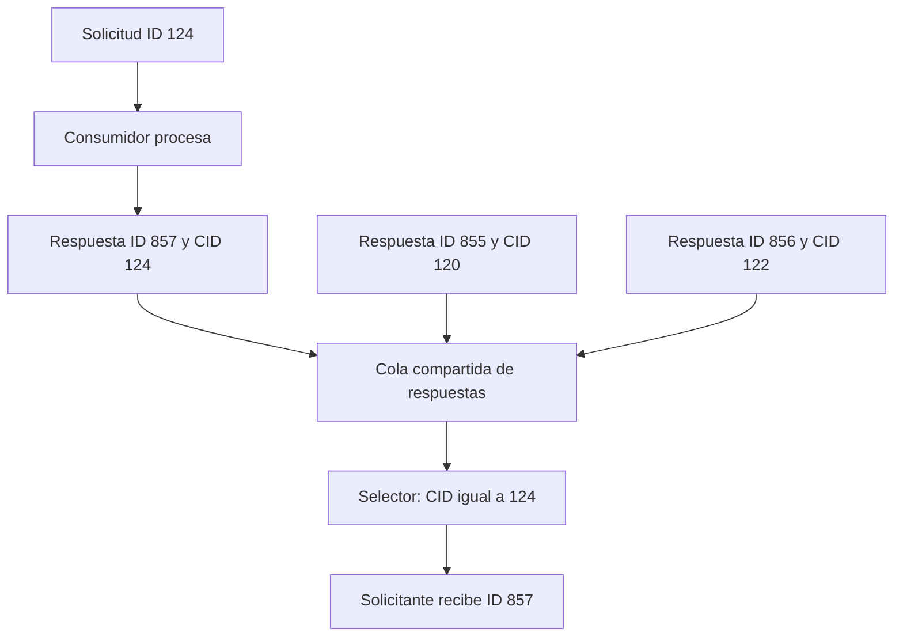
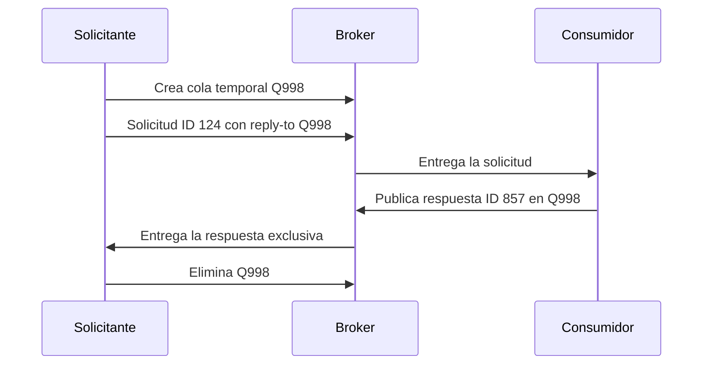

[[Obsidian/lecturas/Fundamentals of Software Architecture/15 Arquitectura dirigida por eventos/00 Índice|Índice del capítulo 15]]

# Request-reply y correlación

Una arquitectura dirigida por eventos puede necesitar una respuesta antes de continuar. Por ejemplo, un procesador necesita recibir un identificador de confirmación antes de publicar un siguiente hecho. La arquitectura sigue usando canales de mensajería, pero esa operación concreta contiene una dependencia de respuesta: no puede terminar solo con «envié el mensaje».

**Request-reply** significa solicitud y respuesta. El libro también lo llama comunicación seudosíncrona: el transporte usa mensajes asíncronos, pero el solicitante termina esperando un resultado. La clave es separar cómo viaja la información de cuándo la aplicación puede continuar con el trabajo que depende de ella.

## Dos colas con responsabilidades diferentes

Una cola transporta solicitudes hacia el consumidor. Otra transporta respuestas hacia el solicitante original. Tras publicar, el solicitante puede ejecutar trabajo independiente. Cuando necesita el resultado, espera en la cola de respuestas. El consumidor procesa la solicitud y publica allí un mensaje nuevo que contiene la respuesta.

Las dos colas separan los sentidos del intercambio. El retorno inmediato después de publicar no es todavía la respuesta de negocio. El consumidor puede tardar en recibir o procesar la solicitud y, hasta que llegue el resultado, el solicitante no puede ejecutar la parte que depende de él.

Este patrón introduce acoplamiento temporal: aunque los servicios no mantengan una conexión directa entre sí, el éxito de la operación solicitante depende de recibir una respuesta a tiempo. Añadir un broker no elimina esa dependencia; cambia el mecanismo que la implementa.

## Primera implementación del libro: correlation ID

Una cola de respuestas compartida puede contener resultados de muchas solicitudes. ¿Cómo sabe el solicitante cuál le pertenece? Mediante un **identificador de correlación**, o CID: un dato de cabecera que relaciona la respuesta con la solicitud que la originó.

El libro utiliza estos números concretos. La solicitud tiene ID `124` y CID vacío. El solicitante recuerda `124` y espera una respuesta cuyo CID sea `124`. En la cola ya hay dos respuestas: mensaje `855` con CID `120` y mensaje `856` con CID `122`. Ambas son resultados de otras solicitudes; ninguna debe entregarse a esta espera.

El consumidor procesa la solicitud `124`, crea una respuesta nueva con ID `857` y asigna CID `124`. La respuesta tiene su propio identificador porque es otro mensaje. Lo que la une a la solicitud es el CID, no la igualdad entre los IDs de ambos mensajes.

| Mensaje | ID propio | CID | Significado para la espera de la solicitud 124 |
|---|---:|---:|---|
| Solicitud original | 124 | Vacío | El solicitante guarda este ID |
| Respuesta ajena | 855 | 120 | No coincide |
| Respuesta ajena | 856 | 122 | No coincide |
| Respuesta esperada | 857 | 124 | Coincide y permite continuar |

El selector expresa qué respuesta acepta esa espera. Los mensajes con otro CID siguen perteneciendo a otros intercambios. La correlación impide que una respuesta válida para un cliente resuelva accidentalmente la operación de otro cliente.

La página impresa 257 contiene un pequeño desliz: al describir la selección dice que es lo que busca el *event consumer*, pero en ese paso quien espera y selecciona la respuesta es el productor o solicitante original. El flujo y la figura permiten identificar la responsabilidad correcta.

## Segunda implementación: cola temporal

La otra opción crea una cola de respuesta exclusiva para una solicitud. En el ejemplo, el solicitante crea `Q998` y publica la solicitud `124` con una cabecera `reply-to` que contiene ese nombre. El consumidor procesa la solicitud y envía la respuesta a `Q998`. Tras recibirla, el solicitante elimina la cola temporal.

**Reply-to** responde a la pregunta «¿a qué destino debo enviar el resultado?». CID responde a otra: «¿a qué solicitud corresponde este resultado?». Son responsabilidades distintas aunque puedan aparecer juntas en un contrato.

Como esa cola está dedicada a una única solicitud, no hace falta filtrar por CID para encontrar su respuesta. El aislamiento se obtiene mediante el destino exclusivo. El libro considera esta implementación más sencilla, pero señala el coste de crear y eliminar colas por cada intercambio, sobre todo con mucha concurrencia.

La figura 15-24 muestra un CID en una caja final aunque la explicación dice correctamente que este método no lo necesita. Ese rótulo no convierte la correlación en una condición del método: la pertenencia se reconoce por la cola temporal de esa solicitud.

El gráfico representa el método con correlación: la solicitud lleva ID 124 y la respuesta tiene ID 857 con CID 124. El circuito de ida y vuelta permite reconocer el resultado esperado aunque su ID sea distinto. Frente a una cola exclusiva por solicitud, este método reutiliza la infraestructura y necesita relacionar los mensajes; el libro lo recomienda generalmente para grandes volúmenes.

## Esperar también necesita una política

Como elaboración propia, toda espera debe tener un límite y una política de resultado incierto. Si no llega la respuesta, no se puede concluir automáticamente que el consumidor no ejecutó la solicitud: pudo ejecutarla y fallar al responder, o la respuesta pudo retrasarse. Repetir una orden de cobro ante un timeout puede duplicar el efecto si no existe una identidad estable e idempotencia.

Tampoco deben confundirse tres confirmaciones: el broker aceptó la solicitud, el consumidor la recibió y el consumidor devolvió su resultado de negocio. Para terminar una operación que necesita un identificador de confirmación, la primera no sustituye a la tercera.

> [!question]- ¿El ID de la respuesta debe ser el mismo ID de la solicitud?
> No. En el ejemplo, la solicitud es 124 y la respuesta 857. El CID de la respuesta es 124, y esa es la relación que permite encontrarla.

> [!question]- ¿Usar colas convierte la operación en completamente asíncrona?
> No. La publicación puede devolver el control, pero el trabajo dependiente termina esperando una respuesta. La comunicación usa mensajes y la operación tiene una dependencia de sincronización.

> [!question]- ¿Por qué la cola temporal no necesita selector?
> Porque cualquier respuesta dirigida a esa cola pertenece al intercambio exclusivo para el que se creó. Eso exige que el diseño conserve realmente esa exclusividad durante todo su ciclo de vida.

**Fuente:** PDF 30–32 · impresas 256–258 · figuras 15-22 a 15-24. [[Obsidian/lecturas/Fundamentals of Software Architecture/Materiales/12 Arquitectura dirigida por eventos.pdf#page=30|Consultar el escaneo]]. Las políticas de timeout y resultado incierto son ampliación propia.

← [[Obsidian/lecturas/Fundamentals of Software Architecture/15 Arquitectura dirigida por eventos/09 Evitar la pérdida de eventos|Anterior]] · [[Obsidian/lecturas/Fundamentals of Software Architecture/15 Arquitectura dirigida por eventos/11 Topología mediadora y selección del mediador|Siguiente]] →
