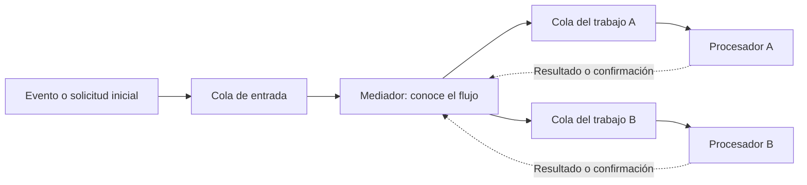
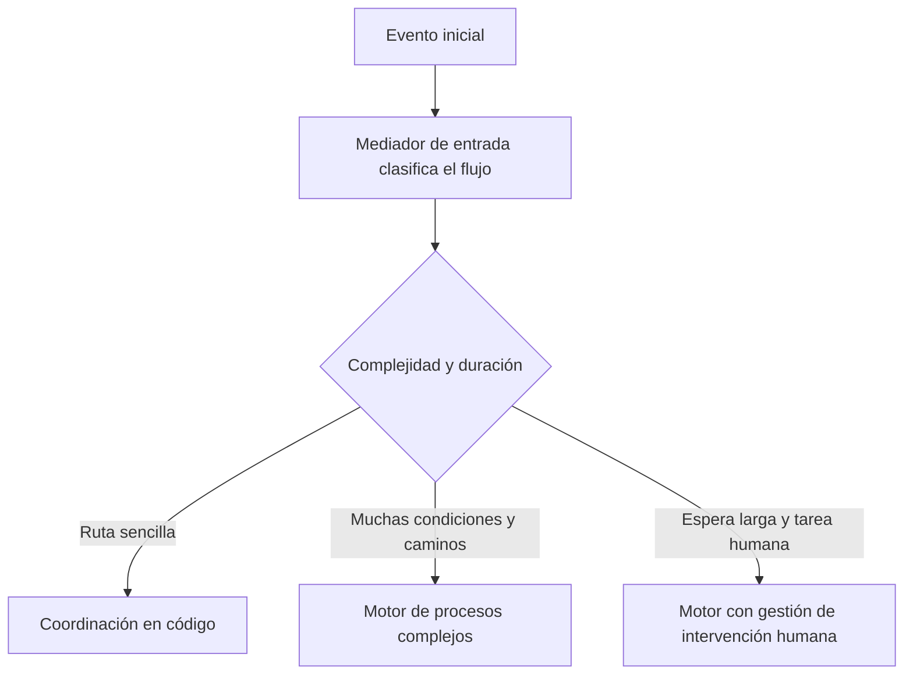

[[Obsidian/lecturas/Fundamentals of Software Architecture/15 Arquitectura dirigida por eventos/00 Índice|Índice del capítulo 15]]

# Topología mediadora y selección del mediador

En la coreografía, cada procesador responde a hechos publicados y genera nuevos hechos cuando termina. El flujo completo surge de esas reacciones. Si necesitas controlar explícitamente qué debe ocurrir primero, qué tareas pueden ejecutarse en paralelo y cuándo una operación completa termina, el libro propone la **topología mediadora**.

Un **mediador de eventos** coordina el flujo de trabajo. Recibe el evento inicial, decide los pasos necesarios, envía mensajes a procesadores concretos y recibe sus resultados. El mediador conoce la secuencia y las dependencias; los procesadores conservan la responsabilidad de ejecutar el trabajo especializado.

## Los cinco elementos de la topología

El capítulo enumera el evento inicial, una cola de entrada, el mediador, los canales y los procesadores. El evento inicial activa una instancia del flujo. La cola permite entregarlo al mediador. Los canales transportan los encargos particulares a los procesadores correspondientes.

Las líneas de ida representan encargos dirigidos. Las líneas de regreso representan resultados que permiten al mediador saber qué trabajo terminó. Una cola por responsabilidad expresa una ruta punto a punto; el modelo no depende de que todos los procesadores reciban cada encargo.

## En este flujo suelen viajar comandos

Aunque el estilo se llame dirigido por eventos, el libro aclara que los mensajes derivados de la topología mediadora suelen ser **comandos**. Un comando pide hacer algo, como `ship_order`: «envía el pedido». Un evento informa de algo ya sucedido, como `order_shipped`: «el pedido fue enviado».

La diferencia afecta a la autoridad del emisor. Publicar un evento permite que los consumidores decidan qué hacer frente al hecho. Enviar un comando dirigido expresa una tarea que el coordinador espera que un destinatario ejecute. Por eso en esta topología el mediador necesita interpretar el resultado y decidir la continuación.

| Pregunta | Coreografía | Mediación |
|---|---|---|
| ¿Quién conoce el proceso completo? | No necesariamente existe un coordinador único | El mediador lo modela |
| ¿Qué suele publicarse tras el trabajo? | Un evento derivado para interesados | Un resultado al mediador |
| ¿Quién decide el siguiente paso? | Los consumidores según hechos recibidos | El coordinador según su estado y reglas |
| ¿Cómo se expresan tareas paralelas? | Por reacciones independientes | El mediador las inicia y espera sus resultados |

En la topología descrita por el libro, los procesadores no anuncian cada resultado al resto del sistema mediante una cadena adicional de eventos derivados. Responden al mediador. Una arquitectura real puede combinar ambos mecanismos, pero primero hay que comprender esta forma de coordinación por sí misma.

## El mediador no ejecuta todo el negocio

Que conozca los pasos no significa que deba implementar pagos, preparación de paquetes, inventario y transporte en una sola clase. El mediador sabe que para avanzar necesita, por ejemplo, pago aceptado e inventario ajustado. Los especialistas saben cómo realizar cada una de esas operaciones.

Como ejemplo propio, un coordinador de matrícula puede pedir validar documentos, comprobar cupo y registrar pago. El servicio de documentos interpreta sus requisitos, el de cupos administra disponibilidad y el de pagos procesa el cobro. El mediador gestiona la relación entre los resultados y el estado de la matrícula. Si además absorbiera toda esa lógica, la coordinación se convertiría en una concentración innecesaria de responsabilidades.

## Qué tipo de mediador necesita cada flujo

El libro distingue complejidades y menciona tecnologías como ejemplos de la edición, no como una comparación actual de productos. Para rutas sencillas y manejo de errores limitado, cita Apache Camel, Mule ESB y Spring Integration. En este nivel, el flujo puede programarse en código mediante rutas y reglas relativamente directas.

Para numerosos caminos condicionales, procesamiento dinámico y directivas de error complejas, cita mediadores basados en **BPEL**, Business Process Execution Language, como Apache ODE u Oracle BPEL Process Manager. BPEL describe procesos en un lenguaje basado en XML y elementos para decisiones, errores y ejecución de tareas. El libro advierte que aprender y gestionar esta representación también tiene coste.

Para procesos largos con intervención humana, presenta un motor **BPM**, Business Process Management. Su ejemplo es una operación de acciones cuya cantidad exige aprobación de un operador sénior. El flujo debe detenerse, notificar al responsable y esperar esa decisión. La duración y la tarea humana cambian el tipo de estado que hay que conservar y gestionar.

La clasificación evita forzar todos los procesos a una misma herramienta. Un motor muy elaborado puede añadir meses de esfuerzo a un flujo simple; código de rutas básico puede ser difícil de mantener cuando la operación necesita pausas durables, aprobaciones y recuperaciones complejas. La adecuación depende del flujo, no del prestigio de una tecnología.

La figura 15-26 plantea un **modelo de delegación**: una entrada común examina la complejidad y atiende lo sencillo o delega el evento original al mediador correspondiente. El mediador inicial puede conservar la responsabilidad de informar que todo terminó, o delegar también esa notificación. Hay que decidir quién posee esa responsabilidad para no tener dos participantes esperando que el otro cierre el proceso.

## Distribuir mediadores por dominio

El capítulo menciona un mediador de clientes para registros y cambios de perfil, y un mediador de pedidos para compras y operaciones del carrito. Distribuir responsabilidades reduce la concentración de carga y evita que todas las operaciones dependan del mismo coordinador lógico.

Es importante precisar una frase del libro: tener varios mediadores de dominios distintos **no elimina por sí solo el punto único de fallo de cada dominio**. Si pedidos solo tiene una instancia sin recuperación, su caída sigue deteniendo pedidos. Como ampliación propia, la disponibilidad requiere diseñar también recuperación del estado, réplicas o reemplazo de instancias y coordinación para que dos coordinadores no ejecuten accidentalmente el mismo paso.

La siguiente nota muestra el ciclo completo de un pedido. Ese ejemplo permite distinguir con claridad el orden entre etapas de la concurrencia dentro de una etapa y entender por qué el mediador debe registrar resultados.

> [!question]- ¿El mediador es lo mismo que el broker?
> No. El broker transporta mensajes y administra sus canales. El mediador interpreta reglas del proceso, conserva qué pasos faltan y decide qué trabajo debe iniciarse. Pueden colaborar y seguir siendo responsabilidades distintas.

> [!question]- ¿Un comando enviado por una cola deja de ser un comando?
> No. El significado depende de su intención: pedir que otro haga una tarea. El transporte asíncrono no lo convierte en un hecho ya ocurrido.

> [!question]- ¿Por qué no usar el motor más potente para todos los procesos?
> Porque gestionar su modelo, estado y herramientas también cuesta. El libro propone ajustar el tipo de coordinación a la complejidad real, evitando tanto un exceso de herramienta como un flujo inmantenible en código básico.

**Fuente:** PDF 32–35 · impresas 258–261 · figuras 15-25 y 15-26. [[Obsidian/lecturas/Fundamentals of Software Architecture/Materiales/12 Arquitectura dirigida por eventos.pdf#page=32|Consultar el escaneo]].

← [[Obsidian/lecturas/Fundamentals of Software Architecture/15 Arquitectura dirigida por eventos/10 Request-reply y correlación|Anterior]] · [[Obsidian/lecturas/Fundamentals of Software Architecture/15 Arquitectura dirigida por eventos/12 Flujo mediado de un pedido|Siguiente]] →
