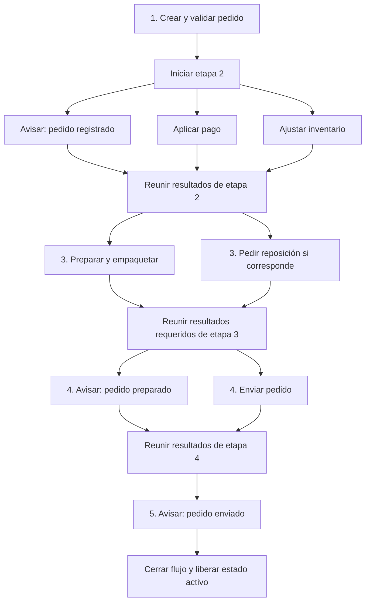
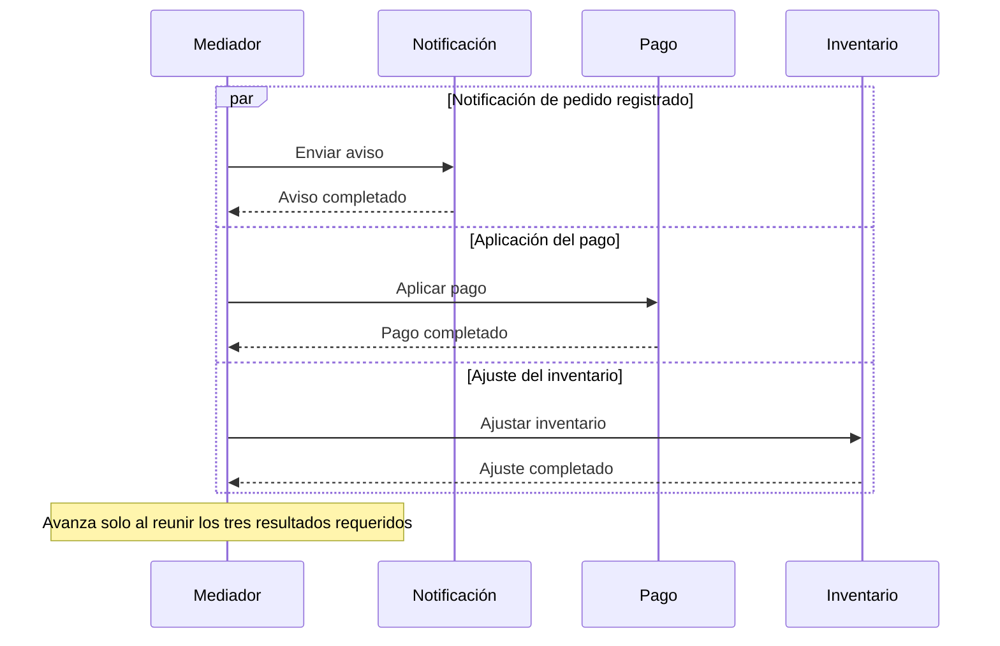
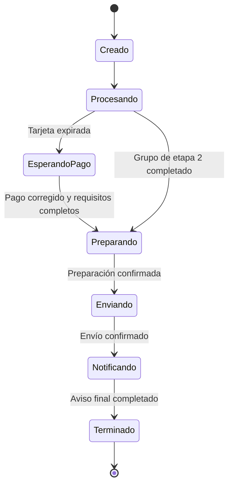

[[Obsidian/lecturas/Fundamentals of Software Architecture/15 Arquitectura dirigida por eventos/00 Índice|Índice del capítulo 15]]

# Flujo mediado de un pedido

El libro reutiliza la compra de un libro para enseñar cómo cambia el flujo cuando existe un coordinador explícito. El cliente inicia el pedido y un mediador recibe la solicitud mediante una cola. A partir de ahí, el mediador genera los encargos necesarios y avanza cuando recibe las confirmaciones correspondientes.

El modelo tiene cinco etapas. **Las etapas están ordenadas; algunas tareas dentro de una etapa son concurrentes**. Esta frase evita dos errores: pensar que el mediador debe ejecutar todo en serie o pensar que, por usar mensajería asíncrona, todas las operaciones pueden empezar inmediatamente.

## Las cinco etapas del libro

| Etapa | Encargos | Qué permite avanzar |
|---|---|---|
| 1. Registrar pedido | Crear y validar el pedido | Confirmación y número de pedido |
| 2. Procesar pedido | Avisar que fue registrado, aplicar pago, ajustar inventario | Confirmaciones de las tres tareas |
| 3. Preparar pedido | Preparar el paquete y pedir reposición si corresponde | Confirmaciones de las tareas iniciadas |
| 4. Enviar pedido | Avisar que está preparado y solicitar envío | Terminación necesaria para considerar enviado |
| 5. Notificar envío | Avisar que el pedido fue enviado | Cierre del flujo y limpieza de su estado activo |

El mediador central conserva el estado, las reglas y los puntos de progreso. Los grupos inferiores representan responsabilidades delegadas, no cinco servicios que ejecuten una etapa cada uno. Las flechas de regreso son resultados que permiten decidir la continuación. La tabla y el diagrama siguiente separan las cinco etapas reales del ejemplo.

Las bifurcaciones representan tareas que pueden progresar simultáneamente y las uniones representan las barreras que reúne el mediador. La reposición tiene una condición: si no se inicia porque no corresponde, no debe producir una espera pendiente. Registro, preparación y envío siguen siendo estados diferentes aunque sus comunicaciones usen las mismas colas y servicios de apoyo.

## Etapa 1: crear el pedido y obtener su identidad

El mediador recibe `place order` y envía `create order` a la cola del procesador de registro de pedidos. Este valida y crea el pedido, y devuelve una confirmación con su identificador.

El número de pedido permite referenciar el trabajo posterior. Según las reglas del producto, el mediador puede devolverlo enseguida al cliente para comunicar que el pedido quedó registrado, o puede esperar que otras etapas terminen antes de confirmar la operación completa. El libro deja explícito que esa elección pertenece a las reglas de negocio.

«Pedido registrado» no significa necesariamente «pago aceptado», «paquete preparado» o «pedido enviado». Mantener nombres diferentes para esos estados evita comunicar un éxito más amplio de lo que el sistema ya sabe.

## Etapa 2: tres encargos concurrentes y una barrera

Después de crear el pedido, el mediador envía tres mensajes: notificar al cliente que fue registrado, aplicar el pago y ajustar inventario. Cada procesador recibe su mensaje y ejecuta su especialidad. El mediador espera las tres confirmaciones antes de avanzar a preparación.

Los tres bloques representan caminos concurrentes. El final de cada camino devuelve información al mediador. Que Notificación termine antes no abre por sí sola la etapa siguiente: el flujo tiene una **barrera de sincronización**, un punto en el que se reúnen todos los resultados requeridos.

Como ejemplo numérico propio, supón que enviar el aviso tarda 80 ms, aplicar el pago 450 ms y ajustar inventario 120 ms. Ejecutarlos en serie suma 650 ms; en paralelo, el grupo tarda aproximadamente 450 ms más el coste de coordinación, si no hay otra contención. El mediador reduce la espera al solapar trabajo, pero sigue esperando la tarea más lenta necesaria para avanzar.

## Etapa 3: preparación y reposición

Al completar el grupo anterior, el mediador inicia la preparación del pedido y la reposición del inventario cuando corresponde. El procesador de preparación organiza recoger y empaquetar los artículos. El de almacén atiende la solicitud de nueva existencia. Ambos pueden actuar simultáneamente y devolver sus confirmaciones.

El diagrama del libro incluye la tarea de pedir más stock, no afirma que el pedido tenga que esperar físicamente a que un proveedor entregue toda reposición. Una implementación necesita definir qué significa la confirmación de esa tarea: solicitud de reposición registrada, compra aprobada o mercancía recibida son resultados diferentes. Esta precisión es elaboración propia y evita confundir el fin de un encargo con un proceso logístico completo.

La figura 15-27 dice que la reposición se realiza si es necesaria. Por tanto, el mediador tiene que tratar esa condición: una tarea que no corresponde no debe dejar el flujo esperando una confirmación que nunca se enviará. Lo fundamental es que el coordinador conozca qué ramas fueron realmente iniciadas.

## Etapa 4: pedido preparado y envío

El mediador genera un mensaje de notificación contextual para informar que el pedido está listo para envío y otro para solicitar el envío. El texto del libro los coloca en el mismo grupo concurrente. El contenido del aviso es distinto del de la etapa 2: informa preparación, no solo registro.

Para pasar a la etapa 5 necesita saber que se cumplió la condición de envío. Un ACK de recepción del mensaje no equivale necesariamente a confirmar que el transportista recibió el paquete. El sistema debe definir con precisión el resultado del procesador de envío que habilita el mensaje «enviado».

La figura 15-31 representa el comando de envío entrando en su cola específica y después en el procesador Shipping. La proximidad de las cajas Warehouse y Shipping no cambia el destinatario: es la conexión desde la cola hacia el procesador la que define la responsabilidad ejecutora.

## Etapa 5: avisar el envío y cerrar el flujo

El mediador envía un tercer mensaje contextual de notificación, ahora para comunicar que el pedido fue enviado. El libro da por terminado el flujo, marca su finalización y elimina el estado activo asociado al evento inicial.

Eliminar el estado activo libera recursos de coordinación. Como elaboración propia, eso no exige borrar registros históricos de auditoría o el pedido de su base: el estado temporal del flujo y la información de negocio no son la misma cosa. Una implementación puede archivar qué pasos terminaron y sus resultados antes de retirar la instancia activa.

## Qué ocurre si falla el pago

El libro presenta una tarjeta expirada. El mediador recibe el error y sabe que no debe iniciar preparación sin pago. Detiene ese flujo, conserva su estado en almacenamiento persistente y, cuando el pago se aplica finalmente, reanuda desde el comienzo de la etapa 3.

El estado persistido permite recuperar una operación que quedó a medio camino. El mediador no necesita recrear todo el pedido para saber qué falta. Pero la reanudación tiene que conservar los resultados ya completados: si inventario se ajustó antes del error de pago, repetir ese ajuste sin protección puede descontar dos veces. Este matiz de idempotencia y registro de progreso complementa el ejemplo del libro.

## El precio del control

La página impresa 268 explica el intercambio: mediación ofrece control del proceso, seguimiento de estado, manejo de errores, recuperación y reinicio. A cambio, el propio mediador debe escalar y puede convertirse en un cuello de botella. También concentra dependencias respecto del flujo y añade coordinación a la ejecución.

El libro no dice que la mediación sea siempre lenta ni que la coreografía nunca controle errores. Compara tendencias de ambas topologías: un coordinador explícito facilita gobernar un proceso, pero necesita transportar resultados, mantener estado y decidir continuaciones. Flujos muy dinámicos pueden ser difíciles de representar declarativamente, por lo que algunas arquitecturas combinan mediación y coreografía.

> [!question]- ¿Puede empezar preparación cuando terminó el pago pero sigue pendiente inventario?
> En el flujo mostrado, no. La etapa 2 requiere las tres confirmaciones antes de avanzar. Otra política es posible, pero sería otro flujo con otras dependencias explícitas.

> [!question]- ¿Reanudar significa repetir desde el primer paso?
> No. El mediador conserva el progreso y puede continuar desde el punto apropiado. El ejemplo de tarjeta expirada reanuda al comienzo de preparación cuando el pago queda resuelto.

> [!question]- ¿Por qué hay tres correos distintos en el proceso?
> Porque informan estados distintos: pedido registrado, pedido preparado y pedido enviado. El contexto del mensaje determina qué puede afirmar al cliente con la evidencia disponible.

**Fuente:** PDF 36–42 · impresas 262–268 · figuras 15-27 a 15-32 y discusión final de mediación. [[Obsidian/lecturas/Fundamentals of Software Architecture/Materiales/12 Arquitectura dirigida por eventos.pdf#page=36|Consultar el escaneo]]. Los tiempos, precisiones de confirmación e idempotencia son elaboración propia.

← [[Obsidian/lecturas/Fundamentals of Software Architecture/15 Arquitectura dirigida por eventos/11 Topología mediadora y selección del mediador|Anterior]] · [[Obsidian/lecturas/Fundamentals of Software Architecture/15 Arquitectura dirigida por eventos/13 Datos compartidos y bases por dominio|Siguiente]] →
