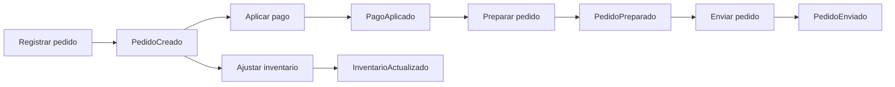
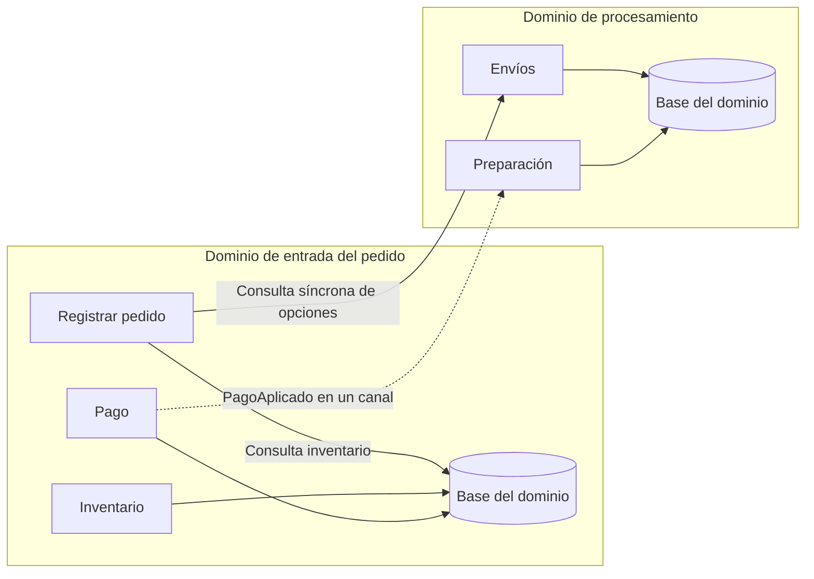

[[Obsidian/lecturas/Fundamentals of Software Architecture/15 Arquitectura dirigida por eventos/00 Índice|↑ Índice del capítulo]]

# Datos compartidos y bases por dominio

Una arquitectura no queda desacoplada solo porque sus mensajes sean asíncronos. También importa **dónde viven los datos y de qué datos depende cada procesador para actuar**. Esta sección del libro mantiene casi intacto el flujo de eventos del pedido y modifica las bases de datos. Ese experimento permite separar dos decisiones que suelen confundirse: cómo circula el trabajo y cómo se obtiene la información necesaria para realizarlo.

El pedido simplificado funciona así: registrar el pedido produce `PedidoCreado`; pago e inventario reaccionan por separado; el pago confirmado permite preparar el pedido; la preparación terminada permite enviarlo. Registrar el pedido necesita además conocer cuántos libros hay y qué opciones de envío corresponden a la ubicación del cliente. Esas consultas son el problema central de las figuras 15-33 a 15-36.

Las dos ramas que salen de `PedidoCreado` pueden avanzar en paralelo. La rama de pago termina habilitando preparación y envío; inventario genera un resultado separado. Esta es la simplificación del libro para estudiar los datos: **no representa por sí sola una garantía de que el inventario esté reservado antes de enviar**. Si esa condición es una regla del negocio, hace falta añadirla explícitamente al flujo. Una flecha ausente en el dibujo no se convierte en una validación automática por usar eventos.

## Una base central: acceso sencillo, dependencia compartida

En la **topología monolítica de datos**, todos los procesadores acceden a una base central. “Monolítica” describe aquí la persistencia, no obliga a que todos los servicios estén dentro de un solo proceso. Puede haber varios ejecutables, colas y consumidores independientes alrededor de una única base.

La ventaja que resalta el libro es muy concreta: Registrar pedido consulta inventario y opciones de envío directamente. No necesita esperar una respuesta de Inventario ni de Envíos. Esto conserva el desacoplamiento dinámico entre procesadores. Una base compartida puede, por tanto, **reducir llamadas entre servicios**, aunque a la vez produzca otra clase de acoplamiento.

La comparación cambia el número de bases y el ámbito de sus propietarios. La base central reúne datos usados por muchos procesadores; las bases de dominio separan grupos; las dedicadas llevan la separación hasta un procesador. La separación puede reducir el alcance de fallos y cambios, pero si Registrar pedido vuelve a necesitar datos remotos inmediatamente, aparecen dependencias de ejecución que el intercambio de eventos no elimina.

El libro identifica cuatro costes de la base central:

1. **Tolerancia a fallos limitada por una dependencia común.** Si la base deja de responder, todos los procesadores que necesitan esa base dejan de hacer su trabajo persistente. Que el broker todavía reciba mensajes no significa que los pedidos estén avanzando. Puede haber aceptación temporal y cola, pero se ha detenido la capacidad de completar las operaciones que requieren datos.
2. **Escalabilidad concentrada.** Añadir consumidores permite ejecutar más tareas en paralelo, pero también concentra más lecturas y escrituras en la misma base. Si la base admite 1.000 operaciones por segundo y los consumidores demandan 1.800, el exceso de 800 operaciones por segundo se convierte en espera o rechazo; añadir más consumidores no arregla el límite. Estas cifras son un ejemplo propio para explicar la relación, no una medición del libro.
3. **Cambios coordinados.** Eliminar una columna puede afectar a Pago, Inventario y Registrar pedido. Aunque desplieguen por separado, deben acordar una transición compatible del esquema. El acoplamiento está en la estructura compartida que sus códigos esperan.
4. **Un único quantum arquitectónico en el análisis del capítulo.** Un quantum es una unidad de la arquitectura cuyas partes comparten dependencias esenciales y características operacionales. La base común conecta esos procesadores en una misma unidad de dependencia. No se cuentan quanta contando archivos, colas o contenedores.

La idea no es que una base central sea siempre incorrecta. Puede ser una decisión razonable si las consultas cruzadas son frecuentes, el volumen es manejable y el coste de coordinación resulta aceptable. Lo importante es reconocer que se obtiene sencillez de acceso a cambio de independencia operacional y de cambio.

## Bases por dominio: una separación intermedia

Un **dominio** agrupa responsabilidades de negocio relacionadas. En la figura 15-35, Registrar pedido, Pago e Inventario comparten una base del dominio de entrada del pedido; Preparación y Envío comparten otra del dominio de procesamiento. No hay una base por servicio: la unidad de propiedad es el grupo.

Si la base de Preparación y Envío falla, el dominio de entrada puede seguir aceptando y cobrando pedidos. Los eventos `PagoAplicado` quedan esperando hasta que el otro dominio se recupere. El canal funciona como una **zona de amortiguación** entre velocidades diferentes: desacopla cuándo se produce trabajo de cuándo puede consumirse. Esto exige que los mensajes se conserven y que la capacidad disponible soporte la interrupción.

Un cálculo propio ayuda a entenderlo. Si entran 40 pagos confirmados por segundo durante una interrupción de cinco minutos, se acumulan `40 × 300 = 12.000` eventos. Al volver, si el consumidor procesa 100 por segundo mientras siguen entrando 40, la cola disminuye a 60 por segundo. Tardará `12.000 / 60 = 200` segundos adicionales en ponerse al día. Recuperar la conexión no es lo mismo que eliminar inmediatamente el retraso acumulado.

Los cambios de esquema y el crecimiento de capacidad quedan también más localizados: modificar la base de envíos no obliga automáticamente a cambiar Pago. Sin embargo, la figura siguiente del libro introduce una dependencia que limita esa promesa.

La línea hacia la base local resuelve inventario sin hablar con otro procesador. La consulta a Envíos atraviesa el límite de dominio y necesita una respuesta inmediata. Aunque `PagoAplicado` siga viajando asíncronamente, registrar el pedido puede ahora quedar bloqueado si Envíos está caído. Una arquitectura debe evaluarse con sus conexiones reales; conservar una cola en otra parte del flujo no neutraliza esa espera.

## Cómo interpretar la tensión de las figuras

La página 271 presenta aislamiento ante la caída del dominio de procesamiento; la página 272 advierte que consultar opciones de envío sincrónicamente puede volver a ligar ambos dominios. Son dos escenarios distintos: el beneficio exige que el dominio de entrada pueda trabajar sin una respuesta inmediata del otro. Si el mismo proceso de entrada consulta Envíos en cada pedido y no tiene alternativa, ya no posee toda la independencia del primer escenario.

El libro recomienda revisar límites de dominio cuando esas consultas proliferan: reunir responsabilidades que se necesitan continuamente, combinar dominios o incluso regresar a una base central. La lección no es distribuir más, sino **poner el límite donde haya una independencia útil**. Como elaboración de diseño, también se puede estudiar una copia local actualizada por eventos de opciones de envío relativamente estables; esa copia cambia disponibilidad por frescura y no sirve automáticamente para reservas estrictas de stock.

> [!question]- Si hay dos bases, ¿ya hay dos quanta?
> No basta con contar bases. Dos grupos con persistencia independiente y comunicación que tolera espera pueden tener quanta distintos. Una dependencia síncrona esencial entre ellos puede volver a conectarlos en una unidad de operación. Hay que identificar qué necesita cada grupo para seguir cumpliendo su responsabilidad.

Fuente: PDF 42–46 · impresas 268–272 · figuras 15-33, 15-34, 15-35 y 15-36. [[Obsidian/lecturas/Fundamentals of Software Architecture/Materiales/12 Arquitectura dirigida por eventos.pdf#page=42|Referencia del capítulo]]. Los cálculos de acumulación y capacidad, la precisión sobre reserva de inventario y la posible copia local son elaboraciones explicativas.

---

[[Obsidian/lecturas/Fundamentals of Software Architecture/15 Arquitectura dirigida por eventos/12 Flujo mediado de un pedido|← Anterior]] · [[Obsidian/lecturas/Fundamentals of Software Architecture/15 Arquitectura dirigida por eventos/14 Base por procesador y elección de topología|Siguiente →]]
