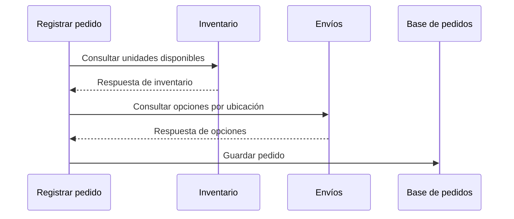

[[Obsidian/lecturas/Fundamentals of Software Architecture/15 Arquitectura dirigida por eventos/00 Índice|↑ Índice del capítulo]]

# Base por procesador y elección de topología

La **base dedicada por procesador** lleva al extremo la separación introducida por las bases de dominio. Registrar pedido posee su persistencia; Pago otra; Inventario otra; Preparación otra; Envíos otra. El libro la relaciona con el patrón *database per service*, conocido en microservicios. Compartir este patrón no convierte automáticamente cualquier arquitectura de eventos en una arquitectura de microservicios: son decisiones relacionadas, pero describen dimensiones diferentes.

La finalidad de la base dedicada es que una responsabilidad pueda controlar sus datos y evolucionar con autonomía. Esa autonomía existe cuando el procesador necesita principalmente datos de su propio contexto. Si para cada operación debe consultar inmediatamente tres servicios distintos, poseer una base propia resuelve solo una parte del problema.

## Contexto delimitado y propiedad real

Un **contexto delimitado** es el ámbito dentro del cual un modelo y sus términos tienen un significado coherente. En Inventario, “disponible” puede significar unidades no reservadas; en Envíos, “disponible” puede referirse a una ruta habilitada. Una base dedicada protege ese modelo: otros procesadores no deben interpretar directamente sus tablas como si fueran un contrato universal.

En la figura 15-37, cada procesador está conectado a su propia base. Esto reduce tres ámbitos de impacto:

- **Fallo:** una caída de la base de Inventario afecta primero al procesador de Inventario. Los demás pueden continuar el trabajo que no requiera inmediatamente su resultado.
- **Capacidad:** esa base se dimensiona según consultas, escrituras y picos de Inventario. No tiene que absorber también los accesos de Pago o Preparación.
- **Cambio:** cambiar el esquema interno obliga a adaptar el propietario de ese esquema, no todos los procesadores del sistema. Los contratos publicados siguen necesitando cuidado: autonomía interna no autoriza romper eventos externos.

La frase “los demás siguen funcionando” se refiere a responsabilidades independientes. Si un pedido necesita una reserva confirmada antes de prepararse, ese pedido espera por Inventario aunque el procesador de Pago siga saludable. Conviene separar **aislar una caída** de **poder completar cualquier flujo de negocio durante esa caída**.

## El coste aparece en la información que falta

Registrar pedido sigue necesitando dos datos del ejemplo del libro: stock y opciones de envío. Con una base central, ambas consultas iban a un lugar accesible. Con bases por dominio, inventario seguía local y opciones de envío requerían una consulta remota. Con una base por procesador, las dos informaciones quedan fuera de su base.

Registrar pedido espera dos respuestas antes de persistir el pedido en este ejemplo. Cada respuesta depende del servicio remoto, de su base y de la comunicación entre ambos. Las bases están separadas, pero la capacidad de completar la entrada del pedido vuelve a depender de otros componentes. El intercambio posterior de eventos no elimina esas dependencias previas.

El diagrama usa consultas secuenciales para hacer visible la espera; no afirma que deban implementarse siempre así. Ejecutarlas en paralelo puede reducir la latencia, pero **no elimina la dependencia de disponibilidad**. Si Inventario no responde y su resultado es obligatorio, Registrar pedido sigue bloqueado.

Un ejemplo propio cuantifica la diferencia. Si la consulta a Inventario tarda 80 ms, la de Envíos 120 ms y el trabajo local 20 ms, la ejecución secuencial necesita aproximadamente `80 + 120 + 20 = 220 ms`, sin contar otros costes. En paralelo, el ideal aproximado baja a `max(80, 120) + 20 = 140 ms`. La mejora temporal no transforma una respuesta obligatoria en opcional.

También se multiplican las condiciones necesarias para responder. Si tres dependencias independientes tienen una disponibilidad de 99,9 % cada una y todas deben estar operativas al mismo tiempo, una aproximación simplificada da `0,999³ = 0,997003`, alrededor de 99,70 %. Es un cálculo ilustrativo, no una predicción universal: las caídas reales pueden estar correlacionadas y las alternativas de recuperación modifican el resultado. Su utilidad es mostrar que añadir dependencias esenciales puede reducir la disponibilidad conjunta.

## Por qué puede costar más dinero y operación

El libro señala que esta topología puede ser costosa según la tecnología elegida. Tener cinco bases no cuesta simplemente cinco veces una base: depende de licencias, tamaño mínimo, recursos compartidos y servicio usado. Pero sí multiplica los objetos que necesitan operación: configuraciones, credenciales, copias de seguridad, actualizaciones, observabilidad y restauración.

Ese coste puede estar justificado por el aislamiento. Un equipo que cambia constantemente el modelo de inventario puede beneficiarse de no coordinar sus migraciones con todos los demás. Para un sistema pequeño con consultas cruzadas frecuentes, el mismo diseño puede introducir mucha administración y muchas esperas con poco beneficio.

## Comparar las tres topologías sin convertirlas en una competición

| Aspecto | Base central | Base por dominio | Base por procesador |
|---|---|---|---|
| Propietario del esquema | Varias responsabilidades | Grupo relacionado | Un procesador |
| Alcance directo de una caída de base | Muchos procesadores | Un dominio | Un procesador |
| Coordinación de cambio interno | Amplia | Dentro del dominio | Local al propietario |
| Acceso a inventario desde entrada del pedido | Directo | Directo en el ejemplo | Consulta a Inventario en el ejemplo |
| Acceso a opciones de envío | Directo | Consulta a Envíos en el ejemplo | Consulta a Envíos en el ejemplo |
| Riesgo dominante | Dependencia central | Fronteras de dominio mal elegidas | Demasiadas consultas remotas |

La tabla conserva las conexiones específicas del ejemplo. No significa que todas las implementaciones de estas topologías deban consultar datos de esa manera. Una decisión se evalúa junto con los requisitos de información de sus procesadores, no por el nombre del patrón.

## Una elección razonada

Antes de escoger una topología, puede hacerse una matriz propia de necesidades: filas para procesadores, columnas para datos y una marca que indique si el dato se necesita inmediatamente, puede llegar después o sirve una copia con retraso. Esa matriz descubre fronteras que producirían consultas síncronas continuas.

El libro favorece bases dedicadas cuando los procesadores son **mayormente autosuficientes**. Si aparecen demasiadas conversaciones inmediatas, propone revisar la topología hacia bases por dominio o una base central, buscando mejor rendimiento y escalabilidad global. El matiz final es valioso: si el esquema cambia con mucha frecuencia, puede aceptarse cierto coste operacional para limitar cuántos procesadores deben cambiar. No hay un ganador que maximice simultáneamente aislamiento, sencillez, coste y velocidad.

Como elaboración de diseño, publicar datos pertinentes en un evento o mantener una proyección local puede reducir consultas, pero aumenta el compromiso con contratos y consistencia eventual. Una copia de “stock observado” sirve para informar; no sustituye por sí sola una reserva atómica de la última unidad. La regla de negocio decide qué información puede estar desactualizada.

> [!question]- ¿Cuándo escogería bases por dominio en vez de una base por procesador?
> Cuando varias responsabilidades comparten datos intensamente y coordinan cambios con naturalidad dentro de una frontera de negocio. Mantenerlas juntas puede evitar llamadas continuas, mientras se conserva aislamiento respecto a otros dominios que sí pueden trabajar de forma independiente.

Fuente: PDF 47–48 · impresas 273–274 · figuras 15-37 y 15-38. [[Obsidian/lecturas/Fundamentals of Software Architecture/Materiales/12 Arquitectura dirigida por eventos.pdf#page=47|Base dedicada en el libro]]. Los ejemplos numéricos y la matriz de necesidades son elaboraciones propias.

---

[[Obsidian/lecturas/Fundamentals of Software Architecture/15 Arquitectura dirigida por eventos/13 Datos compartidos y bases por dominio|← Anterior]] · [[Obsidian/lecturas/Fundamentals of Software Architecture/15 Arquitectura dirigida por eventos/15 Nube riesgos y gobernanza|Siguiente →]]
