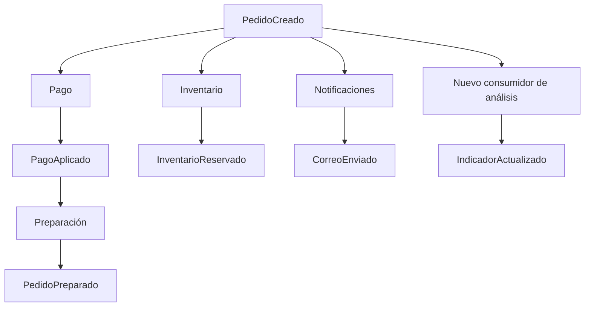

[[Obsidian/lecturas/Fundamentals of Software Architecture/15 Arquitectura dirigida por eventos/00 Índice|↑ Índice del capítulo]]

# Nube riesgos y gobernanza

La nube encaja bien con la arquitectura dirigida por eventos porque permite combinar servicios de mensajería asíncrona y capacidad que crece o disminuye. Esa afinidad no resuelve por sí misma los problemas del capítulo. Un servicio administrado puede operar la infraestructura de mensajes; no decide qué significa que un pedido haya terminado, qué consumidores deben reaccionar o qué cambio de contrato rompe el negocio.

Esta nota reúne tres secciones contiguas del libro: nube, riesgos comunes y gobernanza. **Gobernanza** significa conservar las propiedades que justificaron la arquitectura y detectar cuándo se pierden. En EDA, buena parte de esa vigilancia requiere saber qué está sucediendo durante la ejecución, porque las dependencias de eventos no siempre se revelan leyendo una estructura de carpetas.

## Nube y elasticidad: afinidad con límites

La **elasticidad** es la capacidad de ajustar recursos ante cambios de carga. No es exactamente lo mismo que escalabilidad, que describe hasta dónde puede aumentar la capacidad de procesamiento. Si el canal acumula eventos y los consumidores pueden repartirse trabajo, añadir consumidores puede reducir la acumulación.

El mecanismo funciona bajo condiciones: el trabajo debe poder distribuirse, el broker debe conservar y entregar eventos, y las bases y servicios externos deben admitir la demanda resultante. Añadir cien consumidores a una base que ya está saturada puede empeorar contención y fallos. Además, el procesamiento que exige orden por una misma entidad puede limitar cuánto paralelismo es útil.

El libro hace una afirmación general de afinidad entre EDA y nube; no ofrece una receta de proveedor ni garantiza que todos los componentes escalen automáticamente. Lo que se obtiene es una infraestructura compatible con ese modo de trabajo. La aplicación todavía debe diseñar contratos, reintentos, estados y límites.

## Riesgo 1: no saber todo lo que desencadena un evento

En un flujo **no determinista** desde la perspectiva del control global, un evento puede activar ramas distintas según datos, suscriptores y condiciones. Esto no significa que cada función deba comportarse aleatoriamente. Significa que el iniciador puede no conocer por adelantado el recorrido completo ni todos sus resultados.

`PedidoCreado` puede provocar pago, inventario, notificaciones y análisis. Un nuevo consumidor puede añadir una reacción legítima. Un consumidor mal configurado puede publicar otro evento inesperado o dejar de reaccionar cuando debería. El flujo global se modifica sin que la función que creó el pedido haya cambiado. Esa flexibilidad también hace difícil localizar efectos laterales.

Un único hecho dispara varias ramas y cada rama puede terminar en un momento diferente. `CorreoEnviado` no prueba que el pago se haya aplicado; `IndicadorActualizado` no prueba que el pedido esté preparado. La arquitectura necesita definir cuáles resultados son esenciales para el negocio y cuáles son efectos auxiliares, porque no existe una equivalencia automática entre “alguna rama terminó” y “todo terminó”.

## Riesgo 2: contratos que acoplan aunque el transporte sea asíncrono

Un **contrato de evento** define lo que un consumidor puede esperar: campos, tipos y significado. Un consumidor que espera `importe` como número puede fallar si empieza a llegar como texto. También hay roturas semánticas: mantener el mismo campo pero cambiar “importe antes de impuestos” por “importe final” puede producir cálculos incorrectos sin lanzar una excepción.

Esto es **acoplamiento estático**: el código depende de una forma y un significado compartidos. La comunicación asíncrona reduce esperas entre procesos, pero no hace desaparecer ese acuerdo. Si no se conocen todos los suscriptores, un cambio puede perjudicar a consumidores que el emisor ni siquiera recuerda.

El libro señala una tensión con payloads basados en clave: reducir el evento a un identificador puede limitar la exposición de estructuras grandes, pero trasladar las consultas al consumo degrada rendimiento o escalabilidad y puede producir eventos anémicos. El contrato más pequeño no es siempre el más autónomo.

El **stamp coupling** aparece cuando se entrega a un consumidor una estructura amplia de la que utiliza solo una parte. Como ejemplo propio, Auditoría necesita identificador, monto y fecha, pero recibe además dirección completa, preferencias y promociones. Aunque no use estos últimos campos, una biblioteca o deserializador fuertemente ligado al esquema puede arrastrarlo a cambios innecesarios. Medir qué campos utiliza cada consumidor permite discutir si el contrato está sobredimensionado; no autoriza a borrar campos sin comprobar todos los usos.

## Riesgo 3: llamadas inmediatas que erosionan la independencia

Un procesador que debe consultar sincrónicamente otro servicio para cada evento incorpora una dependencia de tiempo y disponibilidad. Si la consulta falla, ya no puede avanzar solo con su mensaje y sus datos. El libro considera la proliferación de estas llamadas una señal de posible desajuste entre EDA y el problema.

No toda llamada síncrona es automáticamente un error. Lo que debe registrarse es su finalidad, su frecuencia y si constituye una dependencia esencial. Una consulta administrativa ocasional no equivale a una llamada obligatoria por cada pedido. En bases por dominio o dedicadas, las necesidades de datos son una causa frecuente de este deterioro estructural.

## Riesgo 4: no poder determinar el estado global

“Se recibió el evento” es un estado de ingreso. “Se envió el pedido” es un estado de negocio. “Se completaron todos los efectos auxiliares” es otra condición. Mezclarlos hace que la interfaz muestre éxitos prematuros o que un operador no sepa qué recuperar.

El libro indica que, en algunos flujos, el procesador iniciador puede suscribirse a un evento final reconocible. Eso funciona si realmente hay un final bien definido. Cuando las ramas son dinámicas o sus finales no se reúnen, identificar la conclusión es difícil. La topología mediadora ofrece control explícito a cambio de costes; un flujo coreografiado necesita otra forma de observación o definición de terminación.

## Qué vigilar para conservar la arquitectura

La gobernanza propuesta por el capítulo se concentra en contratos y llamadas síncronas. Una **función de aptitud arquitectónica** es una comprobación repetible que detecta si una propiedad sigue cumpliéndose. Puede ejecutarse sobre código o sobre observaciones de producción; no tiene que ser exclusivamente una prueba unitaria.

| Propiedad que interesa | Evidencia posible | Decisión que permite |
|---|---|---|
| Contratos estables y conocidos | Versiones, frecuencia de cambios, consumidores registrados | Revisar compatibilidad antes de cambiar |
| Payload ajustado a necesidades | Campos realmente usados por consumidor | Reducir contenido y cambios innecesarios |
| Autonomía de procesadores | Trazas o logs de llamadas síncronas | Justificar la dependencia o revisar límites |
| Flujos observables | Identificadores de correlación y estados de ramas | Localizar una operación pendiente |

Las tres primeras filas reflejan las áreas destacadas por el libro; la última desarrolla su preocupación por el estado. Los logs deben permitir relacionar un hecho inicial con sus resultados sin confundir eventos diferentes. Contar peticiones HTTP sin saber qué flujos representan ofrece menos información que registrar una relación clara entre pedido, evento y llamada.

Como ejemplo propio de regla de gobierno, puede exigirse que toda nueva llamada síncrona entre procesadores tenga una justificación registrada y que un cambio incompatible de contrato active una revisión de consumidores. El umbral concreto depende del sistema. El libro no fija un porcentaje máximo universal ni promete detectar todo automáticamente: reconoce que algunas métricas requieren recopilación manual.

> [!question]- Si todos los servicios están saludables, ¿puede haber un pedido atascado?
> Sí. Un evento perdido, un contrato rechazado, un consumidor no suscrito o una rama sin resultado pueden dejar una operación incompleta mientras los procesos continúan atendiendo otras. Salud del proceso y progreso de la transacción son observaciones diferentes.

Fuente: PDF 49–50 · impresas 275–276 · secciones Cloud Considerations, Common Risks y Governance. [[Obsidian/lecturas/Fundamentals of Software Architecture/Materiales/12 Arquitectura dirigida por eventos.pdf#page=49|Riesgos y gobernanza en la fuente]]. Los ejemplos de contrato, las reglas operativas y el diagrama son elaboraciones explicativas.

---

[[Obsidian/lecturas/Fundamentals of Software Architecture/15 Arquitectura dirigida por eventos/14 Base por procesador y elección de topología|← Anterior]] · [[Obsidian/lecturas/Fundamentals of Software Architecture/15 Arquitectura dirigida por eventos/16 Equipos quanta y características|Siguiente →]]
