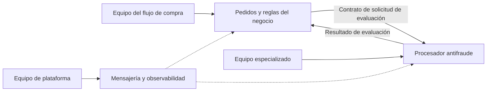

[[Obsidian/lecturas/Fundamentals of Software Architecture/15 Arquitectura dirigida por eventos/00 Índice|↑ Índice del capítulo]]

# Equipos quanta y características

Una arquitectura también organiza el trabajo de las personas. En EDA, un cambio de negocio puede atravesar procesadores, contratos, canales y datos. Por eso, separar procesos no garantiza que un equipo pueda cambiar una funcionalidad sin coordinación. El capítulo conecta esta realidad con los tipos de equipos y después evalúa las características arquitectónicas del estilo.

## Por qué el libro clasifica EDA como partición técnica

Una **partición técnica** organiza la arquitectura mediante piezas de implementación: procesadores, brokers, canales y contratos. Un dominio de negocio puede estar distribuido por varias de esas piezas. Añadir una validación al pedido quizá requiera modificar qué evento se publica, cuándo se publica y quién espera su resultado.

El libro describe EDA como principalmente técnica, aunque admite que pueden funcionar equipos alineados con áreas de dominio. Tampoco impide que una implementación concreta tenga fronteras de negocio fuertes. La clasificación explica dónde se encuentra normalmente la complejidad de este estilo, no constituye una regla que prohíba diseñar ownership por dominio.

## Cuatro tipos de equipos y sus consecuencias

Un **equipo alineado con un flujo de valor** se responsabiliza de resultados continuos de negocio, como compra y entrega. En EDA puede tener que entender muchas piezas dispersas para modificar ese recorrido. Cuando crecen las ramas y los eventos derivados, aumenta su carga cognitiva: debe saber no solo qué hace su procesador, sino qué consecuencias produce en otros.

El capítulo advierte que cuanto más grande y complejo es el sistema, más difícil puede resultar ese trabajo. Un ejemplo propio: incorporar revisión antifraude entre cobro y preparación no consiste necesariamente en añadir un consumidor. Si Preparación ya reacciona a `PagoAplicado`, hay que cambiar la condición que habilita preparar o introducir una señal que represente todos los requisitos. La modificación afecta al flujo completo.

Un **equipo facilitador** ayuda a otros a adquirir capacidades y superar dificultades. El libro considera problemática su integración dentro de los flujos EDA porque experimentar con eventos y contratos puede alterar el recorrido que gestiona el equipo principal y aumentar coordinación. Esa valoración se entiende en el contexto descrito: intervención sobre piezas del flujo. Como precisión explicativa, no implica que formación o asistencia temporal sean imposibles; el riesgo está en cambiar la integración sin una comprensión compartida de sus efectos.

Un **equipo de subsistema complicado** atiende una parte que requiere conocimiento especializado. EDA puede favorecerlo: un algoritmo complejo se encapsula detrás de un procesador y de eventos bien acordados. El equipo principal no necesita dominar el interior de ese algoritmo para usar su resultado. La coordinación sigue siendo necesaria en contratos y eventos derivados: aislamiento no significa ausencia de acuerdos.

Un **equipo de plataforma** ofrece herramientas y servicios comunes. Brokers, buses, canales, observabilidad y capacidades reutilizables pueden quedar bajo su responsabilidad. Así, los equipos de negocio no necesitan reconstruir la misma infraestructura. El libro ve buen encaje en esta topología, especialmente cuando la infraestructura de eventos se trata como plataforma.

El equipo del flujo posee las reglas de compra y el especializado posee la evaluación compleja; ambos acuerdan el significado de solicitud y resultado. Plataforma proporciona capacidades comunes. La división puede reducir conocimiento duplicado, pero no elimina la necesidad de decidir quién espera el resultado y qué ocurre cuando falta. El diagrama es una aplicación propia de las consideraciones del libro.

## Valoraciones exactas de la figura 15-39

Las estrellas expresan una valoración comparativa de los autores: una representa poco apoyo del estilo y cinco una de sus fortalezas. No son resultados de un benchmark ni porcentajes de calidad. La tabla se verificó visualmente ampliando la página escaneada.

La mayor valoración se concentra en respuesta, evolución y tolerancia a fallos; simplicidad y facilidad de prueba quedan bajas. Esto permite entender la elección como un intercambio: desacoplar y ampliar las reacciones a los eventos ofrece capacidades útiles, pero hace más difícil razonar y comprobar el recorrido global. Una valoración alta del estilo no garantiza que cada implementación alcance esa propiedad.

| Grupo | Característica | Valor en la figura |
|---|---|---|
| General | Coste global | `$$$` |
| Estructural | Tipo de partición | Técnica |
| Estructural | Número de quanta | De uno a muchos |
| Estructural | Simplicidad | ★★, 2 de 5 |
| Estructural | Modularidad | ★★★★, 4 de 5 |
| Ingeniería | Mantenibilidad | ★★★★, 4 de 5 |
| Ingeniería | Testabilidad | ★★, 2 de 5 |
| Ingeniería | Desplegabilidad | ★★★, 3 de 5 |
| Ingeniería | Evolucionabilidad | ★★★★★, 5 de 5 |
| Operacional | Capacidad de respuesta (*responsiveness*) | ★★★★★, 5 de 5 |
| Operacional | Escalabilidad | ★★★★, 4 de 5 |
| Operacional | Elasticidad | ★★★, 3 de 5 |
| Operacional | Tolerancia a fallos | ★★★★★, 5 de 5 |

El coste está representado por símbolos monetarios, no por estrellas ni por una cifra de presupuesto. La figura tampoco incluye una fila independiente llamada rendimiento. La prosa siguiente habla de rendimiento, escalabilidad y tolerancia con valoraciones altas, pero no hay que inventar una fila adicional ni convertir elasticidad en cinco estrellas por asociación.

## Explicar las fortalezas y los límites

**Respuesta y rendimiento.** La comunicación asíncrona permite aceptar trabajo sin esperar a que termine todo el recorrido, y varias ramas pueden avanzar en paralelo. Eso mejora la respuesta percibida o el aprovechamiento del procesamiento. Sin embargo, recibir un acuse rápido no significa que el pedido ya esté completado. Debe comunicarse al usuario qué estado se alcanzó.

**Escalabilidad, cuatro estrellas.** Varios consumidores competidores pueden repartirse eventos. El libro también los relaciona con grupos de consumidores. Aumentar consumidores atiende más carga si el trabajo, el canal y las dependencias lo permiten. La base de datos es una de las razones de que la valoración no llegue a cinco. La elasticidad obtiene tres en la figura: crecimiento de capacidad y ajuste automático y eficiente no son idénticos.

**Tolerancia a fallos, cinco estrellas.** Un consumidor temporalmente caído puede procesar más tarde mientras otros avanzan. Esto presupone mensajes conservados y ausencia de una respuesta inmediata obligatoria. La tolerancia no garantiza que cualquier operación continúe sin demora; permite que una parte indisponible no derribe necesariamente todas las demás.

**Evolución, cinco estrellas.** Un evento existente puede alimentar un nuevo procesador. Añadir análisis a `PedidoCreado` no requiere enseñar al emisor a llamar al nuevo consumidor. Esa extensión es especialmente sencilla cuando el hecho y sus datos ya contienen lo necesario. Si el nuevo requisito cambia condiciones de negocio o necesita datos ausentes, puede requerir modificar contratos y flujo.

**Simplicidad y testabilidad, dos estrellas.** La dificultad reside en combinaciones de orden, retraso, ramas y errores. Probar cada consumidor aisladamente no basta para demostrar que el pedido termina correctamente. Como ejemplo propio, diez decisiones binarias independientes podrían producir `2¹⁰ = 1.024` combinaciones; el sistema real no tiene necesariamente esas diez decisiones ni todas las combinaciones son válidas, pero la cuenta muestra por qué los escenarios globales pueden crecer rápido.

**Modularidad y mantenibilidad, cuatro estrellas.** Los procesadores pueden concentrar responsabilidades y limitar cambios internos. El riesgo está en conservar contratos compatibles y no introducir dependencias inmediatas ocultas. La desplegabilidad de tres refleja que independencia de ejecución y libertad total para cambiar interfaces no son equivalentes.

## Quanta: el transporte no determina la dependencia

El capítulo permite uno o varios quanta según persistencia y comunicación real. Compartir una base une procesadores en el mismo quantum. También puede hacerlo el **request-reply** cuando un consumidor necesita inmediatamente la respuesta del otro para continuar, aunque solicitud y respuesta viajen por mensajes asíncronos.

Si A publica una solicitud para crear un pedido y no puede seguir sin el identificador producido por B, la caída de B impide continuar a A. Cambiar HTTP por dos colas no elimina ese vínculo. Para reconocer quanta hay que preguntar qué partes pueden cumplir su responsabilidad de manera independiente, no qué protocolo aparece en el diagrama.

## Por qué reanudar no es repetir desde el principio

Las últimas páginas de características añaden un límite importante: sin mediador, un fallo de Pago puede coexistir con un ajuste de Inventario ya realizado. Reenviar `PedidoCreado` sin cuidado podría volver a ajustar inventario o repetir otros efectos. **Recuperabilidad** significa volver a un estado útil después del fallo, y exige conocer qué trabajo ocurrió, qué falta y qué puede repetirse con seguridad. No se obtiene automáticamente añadiendo más consumidores.

> [!question]- ¿Cómo pueden coexistir tolerancia a fallos alta y recuperación difícil?
> Porque aislar una caída permite que otros procesadores sigan trabajando, pero esa misma independencia produce resultados parciales. El sistema permanece operativo mientras una transacción específica requiere reconciliación, reintentos seguros o intervención. Disponibilidad del conjunto y recuperación de un caso individual miden cosas diferentes.

Fuente: PDF 50–54, inicio · impresas 276–280 · figura 15-39 en PDF 52, impresa 278. [[Obsidian/lecturas/Fundamentals of Software Architecture/Materiales/12 Arquitectura dirigida por eventos.pdf#page=52|Tabla de valoraciones y explicación de quanta]]. Las precisiones sobre facilitación, el ejemplo antifraude y la cuenta combinatoria son elaboraciones explicativas.

---

[[Obsidian/lecturas/Fundamentals of Software Architecture/15 Arquitectura dirigida por eventos/15 Nube riesgos y gobernanza|← Anterior]] · [[Obsidian/lecturas/Fundamentals of Software Architecture/15 Arquitectura dirigida por eventos/17 Elegir el modelo y caso de subastas|Siguiente →]]
