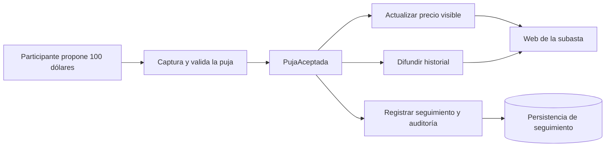

[[Obsidian/lecturas/Fundamentals of Software Architecture/15 Arquitectura dirigida por eventos/00 Índice|↑ Índice del capítulo]]

# Elegir el modelo y caso de subastas

El cierre del capítulo cambia la pregunta. Después de explicar cómo funciona EDA, pregunta **cuándo vale la pena pagar su complejidad**. No todos los problemas necesitan un recorrido de reacciones asíncronas. Si el trabajo consiste en consultar un dato con un resultado inmediato y bien definido, un modelo de solicitudes puede expresar la necesidad con más claridad.

Un **modelo basado en solicitudes** organiza la interacción alrededor de una petición y de la respuesta que la satisface. Un **modelo basado en eventos** organiza reacciones a algo ocurrido. La diferencia no es únicamente si el transporte usa HTTP o un broker: importa si el iniciador controla una tarea definida o si publica un hecho del que otros pueden extraer acciones independientes.

## Dos problemas que parecen similares, pero piden modelos distintos

“Dame el perfil del cliente 42” tiene un objetivo acotado: devolver el perfil o indicar por qué no puede devolverse. El libro lo usa como ejemplo de una solicitud estructurada y orientada a datos. Hay un resultado identificable que el solicitante necesita ahora.

“El cliente completó una compra” expresa un hecho que puede interesar a envío, recomendaciones, auditoría o puntos. El productor no necesita decidir todas las reacciones presentes y futuras. Cuando se requieren respuesta ágil, escala y procesamiento dinámico, ese modelo puede aprovechar bien EDA.

Una aplicación puede combinar ambos: consultar el perfil mediante solicitud y publicar una compra confirmada como evento. Esta combinación es una elaboración de diseño consistente con los dos modelos, no una obligación de convertir cada endpoint en evento. El libro recomienda considerar microservicios si predomina el procesamiento basado en solicitudes; esa recomendación no implica que los microservicios carezcan de eventos ni que EDA y microservicios sean mutuamente excluyentes.

La comparación separa necesidades de respuesta inmediata y control del recorrido de necesidades de reacción flexible y paralela. Una arquitectura se elige por qué condiciones son esenciales para el negocio. El tamaño del sistema o la existencia de una herramienta de mensajes no sustituyen ese análisis.

## Ventajas del modelo de eventos y qué significan

La tabla 15-2 enumera ventajas frente al modelo basado en solicitudes. Estas ventajas no deben interpretarse como promesas incondicionales ni como parejas exactas con cada desventaja de la columna opuesta; la tabla reúne dos listas.

| Ventaja descrita por el libro | Explicación concreta |
|---|---|
| Responder mejor a contenido dinámico del usuario | Un hecho puede habilitar reacciones diferentes según el contexto |
| Escalabilidad y elasticidad | Distribuir trabajo entre consumidores y ajustar recursos cuando la carga cambia |
| Agilidad y gestión de cambios | Añadir consumidores para funcionalidades que no alteran el productor |
| Adaptabilidad y extensibilidad | Aprovechar hechos publicados como puntos de extensión |
| Respuesta y rendimiento | Desacoplar la aceptación del trabajo y procesar ramas en paralelo |
| Decisiones en tiempo real | Reaccionar al llegar hechos relevantes sin esperar un recorrido por lotes |
| Conciencia situacional | Combinar señales de lo que ocurre para ajustar comportamiento |

“Tiempo real” en esta descripción expresa reacción oportuna a eventos; no demuestra por sí solo plazos estrictos garantizados. Una cola con retraso puede hacer que una reacción llegue tarde. Si hay un plazo obligatorio, la implementación necesita medirlo y diseñar sus límites.

La columna de costes reúne consistencia eventual, menor control del recorrido, menor certeza sobre el resultado global y dificultad para probar y depurar. La frase del libro “solo consistencia eventual” se refiere al **resultado distribuido del modelo asíncrono**. Un procesador aún puede ejecutar una transacción local fuerte; lo que no se obtiene automáticamente es una transacción única que cambie simultáneamente todos los estados independientes del flujo.

La consistencia eventual tampoco significa que cualquier incoherencia desaparece por esperar. La convergencia requiere que el trabajo se entregue, se procese y se recupere cuando falle. “Eventual” sin mecanismos de progreso puede convertirse en un pedido pendiente indefinidamente.

## Caso del libro: la subasta Going, Going, Gone

En una subasta, el número de participantes puede ser desconocido y aumentar cerca del cierre. Una nueva puja interesa a varias responsabilidades. El modelo trata la puja aceptada como un hecho que provoca acciones, en lugar de convertir todas esas acciones en una única petición que debe terminar junta.

La figura 15-40 contiene cinco piezas principales:

1. **Participante:** propone una cantidad por un artículo.
2. **Captura de pujas:** recibe la propuesta y determina si supera la puja anterior. Cuando la acepta, publica el hecho `PujaAceptada`, equivalente explicativo al `Bid placed` del dibujo.
3. **Responsable de la subasta:** reacciona para actualizar el precio presentado en la web.
4. **Difusor de pujas:** reacciona para actualizar el historial o distribuir la información a participantes.
5. **Registro de participantes y pujas:** persiste datos para seguimiento y auditoría; su actividad puede realizarse en segundo plano.

La publicación central conecta captura con tres consumidores. Actualizar el precio y difundir el historial no necesitan esperar a que el registro auxiliar termine su procesamiento. Esto ilustra paralelismo y aislamiento temporal. El evento debe representar una puja realmente aceptada, porque una propuesta rechazada no debería presentarse como nuevo precio válido.

Los tres caminos comparten un hecho, pero cumplen tareas diferentes. El registro puede quedar retrasado sin obligar al actualizador de precio a esperar cada escritura auxiliar. En cambio, captura no debe publicar una puja como aceptada sin resolver su validez. Esa distinción evita confundir el paralelismo posterior con permiso para omitir la decisión inicial.

## Lo que la figura no pretende resolver

La ilustración muestra el potencial de EDA; no especifica un algoritmo completo de cierre, orden o concurrencia. Como elaboración propia, dos propuestas simultáneas de 100 y 110 dólares requieren una regla autoritativa para decidir la secuencia y el precio vigente. Si ambas leen el mismo precio anterior sin coordinación, podrían tomar decisiones incompatibles.

Una solución conceptual es serializar la decisión por artículo o utilizar una actualización condicional en la autoridad de pujas. Después de aceptar, se distribuye el hecho. Los consumidores pueden recibir duplicados o retrasos y necesitan evitar que una versión anterior reemplace un precio más nuevo. Estas medidas no están dibujadas en la figura; se mencionan para no atribuir al broker garantías que la regla de negocio todavía debe definir.

Algo similar sucede con auditoría: procesarla después no significa que pueda perderse. Si su conservación es obligatoria, el ingreso y la publicación deben tener garantías suficientes, y el consumidor debe recuperar retrasos. EDA permite desacoplar el momento, no cancelar la responsabilidad.

## Una decisión defendible

EDA encaja especialmente cuando varias responsabilidades reaccionan a hechos, hay carga variable, se tolera que ramas avancen en momentos distintos y se necesita añadir nuevas reacciones. El coste resulta menos justificable cuando la mayoría de las operaciones exige recorrer una cadena fija de consultas inmediatas y entregar un resultado final único con certeza.

Antes de elegir, es útil escribir qué significa “éxito”, cuánto tiempo puede esperar cada resultado, qué estados parciales tolera el negocio y quién recuperará una operación atascada. Estas preguntas convierten “necesitamos escala” en un diseño verificable. Una cola absorbe un pico; no reemplaza una definición de éxito ni vuelve ilimitada la capacidad posterior.

> [!question]- ¿Añadir un consumidor nuevo es siempre una evolución sin cambios existentes?
> Solo si el evento actual ya representa el hecho adecuado y contiene o permite obtener la información necesaria, y si la nueva reacción no cambia condiciones anteriores. Añadir recomendaciones puede ser independiente; exigir aprobación antifraude antes de enviar cambia el flujo y requiere coordinar quién habilita el envío.

Fuente: PDF 54–55 · impresas 280–281 · tabla 15-2 y figura 15-40. [[Obsidian/lecturas/Fundamentals of Software Architecture/Materiales/12 Arquitectura dirigida por eventos.pdf#page=54|Elección de modelo y casos]]. Las precisiones sobre transacciones locales, aceptación concurrente y cierre de subasta son elaboraciones explicativas.

---

[[Obsidian/lecturas/Fundamentals of Software Architecture/15 Arquitectura dirigida por eventos/16 Equipos quanta y características|← Anterior]] · [[Obsidian/lecturas/Fundamentals of Software Architecture/15 Arquitectura dirigida por eventos/18 Laboratorio y repaso resuelto|Siguiente →]]
