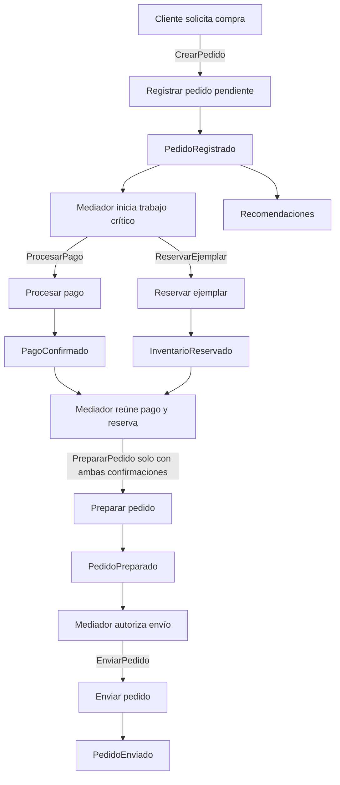
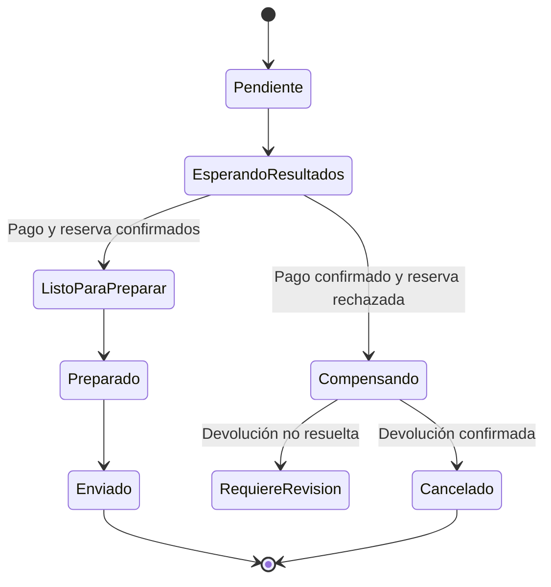

[[Obsidian/lecturas/Fundamentals of Software Architecture/15 Arquitectura dirigida por eventos/00 Índice|↑ Índice del capítulo]]

# Laboratorio y repaso resuelto

Este laboratorio aplica las ideas del capítulo a una librería digital. Es una **elaboración didáctica propia**, no un ejercicio transcrito del libro. Cada apartado plantea una decisión, la resuelve y explica qué problema evita. El objetivo es poder razonar sobre un flujo completo, incluidos los resultados parciales y los fallos.

## El caso y sus requisitos

Una librería vende ejemplares físicos. El cliente compra un libro, recibe una confirmación rápida y más tarde conoce si se cobró, se reservó el ejemplar y se envió. Pago, Inventario y Envíos tienen cargas diferentes. Durante una interrupción de Envíos se quiere continuar recibiendo compras, pero no se acepta enviar sin pago confirmado ni sin ejemplar reservado.

Además, el negocio exige que no se cobre dos veces un mismo pedido, que se pueda localizar una compra atascada y que añadir recomendaciones no obligue a modificar Pago. Las opciones de transporte cambian poco durante el día; la reserva de la última unidad necesita una decisión vigente, no una copia aproximada del inventario.

Estas condiciones mezclan independencia, reglas estrictas y resultados diferidos. El diseño debe distinguirlas: la confirmación de ingreso no equivale a prometer que el pedido ya es viable; una reserva real no equivale al stock mostrado por la página.

## Ejercicio 1: formular eventos y comandos con significado claro

El cliente intenta comprar. Antes de que el sistema valide y registre la intención, todavía no existe el hecho `PedidoRegistrado`. Un comando como `CrearPedido` expresa una acción solicitada. Al persistir el pedido en estado pendiente, puede publicarse `PedidoRegistrado`. Luego aparecen `PagoConfirmado`, `InventarioReservado` o resultados negativos.

Preparación recibe una habilitación solo cuando pago y reserva están confirmados para el mismo pedido. El bloque que reúne requisitos no es una capacidad implícita del broker: es una responsabilidad que el mediador implementa y persiste. Las tres cajas del mediador representan fases de la misma coordinación, no tres servicios. Las etiquetas de sus flechas son comandos; los nodos de resultados describen hechos confirmados. Recomendaciones recibe un hecho independiente y no interviene en la autorización del envío.

> [!question]- ¿Por qué no hacer que Preparación reaccione solo a PagoConfirmado?
> Porque el requisito exige también reserva confirmada. Un cobro correcto no demuestra que el libro exista. El ejemplo simplificado del libro sirve para explicar componentes; este laboratorio añade una regla explícita que el negocio del ejercicio necesita.

## Ejercicio 2: elegir el control del flujo

Podría coreografiarse todo mediante eventos y hacer que un procesador reúna las condiciones. Sin embargo, aquí hay decisiones de suspensión, compensación y reanudación que el negocio quiere poder observar. La solución del laboratorio usa un **mediador para el recorrido crítico del pedido** y deja recomendaciones como suscriptor independiente.

El mediador registra el identificador del pedido y el estado de cada actividad: pago pendiente o confirmado, reserva pendiente o confirmada, preparación y envío. Envía las acciones que correspondan y procesa sus resultados. Esto hace visible dónde se ha detenido la compra.

No se introduce un mediador para decidir cada reacción auxiliar. El híbrido concentra el control donde hay invariantes de negocio y permite extender efectos independientes. Se paga un coste: el mediador debe conservar su estado, escalar y evitar que dos instancias ejecuten de forma conflictiva el mismo paso.

> [!question]- ¿El mediador tiene que cobrar y reservar personalmente?
> No. Controlar el recorrido no implica ejecutar todas las tareas. Pago sabe tratar el proveedor de pago; Inventario sabe reservar; el mediador decide cuándo pedir acciones y cuándo avanzar según resultados.

## Ejercicio 3: escoger los datos sin recrear una cadena de esperas

El laboratorio separa persistencia de pedido, pago, inventario y envío porque interesa limitar cambios y fallos. Esto encaja con bases dedicadas si los procesadores son autosuficientes. La entrada del pedido no consulta Envíos obligatoriamente en cada compra: usa una proyección local de opciones actualizada por eventos, porque el negocio tolera un breve retraso en ese catálogo.

La disponibilidad mostrada de inventario puede provenir también de una proyección, pero **reservar** se decide en Inventario con su estado autoritativo. El mediador espera el resultado de la reserva antes de preparar. En este caso la espera existe como estado de un flujo duradero, no como obligación de mantener abierta la petición inicial del cliente.

Si el negocio cambiara y exigiera comprobar una tarifa exacta vigente para cada compra antes de aceptarla, la proyección podría no servir. Habría que reconsiderar la interacción o el límite de responsabilidad. Una solución depende del nivel de frescura que necesita cada decisión.

## Ejercicio 4: calcular si una caída es recuperable en capacidad

Supongamos que llegan 60 pedidos por segundo y Preparación deja de consumir durante cuatro minutos. La acumulación máxima simplificada es:

`60 pedidos/s × 240 s = 14.400 pedidos pendientes`.

Al recuperarse, Preparación puede atender 150 pedidos por segundo y siguen entrando 60. La velocidad neta para eliminar retraso es:

`150 − 60 = 90 pedidos/s`.

El tiempo de vaciado aproximado es:

`14.400 / 90 = 160 s`, es decir, dos minutos y cuarenta segundos.

Esto supone carga constante, capacidad sostenida y una unidad de trabajo por pedido. La operación real puede variar. Aun así, revela una condición esencial: si después de recuperarse solo procesa 60 por segundo, mantiene la cola existente; si procesa menos, la cola continúa creciendo. La infraestructura debe conservar los mensajes durante toda la interrupción y el periodo de recuperación.

> [!question]- ¿Una cola hace al sistema infinitamente elástico?
> No. Almacena trabajo pendiente hasta un límite y permite desacoplar ritmos. Para no crecer indefinidamente, la capacidad de consumo debe superar la entrada durante el periodo de recuperación. También deben existir espacio, retención y límites de carga adecuados.

## Ejercicio 5: resolver un pago ambiguo sin duplicarlo

Pago envía un cargo al proveedor. El proveedor ejecuta el cobro, pero la respuesta no llega. El procesador no sabe si se cobró. Repetir un cargo con una identidad nueva podría cobrar otra vez.

La solución conceptual utiliza una identidad estable de operación y mecanismos de idempotencia o consulta del estado soportados por la integración. **Idempotencia** significa que repetir la misma operación lógica no produce efectos adicionales. El procesador también guarda resultados para que recibir dos veces la misma instrucción no reinicie un cobro ya resuelto.

No basta con deduplicar el evento en memoria: una caída puede borrar esa memoria. Tampoco basta con una clave si el proveedor no garantiza su interpretación. El diseño necesita comprobar qué soporta la integración real; este laboratorio expone la propiedad requerida sin atribuirla a un proveedor concreto.

> [!question]- ¿Conviene republicar PedidoRegistrado para arreglar cualquier fallo?
> No de forma indiscriminada. Inventario puede haber reservado y Notificaciones enviado un mensaje. Repetir el inicio exige consumidores seguros ante duplicados y puede no representar el punto correcto de recuperación. El mediador reanuda lo pendiente a partir de estado conocido.

## Ejercicio 6: resolver reserva fallida después del pago

Pago termina y la reserva falla por falta de stock. Hay que decidir una política de negocio. Para este laboratorio se escoge anular la compra y devolver el cobro confirmado. La devolución es una **compensación**: una acción posterior que intenta reparar el efecto comercial. No es el rollback de una transacción global que nunca hubiera ocurrido.

El estado `Compensando` conserva el hecho de que hubo un cobro y todavía falta una devolución. No se comunica cancelación completamente resuelta hasta conocer ese resultado. Si la devolución falla, el estado de revisión evita ocultar una deuda operativa. La rama exitosa conserva las dos confirmaciones antes de preparar, de modo que el envío no depende del orden en que lleguen pago y reserva.

Si la reserva se confirma y el pago es rechazado, la política simétrica debe liberar la reserva y registrar la cancelación. Si el resultado del pago es desconocido, primero se reconcilia esa operación: un timeout no autoriza a afirmar que fue rechazado. La máquina de estados anterior ilustra la rama de cobro confirmado con reserva fallida; estas otras ramas requieren estados y condiciones adicionales en una implementación completa.

## Ejercicio 7: definir qué significa completar

El mediador considera completado el pedido cuando se confirma el estado `Enviado`, según el alcance elegido para este ejercicio. No espera a que recomendaciones termine. Si el negocio incluye entrega física como condición final, tendría que existir otro estado y otro hecho, como `PedidoEntregado`; confirmar envío no demuestra entrega.

Para el cliente, la interfaz muestra estados diferenciados: recibido, en validación, preparado y enviado. Para operaciones, una vista relaciona pedido, acciones, eventos y resultados. Los identificadores de correlación permiten distinguir varios eventos pertenecientes al mismo pedido, y los identificadores de evento permiten detectar repeticiones de un mensaje.

> [!question]- ¿Es suficiente un único campo estado para toda observación?
> Puede servir como resumen de negocio, pero el diagnóstico suele necesitar también resultados de ramas. Dos pedidos con estado pendiente pueden estar esperando causas distintas: pago ambiguo, reserva sin respuesta o devolución fallida. Conservar progreso detallado permite una recuperación específica.

## Ejercicio 8: evolucionar y gobernar

Añadir recomendaciones consiste en suscribirse a `PedidoRegistrado` si ese hecho y sus datos bastan para la nueva función. El flujo crítico no depende de su respuesta. Si recomendaciones necesita dirección, historial y preferencias, hay que revisar cómo obtenerlos; añadir todo al evento puede crear un contrato excesivo.

Las reglas de gobierno del laboratorio son: registrar consumidores y versiones de contratos, observar llamadas síncronas entre procesadores y revisar todo nuevo requisito que modifique una condición de preparación. Se comprueba progreso de negocio además de salud técnica.

| Escenario a comprobar | Resultado esperado |
|---|---|
| Un resultado de pago llega dos veces | No hay cobro ni avance adicional |
| Reserva confirma antes que pago | No se prepara hasta la segunda condición |
| Reserva falla tras cobrar | Se conserva estado de compensación hasta resolver |
| Envíos cae temporalmente | Pedidos preparados esperan y luego avanzan |
| Un evento antiguo llega después de un estado nuevo | No retrocede el estado resuelto |
| Recomendaciones deja de consumir | No bloquea preparación ni envío |
| Mediador reinicia | Reanuda desde estado persistido sin repetir efectos concluidos |

Estas comprobaciones se enfocan en invariantes y fallos significativos, no solo en confirmar que cada función devuelve un valor. El orden de recepción, los duplicados y las interrupciones son condiciones normales que conviene incluir en un modelo asíncrono.

## Repaso resuelto del capítulo

> [!question]- ¿Evento y comando se distinguen porque uno viaja por topic y otro por cola?
> No. Se distinguen principalmente por intención y significado: un comando solicita una acción; un evento comunica un hecho. El canal puede ayudar a distribuirlos, pero no cambia esa semántica.

> [!question]- ¿Una base por servicio asegura quanta separados?
> No. Reduce una dependencia compartida, pero las respuestas inmediatas obligatorias pueden volver a conectar servicios. Se cuentan dependencias operacionales, no bases aisladas en un dibujo.

> [!question]- ¿Por qué EDA puede evolucionar bien y ser difícil de probar?
> Porque un hecho puede alimentar nuevos consumidores sin modificar su emisor, pero cada reacción añade caminos, estados y combinaciones temporales al comportamiento global. La misma flexibilidad que facilita extensión exige más observación y pruebas de invariantes.

> [!question]- ¿Cuándo elegiría solicitud-respuesta para una parte del sistema?
> Cuando necesita un resultado inmediato, bien definido y estructurado, como consultar un perfil, y no obtiene suficiente beneficio de un recorrido de reacciones independientes. La elección puede hacerse por responsabilidad, no obligatoriamente por toda la aplicación.

> [!question]- ¿Cuál es la condición principal para llamar “eventual” a la consistencia?
> Que exista un mecanismo fiable para alcanzar el estado esperado después del retraso: entrega conservada, procesamiento correcto y recuperación de fallos. Esperar sin esos mecanismos no garantiza convergencia.

> [!question]- ¿Cuál es la pregunta que resume una elección razonada de EDA?
> Qué independencia, paralelismo, respuesta y evolución necesita el negocio, y si esas ganancias justifican la complejidad de contratos, resultados parciales, observación y recuperación.

Base conceptual: todo el capítulo 15, PDF 1–55 · impresas 227–281. [[Obsidian/lecturas/Fundamentals of Software Architecture/Materiales/12 Arquitectura dirigida por eventos.pdf#page=1|Fuente del capítulo]]. El laboratorio desarrolla un escenario propio y no presenta sus cifras, estados o compensaciones como una solución prescrita por el libro.

---

[[Obsidian/lecturas/Fundamentals of Software Architecture/15 Arquitectura dirigida por eventos/17 Elegir el modelo y caso de subastas|← Anterior]] · [[Obsidian/lecturas/Fundamentals of Software Architecture/15 Arquitectura dirigida por eventos/00 Índice|Siguiente →]]
